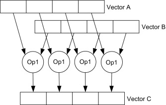

# Terminology in Deep Learning

## DNN: Deep Neural Network

## ReLU： Rectified Linear Unit

## Supervised learning

## CNN: Convolutional Neural Network

Often used in image data.

## Sequence models

Often applied to [NLP](#nlp-natural-language-processing)

## NLP: Natural Language Processing

## RNN: Recurrent Neural Network

NLP

## BRNN: Bidirectional RNN

## LR: Logistic Regression

逻辑回归, 解决二分类(Binary Classification)问题

## LSTM: Long Short-Term Memory models

长期短记忆模型

## Vectorization

Use vector to represent features of example, with this,
we can use matrix features for calculation,
which takes advantage of parallel computing([SIMD](#simd)).

## SIMD

Single Instruction, Multiple Data (SIMD) units refer to hardware components that perform the same operation on multiple data operands concurrently.

 

See [Single Instruction Multiple Data - an overview | ScienceDirect Topics](https://www.sciencedirect.com/topics/computer-science/single-instruction-multiple-data)

## CPU vs. GPU

Parallelization instructions,
also known as [SIMD](#simd).

CPU and GPU are able to use parallel computation, and GPU is better at that than CPU.

## Broadcasting

Python will cast a real number into corresponding vector when calculated with one.

```python
a.shape # (1, 10)
b = 2
a + b # b will be casted as shape of (1, 10) with every value filled with 2.
```

## SVM: Support Vector Machine

## GRU: Gated Recurring Unit

改善 RNN 的梯度消失问题。

## Name entity recognition

命名实体识别, 如在句子中识别人名

## Softmax classification

## Hierarchical softmax classifier

用二叉树分层，优化二分类时 [softmax](#softmax-classification) 大训练集下速度问题

## Word2Vec

使用 [softmax](#softmax-classification) 来训练数据集从而获得 embedding matrix `E` 的方法

### Skip-gram Model

在一句话中，随机一个单词标记为 context, 然后在左右随机一个单词，标记为 target,
模型通过训练根据 context 猜 target 的过程(使用 [softmax](#softmax-classification)),
学习 embedding matrix `E`。

**缺点**: 计算 [softmax](#softmax-classification) 的分母消耗太高

### CBOW: Continuous Bag Of Words Model

连续词袋模型, 通过随机一个中间词, 然后通过左右两边的词来猜测中间词的过程, 来获取 embedding matrix `E`

### Negative sampling

通过二分类来训练模型的过程生成 embedding matrix `E`。

#### 过程如下

1. 在句子中随机选择一个词记作 context, 然后选择其后一个词记作 word, 标签 (target) 1
2. 在词表中随机一个词作为 word, 标签 (target) 为 0

```text
I want a class of orange juice to go along with my cereal.
```

从而构造训练集

```text
| context | word  | target |
+ ------- + ----- + ------ +
| orange  | juice | 1      | <---- positive sample
| orange  | king  | 0      | <---+
| orange  | book  | 0      |     |
| orange  | the   | 0      |     |
| orange  | of    | 0      | <---+-- negative samples
```

进行二分类训练。

**优点**: 将 [softmax](#softmax-classification) 替换为 sigmoid, 提高训练速度

### References

1. Mikolov et. al.,2013. Distributed representation of words and phrases and their compositionality

## GLoVe: GLobal Vectors for word representation

Used to learn word matrix.

### GloVe References

1. [Pennington et.al., 2014. GloVe: Global vectors for word representation]

## N-gram

An n-gram is a **contiguous sequence(sub sequence)** of n items from a given sample of text or speech. The items can be phonemes, syllables, letters, words or base pairs according to the application

> Using Latin numerical prefixes, an n-gram of
> size 1 is referred to as a "unigram";
> size 2 is a "bigram" (or, less commonly, a "digram");
> size 3 is a "trigram".
> ([n-gram - Wikipedia](https://en.wikipedia.org/wiki/N-gram))

### N-gram Example

| Sample Sequence    | unigram                 | bigram                              | trigram                                   |
| ------------------ | ----------------------- | ----------------------------------- | ----------------------------------------- |
| to be or not to be | to, be, or, not, to, be | to be, be or, or not, not to, to be | to be or, be or not, or not to, not to be |

## BLEU: Bilingual Evaluation Understudy

A way to evaluate the result of [MT](#mt-machine-translation)

### BLEU references

1. Papineni et. al., 2002. Bleu: A method for automatic evaluation of machine translation

## MT: Machine translation

## Attention Model

Pay attention to a set of continuous inputs in order to generate output.

### Attention References

- [Visualizing A Neural Machine Translation Model (Mechanics of Seq2seq Models With Attention)](https://jalammar.github.io/visualizing-neural-machine-translation-mechanics-of-seq2seq-models-with-attention/)
- [Visualizing A Neural Machine Translation Model (Mechanics of Seq2seq Models With Attention) – Jay Alammar](https://jalammar.github.io/visualizing-neural-machine-translation-mechanics-of-seq2seq-models-with-attention/)
- [A friendly introduction to Recurrent Neural Networks - YouTube](https://www.youtube.com/watch?v=UNmqTiOnRfg)

## Memory Network

处理阅读理解问题：阅读 -> 提问 -> 回答

## Neural Turing Machine
