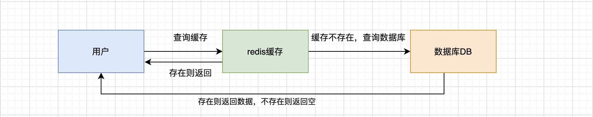
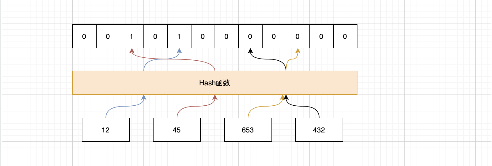
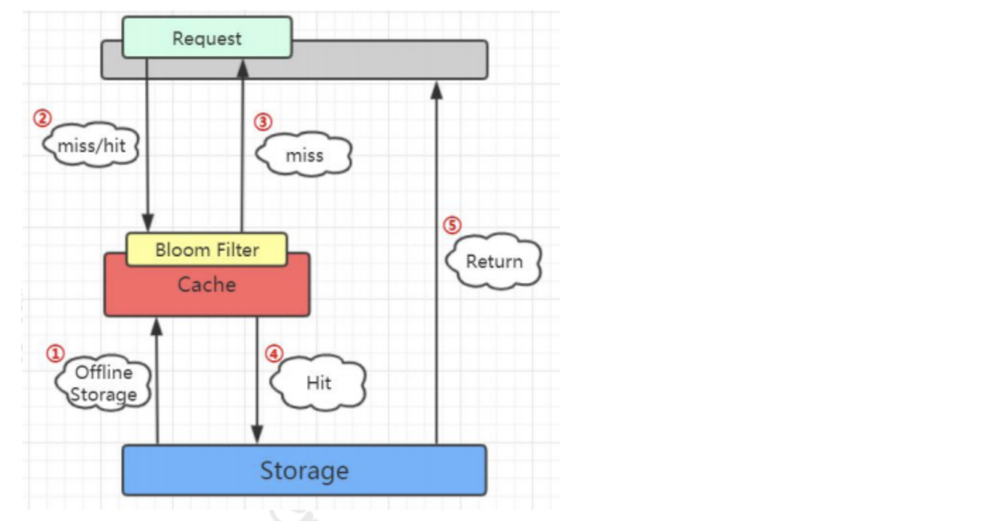

# 通俗易懂讲布隆过滤器

> Origin: [通俗易懂讲布隆过滤器](https://www.cnblogs.com/jajian/articles/12749928.html#%E5%B8%83%E9%9A%86%E8%BF%87%E6%BB%A4%E5%99%A8%E7%9A%84%E5%85%B6%E4%BB%96%E5%BA%94%E7%94%A8%E5%9C%BA%E6%99%AF)

大家看下这幅图，用户可能进行了一次条件错误的查询，这时候redis是不存在的，按照常规流程就是去数据库找了，可是这是一次错误的条件查询，数据库当然也不会存在，也不会往redis里面写值，返回给用户一个空，这样的操作一次两次还好，可是次数多了还了得，我放redis本来就是为了挡一挡，减轻数据库的压力，现在redis变成了形同虚设，每次还是去数据库查找了，这个就叫做缓存穿透，相当于redis不存在了，被击穿了，对于这种情况很好解决，我们可以在redis缓存一个空字符串或者特殊字符串，比如&&，下次我们去redis中查询的时候，当取到的值是空或者&&，我们就知道这个值在数据库中是没有的，就不会在去数据库中查询， ps：这里缓存不存在key的时候一定要设置过期时间，不然当数据库已经新增了这一条记录的时候，这样会导致缓存和数据库不一致的情况。



上面这个是重复查询同一个不存在的值的情况，如果应用每次查询的不存在的值是不一样的呢？即使你每次都缓存特殊字符串也没用，因为它的值不一样，比如我们的数据库用户id是111，112，113，114依次递增，但是别人要攻击你，故意拿-100，-936，-545这种乱七八糟的key来查询，这时候redis和数据库这种值都是不存在的，人家每次拿的key也不一样，你就算缓存了也没用，这时候数据库的压力是相当大，比上面这种情况可怕的多，怎么办呢，这时候我们今天的主角 布隆过滤器 就登场了。

## 从一到面试题说起

问：如何在 海量 元素中（例如 10 亿无序、不定长、不重复） 快速 判断一个元素是否存在？好，我们最简单的想法就是把这么多数据放到数据结构里去，比如`List`、`Map`、`Tree`，一搜不就出来了吗，比如map.get(),我们假设一个元素1个字节的字段，10亿的数据大概需要 **900G** 的内存空间，这个对于普通的服务器来说是承受不了的，当然面试官也不希望听到你这个答案，因为太笨了吧，我们肯定是要用一种好的方法，巧妙的方法来解决，这里引入一种节省空间的数据结构， 位图 ，他是一个有序的数组，只有两个值，0 和 1。0代表不存在，1代表存在。


有了这个厉害的东西，现在我们还需要一个映射关系，你总得知道某个元素在哪个位置上吧，然后在去看这个位置上是0还是1，怎么解决这个问题呢，那就要用到哈希函数，用哈希函数有两个好处，第一是哈希函数无论输入值的长度是多少，得到的输出值长度是固定的，第二是他的分布是均匀的，如果全挤的一块去那还怎么区分，比如MD5、SHA-1这些就是常见的哈希算法。



我们通过哈希函数计算以后就可以到相应的位置去找是否存在了，我们看红色的线，24和147经过哈希函数得到的哈希值是一样的，我们把这种情况叫做 哈希冲突或者哈希碰撞 。哈希碰撞是不可避免的，我们能做的就是降低哈希碰撞的概率， 第一种 是可以扩大维数组的长度或者说位图容量，因为我们的函数是分布均匀的，所以位图容量越大，在同一个位置发生哈希碰撞的概率就越小。但是越大的位图容量，意味着越多的内存消耗，所以我们想想能不能通过其他的方式来解决， 第二种 方式就是经过多几个哈希函数的计算，你想啊，24和147现在经过一次计算就碰撞了，那我经过5次，10次，100次计算还能碰撞的话那真的是缘分了，你们可以在一起了，但也不是越多次哈希函数计算越好，因为这样很快就会填满位图，而且计算也是需要消耗时间，所以我们需要在时间和空间上寻求一个平衡。

## 布隆过滤器

当然，这个事情早就有人研究过了，在 1970 年的时候，有一个叫做布隆的前辈对于判断海量元素中元素是否存在的问题进行了研究，也就是到底需要多大的位图容量和多少个哈希函数，它发表了一篇论文，提出的这个容器就叫做布隆过滤器。


集合里面有3个元素, 要把它存到布隆过滤器里面去，应该怎么做呢？首先是a元素,，这里我们用3次计算，b、c元素也是一样.

元素都存进去以后，现在我要来判断一个元素在这个容器中是否存在，就要使用同样的三个函数进行计算。

比如d元素，我用第一个函数f1 计算，发现这个位置上是1，没问题, 第二个位置也是1，第三个位置上也是1。

如果经过三次计算得到的下标位置值都是1，这种情况下, 能不能确定d元素一定在这个容器里面呢? 实际上是不能的. 比如这张图里面，这三个位置分别是把a、b、c 存进去的时候置成1， 所以即使d 元素之前没有存进去, 也会得到三个1，判断返回true

所以 这个是布隆过滤器的一个很重要的特性，因为哈希碰撞是不可避免的，所以它会存在一定的误判率。这种把本来不存在布隆过滤器中的元素误判为存在的情况，我们把它叫做 假阳性(False Positive Probability，FPP)

我们再来看另一个元素, 我们要判断它在容器中是否存在， 一样的要用这三个函数去计算，第一个位置是1，第二个位置是1，第三个位置是0

e元素是不是一定不在这个容器里面呢？可以确定一定不存在，如果说当时已经把e元素存到布隆过滤器里面去了，那么这三个位置肯定都是1，不可能会出现0。

布隆过滤器的特点，从容器的角度来说：

- 如果布隆过滤器判断元素在集合中存在, 不一定存在.
- 如果布隆过滤器判断不存在, 则一定不存在.

从元素的角度来说：

- 如果元素实际存在, 布隆过滤器一定判断存在
- 如果元素实际不存在,布隆过滤器可能判断存在

利用第二个特性, 我们是不是就可以解决持续从数据库查询不存在的值的问题呢?

## Guava实现布隆过滤器

java为什么写的人多，基数大，因为是开源的，拥抱开源，框架多，轮子多，而且一个功能的轮子还不止一个，光序列化就有`fastjson`，`jackson`，`gson`，随你挑任你选，那布隆过滤器的轮子就是google提供的guava，我们用代码来看一下使用方法

首先引入我们的架包

```xml
<dependency>
    <groupId>com.google.guava</groupId>
    <artifactId>guava</artifactId>
    <version>21.0</version>
</dependency>
```

这里先往布隆过滤器里面存放100万个元素，然后分别测试100个存在的元素和9900个不存在的元素他们的正确率和误判率。

```java
public class BloomFilterDemo {

    //插入多少数据
    private static final int insertions = 1000000;

    //期望的误判率
    private static double fpp = 0.02;

    public static void main(String[] args) {

        //初始化一个存储string数据的布隆过滤器,默认误判率是0.03
        BloomFilter<String> bf = BloomFilter.create(Funnels.stringFunnel(Charsets.UTF_8), insertions, fpp);

        //用于存放所有实际存在的key，用于是否存在
        Set<String> sets = new HashSet<String>(insertions);

        //用于存放所有实际存在的key，用于取出
        List<String> lists = new ArrayList<String>(insertions);

        //插入随机字符串
        for (int i = 0; i < insertions; i++) {
            String uuid = UUID.randomUUID().toString();
            bf.put(uuid);
            sets.add(uuid);
            lists.add(uuid);
        }

        int rightNum = 0;
        int wrongNum = 0;

        for (int i = 0; i < 10000; i++) {
            // 0-10000之间，可以被100整除的数有100个（100的倍数）
            String data = i % 100 == 0 ? lists.get(i / 100) : UUID.randomUUID().toString();

            //这里用了might,看上去不是很自信，所以如果布隆过滤器判断存在了,我们还要去sets中实锤
            if (bf.mightContain(data)) {
                if (sets.contains(data)) {
                    rightNum++;
                    continue;
                }
                wrongNum++;
            }
        }

        BigDecimal percent = new BigDecimal(wrongNum).divide(new BigDecimal(9900), 2, RoundingMode.HALF_UP);
        BigDecimal bingo = new BigDecimal(9900 - wrongNum).divide(new BigDecimal(9900), 2, RoundingMode.HALF_UP);
        System.out.println("在100W个元素中，判断100个实际存在的元素，布隆过滤器认为存在的：" + rightNum);
        System.out.println("在100W个元素中，判断9900个实际不存在的元素，误认为存在的：" + wrongNum + "，命中率：" + bingo + "，误判率：" + percent);
    }
}
```

最后得出的结果

```text
在100W个元素中，判断100个实际存在的元素，布隆过滤器认为存在的：100
在100W个元素中，判断9900个实际不存在的元素，误认为存在的：203，命中率：0.98，误判率：0.02
```

我们看到这个结果正是印证了上面的结论，这100个真实存在元素在布隆过滤器中一定存在，另外9900个不存在的元素，布隆过滤器还是判断了216个存在，这个就是误判，原因上面也说过了，所以布隆过滤器不是万能的，但是他能帮我们抵挡掉大部分不存在的数据已经很不错了，已经减轻数据库很多压力了，另外误判率0.02是在初始化布隆过滤器的时候我们自己设的，如果不设默认是0.03， 我们自己设的时候千万不能设0!

## Redis实现布隆过滤器

上面使用guava实现布隆过滤器是把数据放在本地内存中，我们项目往往是分布式的，我们还可以把数据放在redis中，用redis来实现布隆过滤器，这就需要我们自己设计映射函数，自己度量二进制向量的长度，下面贴代码，大家可以直接拿来用的，已经经过测试了。

```java
/**
 * 布隆过滤器核心类
 *
 * @param <T>
 * @author jack xu
 */
public class BloomFilterHelper<T> {
    private int numHashFunctions;
    private int bitSize;
    private Funnel<T> funnel;

    public BloomFilterHelper(int expectedInsertions) {
        this.funnel = (Funnel<T>) Funnels.stringFunnel(Charset.defaultCharset());
        bitSize = optimalNumOfBits(expectedInsertions, 0.03);
        numHashFunctions = optimalNumOfHashFunctions(expectedInsertions, bitSize);
    }

    public BloomFilterHelper(Funnel<T> funnel, int expectedInsertions, double fpp) {
        this.funnel = funnel;
        bitSize = optimalNumOfBits(expectedInsertions, fpp);
        numHashFunctions = optimalNumOfHashFunctions(expectedInsertions, bitSize);
    }

    public int[] murmurHashOffset(T value) {
        int[] offset = new int[numHashFunctions];

        long hash64 = Hashing.murmur3_128().hashObject(value, funnel).asLong();
        int hash1 = (int) hash64;
        int hash2 = (int) (hash64 >>> 32);
        for (int i = 1; i <= numHashFunctions; i++) {
            int nextHash = hash1 + i * hash2;
            if (nextHash < 0) {
                nextHash = ~nextHash;
            }
            offset[i - 1] = nextHash % bitSize;
        }

        return offset;
    }

    /**
     * 计算bit数组长度
     */
    private int optimalNumOfBits(long n, double p) {
        if (p == 0) {
            p = Double.MIN_VALUE;
        }
        return (int) (-n * Math.log(p) / (Math.log(2) * Math.log(2)));
    }

    /**
     * 计算hash方法执行次数
     */
    private int optimalNumOfHashFunctions(long n, long m) {
        return Math.max(1, (int) Math.round((double) m / n * Math.log(2)));
    }
}
```

这里在操作redis的位图bitmap，你可能只知道`redis`五种数据类型，`string`，`list`，`hash`，`set`，`zset`，没听过`bitmap`，但是不要紧，你可以说他是一种新的数据类型，也可以说不是，因为他的本质还是string，后面我也会专门写一篇文章来介绍数据类型以及在他们在互联网中的使用场景。

```java
/**
 * redis操作布隆过滤器
 *
 * @param <T>
 * @author xhj
 */
public class RedisBloomFilter<T> {
    @Autowired
    private RedisTemplate redisTemplate;

    /**
     * 删除缓存的KEY
     *
     * @param key KEY
     */
    public void delete(String key) {
        redisTemplate.delete(key);
    }

    /**
     * 根据给定的布隆过滤器添加值，在添加一个元素的时候使用，批量添加的性能差
     *
     * @param bloomFilterHelper 布隆过滤器对象
     * @param key               KEY
     * @param value             值
     * @param <T>               泛型，可以传入任何类型的value
     */
    public <T> void add(BloomFilterHelper<T> bloomFilterHelper, String key, T value) {
        int[] offset = bloomFilterHelper.murmurHashOffset(value);
        for (int i : offset) {
            redisTemplate.opsForValue().setBit(key, i, true);
        }
    }

    /**
     * 根据给定的布隆过滤器添加值，在添加一批元素的时候使用，批量添加的性能好，使用pipeline方式(如果是集群下，请使用优化后RedisPipeline的操作)
     *
     * @param bloomFilterHelper 布隆过滤器对象
     * @param key               KEY
     * @param valueList         值，列表
     * @param <T>               泛型，可以传入任何类型的value
     */
    public <T> void addList(BloomFilterHelper<T> bloomFilterHelper, String key, List<T> valueList) {
        redisTemplate.executePipelined(new RedisCallback<Long>() {
            @Override
            public Long doInRedis(RedisConnection connection) throws DataAccessException {
                connection.openPipeline();
                for (T value : valueList) {
                    int[] offset = bloomFilterHelper.murmurHashOffset(value);
                    for (int i : offset) {
                        connection.setBit(key.getBytes(), i, true);
                    }
                }
                return null;
            }
        });
    }

    /**
     * 根据给定的布隆过滤器判断值是否存在
     *
     * @param bloomFilterHelper 布隆过滤器对象
     * @param key               KEY
     * @param value             值
     * @param <T>               泛型，可以传入任何类型的value
     * @return 是否存在
     */
    public <T> boolean contains(BloomFilterHelper<T> bloomFilterHelper, String key, T value) {
        int[] offset = bloomFilterHelper.murmurHashOffset(value);
        for (int i : offset) {
            if (!redisTemplate.opsForValue().getBit(key, i)) {
                return false;
            }
        }
        return true;
    }
}
```

最后就是测试类了

```java
public static void main(String[] args) {
        RedisBloomFilter redisBloomFilter = new RedisBloomFilter();
        int expectedInsertions = 1000;
        double fpp = 0.1;
        redisBloomFilter.delete("bloom");
        BloomFilterHelper<CharSequence> bloomFilterHelper = new BloomFilterHelper<>(Funnels.stringFunnel(Charset.defaultCharset()), expectedInsertions, fpp);
        int j = 0;
        // 添加100个元素
        List<String> valueList = new ArrayList<>();
        for (int i = 0; i < 100; i++) {
            valueList.add(i + "");
        }
        long beginTime = System.currentTimeMillis();
        redisBloomFilter.addList(bloomFilterHelper, "bloom", valueList);
        long costMs = System.currentTimeMillis() - beginTime;
        log.info("布隆过滤器添加{}个值，耗时：{}ms", 100, costMs);
        for (int i = 0; i < 1000; i++) {
            boolean result = redisBloomFilter.contains(bloomFilterHelper, "bloom", i + "");
            if (!result) {
                j++;
            }
        }
        log.info("漏掉了{}个,验证结果耗时：{}ms", j, System.currentTimeMillis() - beginTime);
    }
```

注意这里用的是`addList`，他的底层是`pipelining`管道，而`add`方法的底层是一个个`for`循环的`setBit`，这样的速度效率是很慢的，但是他能有返回值，知道是否插入成功，而`pipelining`是不知道的，所以具体选择用哪一种方法看你的业务场景，以及需要插入的速度决定。

## 布隆过滤器工作位置

第一步是将数据库所有的数据加载到布隆过滤器。第二步当有请求来的时候先去布隆过滤器查询，如果bf说没有，第三步直接返回。如果bf说有，在往下走之前的流程。

ps：另外guava的数据加载中只有put方法，小伙们可以想下布隆过滤器中数据删除和修改怎么办，为什么没有delete的方法？



## 布隆过滤器的其他应用场景

- 网页爬虫对URL去重，避免爬取相同的 URL 地址；
- 反垃圾邮件，从数十亿个垃圾邮件列表中判断某邮箱是否垃圾邮箱；
- Google Chrome 使用布隆过滤器识别恶意 URL；
- Medium 使用布隆过滤器避免推荐给用户已经读过的文章；
- Google BigTable, Apache HBase 和 Apache Cassandra使用布隆过滤器减少对不存在的行和列的查找。
