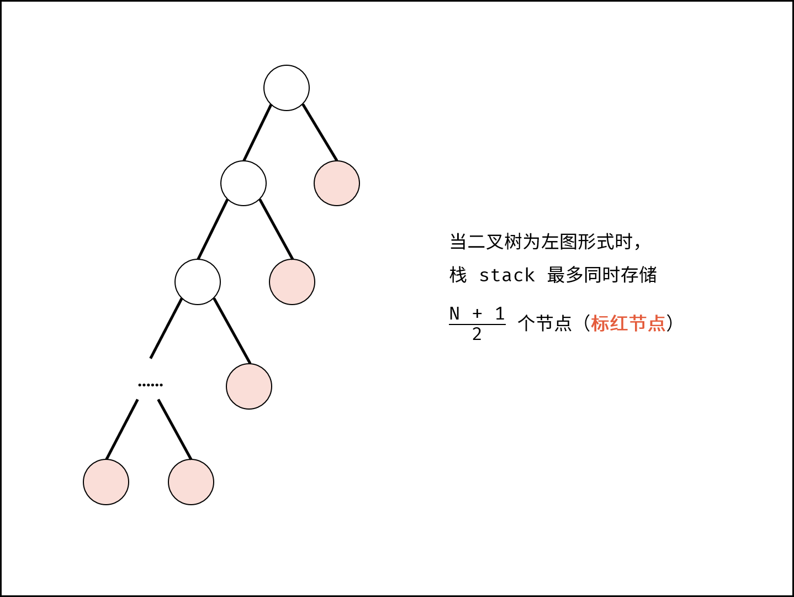

# 剑指 Offer 27. 二叉树的镜像

> 来源：[力扣（LeetCode）](https://leetcode-cn.com/problems/er-cha-shu-de-jing-xiang-lcof)

## Problem

请完成一个函数，输入一个二叉树，该函数输出它的镜像。

例如输入：

```
     4
   /   \
  2     7
 / \   / \
1   3 6   9
```

镜像输出：

```
     4
   /   \
  7     2
 / \   / \
9   6 3   1
```

示例 1：

```
输入：root = [4,2,7,1,3,6,9]
输出：[4,7,2,9,6,3,1]
```

## Solution

### 1. Divide and Conquer

- 时间复杂度 $O(n)$
- 空间复杂度 $O(n)$：最坏情况下为链表，此时程序栈的深度为 $n$

```java
/**
 * Definition for a binary tree node.
 * public class TreeNode {
 *     int val;
 *     TreeNode left;
 *     TreeNode right;
 *     TreeNode(int x) { val = x; }
 * }
 */
class Solution {
    public TreeNode mirrorTree(TreeNode root) {
        if (root == null) return null;
        TreeNode left = root.left;
        TreeNode right = root.right;

        root.left = right;
        root.right = left;
        mirrorTree(left);
        mirrorTree(right);
        return root;
    }
}

```

### 2. Stack

从根节点开始，将节点存入栈中，然后依次 `pop`，每次将 `pop` 后的节点下属子节点对换。

- 时间复杂度 $O(n)$
- 空间复杂度 $O(n)$：最差情况下，栈 `stack` 最多同时存储 $\frac{N + 1}{2}$  个节点，占用 $O(N)$ 额外空间。

    

```java
/**
 * Definition for a binary tree node.
 * public class TreeNode {
 *     int val;
 *     TreeNode left;
 *     TreeNode right;
 *     TreeNode(int x) { val = x; }
 * }
 */
class Solution {
    public TreeNode mirrorTree(TreeNode root) {
        if (root == null) return null;

        Stack<TreeNode> stack = new Stack<>(){{ add(root); }};

        while (!stack.empty()) {
            TreeNode node = stack.pop();

            if (node.left != null) stack.add(node.left);
            if (node.right != null) stack.add(node.right);

            TreeNode tmp = node.left;
            node.left = node.right;
            node.right = tmp;
        }

        return root;
    }
}
```
