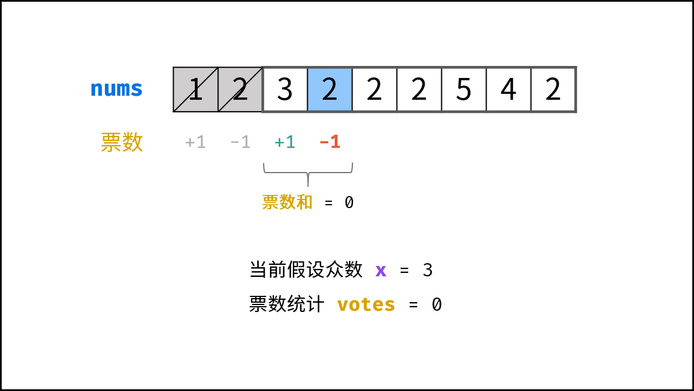

# 剑指 Offer 39. 数组中出现次数超过一半的数字

> 来源：[力扣（LeetCode）](https://leetcode-cn.com/problems/shu-zu-zhong-chu-xian-ci-shu-chao-guo-yi-ban-de-shu-zi-lcof)

{{$page.lastUpdated}}

## Problem

数组中有一个数字出现的次数超过数组长度的一半，请找出这个数字。1

> 你可以假设数组是非空的，并且给定的数组总是存在多数元素。

**示例 1:**

```
输入: [1, 2, 3, 2, 2, 2, 5, 4, 2]
输出: 2
```

**限制：**

```
1 <= 数组长度 <= 50000
```

## Solution

本题有三总解法[^leet-code]

1. **`HashMap` 计数**：时间空间复杂度均为 $O(n)$

2. **排序**：中点的元素一定为所求，时间复杂度为 $O(n\log n)$, 空间复杂度 $O(1)$

3. **摩尔投票法**： 设所求数字（众数）为 $m$，则

    $$
    vote(n_i) = \left \{
        \begin{aligned}
        1, \qquad n_i = x \\
        -1, \qquad n_i \neq x
        \end{aligned}
    \right .
    $$

    ---

    在计算时，设$x = n_0$，并设

    $$
    v_{t} = \sum_{i = 0}^{k}{vote(n_i)}
    $$

    当 $v_{t} = 0$ 时，**剩余的数组 $\left\{n_{k+1}, ..., n_n\right\}$ 中，$m$ 出现次数比重不会减少**。因为此时，

    1. 当 $x = n_0=m$ 时，$\left\{n_0,...,n_k\right\}$ 必然由一半众数，一半非众数构成；
    2. 当 $x = n_0 \neq m$ 时，$\left\{n_0,...,n_k\right\}$ 中 $n_0$ 出现了 $\frac{n}{2}$ 次，则 $m$ 出现的次数必然小于等于 $n_0$ 出现的次数。

    故， 两种情况下 $m$ 在剩余 $\left\{n_{k+1}, ..., n_n\right\}$ 中仍为众数。
    此时，若设 $x = n_{k+1}$，继续计算，直到遍历完整个数组，得到的 $x$ 为所求（Fig. 1）。

     

    此时时间复杂度 $O(n)$，空间复杂度 $O(1)$。

这里给出第三种方法（摩尔投票法）：

```java
class Solution {
    public int majorityElement(int[] nums) {
        int vote = 0, x = -1, offset = 0;
        for (int i = 0; i < nums.length; i++) {
            if (vote == 0)  x = nums[i];
            if (nums[i] == x) vote++;
            else vote--;
        }
        return x;
    }
}
```

[^leet-code]: [作者：jyd](https://leetcode-cn.com/problems/shu-zu-zhong-chu-xian-ci-shu-chao-guo-yi-ban-de-shu-zi-lcof/solution/mian-shi-ti-39-shu-zu-zhong-chu-xian-ci-shu-chao-3/)
