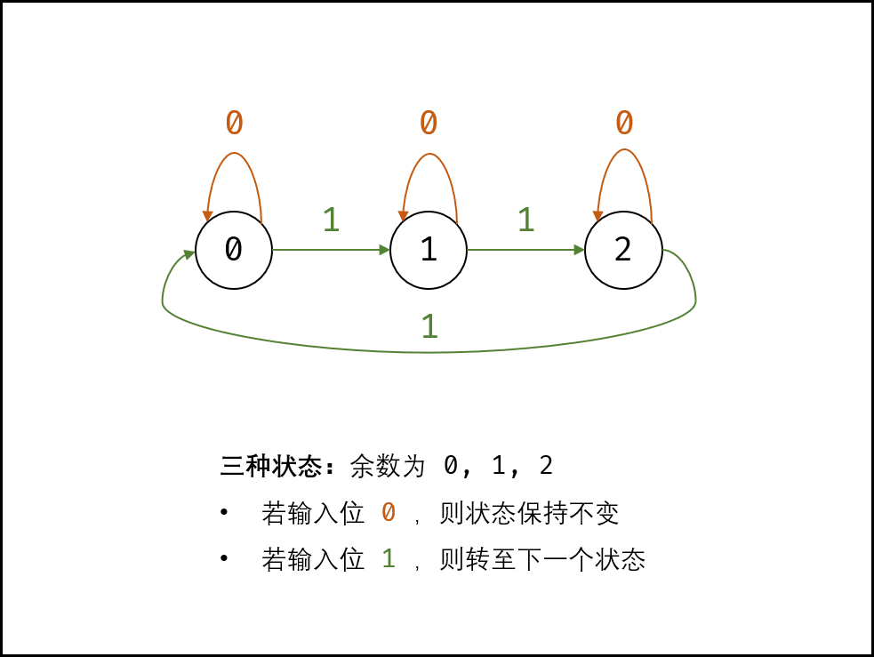
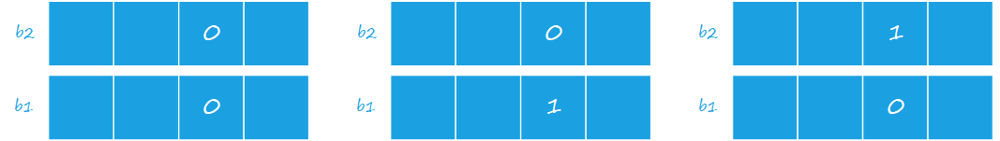

# 剑指 Offer 56 - II. 数组中数字出现的次数 II

> 来源：[力扣（LeetCode）](https://leetcode-cn.com/problems/shu-zu-zhong-shu-zi-chu-xian-de-ci-shu-ii-lcof)

**See Also**: [每个数出现2次，找出只出现1次的2个数](./Offer56-I.md)

## Problem

在一个数组 `nums` 中除一个数字只出现一次之外，其他数字都出现了三次。请找出那个只出现一次的数字。

**示例 1：**

```
输入：nums = [3,4,3,3]
输出：4
```

**示例 2：**

```
输入：nums = [9,1,7,9,7,9,7]
输出：1
```

**限制：**

```
1 <= nums.length <= 10000
1 <= nums[i] < 2^31
```

## Solution

考虑数字的二进制形式，对于出现三次的数字，各 **二进制位** 出现的次数都是 $3$ 的倍数。因此，统计所有数字的各二进制位中 $1$ 的出现次数，并对 $3$ 求余，结果则为只出现一次的数字。


**有限状态机（LSM）法：**

把所有数字都加起来，使用 LSM 来对每一位 $1$ 出现的次数作计数，对计数结果 $\mod 3$ 求余，则每一 $bit$ 位有3种状态：`0`，`1`，`2`。



由于一个二进制位只能保存两个状态：`0`，`1`，故需要引入一个变量来保存第三种状态 `2`。
实际上，我们使用 **两个整型** 来记录每一位的计数，相同位置的两个 $bit$ 位组合起来，得到这个位置 $1$ 的计数。如下图所示：



设 `b2` 表示 `2` 这种状态，`b1` 表示 `0` 或 `1`，`n` 表示当前位，则对于 `b1` 有

```python {2-5}
if b2 == 0
    if n == 1
        b1 = ~n
    if n == 0
        b1 = b1
if b2 == 1
    b1 = 0
```

其2-5行可以化简为 `b1=b1^n`，即

```python
if b2 == 0
    b1 = b1^n
if b2 = 1
    b1 = 0
```

可以进一步化简为

```java
// b1 = b1 ^ n & ~b2
b1 ^= n & ~b2
```

类似地，**在 `b1` 已经更新的前提下**，对于 `b2` 有：

```python
if b1 == 0
    if n == 1
        b2 = ~b2
    if n = 0
        b2 = b2
if b1 = 1
    b2 = 0
```

可化简为

```java
b2 ^= n & ~b1
```

得到如下算法

**Code:**

```java
class Solution {
    public int singleNumber(int[] nums) {
        int b1 = 0, b2 = 0;

        for (int n : nums) {
            b1 ^= n & ~b2;
            b2 ^= n & ~b1;
        }
        return b1;
    }
}
```
