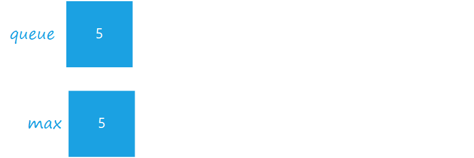
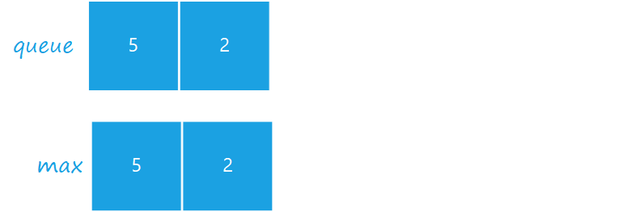
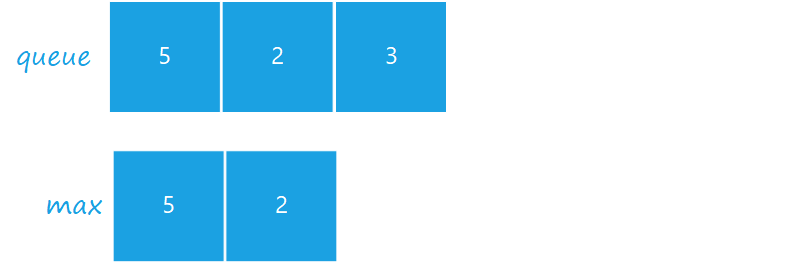
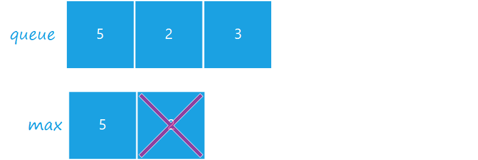
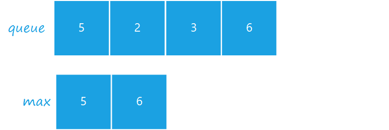
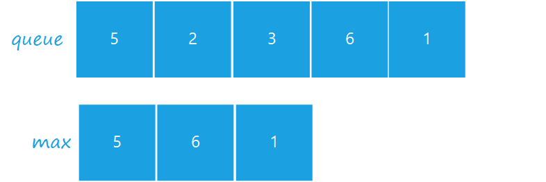

# 剑指 Offer 59 - II. 队列的最大值

## Problem

请定义一个队列并实现函数 `max_value` 得到队列里的最大值，要求函数 `max_value`、`push_back` 和 `pop_front` 的均摊时间复杂度都是 $O(1)$。

若队列为空，`pop_front` 和 `max_value` 需要返回 `-1`。

**示例 1：**

```
输入:
["MaxQueue","push_back","push_back","max_value","pop_front","max_value"]
[[],[1],[2],[],[],[]]
输出: [null,null,null,2,1,2]
```

**示例 2：**

```
输入: 
["MaxQueue","pop_front","max_value"]
[[],[],[]]
输出: [null,-1,-1]
```

**限制：**

- $1 \leq$ `push_back`, `pop_front`, `max_value` 的总操作数 $\leq 10000$
- $1 \leq value \leq 10^5$

## Solution

利用双队列 `queue` 和 `max`。其中 `queue` 存储队列元素，`max` 逆序存储最大值。

由于题目要求实现一个队列，且算法的时间复杂度为 $O(1)$，故最大值队列应该采用逆序，保证最后一个 `push_back` 的元素在 `max` 队列中。
此时可以保证 `max` 队列在 `pop_front` 时，总会有一个最大的元素。

<image-player>






  
  

</image-player>

```java {15-20,27-29}
class MaxQueue {

    LinkedList<Integer> queue = new LinkedList<>();
    LinkedList<Integer> max = new LinkedList<>();

    public MaxQueue() {
    }
    
    public int max_value() {
        return max.isEmpty() ? -1 : max.getFirst();
    }
    
    public void push_back(int value) {
        queue.offerLast(value);
        // `max` should always record the last element, in case popped out of elements
        // so the max queue should be in descent order
        while (!max.isEmpty() && max.peekLast() < value) {
            max.removeLast();
        }
        max.offerLast(value);
    }
    
    public int pop_front() {
        if (queue.isEmpty()) return -1;

        int val = queue.pop();
        if (val == max.getFirst()) {
            max.removeFirst();
        }
        return val;
    }
}

/**
 * Your MaxQueue object will be instantiated and called as such:
 * MaxQueue obj = new MaxQueue();
 * int param_1 = obj.max_value();
 * obj.push_back(value);
 * int param_3 = obj.pop_front();
 */
 ```
