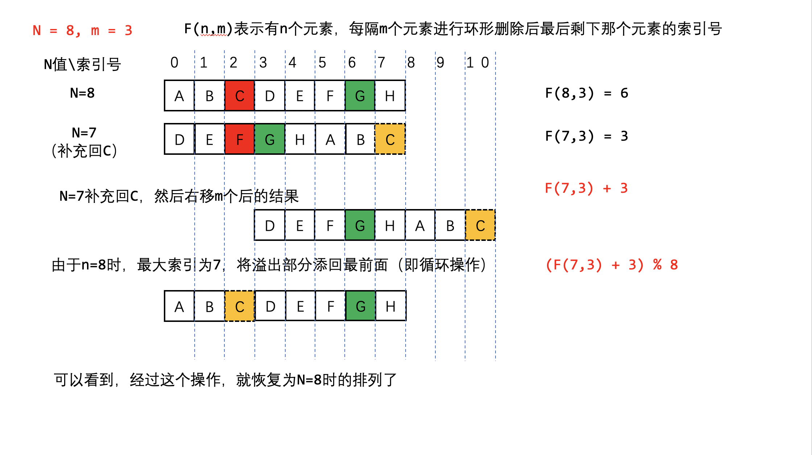

# 剑指 Offer 62. 圆圈中最后剩下的数字

## Problem

$\{0, 1, ···, n-1\}$ 这 $n$ 个数字排成一个圆圈，从数字 $0$ 开始，每次从这个圆圈里删除第 $m$ 个数字（删除后从下一个数字开始计数）。求出这个圆圈里剩下的最后一个数字。

例如，$\{0, 1, 2, 3, 4\}$ 这 $5$ 个数字组成一个圆圈，从数字 $0$ 开始每次删除第 $3$ 个数字，则删除的前 $4$ 个数字依次是 $\{2, 0, 4, 1\}$，因此最后剩下的数字是 $3$。

**示例 1：**

```
输入: n = 5, m = 3
输出: 3
```

**示例 2：**

```
输入: n = 10, m = 17
输出: 2
```

**限制：**

```
1 <= n <= 10^5
1 <= m <= 10^6
```

## Solution

> 这个问题是以 ++*弗拉维奥·约瑟夫*++ 命名的，他是1世纪的一名犹太历史学家。他在自己的日记中写道，他和他的40个战友被罗马军队包围在洞中。他们讨论是自杀还是被俘，最终决定自杀，并以抽签的方式决定谁杀掉谁。约瑟夫斯和另外一个人是最后两个留下的人。约瑟夫斯说服了那个人，他们将向罗马军队投降，不再自杀。约瑟夫斯把他的存活归因于运气或天意，他不知道是哪一个。[^wikipedia]

由于 $n$ 与 $m$ 的取值范围太大，不适合用 `LinkedList` 或者 `ArrayList`，故考虑数学递推的方法。

**删除的过程：**

当某个元素 $a_i$ 被删了之后，它后面的元素 $a_{i+1}$ 开始向前移动 $m$ 位，此时，从 $a_{i+1}$ 重新编号，继续删除第 $m$ 位置的元素。

如此一直继续下去，直到剩下一个元素。最终剩下的元素 $x$ 一定处于 $0$ 的位置。


**倒推的过程：**

最后剩下的元素 $x$ 一定处于 $0$ 的位置，则上一轮删除前的顺序为，$x$ 向右移动 $m$ 位子。
由于上一轮只有2个元素，移动 $m$ 个位子后可能导致溢出，故作 $(x + m) \mod 2$ 操作后所得的位置，即为 $x$ 在两个元素的情况下的位置。

同样地，可以倒推 $3$ 个元素、$4$ 个元素，直到 $n$ 个元素为止，可以得到此时 $x$ 的位置。



:::tip
图片来源：aspenstarss[^leet-code-solution]
:::

**代码：**

```java
class Solution {
    public int lastRemaining(int n, int m) {
        int idx = 0;

        for (int i = 2; i <= n; i++) {
            idx = (idx + m) % i;
        }
        return idx;
    }
}
```

## References

- [换个角度举例解决约瑟夫环 - 圆圈中最后剩下的数字](https://leetcode-cn.com/problems/yuan-quan-zhong-zui-hou-sheng-xia-de-shu-zi-lcof/solution/huan-ge-jiao-du-ju-li-jie-jue-yue-se-fu-huan-by-as/)

[^wikipedia]: [阿橋问题 - 维基百科](https://zh.wikipedia.org/wiki/%E7%BA%A6%E7%91%9F%E5%A4%AB%E6%96%AF%E9%97%AE%E9%A2%98)

[^leet-code-solution]: [约瑟夫环——公式法（递推公式）](https://blog.csdn.net/u011500062/article/details/72855826)
