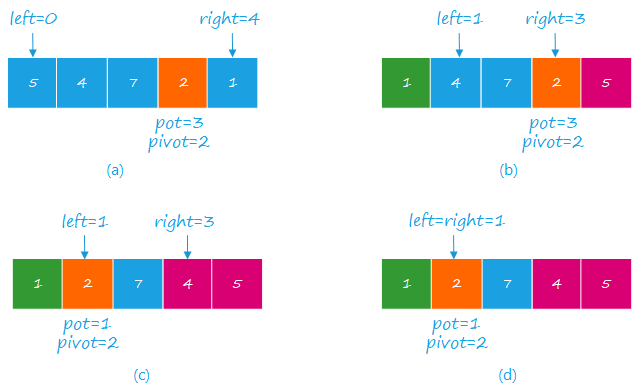

# 快速排序 <todo/>


快速排序是将元素分区，然后再分治进行排序的方法。首先选取一个基准元素 $pivot$，然后移动元素，使得左边的元素 $<pivot$，右边的元素 $>pivot$。

元素的移动主要有两种方法：

1. 挖坑法
2. 指针交换法

选择基准元素的方法：

1. 首尾、中间元素
2. 随机

时间复杂度：

- **最差**：$O(n^2)$，此时给定数组正好是逆序
- **平均**：$O(n \log n)$

## 1. 挖坑法

**定义：**

- $pot$ 记录坑的位置
- $pivot$ 记录基准元素
- $left$ 记录左索引
- $right$ 记录右索引

初始时，

$$
\left\{
\begin{aligned}
    pot     &= 0\\
    pivot   &= a_{pot} = a_0\\
    left    &= 1\\
    right   &= n-1
\end{aligned}
\right.
$$

开始时从右边开始扫描，得到元素 $a_{right}$，此时会出现两种情况：

1. $a_{right} < pivot$，则
   1. 将 $a_{right}$ 放入 $a_{pot}$
   2. 将 $right$ 标记为 $pot$
2. $a_{right} >= pivot$，则移动 $right$ 至 $right - 1$，直到出现 $a_{right} < pivot$。

然后当 $pot$ 在右侧时，再类似地从左边往右边扫描，此时：

1. $a_{left} >= pivot$，则将 $a_{left}$ 放入 $a_{pot}$，并将 $left$ 标记为 $pot$
2. $a_{left} < pivot$，则移动 $left$ 至 $left - 1$，直到出现 $a_{left} >= pivot$。

当 $left=right$ 时结束。

经过一趟遍历之后，就可以将小于 $pivot$ 的数据分到左边，大于 $pivot$ 的数据分到右边。
然后再对左右两边的数据分别递归的进行处理。

终止条件：<todo/>

## 2. 指针交换法

设 $pot$ 代表基准元素的位置，初始时，

$$
\left\{
\begin{aligned}
    pot     &= 0 \\
    pivot   &= a_{pot} = a_0 \\
    left    &= 1 \\
    right   &= n - 1\\
\end{aligned}
\right.
$$

开始时，类似[挖坑法](#1-挖坑法)，移动 $left$、$right$ 指针，当出现 $a_{right} \leq pivot < a_{left}$ 时，交换 $a_{right}$ 与 $a_{left}$，直到 $left = right$。
此时，$pot$ 与 $left$ 对应元素。

类似[挖坑法](#1-挖坑法)，经过一趟遍历，可以使 $pivot$ 处于正好第 $k$ 大的位置，并将数组 $a$ 进行了左右分组。

```java
class Solution {
    public int[] sortArray(int[] nums) {
        return sort(nums, 0, nums.length - 1);
    }

    public int[] sort(int[] nums, int left, int right) {
        int i = left, j = right;
        int pivot = nums[i];

        while (left < right) {
            while(nums[right] > pivot && right > left) right--;
            while(nums[left] <= pivot && left < right) left++;

            if (left < right) {
                swap(nums, left, right);
            } else if (left == right) {
                swap(nums, left, i);
            }
        }
        if (left > i + 1) sort(nums, i, left - 1);
        if (left < j - 1) sort(nums, left + 1, j);
        return nums;
    }

    private void swap(int[] nums, int i, int j) {
        int tmp = nums[i];
        nums[i] = nums[j];
        nums[j] = tmp;
    }
}
```

:::tip 关于随机选择基准元素

随机选择基准元素 $pivot$ 时，考虑两种情况

1. $pivot$ 在左侧，当 $pot=left$ 时，由于 $a_{left}<=pivot$，`lef++`， 最后当指针 $left = right$ 时，交换 $a_{left}$ 与 $a_pot$即可。
2. $pivot$ 在右侧，当 $pot=right$ 时，由于 $a_{right}=pivot$，需要将right移动到左侧，交换 $a_{right}$ 与 $a_{left}$，并标记 $pot=left$。最后当指正 $left=right$时结束循环。

    <!-- <image-player> -->

      

    <!-- </image-player> -->

:::

## 非递归方法 <todo/>
