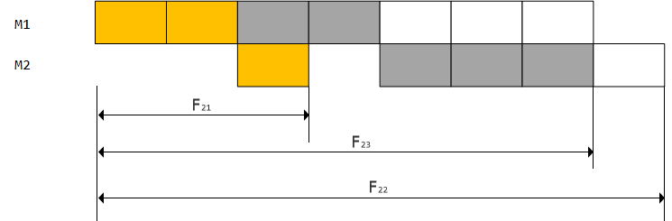

# Batch Job Scheduling Problem

## 问题描述

每一个作业 $J_i$ 都有两项任务分别在2台机器上完成。每个作业**必须**先由 `机器1` 处理，然后再由 `机器2` 处理。作业 $J_i$ 需要机器 $j$ 的处理时间为 $t_{ji}$。对于一个确定的作业调度，设 $F_{ji}$ 是作业 $i$ 在机器 $j$ 上完成处理时间。**则所有作业在 `机器2` 上完成处理时间和 $f=F_{2i}$，称为该作业调度的完成时间和**。求调度方案使得 $f$ 最小。

::: tip 区别于流水线调度问题

- **批处理作业调度问题**旨在求出使其完成时间和达到最小的最佳调度序列；

- **流水线调度问题**旨在求出使其最后一个作业的完成时间最小的最佳调度序列；
:::

例如对于问题

| $t_{ji}$ | M1  | M2  |
| -------- | --- | --- |
| Job 1    | 2   | 1   |
| Job 2    | 3   | 1   |
| Job 3    | 2   | 3   |

其作业顺序可以按 `(1, 2, 3), (1, 3, 2), (2, 1, 3), (2, 3, 1), (3, 1, 2), (3, 2, 2)` 6 种方式执行。其中`(1, 3, 2)`最优方式， **作业调度的完成时间和** 为 `18`，如小图所示：

$$
\begin{aligned}
F_{21} &= 3 \\
F_{23} &= 7 \\
F_{22} &= 8 \\
f \; &= F_{21} + F_{22} + F_{23} = 18
\end{aligned}
$$

todo
