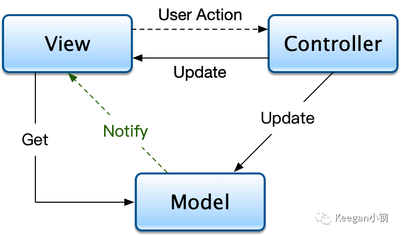
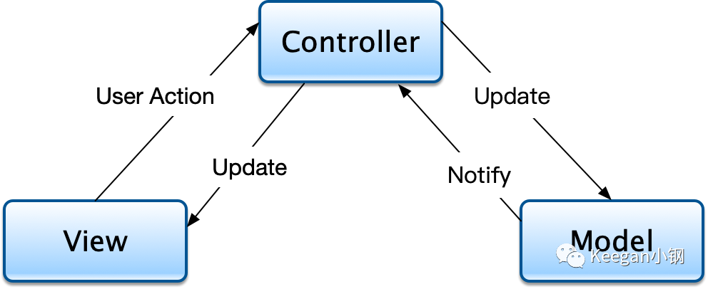
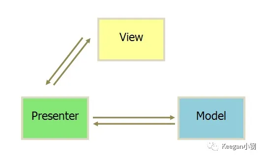
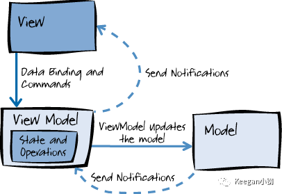

# MVC vs. MVP vs. MVVM

## MVC

### Traditional MVC

 

### One We Currently Use

## MVP

Model-View-Presenter

`Presenter` is the same as `Controller`, using this term to distinguish with `MVC`.

`Presenter` differs from `Controller` in that it is lighter, the former contains only schedule logic, without view logic(such as its lifecycle), while `Controller` does.

## MVVM

VM for `ViewModel`, which is the model for view, containing the **states/operations** for  views. And `MVVM` introduced _data binding_.

## See Also

- [正确认识 MVC/MVP/MVVM](https://mp.weixin.qq.com/s/gsPajW3_gU9HPIoQuGjjNw)
