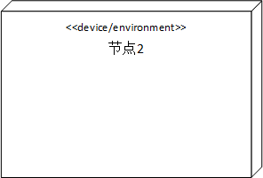
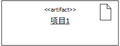
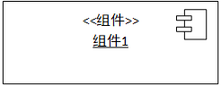

# 部署图（Deployment Diagram）

部署图描述的是系统运行时的结构，展示了硬件的配置及其软件如何部署到网络结构中。一个系统模型只有一个部署图，部署图通常用来帮助理解分布式系统。

## 节点

- `<<Type>>`： 节点的类型
- `节点2`：的名称

## 物件（工件、Artifact）

 物件是软件开发过程中的产物，包括过程模型（比如用例图、设计图等等）、源代码、可执行程序、设计文档、测试报告、需求原型、用户手册、**jar包**等等。物件表示如下，带有关键字`<<artifact>>`和文档图标

## 组件（Component）

组件是一组接口定义明确的抽象模块。其中可以包含物件或者组件。

## 参考

- [UML建模之部署图（Deployment Diagram） - 灵动生活 - 博客园](https://www.cnblogs.com/ywqu/archive/2009/12/21/1628545.html)
- [Deployment Diagram | Enterprise Architect User Guide](https://sparxsystems.com.au/enterprise_architect_user_guide/14.0/model_domains/deploymentdiagram.html)
