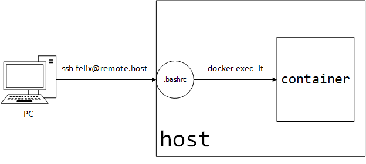

# Use Docker Container as Virtual Host

This article describes a way to use Docker container as virtual host.
Through this way, the server `host` can be divided as a collection of containers.



And we can use `ssh` to login to the container just as to any remote server.

## Pull image

```bash
docker pull ubuntu:18.04
```

## Dockerfile

Before writing a `Dockerfile`, we should declare the directory structure, which is as follows:

```
.
├── build
│   ├── Dockerfile
│   └── sources.list
└── docker-compose.yml
```

::: tip
`sources.list` can be found [here](#sources-list)
:::

Now we can write the `Dockerfile`:

```dockerfile {9,10,12}
FROM ubuntu:18.04

COPY sources.list /etc/apt/sources.list
RUN apt-get update \
    && apt-get install -y vim ssh sudo

# Create a user,
# which will later be used to connect to the container.
RUN groupadd -g 1009 felix
RUN useradd -s /bin/bash -u 1009 -g 1009 felix
# This user should have access to `sudo`
RUN usermod -aG sudo felix

# To prevent the container from exiting
ENTRYPOINT tail -f /dev/null
```

:::warning
Replace `felix` with the user you want to create, and `id` if necessary.
:::

## Write `docker-compose.yml` file

```yaml {11}
version: "3.7"
services:
  ubuntu:
    build:
      context: ./build
    restart: unless-stopped
    hostname: video-process
    volumes:
      # Mount the user directory in case we want to
      # transfer files from local to created virtual host
      - /home/felix/projects:/home/felix

```

:::warning
Replace `felix` with your username.
:::

## Build & Start container

```bash
docker-compose up -d
```

## Set password for felix

After the container started, we need a password to run `sudo` command inside it.

For security reasons, **do not use `useradd --password`** to set password.
Instead, use `passwd` to set password.

```bash
docker-compose exec -u root ubuntu passwd felix
```

## Edit Login script to enter container

### Edit login script

Append the following script in `.bashrc`

```bash
# Run `exec -it bash` of the container
sudo /usr/local/bin/docker-compose -f /home/ubuntu/projects/video-process/docker-compose.yml exec -u felix ubuntu bash

# logout the after the exits from the container
logout
```

### Add Privilege to `sudo`

Use `vim /etc/sudoers` or `sudo visudo` to add the privilege.

```
felix ALL= NOPASSWD: /usr/local/bin/docker-compose -f /home/ubuntu/projects/video-process/docker-compose.yml exec -u felix ubuntu bash
```

This allows the user *felix* to get into container without password.

## Finally

We have done all the steps to create a usable container,
all we need to do then is to connect to it.


As illustrated above, after ['edit login script'](#edit-login-script-to-enter-container) configured,
when we login to `host`, its `.bashrc` will be executed,and will result directly into `container`.
And after `exit` from inside `container`,the subsequent `logout` command specified in host's `.bashrc` will be executed,
as a result, the user *felix* got logged out and get back to `PC`.

## Ports

Now, the question is, how to expose ports. Say I have a web service which needs to expose port **80**.

If I know the IP to use to access container from host, I can just use nginx as reverse proxy server to access the container's web server.

**Get the ip address:**

```bash
docker inspect -f '{{range.NetworkSettings.Networks}}{{.IPAddress}}{{end}}' <container>
```

output like:

```
172.29.0.2
```

Using this IP, use can set reverse-proxy from `host` to `container` just
like two normal servers.

## Others

### `sources.list`

```
# 阿里源
deb http://mirrors.aliyun.com/ubuntu/ bionic main restricted universe multiverse
deb http://mirrors.aliyun.com/ubuntu/ bionic-security main restricted universe multiverse
deb http://mirrors.aliyun.com/ubuntu/ bionic-updates main restricted universe multiverse
deb http://mirrors.aliyun.com/ubuntu/ bionic-proposed main restricted universe multiverse
deb http://mirrors.aliyun.com/ubuntu/ bionic-backports main restricted universe multiverse
deb-src http://mirrors.aliyun.com/ubuntu/ bionic main restricted universe multiverse
deb-src http://mirrors.aliyun.com/ubuntu/ bionic-security main restricted universe multiverse
deb-src http://mirrors.aliyun.com/ubuntu/ bionic-updates main restricted universe multiverse
deb-src http://mirrors.aliyun.com/ubuntu/ bionic-proposed main restricted universe multiverse
deb-src http://mirrors.aliyun.com/ubuntu/ bionic-backports main restricted universe multiverse
```
