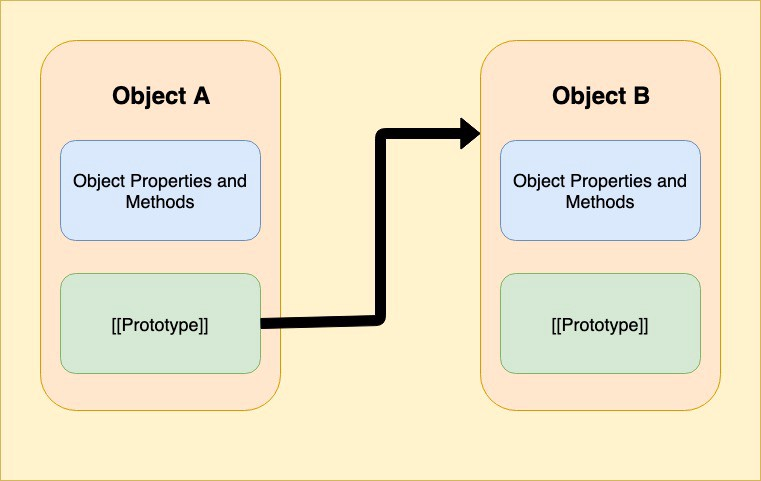
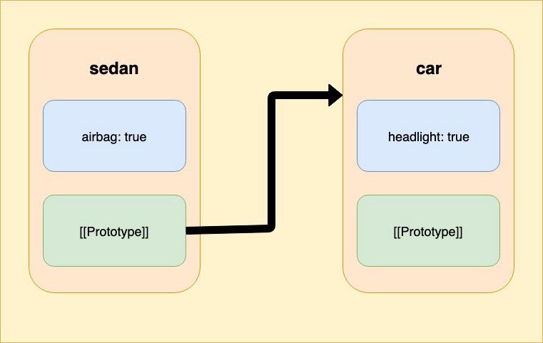
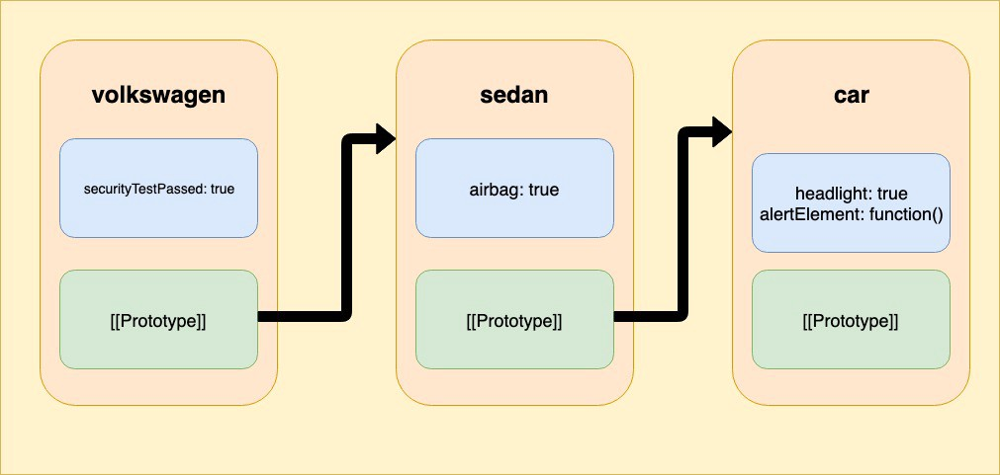
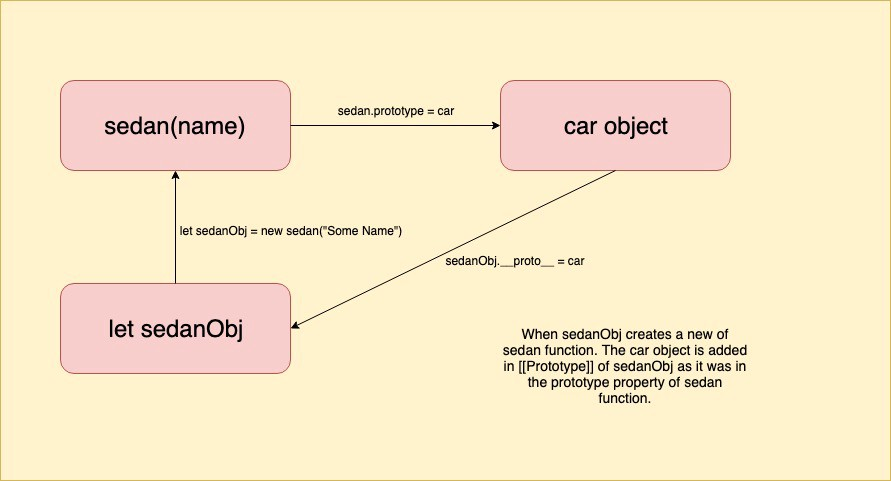

# JavaScript Prototype

This article is a mirror of [Diving deeper into Javascript Prototypes](https://codeburst.io/diving-deeper-into-javascript-prototypes-75bdac717d0b)

Thanks for [Kewal Kothari](https://codeburst.io/@kewal.kothari) for the clear picture of Javascript prototype.

Prototypes are a mechanism in JavaScript which adds the property to all the objects which can inherit features from another object. Let’s dive deeper to understand how does the prototype and its chaining work and how can it be useful.

## Is JavaScript a prototype based language?

JavaScript is known to be a prototype-based language. So that it can provide inheritance through every object containing a prototype object. The prototype object could contain the reference to the object of which the methods and properties have to be inherited. Also, every prototype object contains a prototype object which can further inherit the methods and properties. This is referred as a prototype chain.

## `[[Prototype]]`

JavaScript objects contain a hidden property — `[[Prototype]]` (as mentioned in the specification), which is either null or contains a references to another object. This object is the prototype. When we read a property from the object and if it’s missing then the JavaScript engine searches inside the objects prototype.

Look at the below diagram for a better clarity. `Object A` contains some properties and methods. `[[Prototype]]` of `Object A` contains the reference to `Object B` . Thus contents of `Object B` is accessible through `Object A` .



The property — `[[Prototype]]` is hidden and internally present.

## `__proto__`

There are multiple ways to get and set the prototype. We will use the primitive `__proto__` to understand this.

`__proto__` is not `[[Prototype]]` instead it is the getter and setter for it.

We can see in the below example.

```js
let car = {
  headlight: true
};
let sedan = {
  airbag: true
};

sedan.__proto__ = car; // Here we insert the car object in the [[prototype]] of sedan

// we can find both properties in sedan now:
alert( sedan.airbag ); // true
alert( sedan.headlight ); // true
```

We have two objects i.e; `car` and `sedan`. Here we can see that `sedan.__proto__ = car` sets the `car` to be the prototype of `sedan` . Therefore the `sedan` object can access `car` properties.



When we try to access the `sedan.headlight` JavaScript engine first checks if the property with name `headlight` is present. If not, then it checks the prototype of `sedan` and that is where it gets the value.

Lets look at another example which explains prototype chaining in it.

```js
let car = {
  headlight: true,
  alertElement: function() {
    alert("This is a Car!");
  }
};
let sedan = {
  airbag: true,
  __proto__: car
};
let volkswagen = {
  c: true,
  __proto__: sedan
};

volkswagen.alertElement();
alert( volkswagen.volkswagen ); // true
alert( volkswagen.airbag ); // true
alert( volkswagen.headlight ); // true
```

A new object has been added in this `case — volkswagen` which has `sedan` as its prototype.



Note: An object may always contain just one `[[Prototype]]` property. Therefore one object can inherit only some other one object at a time.

## The Prototype property

As we know, `new func()` creates new object with the constructor function. Also we know that `func.prototype` is an object, which means that the new operator just sets the `[[Prototype]]` for the new object.

Let’s look at the example below:

```js
let car = {
  headlight: true
};

function sedan(name) {
  this.name = name;
}

sedan.prototype = car;

let sedanObj = new sedan("Some Name"); // sedanObj.__proto__ == car

alert( sedanObj.headlight ); // true
```

Setting sed`an.prototype = car` literally means that when a `new sedan` is created, assign its `[[Prototype]]` to `car`.



Note: `func.prototype` only comes into play when we create a `new func()`.

Every function has the `prototype` property even if we don’t set any value to it.

The default `prototype` of any function is an object with the only property `constructor` that points back to the function itself.

## Modern Practices to use prototypes

The `__proto__` is considered outdated and somewhat deprecated property in JavaScript. `__proto__` property was only used for explanation in this article. However, some of the modern methods are as follows:

- `Object.create(proto, [propertiesObject])` — creates an empty object with given `proto` as `[[Prototype]]` and optional property descriptors.
- `Object.getPrototypeOf(obj)` — returns the `[[Prototype]]` of `obj`.
- `Object.setPrototypeOf(obj, proto)` — sets the `[[Prototype]]` of obj to proto.

**These should be used instead of `__proto__`.**

There are a lot of methods to change or get the value of `[[Prototype]]`. It is always safe to use these methods instead accessing the `__proto__` directly.

## Appendix

- [Diving deeper into Javascript Prototypes – codeburst](https://codeburst.io/diving-deeper-into-javascript-prototypes-75bdac717d0b)
- [Object prototypes - Learn web development | MDN](https://developer.mozilla.org/en-US/docs/Learn/JavaScript/Objects/Object_prototypes)
- [Inheritance and the prototype chain - JavaScript | MDN](https://developer.mozilla.org/en-US/docs/Web/JavaScript/Inheritance_and_the_prototype_chain)