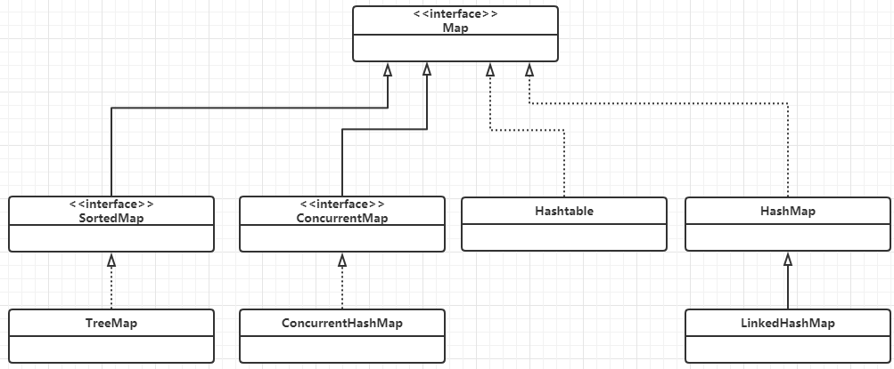

# Java 容器

Java 容器包含 `Collection` 和 `Map` 两种

## Collection

### Set

- `TreeSet`: 使用红黑树，有序，查找慢
- `HashSet`：使用 `HashMap`，无序，查找快
- `LinkedHashSet`：使用双向链表，有序，查找快

### List

- `ArrayList`：使用数组实现，支持随机存取，动态扩容，写操作成本高
- `CopyOnWriteArrayList`：`ArrayList` 的线程安全版，读写分离，写时加锁，读时不加。
- `Vector`：线程安全版 `ArrayList`，使用 `synchronized`
- `LinkedList`: 双向链表，只能顺序访问。

    

可以看出，`LinkedList` 即实现了 `Queue`, `Deque` 也实现了 `Link` 接口，故既可以作为双向链表也可以作为双向队列。

### Queue

- `LinkedList`
- `PriorityQueue`：利用最小堆+数组完成的队列

## Map

- `TreeMap`：红黑树实现
- `LinkedHashMap`: 双向链表，顺序为 *LRU* 或插入顺序
- `HashMap`：`hash` 表实现，无序，访问速度快
- `Hashtable`：线程安全的 `HashMap`，**已弃用**
- `ConcurrentHashMap`：线程安全的 `HashMap`，使用 *分断锁*，效率比 `HashTable` 更高

    > If a thread-safe highly-concurrent implementation is desired, then it is recommended to use `java.util.concurrent.ConcurrentHashMap` in place of `Hashtable`.

## 参考文献

- [CS-Notes](http://cyc2018.gitee.io/cs-notes/#/notes/Java%20%E5%AE%B9%E5%99%A8)
