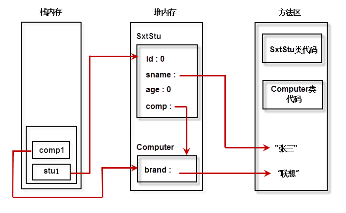
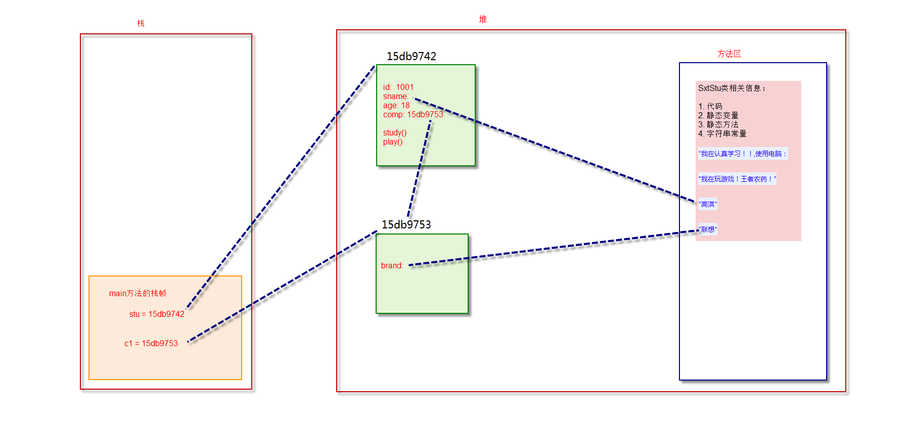

# Heap and Stack

Java虚拟机的内存可以分为三个区域：栈stack、堆heap、方法区method area。

**栈的特点如下：**

　　1. 栈描述的是方法执行的内存模型。每个方法被调用都会创建一个栈帧(存储局部变量、操作数、方法出口等)

　　2. JVM为每个线程创建一个栈，用于存放该线程执行方法的信息(实际参数、局部变量等)

　　3. 栈属于线程私有，不能实现线程间的共享!

　　4. 栈的存储特性是“先进后出，后进先出”

　　5. 栈是由系统自动分配，速度快!栈是一个连续的内存空间!

**堆的特点如下：**

　　1. 堆用于存储创建好的对象和数组(数组也是对象)

　　2. JVM只有一个堆，被所有线程共享

　　3. 堆是一个不连续的内存空间，分配灵活，速度慢!

**方法区(又叫静态区)特点如下：**

　　1. JVM只有一个方法区，被所有线程共享!

　　2. 方法区实际也是堆，只是用于存储类、常量相关的信息!

　　3. 用来存放程序中永远是不变或唯一的内容。(类信息【Class对象】、静态变量、字符串常量等)

图4-4 示例4-3内存分配图

