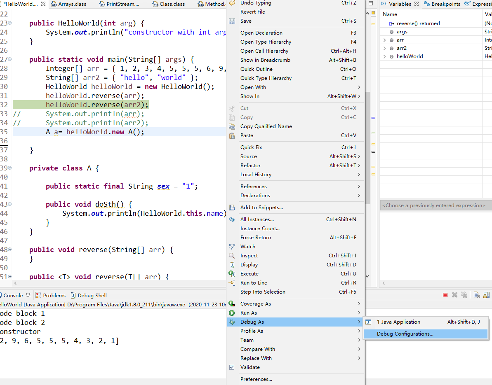
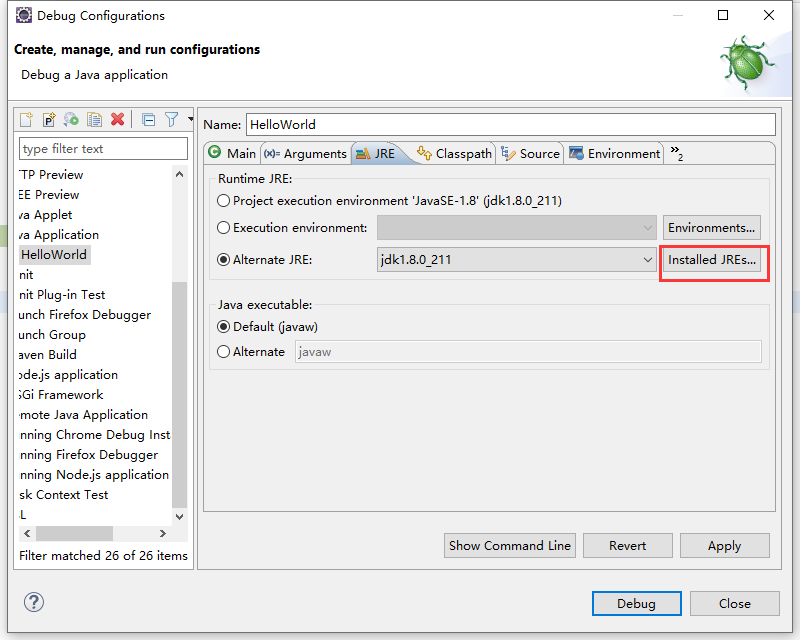
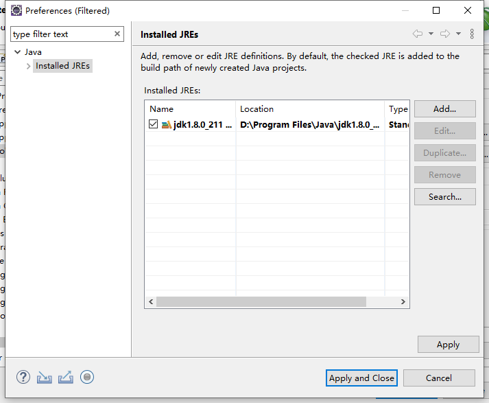
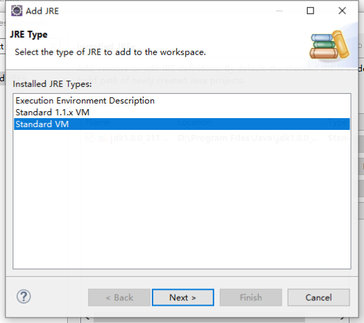
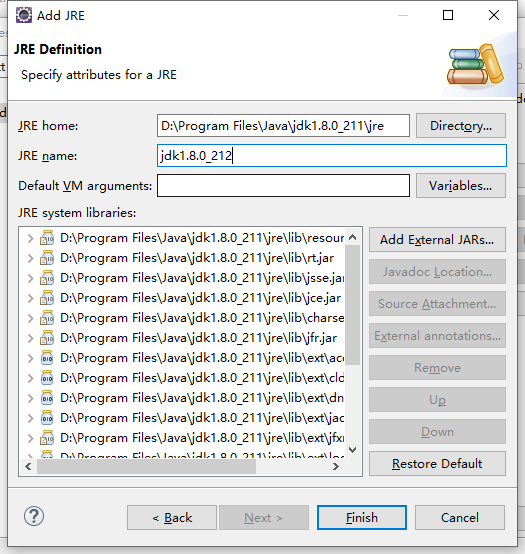

# Cannot `Step Into` when Debugging Using Eclipse

This happens probably because you are using `jre` instead of `jdk`,
of which the former is just **runtime**

## How to solve this

Change `jre` into that of `jdk`

### Step 1: Edit configuration

### Step 2: Replace `jre`with another from `jdk`

Click <kbd>Add...</kbd> , choose `Standard VM` and click <kbd>Next ></kbd>

### Step 3: Choose `jre`

Click <kbd>Directory...</kbd>, and navigate to the directory of `jre`, click <kbd>Finish</kbd>.
