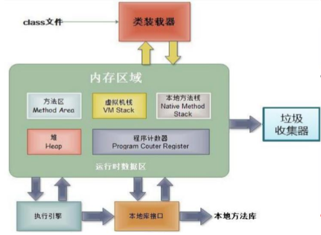

# Java Memory Model

- **堆(Heap)**，此内存区域的唯一目的就是存放对象实例，几乎所有的对象实例都在这里分配内存。这一点在 Java虚拟机 规范中的描述是：所有的 对象实例以及数组都要在堆上分配。
- 通常所说的**栈(Stack)**，是指虚拟机栈。虚拟机栈用于存储局部变量等。 局部变量表存放了编译期可知长度的 各种基本数据类型(`boolean`、`byte`、 `char`、 `short` 、 `int` 、 `float` 、 `long` 、 `double`)、对象引用(reference类型， 它不等同于对象本身，是对象在堆内 存的首地址)。 方法执行完，自动释放。
- **方法区(Method Area)**，用于存储已被虚拟机加载的类信息、常量、静态 变量、即时编译器编译后的代码等数据。
