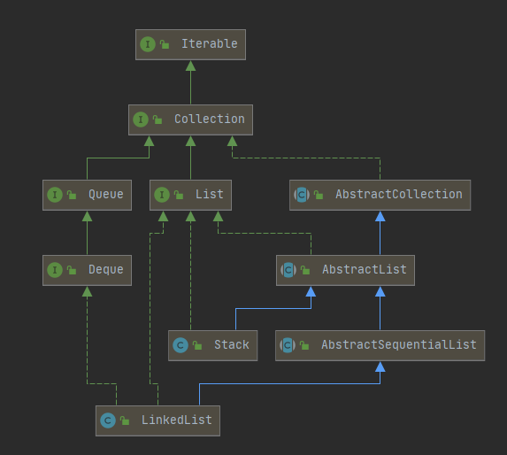

# Queue, Deque and Stack

## Diagram



## API List

### Queue

| Throws Exception   | Returns Null   | Description                            |
| ------------------ | -------------- | -------------------------------------- |
| [add][add]         | [offer][offer] | Add an element to the end of the queue |
| [remove][remove]   | [poll][poll]   | Remove and return the head element     |
| [element][element] | [peek][peek]   | Get first element without remove it    |

### Deque

Pronounced `[dek]`, meaning _Double End Queue_, which also has APIs for **queue**, **stack**.

| `Queue` Methods        | Equivalent `Deque` Method      | Exception |
| ---------------------- | ------------------------------ | --------- |
| [`add(e)`][add]        | [`addLast(e)`][addLast]        | Y         |
| [`offer(e)`][offer]    | [`offerLast(e)`][offerLast]    |
| [`remove()`][remove]   | [`removeFirst()`][removeFirst] | Y         |
| [`poll()`][poll]       | [`pollFirst()`][pollFirst]     |
| [`element()`][element] | [`getFirst()`][getFirst]       | Y         |
| [`peek()`][peek]       | [`peekFirst()`][peekFirst]     |

### LinkedList

### Stack

> A more complete and consistent set of _LIFO_ stack operations is provided by the `Deque` interface
> and its implementations, which should be used in preference to this class. For example:
>
> ```java
> Deque<Integer> stack = new ArrayDeque<Integer>();
> ```
>
> -- From [Stack (Java Platform SE 7 )](https://docs.oracle.com/javase/7/docs/api/java/util/Stack.html)

Which means this class is seldom used.

[add]: https://docs.oracle.com/javase/7/docs/api/java/util/Queue.html#add(E)
[offer]: https://docs.oracle.com/javase/7/docs/api/java/util/Queue.html#offer(E)
[remove]: https://docs.oracle.com/javase/7/docs/api/java/util/Queue.html#remove()
[poll]: https://docs.oracle.com/javase/7/docs/api/java/util/Queue.html#poll()
[element]: https://docs.oracle.com/javase/7/docs/api/java/util/Queue.html#element()
[peek]: https://docs.oracle.com/javase/7/docs/api/java/util/Queue.html#peek()

[addLast]: https://docs.oracle.com/javase/7/docs/api/java/util/Deque.html#addLast(E)
[offerLast]: https://docs.oracle.com/javase/7/docs/api/java/util/Deque.html#offerLast(E)
[removeFirst]: https://docs.oracle.com/javase/7/docs/api/java/util/Deque.html#removeFirst()
[pollFirst]: https://docs.oracle.com/javase/7/docs/api/java/util/Deque.html#pollFirst()
[getFirst]: https://docs.oracle.com/javase/7/docs/api/java/util/Deque.html#getFirst()
[dequePeek]: https://docs.oracle.com/javase/7/docs/api/java/util/Deque.html#peek()
[peekFirst]: https://docs.oracle.com/javase/7/docs/api/java/util/Deque.html#peekFirst()
