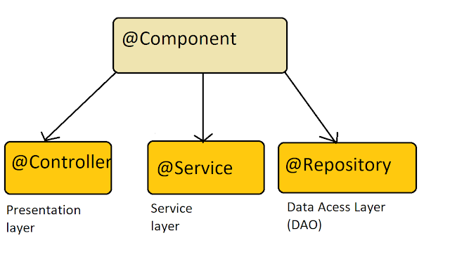
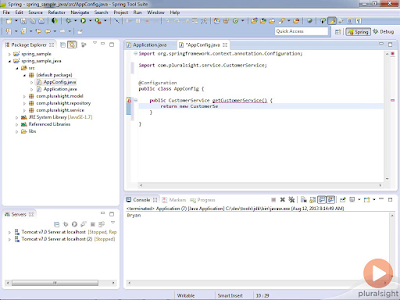

# Difference between @Component, @Service, @Controller, and @Repository in Spring

Before you learn the difference between `@Component`, `@Service`, `@Controller`, and `@Repository` annotations in the [Spring framework](https://javarevisited.blogspot.com/2018/06/top-6-spring-framework-online-courses-Java-programmers.html), it's important to understand the role of `@Component` annotation in Spring. During the initial release of Spring, all beans are used to be declared in an XML file. For a large project, this quickly becomes a massive task, and Spring guys recognize the problem rather quickly. In later versions, they provide annotation-based dependency injection and Java-based configuration. From Spring 2.5 annotation-based [dependency injection](http://javarevisited.blogspot.sg/2012/12/inversion-of-control-dependency-injection-design-pattern-spring-example-tutorial.html) was introduced, which automatically scans and registers classes as Spring bean which is annotated using `@Component` annotation.

This means you don't declare that bean using the `<bean>` tag and inject the dependency, it will be done automatically by Spring. This functionality was enabled and disabled using <context:component-scan> tag.

Now that you know what does `@Component` annotation does let's see what does @Service, @Controller, and `@Repository` annotation do.

They are nothing but the specialized form of `@Component` annotation for certain situations. Instead of using `@Component` on a controller class in Spring MVC, we use @Controller, which is more readable and appropriate.

By using that annotation we do two things, first, we declare that this class is a Spring bean and should be created and maintained by [Spring ApplicationContext](http://javarevisited.blogspot.sg/2012/11/difference-between-beanfactory-vs-applicationcontext-spring-framework.html), but also we indicate that its a controller in MVC setup. This latter property is used by web-specific tools and functionalities.

For example, DispatcherServlet will look for @RequestMapping on classes that are annotated using @Controller but not with @Component.

This means @Component and @Controller are the same with respect to bean creation and dependency injection but later is a specialized form of former. Even if you replace @Controller annotation with @Compoenent, Spring can automatically detect and register the controller class but it may not work as you expect with respect to request mapping. You can further see, [**Spring Master Class**](https://click.linksynergy.com/fs-bin/click?id=JVFxdTr9V80&subid=0&offerid=323058.1&type=10&tmpid=14538&RD_PARM1=https%3A%2F%2Fwww.udemy.com%2Fspring-tutorial-for-beginners%2F) course on Udemy for more details about these annotations.



The same is true for @Service and @Repository annotation, they are a specialization of @Component in service and persistence layer. A Spring bean in the service layer should be annotated using @Service instead of @Component annotation and a spring bean in the persistence layer should be annotated with @Repository annotation.

By using a specialized annotation we hit two birds with one stone. First, they are treated as Spring bean, and second, you can put special behavior required by that layer.

For example, @Repository's not only helping in annotation based configure but also catch Platform-specific exceptions and re-throw them as one of Spring’s unified [unchecked exception](https://javarevisited.blogspot.sg/2011/12/checked-vs-unchecked-exception-in-java.html).

Though for that you also need to declare org.springframework.dao.annotation.PersistenceExceptionTranslationPostProcessor as Spring bean in your application context.

This bean post-processor adds an advisor to any bean that’s annotated with @Repository so that any platform-specific exceptions are caught and then rethrown as one of Spring’s unchecked data access exceptions. You can also see [**Spring Framework 5: Beginner to Guru**](https://click.linksynergy.com/fs-bin/click?id=JVFxdTr9V80&subid=0&offerid=323058.1&type=10&tmpid=14538&RD_PARM1=https%3A%2F%2Fwww.udemy.com%2Fspring-framework-5-beginner-to-guru%2F) on Udemy for more details.

This is also one of the frequently asked Spring Interview Question and a popular concept from the Spring certification perspective. You will find a couple of questions based on these annotations and their usage in the Spring professional certification exam too.

## How does Component Scanning work in Spring ?

From Spring 2.0, Spring provides <context:component-scan> and annotation-driven dependency injection to automatically detect and register Spring bean instead of specifying them in the XML file.

But, it only scans `@Component` and does not look for `@Controller`, `@Service`, and `@Repository` in general. They are scanned because they themselves are annotated with @Component.

Just take a look at `@Controller`, `@Service`, and `@Repository` annotation definitions:

```java

@Component
public @interface Service {
….
}


@Component
public @interface Repository {
….
}

@Component
public @interface Controller {
…
}
```

Thus, it’s not wrong to say that `@Controller`, `@Service`, and `@Repository` are special types of `@Component` annotation. <context:component-scan> picks them up and registers their following classes as beans, just as if they were annotated with `@Component`.

They are scanned because they themselves are annotated with `@Component` annotation. If you define your own custom annotation and annotate it with `@Component`, then it will also get scanned with <context:component-scan>.

If you want to learn more about dependency injection, auto-wiring, and different types of configuration in Spring e.g. XML based, annotation-based, and Java configuration in Spring, I suggest you take the [**Spring Fundamentals course**](https://pluralsight.pxf.io/c/1193463/424552/7490?u=https%3A%2F%2Fwww.pluralsight.com%2Fcourses%2Fspring-fundamentals) on Pluralsight. A free trial is also available.



### Differences between @Component, @Service, @Controller, and @Repository in Spring

Here is a nice summary of what does `@Component`, `@Service`, `@Controller`, and `@Repository` annotation do in Spring Framework:

1. `@Component` is a generic stereotype for any Spring-managed component or bean.
2. `@Repository` is a stereotype for the persistence layer.
3. `@Service` is a stereotype for the service layer.
4. `@Controller` is a stereotype for the presentation layer (spring-MVC).

And here is the nice diagram to explain the hierarchy of all these annotations in Spring Framework:


That's all about the **difference between `@Component`, `@Controller`, `@Service`, and `@Repository` in Spring Framework**. As I said, all of them are used to auto-detect Spring beans when context scanning is enabled and essentially provide the same functionality with respect to dependency injection.

Their only difference comes in their purpose i.e. `@Controller` is used in Spring MVC to define controller, which are first Spring bean and then the controller. Similarly, `@Service` is used to annotated classes that hold business logic in the Service layer and `@Repository` is used in the Data Access layer.

In short, you should use the most appropriate annotation based upon which layer that particular class belongs to.

**Read more**: <https://javarevisited.blogspot.com/2017/11/difference-between-component-service.html#ixzz6QWaGpS1o>
