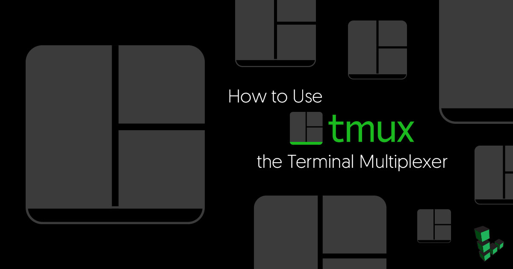
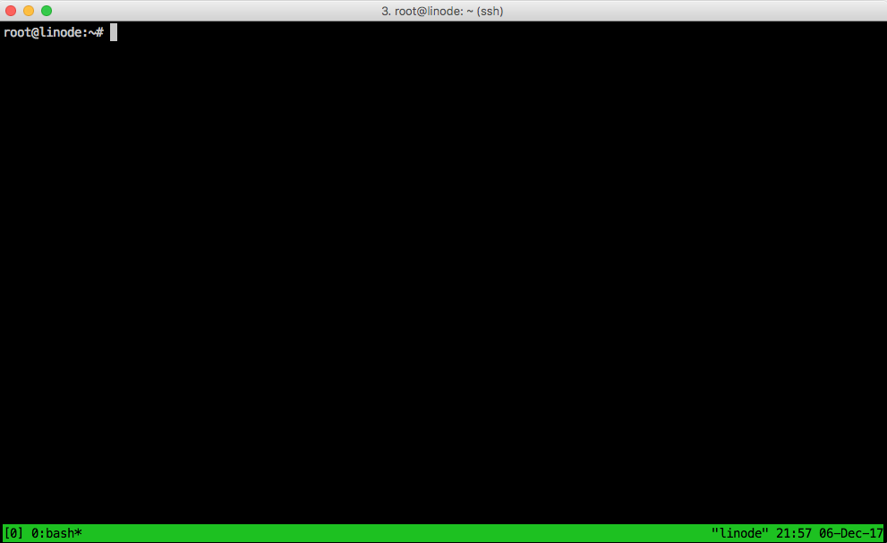

# Tmux



## What is tmux?

Tmux is a **terminal multiplexer**. It creates a host **server** on your computer and connects to it with a client window. If the client is disconnected, the server keeps running. When re-opened you terminal, you can reattach to the `tmux` session and the files you were working with will still be open, and the processes you had running will still be active.

By attaching multiple sessions, windows, and panes to a tmux server, you can organize your workflow and easily manage multiple tasks and processes.

## Install tmux

Install tmux with your distribution's package manager.

On Debian or Ubuntu:

    sudo apt install tmux

## Attach and Detach from a tmux Session

1.  When tmux is started it creates a new session with one window and one pane. Start a session:

        tmux

    Your terminal window should have a green menu bar at the bottom, similar to the one below:

    

2.  Detach from the session:

        tmux detach

    This will return you to the basic terminal.

3.  Once a session has been started, it will continue to run as long as the host computer is running, or until you stop the session. You can log out of your current session, and reattach to the previous session.

        tmux attach

## tmux Commands

There are three ways to issue commands to tmux:

  * **shortcuts**: tmux uses what is called a *prefix key*, which is **<kbd>CTRL+b</kbd>** by default. tmux will interpret the keystroke following the prefix as a tmux shortcut. For example: to detach from your session using a shortcut: press **<kbd>CTRL+b</kbd>**, release both keys and then press **d**.
  * **command mode**: Enter command mode by pressing **`Prefix`** then **`:`**. This will open a command prompt at the bottom of the screen, which will accept tmux commands.
  * **command line**: Commands can also be entered directly to the command line within a tmux session. Usually these commands are prefaced by `tmux`. The `tmux attach` command used in the previous section was an example of this type of command.

  Most tmux tasks can be accomplished using any of these three methods.

> **Note**: You can change the prefix key by editing the `.tmux.config` file. For the remainder of this guide, **Prefix** will be used to refer to either the default **<kbd>CTRL+b</kbd>** or the combination you have chosen in your configuration file.

## Manage tmux Windows

When a tmux session starts, a single window is created by default. It is possible to attach multiple windows to the same session and switch between them as needed. This can be helpful when you want to run multiple jobs in parallel.

| Command  |  Result |
|---|---|
| **Prefix** + **c**  | Create a new window  |
| **Prefix** + **p** |  Switch to the previous window |
| **Prefix** + **n**  |  Switch to the next window |
| **Prefix** + **0-9**  |  Switch to a window using it's index number |
| **Prefix** + **w**  | Choose a window from an interactive list |
| **exit** |  Close a window |
| **Prefix** + **&**  | Force kill-all processes in an unresponsive window  |

By default, tmux names each window according to the process that spawned it (most commonly bash). To give windows names that are easier to remember and work with, you can rename a window with **`Prefix + ,`**.

## Manage tmux Panes

Each window can be divided into multiple panes. This is useful when you want outputs from multiple processes visible within a single window.

| Command  | Result  |
|---|---|
| **Prefix** + **"**  |  Split the active pane horizontally |
| **Prefix** + **%**  | Split the active pane vertically  |
| **Prefix** + **arrow key**  | Switch to another pane  |
| **Prefix** + **ALT+arrow**  | Resize the active pane  |
| **Prefix** + **z**  | Zoom in on the active pane. Press the same combination again to exit zoom mode  |
| **exit**  | Close the active pane  |
| **Prefix** + **x**   | Force kill an unresponsive process in a pane  |

## Manage tmux Sessions

Sometimes even multiple windows and panes aren't enough and you need to separate the layouts logically by grouping them into separate sessions. Open the command prompt with **`Prefix`** then **`:`**, then start a new session:

```text
new-session
```

> **Note**: It's also possible to type shorter versions of a command, for example: "`new-se`". But this will work only if it there isn't another command that starts with the same string of characters.

| Command  | Result  |
|---|---|
| **Prefix** + **(**  | Switch to the previous session |
| **Prefix** + **)**  | Switch to the next session  |
| **Prefix** + **s**  | Display an interactive session list  |
| `tmux ls`  | List all available sessions  |
| `tmux attach -t 0`  | Zoom in on the active pane. Press the same combination again to exit zoom mode  |
| `tmux kill-server`  | Destroy all sessions and kill all processes  |

## Create a tmux Configuration File

1.  As you get comfortable with tmux, you may want to change some of the defaults. Using a text editor, create a configuration file(`~/.tmux.conf`) in your user's home directory:

    ```conf
    # Uncomment the lines with the options you want to activate (by deleting the preceding "#")

    # Allow mouse interaction
    # set-option -g mouse on

    # Change prefix key to CTRL+A. "C-" stands for CTRL, "M-" stands for ALT key
    # set-option -g prefix C-a
    # unbind-key C-b
    # bind-key C-a send-prefix

    # Display CPU load average for the last 1,5 and 15 minutes, in the status bar
    set -g status-right "#(cut -d ' ' -f -3 /proc/loadavg) %H:%M %d-%b-%y"
    ```

2.  When you have saved your changes to this file, load the new configuration. Enter the tmux command mode by pressing **`Prefix`** then **`:`**, then use the following command:

    ```text
    source-file ~/.tmux.conf
    ```
3.  With the mouse option enabled you can use the pointer to interact with tmux panes, windows and status bar. For example you can click on a window name in the status bar to switch to it or you can click and drag a pane line to resize it.

4.  Other configuration options are available in the [tmux manual](http://man.openbsd.org/OpenBSD-current/man1/tmux.1).

## Some Tips

### 1. Start tmux as default terminal

Add this to your remote system’s ~/.bash_profile file:

```.bash_profile
if [ -z "$TMUX" ]; then
    tmux attach -t default || tmux new -s default
fi
```

## Tmux Commands

1. `Prefix :` Enter command mode.
1. `clear-history` As the name indicates, clear the scrollbar.
1. **search** in `Tmux` buffer ([StackExchange](https://superuser.com/questions/231002/how-can-i-search-within-the-output-buffer-of-a-tmux-shell))

    > **copy mode search**
    >
    > To search in the tmux history buffer for the current window, press Ctrl-b [ to enter copy mode.
    >
    > If you're using `emacs` key bindings (the default), press <kbd>Ctrl-s</kbd> then type the string to search for and press Enter. Press n to search for the same string again. Press <kbd>Shift-n</kbd> for reverse search. Press Escape twice to exit copy mode. You can use <kbd>Ctrl-r</kbd> to search in the reverse direction. Note that since `tmux` is in control of the keyboard in copy mode, <kbd>Ctrl-s</kbd> works regardless of the `stty ixon` setting (which I like to have as `stty -ixon` to enable forward searches in Bash).
    >
    > If you're using vi key bindings (<kbd>Ctrl-b:</kbd>`set-window-option -g mode-keys vi`), press <kbd>/</kbd> then type the string to search for and press Enter. Press n to search for the same string again. Press Shift-n for reverse search as in emacs mode. Press q twice to exit copy mode. You can use ? to search in the reverse direction.
    > 
    > **find-window**
    > If you want to switch to a window based on something displayed in it (this also includes window names and titles but not history), (starting with more than one window open) press Ctrl-b f then type the string to search for and press Enter. You will be switched to a window containing that text if it's found. If more than one window matches, you'll see a list to select from.

## See Also

- [tmux Manual](http://man.openbsd.org/OpenBSD-current/man1/tmux.1)
- [The Tao of tmux](https://leanpub.com/the-tao-of-tmux/read)
- [4 tips for better tmux sessions - Fedora Magazine](https://fedoramagazine.org/4-tips-better-tmux-sessions/)