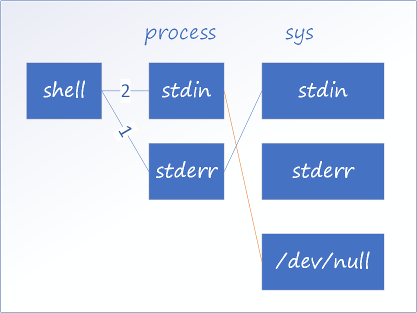

# I/O Redirect

> Redirect includes input, output and pipe

## Input redirection

Input usually from keyboard or pipe(`|`)

### 1. `<`

Redirect a file to a bash, same as `bash file`, rarely used.

```bash
# same as
# cat some_file
cat < some_file
```

### 2. `<<`

The content will be regarded as a file content, same as do something with the file contains such content.

1. **here document**: `<<EOF`, inside which bash calling is allowed, and the output is taken as the embed string
2. **now document**: `<<'EOF'`(quote the identifier with either single or double quotes), inside which all characters will be taken as plain text

```bash
# here document
cat <<HERE
date is `date`
HERE
# output: date is Tue Jul 11 07:44:27 CST 2017

# now document
# same as `cat <<"NOW"`
cat <<'NOW'
date is `date`
NOW
# output: date is `date`
```

> Notice: There could be space(s) between redirect token and document delimiter

## Output redirection

### 1. `>`

Redirect to and replace the file.

### 2. `>>`

Redirect and append to the file.

## `stdin`/`stdout`/`stderr`

Devices locates at `/dev/fd/`

When redirecting to file descriptor(e.g. stdin 0, stdout 1, stderr 2), the descriptor should **immediately** appending the redirection operator(`>`, `>>`), otherwise error `syntax error near unexpected token '&'` will raise.

## Example

```bash
ls -l 1>file.txt 2>&1
```

It redirects standard output to `file.txt`, and redirects standard error to standard output, which is also redirected to `file.txt` .

The `2>&1` should be behind standard output redirection(`1>file.txt`).
Otherwise, when error occurs from the command(`ls -l` in this example), it will have redirect to `stdout`

```sh
command 2>&1 1>/dev/null
```

The `stderr` will be redirected to standard error, and the output to descriptor `1` will redirect to `/dev/null`.



:::tip

1. When use `1` as `stdin`, it can be omitted:

    ```sh
    # Same as `ls 1>stdout.txt`
    ls > stdout.txt
    ```

2. When redirect using file descriptors, `&` must be immediately after redirect symbols

    ```sh
    # `ls > &2` will raise error: syntax error near unexpected token `&'
    ls >& 2
    ```

:::

### BASH script

**script `test.sh`**:

```bash
#!/usr/bin/env bash

echo -e "\033[32m"
cat $1
echo -e "\033[0m"
```

**usage**:

```bash
echo 123 | ./test.sh
# put out green colored "123"
```

### PHP script

**script `test.php`**:

```php
#!/usr/bin/env php
<?php

echo fgets(STDIN);
```

**usage**:

```bash
echo 123 | php test.php
# or
echo 123 | ./test.php

# both output "123"
```

## Pipe

Pipe(`|`) can be used to redirect `stdout` from former command(*commandA*) to `stdin` of the next command(*commandB*).

```sh
commandA | commandB
```

## A bit more about how shell works with files

When shell performs I/O redirect, it firstly parses the command given, if there are files(descriptors), the file(descriptors) will be opened first. For instance,

```sh
ls -la | tee result.txt
```

and you will see the `result.txt` listed(result.txt is list below), which means, the file `result.txt` is created before `ls` actually executed.

```
.
..
result.txt
others
```
