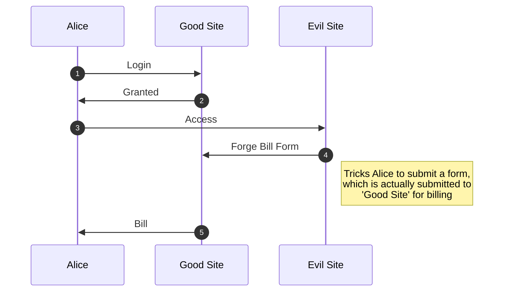

# CSRF: Cross-Site Request Forgery

Suppose that Client(Alice) has access to Good-Site, and when she visits one Evil-Site, The Evil-Site, which is hosted by Bob, tricks Alice to make a request to Good-Site, within the request, Bob may do something like buying some stuff with Alice's money and sent to Bob. The request will be totally *normal* to Good-Site. Through this way, Evil-Site is able to use the resource of Alice in Good-Site(buying something or use some privileged service).

By the **4th** step `forge form`, ++Evil Site++ prepares an evil request trying to access some payment service on ++Good Site++, and the bill is on ++Alice++.

## Appendix

1. [CSRF攻击原理及防御](https://www.cnblogs.com/shytong/p/5308667.html)