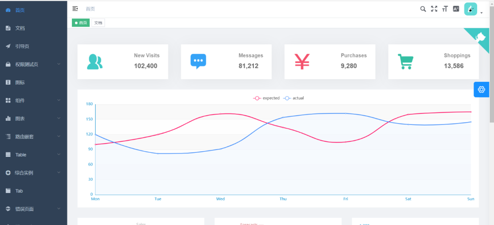
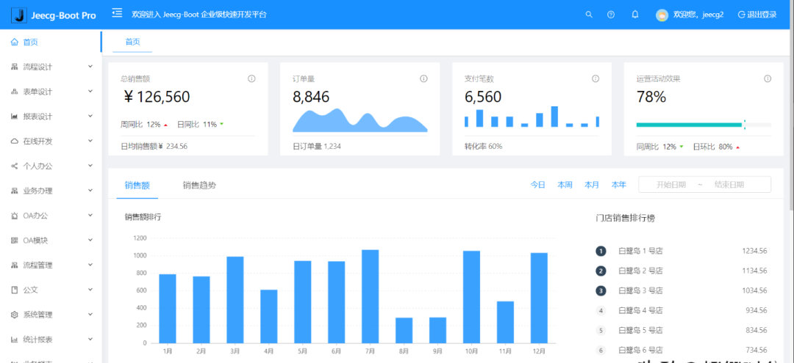
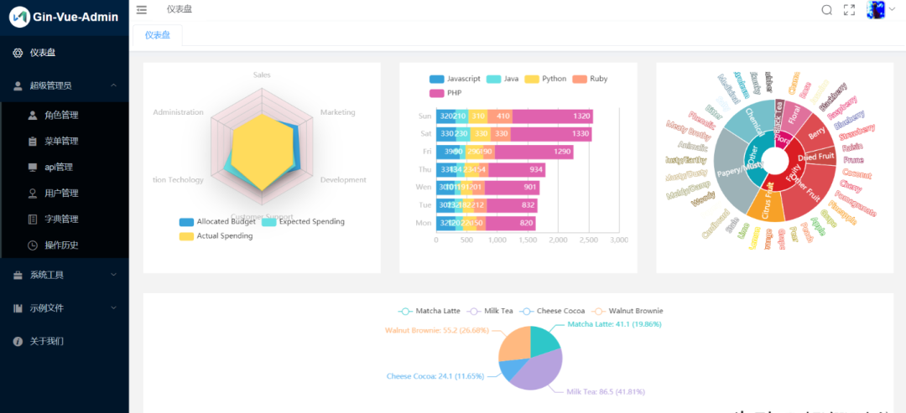
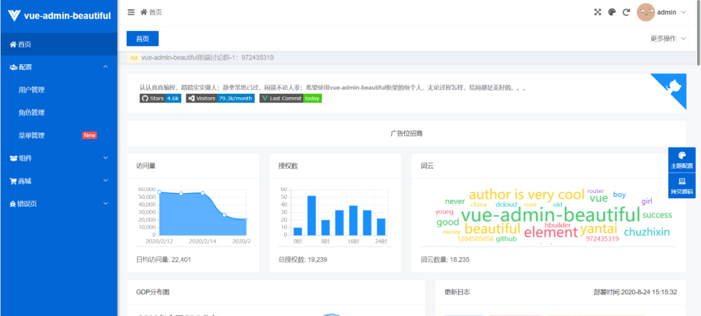
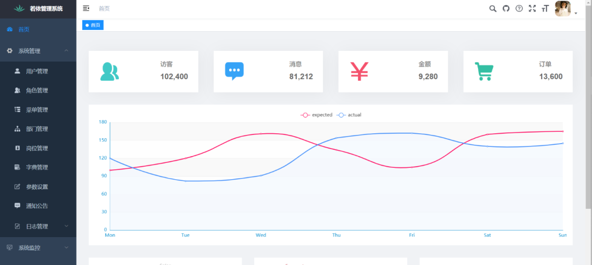
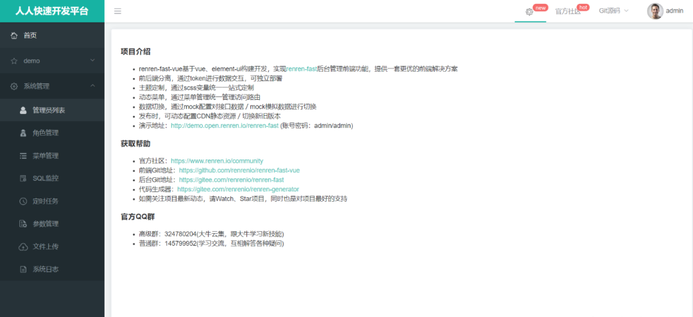
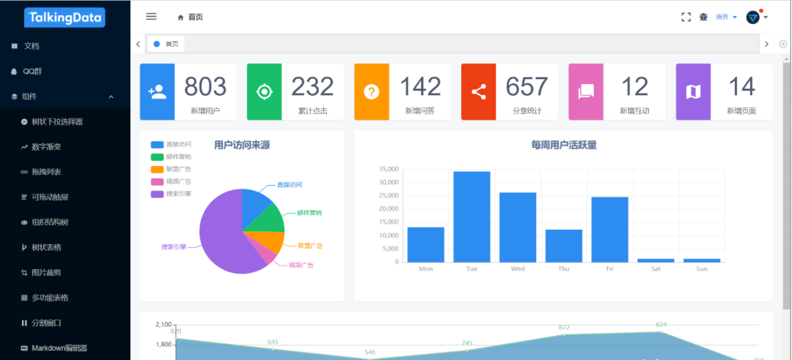
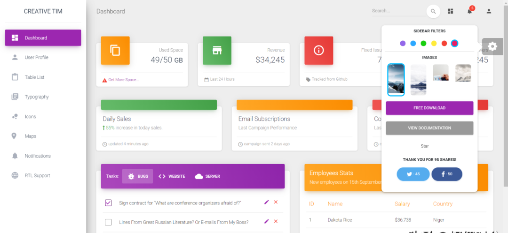
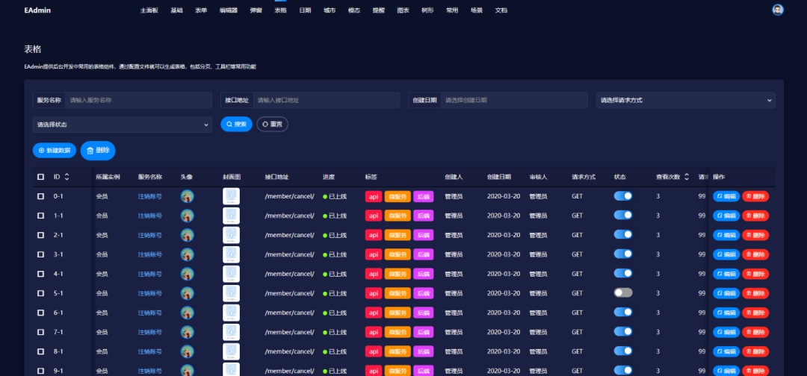

# Outsourcing Projects

## **1、D2admin**

开源地址：https://github.com/d2-projects/d2-admin

文档地址：https://d2.pub/zh/doc/d2-admin/

效果预览：https://d2.pub/d2-admin/preview/#/index

开源协议：MIT

## **2、vue-element-admin**

开源地址：https://github.com/PanJiaChen/vue-element-admin

文档地址：https://panjiachen.github.io/vue-element-admin-site/zh/

效果预览：https://d2.pub/d2-admin/preview/#/index

开源协议：MIT

## **3、JEECG-BOOT**

开源地址：https://github.com/zhangdaiscott/jeecg-boot

文档地址：https://panjiachen.github.io/vue-element-admin-site/zh/

效果预览：http://boot.jeecg.com/

开源协议：Apache-2.0 License

## **4、GIN-VUE-ADMIN**

开源地址：https://github.com/flipped-aurora/gin-vue-admin

文档地址：https://www.gin-vue-admin.com/

效果预览：http://demo.gin-vue-admin.com/#/layout/dashboard

开源协议：Apache-2.0 License

## **5、vue-admin-beautiful**

开源地址：https://github.com/chuzhixin/vue-admin-beautiful

文档地址：https://www.gin-vue-admin.com/

效果预览：http://beautiful.panm.cn/

开源协议：MPL-2.0 License

## **6.Dcat-admin**

开源地址：https://github.com/jqhph/dcat-admin

文档地址：http://www.dcatadmin.com/

效果预览：http://103.39.211.179:8080/admin

开源协议：MIT License

## **7、RuoYi**

开源地址：https://gitee.com/y_project/RuoYi

文档地址：https://doc.ruoyi.vip/

效果预览：https://vue.ruoyi.vip/index

开源协议：MIT License

## **8、renren-fast-vue**

开源地址：https://gitee.com/renrenio/renren-fast-vue

文档地址：https://www.renren.io/guide

效果预览：http://demo.open.renren.io/renren-fast/#/home

开源协议：MIT License

## **9、ant-design-pro**

开源地址：https://github.com/ant-design/ant-design-pro

文档地址：https://pro.ant.design/index-cn/

效果预览：https://pro.ant.design/

开源协议：MIT License

## **10、iview-admin**

开源地址：https://github.com/iview/iview-admin

文档地址：https://lison16.github.io/iview-admin-doc/

效果预览：https://admin.iviewui.com/home

开源协议：MIT License

## **11、material-dashboard**

开源地址：https://github.com/creativetimofficial/material-dashboard#demo

文档地址：https://demos.creative-tim.com/material-dashboard/docs/2.1/getting-started/introduction.html

效果预览：https://demos.creative-tim.com/material-dashboard/examples/dashboard.html

开源协议：MIT License

## **12、EAdmin**

开源地址：https://github.com/suruibuas/eadmin

文档地址：http://doc.eadmin.com.cn/

效果预览：http://www.eadmin.com.cn/

开源协议：无

