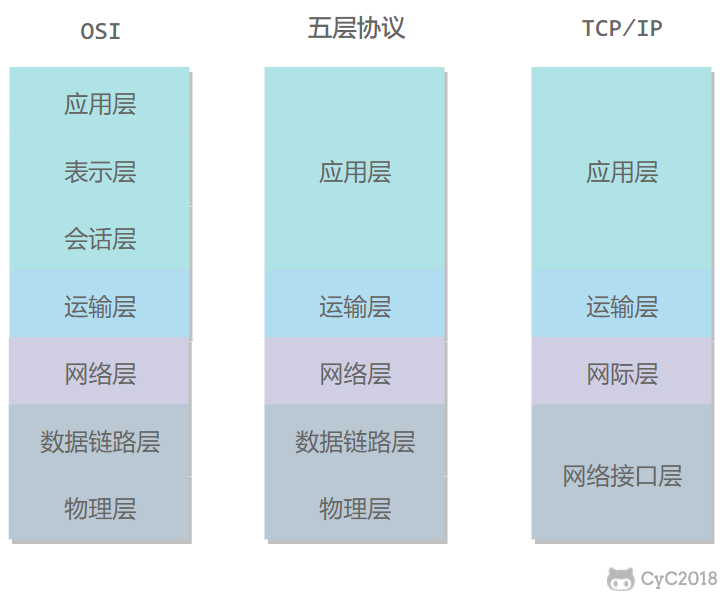

# 计算机网络

OSI（Open System Interconnection）7层架构

VLAN: 虚拟局域网络<todo/>

| 层次   | 数据   | Eng.    | Protocol
| ------ | ------ | ------- | ---
| 应用层 |        |         | `DNS,UDP,53`
| 传输层 | 报文   | Segment |
| 网络层 | 数据报 | Diagram |
| 链路层 | 帧     | Frame   |
| 物理层 | 位     | Bit     |

## 传输层

TCP vs. UDP

## 应用层

### UDP

> 在两种情况下会使用 TCP 进行传输：
>
> 如果返回的响应超过的 512 字节（UDP 最大只支持 512 字节的数据）。
> 区域传送（区域传送是主域名服务器向辅助域名服务器传送变化的那部分数据）。

### FTP

TCP

- 主动模式
- 被动模式

### DHCP

UDP

### TELNET

<acr>Teletype Network</acr>
