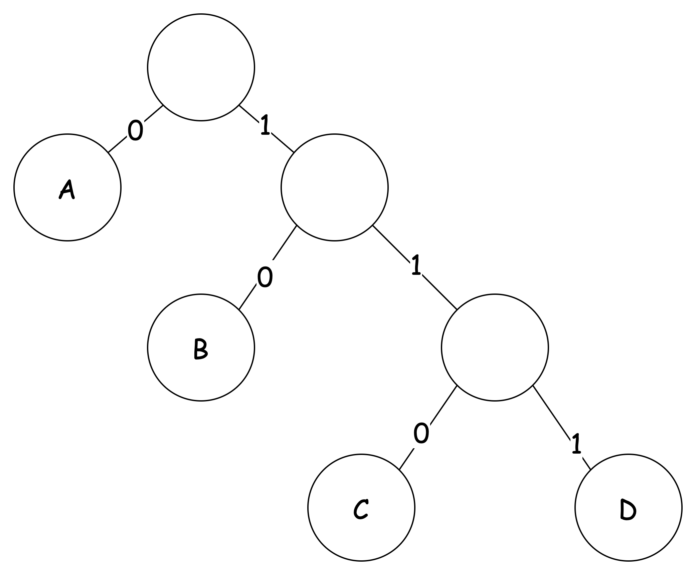
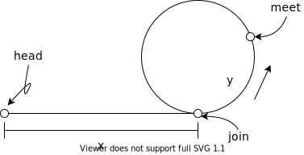

# Algorithm

## AVL Tree 的特点

> 平衡二叉树，Balanced Binary Tree。

1. 左子树与子树都是平衡树
2. 左右子树的深度差不超过 1

平衡二叉树的所有结点的平衡因子均为 `{-1, 0, 1}`。

插入新结点后会导致树失去平衡，此时可以通过左旋、右旋再次达到平衡。

### 平衡因子

某结点的平衡因子：该结点左子树深度减去右子树深度。

### 时间复杂度

查询树的时间复杂度都为 \\(O(h)\\)，\\(h\\) 为树的高度。

对于平衡二叉树有

\\[
h = \\log_2 n
\\]

插入 \\(O(\\log_2n)\\\)

## 二叉搜索树的时间复杂度

> 二叉搜索树（Binary Search Tree）

增删查都是 \\(O(h)\\)，\\(h\\) 为树的高度。

## 红黑树比 AVL 树优在哪里

红黑树对平衡的要求没有 AVL 树严格，增删结点导致的旋转操作减少，所以两者相比，前者更适合修改操作较多的情况，AVL 树更适合查询较多的场景。

## 红黑树的性质

红黑树是二叉排序树，深度不超过 `n / 2`

1. 每个结点不是红色就是黑色
2. 根结点为黑色
3. 叶结点为黑色（`=nil`）
4. 红色结点的子结点为黑色
5. 任何结点到其子树的叶结点包含的黑色节点数相同，称黑高。（树的黑高为根节点的黑高）

新增、修改一个结点，可能破坏以上性质，通过

1. 旋转：左旋、右旋
2. 变色

使其再次满足以上 5 点性质。

## MySQL B+ 树深度

索引指针大小：6 bytes

页大小： 16K

设索引是 `bigint`： 8 bytes

一页作为一个节点，关键字数目：\\(16384 \\div (8 + 6) = 1170\\)

设一个数据行大小：1K

则 \\(h\\) 层 B+ 树包含的数据行数目 \\(n\\) 为

\\[
n = 1170  ^  {h - 1} * 16
\\]

| 深度（\\(h\\)） | 数据行数 |
| --------------- | -------- |
| 1               | 16       |
| 2               | 2 万     |
| 3               | 2000 万  |
| 4               | 200 亿   |
| 5               | 3 亿亿   |

> 所以即使 `bigint` 也不会超过 6 层。

---

```sql
SHOW VARIABLES LIKE 'innodb_page_size'
```

可以查看默认页大小。

## 排序算法有哪些，什么特点

堆排序、最大堆、大根堆、大顶堆

树，怎么了

## 霍夫曼编码 Huffman 的原理，解决什么问题

利用最优二叉树对字符串编码，减少字符串长度。也可以做无损压缩

将出现次数最少（权重为出现的次数）的字符放在树的最底层。

\\[
\sum_{i=1}^n{w_il_i}
\\]

\\(w_i\\) 为出现的次数，\\(l_i\\) 为深度。则上式为报文长度。

Huffman 编码使该 *带权路径长度* 最短。

对于序列\\(a_1, a_2, ...,a_n\\)

1. 先取最小两个值相加的\\(b_i\\)形成新队列\\(\{b_1,a_3,...,a_n\}\\)
2. 对新队列重复上述步骤直至只有一个元素

---

对于字符串 `ACABBDA`，其中字符出现的次数为

| Char | Count | Bit  |
| ---- | ----- | ---- |
| A    | 3     | 0    |
| B    | 2     | 10   |
| C    | 1     | 110  |
| D    | 1     | 111  |

使用 `count` 作为权值，可以得到下面的 Huffman 树。此时的压缩后结果为 (占13位)

```
0 1100 1010 1110
```




## 求是整数二进制表示是否只有一个 1

`n & (n - 1) == 0`

## 数据结构有哪些

1. 队列
2. 栈
3. 链表：单向、双向、循环
4. 树：二叉树、平衡树、红黑树
5. 图

## 不使用加做加法（整数）

使用位运算，同位置均为 1 则需要进位（按位与后左移 1 位），否则不需要进位（异或）

使用 `b` 存储进位，则当进位为 0 时，表示计算结束。

```java
// a + b
while (b != 0) {
  int c = a & b << 1; // 进位
  a ^= b;             // 不进位
  b = c;
}
return a;
```

## 不使用乘做乘法（整数）

考虑 `res = a * b`，相当于 `a` 的 `b` 倍，则可以使用加法，来叠加 `a`。为了降低时间复杂度，

1. 当 `b` 为偶数时，则可化为 `res = (a * b / 2) * 2`，二分 `b`
2. 当 `b` 为奇数时，则可化为 `res = (a * (b - 1) /2) * 2 + a`

```java
// a * b
int res = 0;
while (b != 0) {
  if ((b & 1) == 1) res += a;
  a <<= 1;
  b >>>= 1;
}
return res;
```

> 注意 `b >>>= 1` 是按无符号右移 1 位。这样便可以对负数同样有效

## [1,7] random 求 [1,10] random

`(rand7() - 1) * 7` 可以生成 `0, 7, 14, ..., 42` 这样均匀分布的步长为 `7` 的整数序列，再与 一个 `rand7()` 相加，正好可以弥补间隙，分布也是均匀的分布。具体如下表所示。

| `rand7() - 1` | `*7` | `+ rand7()` |ans|
| ------------- | ---- | ----------- |---|
| 0             | 0    | 1..7        |1..7|
| 1             | 7    | 1..7        |8..14|
| 2 | 14 | 1..7 |15..21|
| 3 | 21 | 1..7 |22..28|
| 4 | 28 | 1..7 |29..35|
| 5 | 35 | 1..7 |36..42|
| 6 | 42 | 1..7 |43..49|

这样生成出来的范围为 `[1, 49]`，每一个数字出现的概率都相等，于是可以拒绝 `[41, 49]` 的结果，剩下的 `[1, 40]` 仍然均匀分布，最后通过取模运算得到。

```java
/**
 * The rand7() API is already defined in the parent class SolBase.
 * public int rand7();
 * @return a random integer in the range 1 to 7
 */
class Solution extends SolBase {
    public int rand10() {
        int val;
        do {
            val = (rand7() - 1) * 7 + rand7();
        } while (val > 40);
        return val % 10 + 1;
    }
}
```

- [470. 用 Rand7() 实现 Rand10() - 力扣（LeetCode）](https://leetcode-cn.com/problems/implement-rand10-using-rand7/)

## mod 运算法则

```
[(a mod n) * (b mod n)] mod n = (a * b) mod n

if p, q are primes, let z = (p - 1)(q - 1)
then
	x^ y mod n = x ^ (y mod z) mod n
```

## 单向链表求环及变种

### 1. 判断是否有环

1. 暴力求解，一次遍历每一个节点，利用计数器标识当前节点是否新的节点，然后与之前每一个节点比较，如果相同，则有环。时间复杂度 `O(n^2)`，空间复杂度 `O(1)`。
2. HashSet，记录每一个访问过的节点，如果出现 contains 就有环。时间复杂度 `O(n)`，空间复杂度 `O(n)`。
3. 快慢指针：`fast = 2 * slow`，相遇时必然有 `S_fast = 2 * S_slow`，时间复杂度 `O(n)`，空间复杂度 `O(1)`。



设环长为 `r`，slow 的路程为 `S`。

### 2. 求环长

第一次相遇时，slow 的路程为 `S`，则第二次在点 mee 相遇时，slow 所走路程为 `S'`，则

```
r = S' - S
```

### 3. 求环的起点

第一次 fast 与 slow 相遇时有。fast 可能已经跑了 n 圈。

```
slow:  S = x + y
fast: 2S = x + n * r + y
=>
x = n * r - y
```

设两个指针，一个指向 meet，一个指向 head，每次两个指针都移动一个单位。两个指针刚好在 join 出汇合，所得的移动计数为 x。

### 4. 求链表长

x + r

## 剪绳子

给你一根长度为 n 的绳子，请把绳子剪成整数长度的 `m` 段（`m`、`n` 都是整数，`n>1` 并且 `m>1`），每段绳子的长度记为 `k[0],k[1]...k[m-1]` 。请问 `k[0]*k[1]*...*k[m-1]` 可能的最大乘积是多少？

例如，当绳子的长度是8时，我们把它剪成长度分别为 `2`、`3`、`3` 的三段，此时得到的最大乘积是 `18`。

提示：

1. 绳子长度 <=3 时，返回 n - 1
2. 绳子长度 > 3 时，**将绳子分为 n 份，每份的长度为 3**。剩余的部分有三总情况：0,1,2。则考虑将最后这一部分单独作为一部分还是与前面的长度为 3 的段合并谁更大。


## int 相乘（可能超过 int 范围）取余

不超过 `int` 的两个整数相乘可能超过 `CEIL`。所以转 `long` 相乘再取余。

```java
// int CEIL = 1_000_000_007
int multiply(long a, long b) {
    return (int) (a * b % CEIL);
}
```

## 什么是前缀编码？

任何一个编码都不是另一个编码的前缀（最左侧）。

如

- `10` 是 `100` 的前缀，则 **不是** 前缀编码；
- `10` 与 `110` 非彼此前缀，**是** 前缀编码。

## Hash 函数常用的构造方法有哪些？

1. **直接地址法**：使用线性变换
2. **数字分析法**：分析关键字，取其中可以用于区分的部分，作为 Hash
3. **平方取中法**：取关键字的平方后中间几位
4. **折叠法**：将关键字分割成长度相同的几个部分 \\(k_i\\)，然后叠加各个部分 \\(\sum{k_i}\\)（舍去进位）
5. **除留余法**：取余数
6. **随机数法**：用伪随机数生成函数作为 Hash 函数，这种随机函数需要接受一个值然后生成确定的结果（如 key 作为 seed）。

## Hash 冲突解决办法有哪些

### 1. 开放地址法

\\[
H_i = (H(key) + d_i) \mod m
\\]

根据 \\(d_i\\) 的类型，又可以细分

1. \\(d_i=1,2,...,m - 1\\)，**线性探测** 再散列
2. \\(d_i=1^2, -1^2,2^2,-2^2,...,\pm k^2\\)，**二次探测** 再散列
3. \\(d_i\\)为伪随机数序列，**伪随机探测** 再散列

### 2. 再 Hash 法

\\[
H_i = RH_i(key)
\\]

\\(RH_i\\) 为不同的 Hash 函数，即每当遇到冲突时，都换一种 Hash 函数，直到没有碰撞为止。

### 3. 链地址法

相同 Hash 的不同记录放在一个链表中。又称拉链法拉链法。

### 4. 建立公共溢出区

一旦发生冲突，就将冲突的关键字放入溢出表。

设两个表，基本表与溢出表，当 Hash 后无冲突，则放入基本表，如果有冲突，则放入溢出表。

## 树的之字遍历

第一层从左到右，第二层从右到左，依次交替遍历。

使用双端队列

1. 节点奇偶分层遍历。每层节点使用双端队列按奇偶层调用 `addFirst` 和 `addLast`，值只接 `list.add`。
2. 值分奇偶层。每层节点使用 `List` 按从左到右遍历，值使用双端队列，奇数层 `addLast`，偶数层 `addFirst`

```html
    3
   / \
 9    20
     /  \
    15   7
```

遍历结果

```html
[
  [3],
  [20, 9],
  [15, 7],
]
```

## 什么是排序算法的稳定性？

是指记录序列中，存在多个具有相同关键字的记录，若经过排序，这些记录相对次序保持不变，即在原序列中 `r[i]=r[j]`，`i<j`，则排序之后 `r[i]` 仍然在 `r[j]` 之前。 

## 排序算法总结

| 排序法 | 平均时间          | 最差              | 最好         | 稳定度 | 额外空间          | 备注                                      |
| ------ | ----------------- | ----------------- | ------------ | ------ | ----------------- | ----------------------------------------- |
| 冒泡?  | \\(O(n^2)\\)      | \\( O(n^2)\\)     | \\(O(n)\\)   | 稳定   | O(1)              | n小时较好                                 |
| 交换?  | \\(O(n^2)\\)      | \\(O(n^2)\\)      |              | 不稳定 | O(1)              | n小时较好                                 |
| 选择?  | \\(O(n^2)\\)      | \\(O(n^2)\\)      | \\(O(n^2)\\) | 不稳定 | O(1)              | n小时较好                                 |
| 插入?  | \\(O(n2)\\)       | \\(O(n^2)\\)      | \\(n\\)      | 稳定   | O(1)              | 大部分已排序时较好                        |
| 基数?  | \\(O(\log_RB)\\)  | \\(O(\log_RB)\\)  |              | 稳定   | O(n)              | \\(B\\)是真数(0-9)，\\(R\\)是基数(个十百) |
| Shell? | \\(O(n\log{n})\\) | \\(O(n^2)\\)      |              | 不稳定 | O(1)              |                                           |
| 快速?  | \\(O(n \log n)\\) | \\(O(n^2)\\)      |              | 不稳定 | \\(O(n \log n)\\) | n大时较好                                 |
| 归并?  | \\(O(n\log n)\\)  | \\(O(n \log n)\\) |              | 稳定   | O(1)              | n大时较好                                 |
| 堆?    | \\(O(n \log n)\\) | \\(O(n \log n)\\) |              | 不稳定 | O(1)              | n大时较好                                 |
