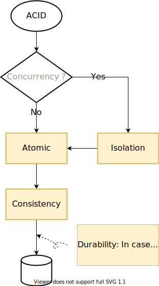

# Database::MySQL

## MySQL vs. MongoDB

### MySQL 应用场景

1. 固定的数据结构
2. ACID（NoSQL也支持事务，但是不满足ACID）
3. 数据量相对较小
4. 索引优化

### MongoDB 应用场景

1. 写频繁
2. 无固定数据结构
3. 大数据

## 秒杀怎么防止超卖？

### Redis 方案

<ins>利用 Redis 执行命令时的单线程操作。</ins>

将库存放入 Redis。每次用户抢购都执行 `decr` 命令, `decr` 将返回减少后的值，当返回值小于等于 0 时，认为库存为空。

### SQL 方案

<ins>利用 SQL 的更新条件。</ins>

建立秒杀库存表，每次抢购时，先进行

```sql
UPDATE sec_kill_goods SET stock = stock - 1
    WHERE goods_id = ?
    AND stock > 0
```

数据库对以上语句进行加锁操作，同时只有一个线程能进行更新操作，当库存为 0 时，返回影响条数为 0，从而判断更新失败，即为卖光。

## MySQL 使用 HASH 算法吗？

MyISAM 和 InnoDB 的索引都不支持 Hash 算法，可以通过 DDL 添加一个 Hash 索引，但是实际上用的还是 BTree。InnoDB 内部会用 Hash 实现 *自适应 Hash 索引*。

> InnoDB utilizes hash indexes internally for its Adaptive Hash Index feature

- [MySQL :: MySQL 8.0 Reference Manual :: 13.1.15 CREATE INDEX Statement](https://dev.mysql.com/doc/refman/8.0/en/create-index.html)
- [MySQL :: MySQL 8.0 Reference Manual :: 24.6 Restrictions and Limitations on Partitioning](https://dev.mysql.com/doc/refman/8.0/en/partitioning-limitations.html)
- [警惕 InnoDB 和 MyISAM 创建 Hash 索引陷阱](https://blog.csdn.net/defonds/article/details/46787105)

## MySQL 如何修改密码

```bash
mysqladmin -u root password <your pass>
```

mysqladmin 的语法为

```bash
mysqladmin [options] command
```

而 `password` 为修改密码的命令

## MySQL 查看数据库位置

```mysql
show variables like "datadir"
```

## MySQL 文件 frm, MYD, MYI, ibd 分别存放了什么？

- frm 文件：存表结构
- MYD 文件：MyISAM，存数据文件，data
- MYI 文件：MyISAM，存放索引，index
- ibd 文件：InnoDB 存放索引+数据

## 并发事务的问题

1. 脏读：读未提交
2. 丢失修改
3. 不可重复读：修改
4. 幻读：增删

## 事务的隔离级别

| 隔离级别         | 脏读 | 不可重复读 | 幻读 |
| ---------------- | ---- | ---------- | ---- |
| READ UNCOMMITTED | Y    | Y          | Y    |
| READ COMMITTED   | N    | Y          | Y    |
| REPEATABLE READ  | N    | N          | Y    |
| SERIALIZABLE     | N    | N          | N    |

> READ COMMITTED 不能保证可重复度，短事务修改数据导致长事务两次修改结果不一致。

MySQL 默认使用 REPEATABLE READ 隔离级别。

## MVCC

多版本并发控制，Multi-Version Concurrency Control。利用版本号进行快照，每次开启事务都版本号自增。没有统一的标准，每个数据库引擎实现不一样，对于 InnoDB：

每行记录增加两个隐藏列：创建时间（版本号）、过期时间（删除时间，版本号）。大部分情况下可以不使用锁。

修改一行记录时，插入一条新纪录，同时标记原始记录的删除时间（当前版本号）。

MVCC 只在 REPEATABLE READ 和 READ COMMITTED 隔离级别起作用

## ACID

ACID 是指事务的特性。

### 1. Atomic，原子性

一个事务被当做不可分割的单元。要么全部成功，要么全部失败。

> redo log 提交事务、undo log 回滚事务。

### 2. Consistency， 一致性

数据库总是从一个一致的状态转换到另一个一致的状态。

### 3. Isolation，隔离性

一个事务所做的修改在最终提交之前，对其他事务是不可见的。

### 4. Durability 持久性

一旦事务提交，则所做的修改会提交并永久保存在数据库中，即使系统崩溃，仍然可以恢复。

> 可以使用 redo log 进行恢复

---

<ins>原子性</ins> 与 <ins>隔离性</ins> 共同保证了 <ins>一致性</ins>。



## 怎么设置事务的隔离级别

```mysql
SET [SESSION] TRANSACTION ISOLATION LEVEL READ COMMITTED
```

## MySQL 中，同一个事务能不能使用多个存储引擎？

不能。

MySQL 的事务由下层的存储引擎实现，所以跨存储引擎的事务是不可靠的。

## MySQL 的逻辑架构



第一层： 链接处理、授权认证、安全等

第二层：服务器层。分析、优化、函数、存储过程、触发器、视图等

第三层：存储引擎

> 事务是由存储引擎实现。

## SQL

### SHOW TABLE STATUS

查看表信息，这些信息也在 `information_schema` 表中。

```sql
SHOW TABLE STATUS LIKE 'user';
```

### SHOW PROCESSLIST

查看正在执行的 SQL 语句。

## 选择数据库引擎的指标

1. 事务支持：InnoDB 支持事务
2. 数据备份：InnoDB 支持热备份
3. 崩溃恢复：InnoDB 支持崩溃恢复，MyISAM 丢失（依赖 OS sync 操作）
4. 特有的特性

**场景：**

- 日志型应用：MyISAM，Archive（`zlib` 压缩，压缩率更高）
- 订单型：InnoDB
- 大数据量：InnoDB（MyISAM 崩溃噩梦）
- CD-ROM：MyISAM（压缩表）

> MyISAM 崩溃噩梦：系统崩溃后可能丢失、破坏数据，数据无法恢复。

## MyISAM 与 InnoDB 的区别

1. 压缩表：MyISAM 支持压缩表，节省表空间
2. InnoDB 支持事务、奔溃恢复、热备份、外键
3. 锁粒度：MyISAM 只支持表锁

## 隐式锁与显式锁

MySQL 在查询的时候会自动加锁（e.g. 行锁、表锁），称隐式锁。显式加锁是在 SQL 语句上明确表示用锁。如

```sql
SELECT ... LOCK IN SHARE MODE
SELECT ... FOR UPDATE
```

## 转换表的存储引擎

### 1. ALTER

```sql
ALTER TABLE mytable ENGINE = InnoDB;
```

### 2. 导入导出

利用 `mysqldump` 将数据导出再修改导出 sql，然后导入。

> 1. 这种方法将数据进行了备份，比方法 1 略微安全。
> 2. `mysqldump` 导出数据自动添加了 `DROP TABLE` 语句，需要特别注意

### 3. 创建并插入

综合方法 1、2。

```sql
CREATE TABLE innodb_table LIKE myisam_table;
ALTER TABLE innodb_table ENGINE = InnoDB;
INSERT INTO innodb_table SELECT * FROM myisam_table;
```

当数据量大时，可以给 `SELECT` 增加条件，分批插入，插入时给每批数据加上事务，避免大事务回滚。

### 4. 利用三方工具

如 `pt-online-schema-change` 工具可以自动转换。

## MySQL 中事务怎么开启？

MySQL 中事务总是开启的，而默认情况下是开启了事务的 *自动提交*， 每执行一个 SQL 都在一个新的事务中完成并自动提交。此外某些如 DDL 语句会强制 COMMIT 事务。

通过以下命令可以查看自动提交开启状态（`1` or `ON` 表示开启）。

```sql
SHOW VARIABLES LIKE 'AUTOCOMMIT'
```

通过以下语句可以设置关闭自动提交

```sql
SET AUTOCOMMIT = 0
```

## DDL, DML, DQL, DCL, TCL 分别指什么

- DDL, Data Definition Language:  CREATE e.t.c.
- DML, Data Manipulation Language: UPDATE, CALL etc.
- DQL: Data Query Language: SELECT
- DCL, Data Control Language: GRANT, REVOKE
- TCL, Transaction Control Language: 

## Profiling

MySQL 5.1 开始增加了对 *性能剖析（profiling）* 的支持。

#### 开启

```sql
SET profiling = 1;
```

#### 查看

```sql
SHOW PROFILES;
```

实际上是查询 `INFORMATION_SCHEMA.PROFILING` 表。

会得到执行的统计信息

```
+---------+----------+-------+
|Query_ID | Duration | Query |
+---------+----------+-------+
```

其中 Query_ID 为从 1 开始的整数标识。可以使用来查看某条语句的详细统计信息。

#### 查看详情

```sql
SHOW PROFILE FOR QUERY 1
```

