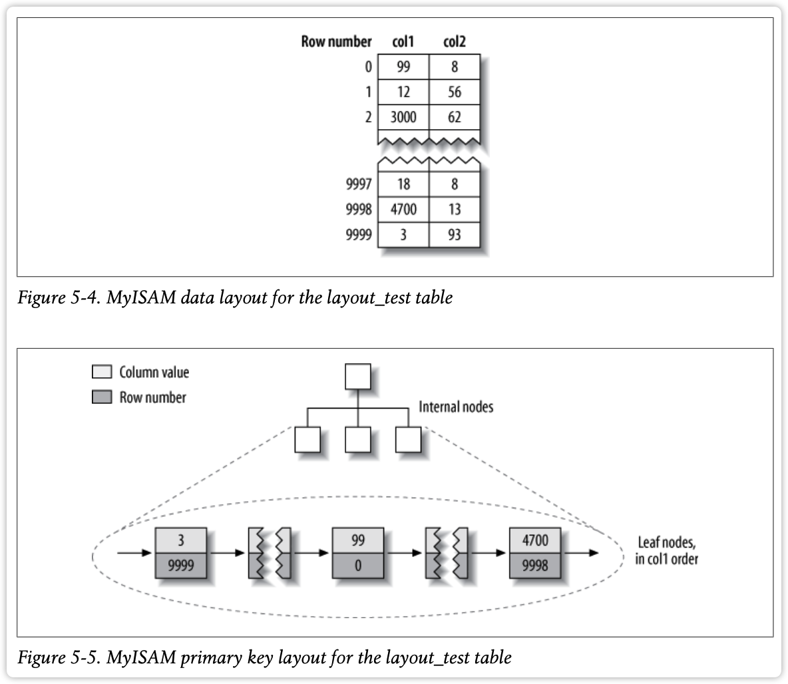
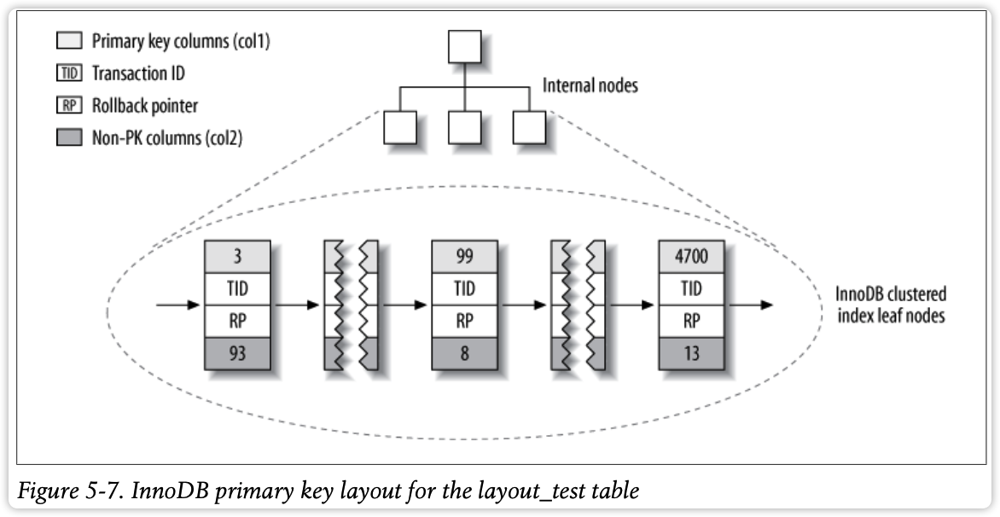
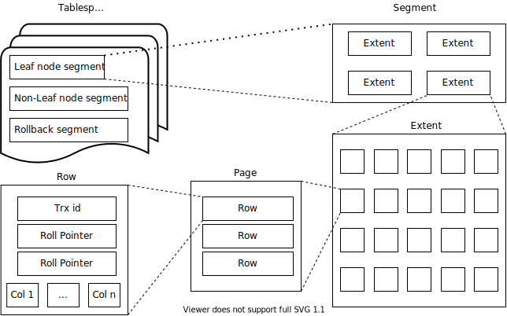
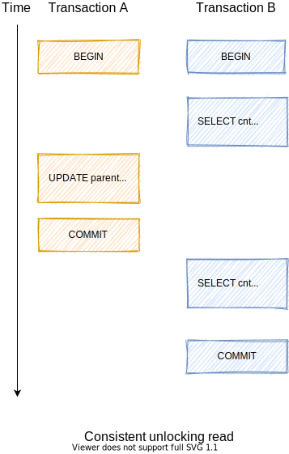
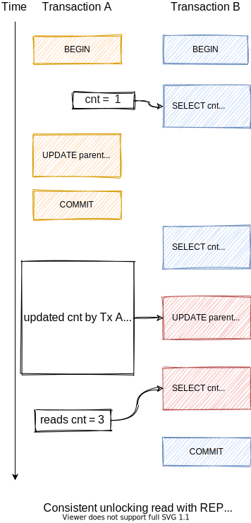

# Database

## MySQL vs. MongoDB

### MySQL 应用场景

1. 固定的数据结构
2. ACID（NoSQL也支持事务，但是不满足ACID）
3. 数据量相对较小
4. 索引优化

### MongoDB 应用场景

1. 写频繁
2. 无固定数据结构
3. 大数据

## 秒杀怎么防止超卖？

### Redis 方案

<ins>利用 Redis 执行命令时的单线程操作</ins>。

将库存放入 Redis。每次用户抢购都执行 `decr` 命令, `decr` 将返回减少后的值，当返回值小于等于 0 时，认为库存为空。

### SQL 方案

<ins>利用 SQL 的更新条件。</ins>

建立秒杀库存表，每次抢购时，先进行

```sql
UPDATE sec_kill_goods SET stock = stock - 1
    WHERE goods_id = ?
    AND stock > 0
```

数据库对以上语句进行加锁操作，同时只有一个线程能进行更新操作，当库存为 0 时，返回影响条数为 0，从而判断更新失败，即为卖光。

## MySQL 使用 HASH 算法吗？

MyISAM 和 InnoDB 的索引都不支持 Hash 算法，可以通过 DDL 添加一个 Hash 索引，但是实际上用的还是 BTree。InnoDB 内部会用 Hash 实现 *自适应 Hash 索引*。

> InnoDB utilizes hash indexes internally for its Adaptive Hash Index feature

- [MySQL :: MySQL 8.0 Reference Manual :: 13.1.15 CREATE INDEX Statement](https://dev.mysql.com/doc/refman/8.0/en/create-index.html)
- [MySQL :: MySQL 8.0 Reference Manual :: 24.6 Restrictions and Limitations on Partitioning](https://dev.mysql.com/doc/refman/8.0/en/partitioning-limitations.html)
- [警惕 InnoDB 和 MyISAM 创建 Hash 索引陷阱](https://blog.csdn.net/defonds/article/details/46787105)

## MySQL 如何修改密码

```bash
mysqladmin -u root password <your pass>
```

mysqladmin 的语法为

```bash
mysqladmin [options] command
```

而 `password` 为修改密码的命令

## MySQL 查看数据库位置

```mysql
show variables like "datadir"
```

## MySQL 文件 frm, MYD, MYI, ibd 分别存放了什么？

- frm 文件：存表结构
- MYD 文件：MyISAM，存数据文件，data
- MYI 文件：MyISAM，存放索引，index
- ibd 文件：InnoDB 存放索引+数据

## 并发事务的问题

1. 脏读：读未提交
2. 丢失修改
3. 不可重复读：修改
4. 幻读：增删

## 事务的隔离级别

| 隔离级别         | 脏读 | 不可重复读 | 幻读 |
| ---------------- | ---- | ---------- | ---- |
| READ UNCOMMITTED | Y    | Y          | Y    |
| READ COMMITTED   | N    | Y          | Y    |
| REPEATABLE READ  | N    | N          | Y    |
| SERIALIZABLE     | N    | N          | N    |

> READ COMMITTED 不能保证可重复读，短事务修改数据导致长事务两次修改结果不一致。

MySQL 默认使用 REPEATABLE READ 隔离级别。

## MVCC

多版本并发控制，Multi-Version Concurrency Control。利用版本号进行快照，每次开启事务都版本号自增。没有统一的标准，每个数据库引擎实现不一样，对于 InnoDB：

每行记录增加两个隐藏列：创建时间（版本号）、过期时间（删除时间，版本号）。大部分情况下可以不使用锁。

修改一行记录时，插入一条新纪录，同时标记原始记录的删除时间（当前版本号）。

MVCC 只在 REPEATABLE READ 和 READ COMMITTED 隔离级别起作用

## ACID

ACID 是指事务的特性。

### 1. Atomic，原子性

一个事务被当做不可分割的单元。要么全部成功，要么全部失败。

> redo log 提交事务、undo log 回滚事务。

### 2. Consistency， 一致性

数据库总是从一个一致的状态转换到另一个一致的状态。

### 3. Isolation，隔离性

一个事务所做的修改在最终提交之前，对其他事务是不可见的。

### 4. Durability 持久性

一旦事务提交，则所做的修改会提交并永久保存在数据库中，即使系统崩溃，仍然可以恢复。

> 可以使用 redo log 进行恢复

---

<ins>原子性</ins> 与 <ins>隔离性</ins> 共同保证了 <ins>一致性</ins>。


## 怎么设置事务的隔离级别

```mysql
SET [SESSION] TRANSACTION ISOLATION LEVEL READ COMMITTED;
```

## 怎么查看事务的隔离级别

```sql
SELECT @@tx_isolation;
```

结果

```html
+-----------------+
| @@tx_isolation  |
+-----------------+
| REPEATABLE-READ |
+-----------------+
1 row in set (0.000 sec)
```


## MySQL 中，同一个事务能不能使用多个存储引擎？

不能。

MySQL 的事务由下层的存储引擎实现，所以跨存储引擎的事务是不可靠的。

## MySQL 的逻辑架构


第一层： 链接处理、授权认证、安全等

第二层：服务器层。分析、优化、函数、存储过程、触发器、视图等

第三层：存储引擎

> 事务是由存储引擎实现。

## SQL

### SHOW TABLE STATUS

查看表信息，这些信息也在 `information_schema` 表中。

```sql
SHOW TABLE STATUS LIKE 'user';
```

### SHOW PROCESSLIST

查看正在执行的 SQL 语句。

## 选择数据库引擎的指标

1. 事务支持：InnoDB 支持事务
2. 数据备份：InnoDB 支持热备份
3. 崩溃恢复：InnoDB 支持崩溃恢复，MyISAM 丢失（依赖 OS sync 操作）
4. 特有的特性

**场景：**

- 日志型应用：MyISAM，Archive（`zlib` 压缩，压缩率更高）
- 订单型：InnoDB
- 大数据量：InnoDB（MyISAM 崩溃噩梦）
- CD-ROM：MyISAM（压缩表）

> MyISAM 崩溃噩梦：系统崩溃后可能丢失、破坏数据，数据无法恢复。

## MyISAM 与 InnoDB 的区别

1. 压缩表：MyISAM 支持压缩表，节省表空间
2. InnoDB 支持事务、崩溃恢复、热备份、外键
3. 锁粒度：MyISAM 只支持表锁

## 隐式锁与显式锁

MySQL 在查询的时候会自动加锁（e.g. 行锁、表锁），称隐式锁。显式加锁是在 SQL 语句上明确表示用锁。如

```sql
SELECT ... LOCK IN SHARE MODE
SELECT ... FOR UPDATE
```

## 转换表的存储引擎

### 1. ALTER

```sql
ALTER TABLE mytable ENGINE = InnoDB;
```

### 2. 导入导出

利用 `mysqldump` 将数据导出再修改导出 sql，然后导入。

> 1. 这种方法将数据进行了备份，比方法 1 略微安全。
> 2. `mysqldump` 导出数据自动添加了 `DROP TABLE` 语句，需要特别注意

### 3. 创建并插入

综合方法 1、2。

```sql
CREATE TABLE innodb_table LIKE myisam_table;
ALTER TABLE innodb_table ENGINE = InnoDB;
INSERT INTO innodb_table SELECT * FROM myisam_table;
```

当数据量大时，可以给 `SELECT` 增加条件，分批插入，插入时给每批数据加上事务，避免大事务回滚。

### 4. 利用三方工具

如 `pt-online-schema-change` 工具可以自动转换。

## MySQL 中事务怎么开启？

MySQL 中事务总是开启的，而默认情况下是开启了事务的 *自动提交*， 每执行一个 SQL 都在一个新的事务中完成并自动提交。此外某些语句（如 DDL）会强制 `COMMIT` 事务。

通过以下命令可以查看自动提交开启状态（`1` or `ON` 表示开启）。

```sql
SHOW VARIABLES LIKE 'AUTOCOMMIT'
```

通过以下语句可以设置关闭自动提交

```sql
SET AUTOCOMMIT = 0
```

## DDL, DML, DQL, DCL, TCL 分别指什么

- DDL, Data Definition Language:  CREATE e.t.c.
- DML, Data Manipulation Language: UPDATE, CALL etc.
- DQL: Data Query Language: SELECT
- DCL, Data Control Language: GRANT, REVOKE
- TCL, Transaction Control Language: 

## Profiling

MySQL 5.1 开始增加了对 *性能剖析（profiling）* 的支持。

#### 开启

```sql
SET profiling = 1;
```

#### 查看

```sql
SHOW PROFILES;
```

实际上是查询 `INFORMATION_SCHEMA.PROFILING` 表。

会得到执行的统计信息

```
+---------+----------+-------+
|Query_ID | Duration | Query |
+---------+----------+-------+
```

其中 Query_ID 为从 1 开始的整数标识。可以使用来查看某条语句的详细统计信息。

#### 查看详情

```sql
SHOW PROFILE FOR QUERY 1
```

## CSV 存储引擎是什么

直接使用 CSV 文件存取记录，不支持索引，可以直接将文件进行拷贝以导入导出。

## NDB 是什么

2003 年 MySQL AB 公司 收购了索尼爱立信的 NDB 数据库后来开发了 NDB 集群，现在被称为 MySQL 集群（Cluster）。

## 什么是 Hash 索引

使用 Hash 函数建立字段值到记录的映射。Memory 存储引擎便使用了这种索引。实际上， Memory 使用了拉链法来存储索引，即相同 Hash 值的不同索引存放在链表中。所以如果 Hash 碰撞严重时，Memory 存储引擎效率并不高。

InnoDB 也支持自适应 Hash 索引。

## Hash 索引的优缺点？

**优点**

1. 存储字段的 Hash 值，数据对其，查询快

**缺点**

1. 不能做范围查询
2. 不能用于排序
3. 必须全部存入内存

## Memory 引擎使用了什么索引，不适合什么场合？

Memory 存储引擎便使用了 Hash 索引。实际上， Memory 使用了拉链法来存储索引，即相同 Hash 值的不同索引存放在链表中。所以如果 Hash 碰撞严重时，Memory 存储引擎效率并不高。

## 空间数据索引：R-Tree

MyISAM 支持的一种索引，作地理位置的存储。MySQL 对 *GIS (Geographic Information System)* 的支持不完善，很少有人会用。支持较好的是 PostgreSQL, PostGIS。

## 操作符

- `<>`：`!=`
- `<=>`: `NULL` safe equals，可以与 NULL 进行相等比较（区别于 `=`）

## 什么是自适应哈希索引

InnoDB 支持 *自适应哈希索引（Adaptive Hash Index）*。当 InnoDB 发现某些索引值被使用得非常频繁时，便会在 B+Tree 基础上增加 Hash 索引，便可以快速通过 Hash 值查找。

> 自适应 Hash 索引是自治的，用户无法控制，但是可以关闭。

## 索引优化的方法

### 1. 自定义 Hash

```sql
SELECT id FROM urls WHERE url = 'http://example.com' AND url_crc=CRC32('http://example.com');
```

由于 `url` 可能会很长，如果建一个 B+Tree，将会非常大，可以使用一个 Hash 算法，将长的 `url` Hash 以变短，然后再建立索引，此时 InnoDB 便可以使用这个 Hash 去建 B+Tree。

记录中 Hash 值的维护，可以使用 *触发器* 来实现。

> 不要使用 `SHA1()` 或 `MD5()` 来作为 Hash 函数，因为他们的结果非常长的字符串，会浪费空间且查询效率不高。如果冲突较多，可以自定义一个返回 **64 bit 整数** 的 Hash 函数。

### 2. 前缀索引

如果以一个列的前 n 个字符为前缀的选择性和 **分布** 已经接近索引整个列，则使用固定长度的前缀进行索引。

```sql
-- 取 name 的前 10 个字符作为索引
ALTER TABLE user ADD KEY(name(10));
```

> 索引的选择性：不重复的索引值（也称为基数, cardinality）与总数据的占比。

### 3. 多列索引

当查询使用了多列时，可以为查询设置多列索引（联合索引），而不是为每一列创建一个索引。

经验法则：最有 *选择性（selectivity）* 的列排在最前面。

#### 整体

利用选择性

```sql
SELECT
  COUNT(DISTINCT staff_id) / COUNT(*) AS staff_id_selectivity,
  COUNT(DISTINCT custom_id) / COUNT(*) AS custom_id_selectivity,
  COUNT(*)
FROM payment\G
```

#### 局部

查看对应数据条数，条数越少，说明对该字段值而言，选择性越高。

```sql
SELECT
  COUNT(*),
  SUM(groupId = 10137),
  SUM(userId = 1288826),
  SUM(anonymos = 0)
FROM message\G
```

> 通常情况下，由于不知道数据分步，我们只考虑整体情况，当出现局部记录性能问题时，再局部调优。

### 其他

4. 聚簇索引
5. 覆盖索引
6. 使用 *索引扫描（index scans）* 来做排序
7. 索引前缀压缩（MyISAM）
8. 排查冗余和重复索引
9. 排查未使用的索引

## 什么是一级索引

根据索引与数据行存储在一起，找到索引就找到了数据行。B+Tree 则是将数据行存储在叶子节点。

## 什么是二级索引

根据索引只能找到指向数据行的指针，需要通过指针再次检索才能找到数据行。InnoDB 中 B+Tree 的非聚簇索引都是二级索引，指向数据行的指针是主键。MyISAM 指向数据行的指针为偏移量（行号）。

## 聚簇索引

Clustered index，是一种数据存储方式。

**聚簇**：是指拥有相邻键值的数据行紧凑地存储在一起。

当表有聚簇索引时，数据行实际存储在索引的 *叶子页（leaf page）*。

MyISAM 与 InnoDB 组织方式不同，MyISAM 没有使用聚簇索引。

InnoDB 使用自适应 Hash 算法，可以降低二级索引带来的查询消耗。

## 聚簇索引的优点

1. 可以把相关数据保存在一起，减少 I/O。如某 uid 的邮件，聚集在一起，提前读，不用频繁移动磁盘探头，不用每封邮件都去做一次 I/O。
2. 数据访问更快，数据与索引保存在一起，从聚簇索引中取数据更快。
3. 对于 InnoDB，利于 **覆盖索引** 优化，二级索引总是包含主键。

## 聚簇索引的缺点

1. 显著地对磁盘 I/O 性能优化，如果是内存型，这种优化就没有必要了。
2. 插入速度严重依赖于插入顺序，按照主键递增的顺序插入时最快的。否则需要 `OPTIMIZE TABLE` 命令重新组织表。
3. 更新聚簇索引列的代价很高，会强制被更新的数据行移动到新的位置。
4. 当主键更新或有新的插入导致时，会产生数据移动，面临 *页分裂 page split*，会产生碎片，占用更多的磁盘空间。
5. 二级索引存储主键值而非指针，可能使其变得更大（主键可能很长，e.g. 64 bits）。

## 聚簇索引：MyISAM

**MyISAM 并没有使用聚簇索引**，MyISAM 的主键索引与普通索引没有任何区别。插入的数据时顺序存储的，而索引列使用 BTree 组织，叶子节点储存了数据行的偏移量（如行号），然后再根据偏移量去取数据。MyISAM 的索引文件(.MYI)与数据文件(.MYD)是分开存放的。



## 聚簇索引：InnoDB

InnoDB 通过主键聚集数据，即被索引的列为 “主键” 列。如果没有定义主键，InnoDB 会选择一个唯一的非空索引代替。如果没有这样的索引，InnoDB 会隐式地定义一个主键来作为聚簇索引。InnoDB 值聚集在同一个页面中的记录，包含相邻键值的页面可能会相距甚远。

InnoDB 的二级索引为非主键索引，其叶子节点存储的指针为 “主键值”。这样做的好处是可以减少当出现行移动或者数据分裂时产生的二级索引的维护工作（不用修改指针，只需要修改聚簇索引）。



## 覆盖索引

如果一个索引包含了所有需要查询的字段，则称为 *覆盖索引（covering index）*。

### 特点

1. 根据索引查找到叶子节点时，叶子节点上的索引包含了需要查找的字段，就没有必要去查数据行，少一次查询。
2. 索引 *条目（entries）*的大小通常远小于数据 *行（row）*，I/O 耗时减少。
3. 索引是按照列值顺序存储的（单页内），I/O 效率会更高（提前读，减少磁头探针移动、只需少量的磁盘旋转）
4. InnoDB 中二级索引包含了 **主键** 值，所以即使查询索引中没有主键，主键也可以作为查询索引一部分。
5. 只有存有列值的索引才能做覆盖索引优化，所以 MySQL 中，只有 B-Tree/B+Tree 可以做覆盖索引。

### EXPLAIN

```sql
EXPLAIN SELECT actor_id, last_name
  FROM actor WHERE last_name = 'HOPPER'\G
```

结果

```
************************** 1. row ***************************
            id: 1
   select_type: SIMPLE
         table: actor
          type: ref
 possible_keys: idx_actor_last_name
           key: idx_actor_last_name
       key_len: 52
           ref: const
          rows: 10
         Extra: Using where; Using index
```

> `Extra` 字段中的 `Using index` 表明使用了覆盖索引。

可以覆盖索引的情况：

- 当 `(last_name, actor_id)` 为多列索引时
- 当 `last_name` 是索引， `actor_id` 是主键时

## 使用索引扫描来做排序

`EXPLAIN` 时，返回 `type` 为 `index` 则表明排序使用了索引扫描。

MySQL 排序有两种方式：

1. 通过排序操作：将数据返回，由服务器进行排序（filesort）
2. 通过索引扫描：排序时只通过索引列，不用去查询数据行

> 索引扫描是指遍历索引，这个操作不涉及数据行的寻址。

只有当索引的顺序和 `ORDER BY` *子句（clause）*的顺序完全一致，并且所有列的排序方向（ASC or DESC）都一样时，MySQL 才能够使用索引来对结果做排序。除非 *前导列（leading columns）* 为常量时，例如：

对于索引

```sql
KEY idx_rental_date(rendal_date, inventory_id, custom_id);
```

下列查询符合索引扫描

```sql
SELECT
  rental_id, staff_id FROM sakila.rental
WHERE rental_date = '2005-05-25'
ORDER BY inventory_id, custom_id;
```

其中 `rental_date` 固定为 `2005-05-25`。

## 前缀压缩索引

这是 MyISAM 的优化方案，针对 I/O 密集型，会有很大的性能提升。

MyISAM 使用前缀压缩来减少索引的大小，从而让更多的索引可以放入内存中，这在某些情况下能极大地提高性能。默认只能压缩字符串，可以通过参数修改。

压缩方法：先完全保存索引块中的第一个索引值，然后将其他的值和第一个值进行比较，得到相同前缀的 **字节数** 和 **剩余的字符串**，把这两个部分存起来，便得到其余的索引。e.g. perform，performance，第二个索引值可以被保存为 `7ance`。

对于 *CPU 密集型（CPU-bound）*，这个特性会降低查找效率，必须查询第一个索引，才能知道后续索引。对于 *I/O 密集型（I/O-bound）*，压缩可以使所占空间大量减少，如只需要十分之一的空间，使得 I/O 的成本远小于解压成本。

## 冗余和重复索引

### 重复索引

相同列上的相同类型索引，这类索引应当避免。

```sql
CREATE TABLE test (
  ID INT NOT NULL PRIMARY KEY, A INT NOT NULL,
  B INT NOT NULL,
  UNIQUE(ID),
  INDEX(ID)
) ENGINE=InnoDB;
```

### 冗余索引

已有 `(A, B)`再创建 `(A)`，因为 `(A, B)` 已经包含了 `(A)`（以最左前缀的形式）。

大多数时候都不需要冗余索引，应尽量扩展已有索引，而不是创建新的索引。但也有时候处于性能考虑，也会创建冗余索引。因为扩展已有索引会导致其变得太大，从而影响其他使用该索引的查询性能。

> 特别地，对于 InnoDB，将 `(A)` 扩展为 `(A, ID)` 也为冗余，前者已经包含后者。而扩展成 `(A, B)` 则相当于 `(A, B, ID)` 会使得原来基于 `(A, ID)` 覆盖索引的查询失去覆盖索引。

#### 扩展索引

对于查询

```sql
SELECT state_id, address
FROM userinfo
WHERE state_id=5;
```

目前只有索引 `KEY(state_id)`，可以扩展为覆盖索引 `KEY(state_id, address)`。

通过 `DROP KEY` 和 `ADD KEY` 操作组合。

```sql
ALTER TABLE userinfo
  DROP KEY state_id,
  ADD KEY state_id_2(state_id, address);
```

> 词例中，如果初始索引不止 `state_id` 一个列，而是很多列组成，这时如果再扩展一个 `address` 列，可能导致索引过大，此时可以考虑单独建立一个索引。

## 排查未使用的索引

1. 打开服务器变量 `userstates` 可以记录索引使用情况，通过查询 INFORMATION_SCHEMA.INDEX_STATISTICS 可以得到每个索引的使用频率。
2. 使用三方工具。

## InnoDB 索引和锁

InnoDB 在查询时，可以使用索引过滤不需要的行。当无法过滤时，会返回数据给 MySQL 服务器层进行 `WHERE` 过滤，而返回的所有数据行，都需要加锁。索引能减少 InnoDB 访问的行数，从而减少锁竞争。

在 `EXPLAIN` 时，得到 `Extra` 包含 `Using where`，则表示存储引擎将数据返回后，再应用 `WHERE` 条件过滤。

## EXPLAIN Extra Using where 代表什么？

表示存储引擎将数据返回 MySQL 服务器后，再应用 `WHERE` 条件过滤。

## EXPLAIN Extra Using index 代表什么？

表示使用了覆盖索引。

## EXPLAIN type index 代表什么？

查询中使用了索引扫描排序。

## InnoDB 为什么不能用 UUID 作为主键？

*UUID (Universally Unique Identifier)* 会使聚簇索引的插入完全随机，使得数据没有任何聚集特性。

- **增加随机 I/O**：写入的目标也可能已经不在内存中，已经刷新到磁盘，需要先将页读出到内存。
- **页分裂（page split）**：因为是随机插入，InnoDB 不得不频繁的页分裂，以便为新行分配空间。页分裂会导致大量的数据移动。
- **数据碎片**：频繁的页分裂会使页变得稀疏，最终出现许多碎片。

> InnoDB 数据插入时，主键应该尽量按顺序插入，这样记录行的插入也是按顺序插入，不会有数据的移动，页分裂的出现。

## InnoDB 逻辑存储结构



- Tablespace: 表空间
- Segment: 段
- Extent: 区
- Page: 页
- Row: 数据行

## 分区表

类似分表，可以把大的表分为许多部分，称为分区。每一分区有各自的完全相同的索引，执行查询时，可以过滤掉不必要的分区，从而提高索引查询的速度，减少随机磁盘 I/O。

### 创建

```sql
CREATE TABLE sales (
    order_date DATETIME NOT NULL,
) ENGINE=InnoDB PARTITION BY RANGE(YEAR(order_date)) (
    PARTITION p_2010 VALUES LESS THAN (2010),
    PARTITION p_2020 VALUES LESS THAN (2020),
    PARTITION p_rest VALUES LESS THAN MAXVALUE,
  )
```

创建分区表后会在文件系统中生成使用 `#` 分隔的表文件。

>  分区有相同的存储引擎、索引。

### 查询

```sql
PARTITIONS SELECT * FROM sales;
```

### CRUD

在 CRUD 时，分区层会先打开并锁住所有底层表，优化器过滤确定哪个分区，再释放掉其他分区锁，对目标分区执行 CRUD。

## 什么是合并表

*合并表* 是早期的分区实现，之后会被 *分区表* 淘汰。

## MySQL 中的视图

视图是一个虚拟表，不存放任何数据。

视图的优点：

1. 屏蔽表的细节
2. 做字段权限控制

两种查询算法：

1. **合并算法**：将视图与查询 SQL 合并，再发送给存储引擎。
2. **临时表算法**：执行视图，将结果储存在临时表，再执行查询。

其他特点：

1. 可以通过视图修改简单视图对应的数据。

---

定义

```sql
CREATE VIEW <name> AS
  SELECT * FROM <table>
WITH CHECK OPTION
```

删除

```sql
DROP VIEW <view>
```

使用

```sql
SELECT * FROM <view>
```

查看

```sql
SHOW CREATE VIEW <name>
```

> MySQL 中的视图并不成熟。

## InnoDB 为什么使用 B+ 而不是 B- 建立索引？

1. B+ 树内结点较小，一次可以更多的读入内存，减少磁盘 I/O 次数。相对而言 B- 保存了数据或指向记录的指针。
2. 叶子节点存储了指向下一个叶子节点的指针，方便索引遍历。

## MongoDB 为什么使用 B+Tree 而不是 B-

MongoDB 是内存型数据库，B+ 的优点在于减少 I/O 次数，这点在于 MongoDB 这种情况下优势变得不那么明显了

## 为什么关系型数据库不使用红黑树作索引？

红黑树是二叉树，而 B 树每一个结点有 `[n/2, n]` 子结点，大大减少了树的深度。在磁盘上存取的 I/O 次数通常是由树的深度决定（如每层的结点可以顺序存放），而 I/O 的次数影响 I/O 效率。

深度太大，结点存储相对分散，此时需要频繁的移动 “动臂” 进行定位。

## B+Tree 与 聚簇索引什么关系？

B+Tree 每个内结点存储了键的最大值序列，叶子节点存储了键及对应的数据，该数据可以是数据行或指向数据行的指针（主键）。而聚簇索引是在 B+Tree 基础上，在叶子节点存储了数据行，并且存储时，让相邻的主键对应的数据行紧凑地存储在一起。

## B+Tree 怎么存储字符串类型的字段？

只需要一个 `comparator()`，能够比较大小即可，最后在叶子节点存储字段的值以及指向数据行的主键值。

由于字符串的比较效率低于整数的比较，所以通常 `bigint` 的索引效率高于 `varchar`。

## 为什么不推荐使用 NULL？

`NULL` 在 MySQL 中代表 “未知”，而不是 “空”。

1. MySQL 对 `NULL` 有特殊处理，需要额外增加 1 bit 来标识数据行中，该字段是否为 `NULL`。
2. 大多数函数，在参数时 `NULL` 时将返回 `NULL`，如拼接字符串，这不是我们想要的。
3. 难以优化可 `NULL` 字段的查询，因为它会使索引、索引统计和值的比较更复杂。
4. 官方建议：尽量声明为 `NOT NULL`，如果非要用 `NULL`，也可以。

**See More:**

- [MySQL 8.0 Reference Manual: Optimizing Data Size](https://dev.mysql.com/doc/refman/8.0/en/data-size.html)
- [NULL Values - MariaDB Knowledge Base](https://mariadb.com/kb/en/null-values/)

## 什么是幂等、有哪些解决方案？

幂等是指多次操作的结果和一次结果相同。

幂等解决方案

1. 数据库唯一主键：插入、删除
2. 乐观锁：更新
3. 悲观锁：更新
4. 防重 Token 令牌：CUD
5. 下游传递唯一序列号如何实现幂等性：CUD
6. 使用分布式锁：Redis `SETNX` etc.

---

### 1. 数据库唯一主键

数据库唯一主键可以做 **插入、删除** 幂等，这个唯一主键不是数据库自增主键，而是分布式 ID，以保证分布式环境下全局唯一。

### 2. 乐观锁

实现 **更新操作** 幂等，如给表增加一个 version 字段，每次更新的时候，带上 version 版本。

```sql
UPDATE products SET price=1000 WHERE id = 1 AND version = 5;
```

### 3. 悲观锁

先 select 再 update

```sql
SELECT * FROM user WHERE id = 1 FOR UPDATE;
```

只有一个进程能获得该行锁，其余进程阻塞等待。

### 4. 防重 Token 令牌

服务器提供一个令牌接口，用于生成 token 并存入 Redis。适用于 **插入、更新、删除** 操作。

1. 客户端每次请求业务前，都请求令牌接口，获取一个 token。
2. 客户端携带 token 请求业务接口。
3. 服务器检查 Redis 中的 token。
4. 如果 token 存在，则删除并执行操作。
5. 如果 token 不存在，则返回错误（重复请求）。

### 5. 下游传递唯一序列号如何实现幂等性

下游传递唯一序列，如订单号、用户 ID，在 **插入、更新、删除** 时，检查 Redis 中该唯一序列组合是否存在

1. 如果存在，则已操作过，返回重复请求，
2. 如果不存在，则表示未执行过操作，可以正常执行，并将唯一序列号存入 Redis。

---

**参考**

- [一口气说出四种幂等性解决方案，面试官露出了姨母笑~](https://juejin.cn/post/6906290538761158670#heading-5)
- [分布式高并发系统如何保证对外接口的幂等性？ - 知乎](https://www.zhihu.com/question/27744795)

## OFFSET 实现原理及优化

假设有联合索引 `(a, b)` 对于 SQL

```sql
SELECT * FROM users WHERE a>1 AND b<10 LIMIT 10000, 10
```

执行逻辑是先从数据库读出 10000 行，并抛弃，取后面 10 行。所以优化的方法是如何跳过这 10000 数据的读取。

### 优化1

这种情况下可以利用索引覆盖扫描

```sql
SELECT * FROM users
	INNER JOIN (
    SELECT id FROM users
    WHERE a > 1 AND b < 10
    LIMIT 10000, 10
  ) AS tmp
  USING(id)
```

### 优化2

有“书签”字段可以记录访问的位置（设标签为 `id`）

```sql
SELECT * FROM users
  WHERE
    id > 10000
	  AND a > 1 AND b < 10
	LIMIT 10
```

> 添加了 `id > 10000` 条件后，将 `LIMIT` 的 `OFFSET` 去掉。

## 什么是 S、X 锁？

数据库中锁的类型分为

1. 互斥锁（Exclusive）：X 锁，写锁。
2. 共享锁（Shared）：S 锁，读锁。

两个规定

- 一个事务对数据对象 A 加了 X 锁，就可以对 A 进行读取和更新。加锁期间其它事务不能对 A 加任何锁。
- 一个事务对数据对象 A 加了 S 锁，可以对 A 进行读取操作，但是不 **能进行更新操作**。加锁期间其它事务能对 A 加 S 锁，但是不能加 X 锁。

---

**参考**

1. [数据库系统原理 | CS-Notes](http://www.cyc2018.xyz/%E6%95%B0%E6%8D%AE%E5%BA%93/%E6%95%B0%E6%8D%AE%E5%BA%93%E7%B3%BB%E7%BB%9F%E5%8E%9F%E7%90%86.html#%E5%B0%81%E9%94%81%E7%B1%BB%E5%9E%8B)

## MySQL delete 数据之后，为什么还占用磁盘

`DELETE` 是标记行已经删除（将记录的删除位置为 1），实际上并没有释放磁盘空间，这样做的目的是为了 MVCC。当一个 `DELETE` 事务完成时，其他事务可能已经读取并正在使用该行，如果直接释放空间则会破坏事务的一致性。除了 `DELETE` 语句，`UPDATE` 语句情况相同，因为 MVCC 要求更新操作是删除原来的行，插入新行来完成的。

此外，还可以复用此处的页，避免以后在这个位置插入数据而进行数据的移动。

如果需要释放磁盘，有两个操作可以做到，

1. `OPTIMIZE` 语句
2. `purge` 阶段

### 1. OPTIMIZE

```sql
OPTIMIZE TABLE my_table
```

该语句会整理碎片、清除标记删除的数据行。

### 2. purge

当所有事务都没有使用被删除的行时，则可以执行 `purge` 操作，该操作是 MySQL 自动完成的。

## 一致性非锁定读

> [Consistent unlocking read](https://dev.mysql.com/doc/refman/8.0/en/innodb-consistent-read.html)

利用 *多版本并发控制（Multiple Version Concurrency Control, MVCC）*，读数据时利用快照来使同一个事务中达到一致性读。

具体读的内容与事务的隔离级别有关。

### READ COMMITTED

该级别下，事务读到的数据总是最新的提交（`commit`）的快照。

举例说明



此时事务 B 两次读到的 `cnt` 不相同。

### REPEATABLE READ

读到的数据总是事务开始的快照。


事务 B 两次读到的 `cnt` 相同。

但 `REPEATABLE READ` 隔离级别下有一个特殊情况，



事务 A 修改了 `cnt` 并提交，此时事务 B 再次修改 `cnt`，则事务 A 的修改会对事务 B 立即可见。

## 一致性锁定读

> [Consistent locking read](https://dev.mysql.com/doc/refman/8.0/en/innodb-locking-reads.html)

读数据时，会锁住数据行，导致其他读或写阻塞。常用于树或图结构的数据，如 parent-children 结构。

触发一致性锁定读的操作有两个

1. SELECT ... FOR UPDATE
2. SELECT ... LOCK IN SHARE MODE

分别表示写、读锁。

> 在 MySQL 8.0，可以使用 <u>SELECT ... FOR SHARE</u>  来添加读锁，与 <u>LOCK IN SHARE MODE</u> 等价，但是 <u>FOR SHARE</u> 的功能更丰富。
>
> 以上两个语句只有在事务中才有意义，也就是必须加上 <u>BEGIN</u>, <u>START TRANSACTION</u>, <u>SET AUTOCOMMIT = 0</u> 其中一个。

一致性锁定之间的读，根据 `X`，`S` 锁的规则进行阻塞

**一致性锁定与一致性非锁定** 之间的读，非锁定的事务中按快照规则读，如下图。


事务 C 的 `SELECT` 使用了 nonlocking read，则不受事务 A 的影响；相反 B 使用的是 locking read，则收到事务 A 的影响。

## 自增长与锁

MySQL 中列的自增长是通过锁来实现的，MyISAM 通过表锁，InnoDB 通过互斥量。

### 原理

每一个有自增列（`AUTO_INCREMENT`）的表都在 **内存** 维护了一个计数器，每次插入新行时都会根据该计数器 +1 来设置新的值。获取新的自增值时，会根据情况，通过表级锁 AUTO-INC 或 *互斥量（mutex）* 来对计数器加锁。

### 计数器初始化

在 MySQL 5.7 及以前，计数器在第一次执行该表的插入操作时会进行初始化，InnoDB 会执行等价于下面的 SQL 语句来获得该值

```sql
SELECT MAX(ai_col) FROM table_name FOR UPDATE;
```

之后存储在内存当中进行维护。

MySQL 8.0 之后会将该值存储在 redo log 和 *数据字典（data dictionary）* 中，分两种情况加载到内存

1. 正常重启：读取数据字典的值
2. 崩溃重启：读取数据字典并扫描 redo log，取最大值。

在 MySQL 8.0 中，以下情况会执行上述 <u>等价 SQL 语句</u>

1. 导入表时，没有提供对应的 `.cfg` 文件。
2. 手动修改低于当前内存维护的计数器值：<u>ALTER TABLE ... AUTO_INCREMENT = N FOR UPDATE</u>。

> `.cfg` 文件是执行 <u>FLUSH TABLES ... FOR EXPORT</u> 语句生成，包含了用于验证 *数据库结构（schema）* 的元数据。See [MySQL manual](https://dev.mysql.com/doc/refman/5.7/en/innodb-table-import.html)。

**See Also:**

- [15.6.1.6 AUTO_INCREMENT Handling in InnoDB](https://dev.mysql.com/doc/refman/8.0/en/innodb-auto-increment-handling.html)

## 锁与外键

对于具有外键的表进行插入时，当对子表的插入，父表会添加 `S` 锁，等价于

```sql
SELECT * FROM PARENT WHERE id=pid LOCK IN SHARE MODE
```

否则父表记录删除，可能导致父表记录删除而子表添加数据成功，导致不一致的情况（此处外键就是为了保证一致性）。

## InnoDB 锁有哪些

> [MySQL :: MySQL 8.0 Reference Manual :: 15.7.1 InnoDB Locking](https://dev.mysql.com/doc/refman/8.0/en/innodb-locking.html#innodb-record-locks)

1. S/X 锁
2. 意向锁（Intention Lock）
3. 行锁（Record Lock）
4. 间隙锁（Gap Lock）
5. Next-Key Lock
6. 插入意向锁（Insert Intention Lock）
7. AUTO-INC Lock
8. 空间索引预测锁（Predicate Locks for Spatial Indexes）

## MySQL 锁粒度

1. 表级锁
2. 行级锁

### 1. 表级锁

有两类

1. 意向锁
2. 通过 <u>LOCK TABLES ...</u> 语句

```sql
LOCK TABLES a, b, c WRITE;
LOCK TABLES d, e, f READ;

-- Release table
UNLOCK TABLES;
```

### 2. 行级锁


## 意向锁

> Intention Lock

表示有获取锁的意向，当前正在获取或将要获取行锁。意向锁属于表级锁。只有获得了 `IS` 锁才能获得行的 `S` 锁，`IX` 与 `X` 锁也相同。

分类：

1. **IS**：Intention Share Lock
2. **IX**：Intention Exclusive Lock

只有当出现全表扫描时（e.g. <u>LOCK TABLES ... WRITE</u>），意向锁才会发生阻塞。

## 行级锁

> Record Lock.
>
> A record lock is a lock on an index record.

行级锁总是锁住索引，如果表没有索引，就锁住聚簇索引。

```sql
SELECT c1 FROM t WHERE c1 = 10 FOR UPDATE;
```

将锁住 `t.c1` 等于 `10` 的行。

## 间隙锁

> A gap lock is a lock on a gap between index records, or a lock on the gap before the first or after the last index record. 

根据数据库现有的数据，在索引值之间称为间隙。当锁定某一数据行 `R` 时，如果 `R` 索引列落在某个间隙中，则整个间隙将被锁定。间隙不包括查询的索引值本身。

举例说明：

设有索引值 `1, 3, 7, 15`，则间隙为

\\[
(-\\infty, 1)\\\\
(1,3)\\\\
(3,7)\\\\
(7,15)\\\\
(15,\ \infty)
\\]

当有查询 `R=5` 时，则 `(3, 7)` 的所有记录将被锁定，此时无法插入任何 `(3, 7)` 的值。以下两条语句都将阻塞。

```sql
INSERT INTO gap_test VALUES(4);

DELETE FROM gap_test WHERE id = 6;
```

**特别注意：除了当前的索引值，InnoDB 会为辅助索引的下一个索引值添加 gap lock。**

> InnoDB 同时使用了 *临键锁（Net-Key Locking）*，因此无法直接测试出间隙锁效果。


---

特别注意

当执行范围查询时，即使使用的是主键索引，锁定的间隙可能也超过实际应该锁定的范围。

```sql
CREATE TABLE `gap_test` (
  `id` int(11) NOT NULL AUTO_INCREMENT,
  PRIMARY KEY (`id`)
) COLLATE=utf8mb4_unicode_ci;

INSERT INTO gap_test VALUES (1), (3), (7), (15);

-- TX 1
BEGIN;
SELECT * FROM gap_test WHERE id BETWEEN 4 AND 6 FOR UPDATE;

-- TX 2
BEGIN;
-- Blocked
INSERT INTO gap_test SET id = 10000;
```

## 不同事务能否持有相同的间隙锁

**不同的事务可以获取相同的间隙锁**，且间 *隙读锁（gap S-lock）* 与 *间隙写锁（gap X-lock）* 没有任何区别。

这样做的原因是因为，如果两个事务持有相邻的两个间隙锁，当他们之间的索引值被删除，那这两个间隙锁就必须合并，最终仍然是同一个间隙锁。

## 什么样的查询不会用到间隙锁

对唯一索引的唯一行查询。

```sql
SELECT * FROM child WHERE id = 100;
```

## InnoDB 是怎么决定锁住哪些行的？

当使用行锁时，InnoDB 会给查询或扫描到的每一行都添加上 S 或 X 锁。

## 怎么关闭间隙锁

1. 使用 <u>READ COMMITTED</u> 隔离级别
2. 将 innodb_locks_unsafe_for_binlog 设置为 1

## 临键锁

> Next-Key Locking, 又称后码锁。
>
> A next-key lock is a combination of a record lock on the index record and a gap lock on the gap before the index record.

锁住查询的索引记录与其之前的间隙。包含查询的记录本身。

设有索引值 `1, 3, 7, 15`，则临键锁区间为

\\[
(-\\infty, 1]\\\\
(1,3]\\\\
(3,7]\\\\
(7,15]\\\\
(15,\ \infty)
\\]

---

与 Next-Key Lock 对应的是 Previous-key Lock，

设有索引值 `1, 3, 7, 15`，则 Previous-Key Lock 区间为

\\[
(-\\infty, 1)\\\\
[1,3)\\\\
[3,7)\\\\
[7,15)\\\\
[15,\ \infty)
\\]

## 查看 InnoDB 锁信息

```sql
SHOW ENGINE INNODB STATUS\G
```

## 插入意向锁

> Insert Intention Lock

表示有插入的意向，将要插入。实际上并不阻塞其他事务，只要插入的索引不冲突。

> An insert intention lock is a type of gap lock set by `INSERT` operations prior to row insertion. This lock signals the intent to insert in such a way that multiple transactions inserting into the same index gap need not wait for each other if they are not inserting at the same position within the gap. Suppose that there are index records with values of 4 and 7. Separate transactions that attempt to insert values of 5 and 6, respectively, each lock the gap between 4 and 7 with insert intention locks prior to obtaining the exclusive lock on the inserted row, but do not block each other because the rows are nonconflicting.

## AUTO-INC Lock

特殊的表级锁，用于含有自增列的表插入时，保证表的自增列不重复。

> An `AUTO-INC` lock is a special table-level lock taken by transactions inserting into tables with `AUTO_INCREMENT` columns. In the simplest case, if one transaction is inserting values into the table, any other transactions must wait to do their own inserts into that table, so that rows inserted by the first transaction receive consecutive primary key values.
>
> The [`innodb_autoinc_lock_mode`](https://dev.mysql.com/doc/refman/8.0/en/innodb-parameters.html#sysvar_innodb_autoinc_lock_mode) variable controls the algorithm used for auto-increment locking. It allows you to choose how to trade off between predictable sequences of auto-increment values and maximum concurrency for insert operations.

## REPEATABLE READ 能不能解决幻读问题

对于 InnoDB，REPEATABLE READ 采用了 Next-Key Locking 机制，对间隙加锁，阻止其他事务一定范围内的查询。

举例说明

```sql
# tx 1
SELECT * FROM test WHERE id > 2 FOR UPDATE;

# tx 2
## blocked
INSERT INTO test VALUES(3);

# tx 1
## go the same result
SELECT * FROM test WHERE id > 2 FOR UPDATE;
```

## 利用 Next-Key Locking 机制做唯一性检查

```sql
SELECT * FROM table WHERE unq_val = xxx LOCK IN SHARE MODE;
```

如果没有找到 `xxx` 记录，同样会将该记录锁定 `xxx` 所在的范围，此时在插入 `xxx` 的记录行，则可以保证唯一性。

## 怎么设置阻塞超时时间

```sql
SET @@innodb_lock_wait_timeout = 60;
```

超时回滚

```ini
innodb_lock_wait_timeout = 60
innodb_rollback_on_timeout=OFF
```

>`innodb_rollback_on_timeout` 是只读配置，不能在会话中动态修改。
