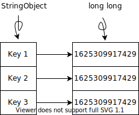
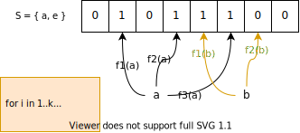
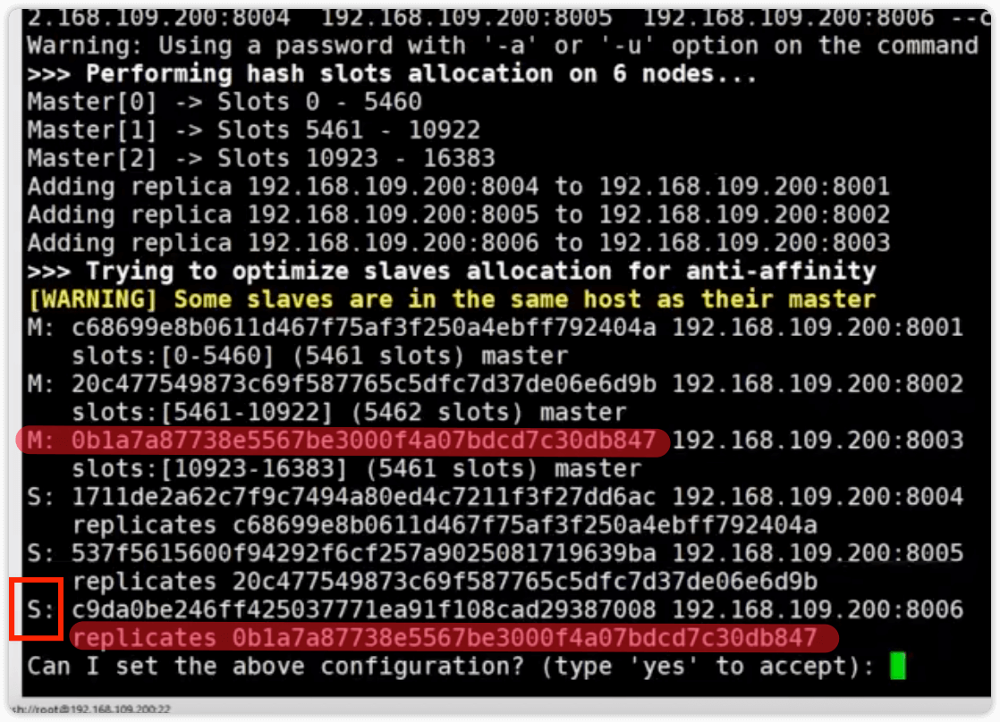
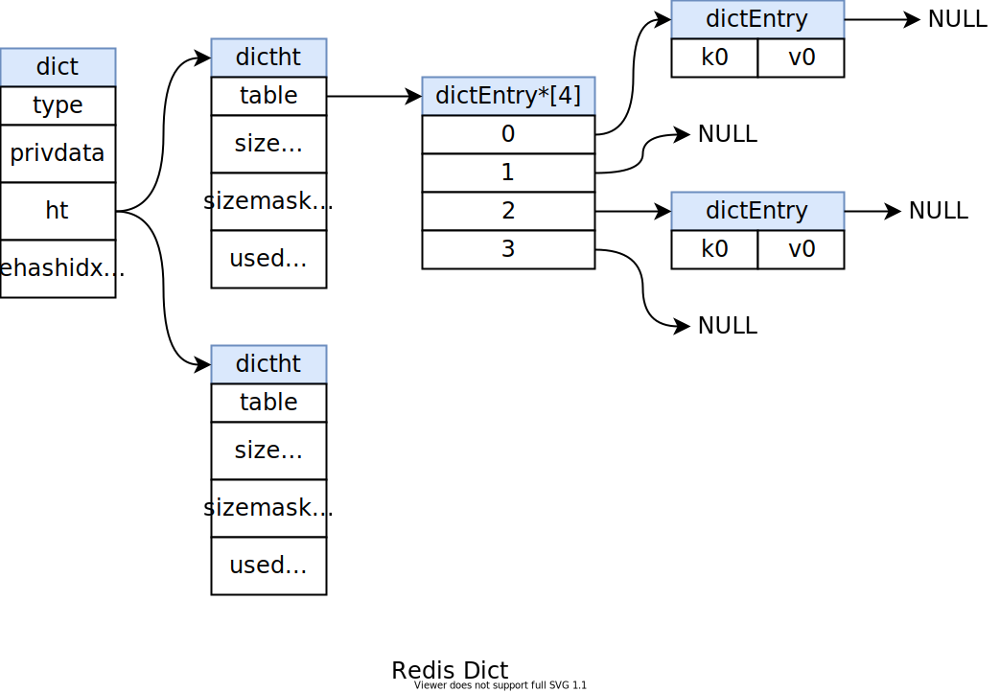
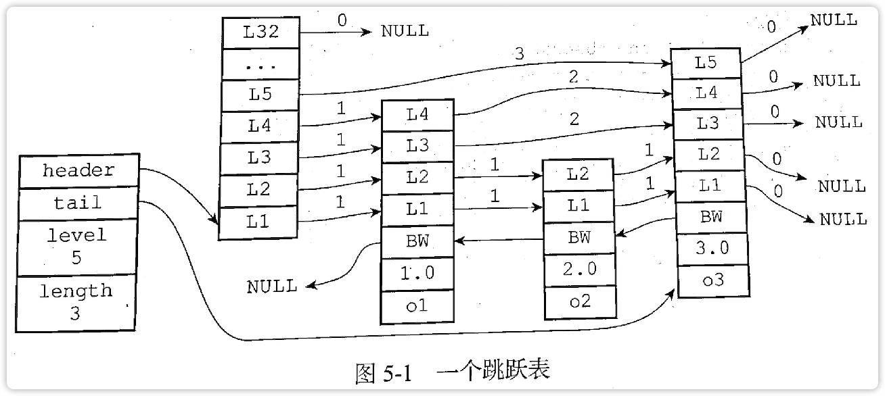

# Redis

## Redis 数据类型有哪些

### 基本类型

1. Strings：set, get, del, incr, incrby, decr
2. List: 双向连表
3. Hash: hset, hget
4. Set: sadd, spop, scard(获取长度)
5. Sorted Set：score 字段存储排序值, zadd, zrange, zrem

> `incr`, `decr` 等返回修改后的值

### 新数据类型

1. Bitmap：基于 String
2. HyperLogLogs：基于 String，集合的概率
3. Geospatial index：基于 sorted map，空间位置索引，提供基于经纬度的查询功能
4. Stream：类似日志，提供阻塞式的“生产者-消费者”模式的能力

### 其他类型

1. Bit map: based on strings
2. geo: sorted set

## Redis 分布式锁支持的方法

不存在时设置成功，否则失败。

1. setnx: SET if Not eXists
2. msetnx: Multiple set
3. hsetnx: Hash set, `hsetnx key field value`

## Redis 事务

将一组命令加入队列，之后一次性执行（不被抢占）。

1. `MULTI`：开启事务
2. `EXEC`: 执行队列
3. `DISCARD`: 放弃队列的执行
4. `WATCH`: 监听变量是否改动，若改动则 `EXEC` 时报错
5. `UNWATCH`: 取消所有监听

Redis 事务不满足原子性。

两个异常情况：

1. 将命令加入队列时错误（命令名错误、参数错误）：直接返回错误，此时执行 `EXEC` 无法成功
2. `EXEC` 时报错，队列继续执行后面任务。

## Redis 过期 key 删除策略

1. 惰性删除（Passive）：获取 key 时发现过期，删除
2. 定时删除（Active）：定时启动删除任务，概率保证已过期却没有被删除的比例为 1/4。过程如下（10次/s）

    1. 在设有过期时间的 key 中，随机抽取 20 个记录
    2. 删除已过期记录
    3. 若已删除记录超过 25%，立即重新启动算法

## 为什么防超卖用 Redis 不用 Java 锁

Redis 可以持久化、可以做分布式，这都是 Java 锁机制不具备的。我们可以用多个 Redis 节点去存储库存，Java 的话每个节点的数据不能同步，而且如果遇到宕机，无法恢复。而 Redis 可以通过主备，即使一个节点宕机，也可以保证其他节点可用。

## Redis 怎么实现 CAS

1. 利用事务：WATCH, MULTI
2. Lua 脚本

## 数据淘汰策略

\# | 策略            | 描述                                                 |
---| --------------- | ---------------------------------------------------- |
1| volatile-lru    | 从已设置过期时间的数据集中挑选最近最少使用的数据淘汰 |
2| volatile-ttl    | 从已设置过期时间的数据集中挑选将要过期的数据淘汰     |
3| volatile-random | 从已设置过期时间的数据集中任意选择数据淘汰           |
4| volatile-lfu    | 4.0 引入，Least Frequently Used                      |
5| allkeys-lfu     | 4.0 引入                                             |
6| allkeys-lru     | 从所有数据集中挑选最近最少使用的数据淘汰             |
7| allkeys-random  | 从所有数据集中任意选择数据进行淘汰                   |
8| noeviction      | 禁止驱逐数据                                         |

## Redis 单线程

是指网络IO时使用了单线程，在持久化、垃圾回收等操作时，也会开启新线程处理。4.0之后，在某些操作也会支持多线程。

> For instance, using pipelining Redis running on an average Linux system can deliver even 1 million requests per second.
>
> --- From: [FAQ – Redis](https://redis.io/topics/faq)

事实上，Redis 6.0 开始，支持多线程，不过此时仍然是单线程处理命令，只是在网络 I/O 使用了多线程，目的是为了利用多核，提高 I/O 效率。

**See Also:**

- [为什么说Redis是单线程的以及Redis为什么这么快！](https://blog.csdn.net/xlgen157387/article/details/79470556)
- [Redis 6.0 多线程重磅发布！](https://www.cnblogs.com/gz666666/p/12901507.html)

## Redis 命令 CPU 处理速度

单机 10w QPS

## 持久化

- RDB: Redis Database
- AOF: Append Only File

两者可以同时开启，重启 Redis 时，以 AOF 为准，因为他保存了更新的修改。

## 持久化：RDB

保存数据库快照，每次都是数据库的 **全量** 快照。快照会保存在 `redis.conf` 文件的 `dbfilename` 配置下，默认为 `dump.rdb` 中。快照生成策略

1. 调用 `fork` 系统调用，创建子进程，备份发生在子进程。（`SAVE` 命令除外）
2. 进程开始将 *数据库（dataset）* 保存到临时文件。
3. 将写临时文件重命名为 `dump.rdb`。

有两种方式可以生成快照：

### 1. 通过命令

通过命令 `SAVE`, `BGSAVE` 生成，其中 `SAVE` 会阻塞所有客户端请求，生产环境多用 `BGSAVE`。`BGSAVE` 会使用 `fork` 系统调用，创建一个子进程生成快照。

此外，可以通过 `LASTSAVE` 命令检查上次保存是否成功，该命令返回上一次快照生成的 Unix 时间戳。

### 2. 通过配置文件

编辑 `redis.conf` 文件，如

```nginx
save 300 10
save 60  10000
```

以上配置表示：`300s` 内有 10 次或以上修改、`60s` 内有 10000 次及以上修改，便生成一次快照。可以配置多个。

### 3. 关闭 RDB

关闭 RDB 两种方式：

1. 不配置 `save`
2. 配置 `save ""`

## 持久化：AOF

AOF, Append Only File。**默认关闭**。

Redis 每收到一个 **修改命令**，便会追加到 AOF 文件。当 Redis 重启时，会 *重播（re-play）* AOF 文件以重建数据库。

### AOF 相关配置

```nginx
appendonly yes

# The name of the append only file (default: "appendonly.aof")
appendfilename "appendonly.aof"

appendfsync everysec
```

### AOF 磁盘写频率配置

AOF 调用 `fsync(2)` 告诉内核，应该将高速缓冲（buffer cache）写入磁盘，实际上也是依赖操作系统决定什么时候写。有些是马上写，有些是 ASAP。

| 选项         | 同步频率                 |
| ------------ | ------------------------ |
| always       | 每个写命令都同步         |
| **everysec** | **默认**。每秒同步一次   |
| no           | 让操作系统来决定何时同步 |

> `fsync` 是将 **某个文件描述符** 对应的高速缓冲数据刷新到磁盘。

可以使用 `redis-check-aof` 工具检查并可选地修复（`--fix`）最后一条记录写失败的情况。

See Also:

- [详解Redis中两种持久化机制RDB和AOF（面试常问，工作常用）](https://baijiahao.baidu.com/s?id=1654694618189745916&wfr=spider&for=pc)
- [CS-Notes](http://www.cyc2018.xyz/%E6%95%B0%E6%8D%AE%E5%BA%93/Redis.html#%E5%85%AB%E3%80%81%E6%8C%81%E4%B9%85%E5%8C%96)
- [Redis Persistence – Redis](https://redis.io/topics/persistence)
- [redis.conf](https://raw.githubusercontent.com/redis/redis/6.0/redis.conf)

## 什么是 AOF rewrite

AOF 会保存每一条写命令，这样可次帮助重建数据库。而这样会使得 AOF 越来越大，出现很多没必要的修改命令。如调用100次 `INCR key`，只需执行 `SET key 100` 一条命令。AOF rewrite 便是将优化这些写命令的机制，用最少的命令序列来重建某一时间点的数据库。

Redis 2.4 之前，必须手动的执行 `bgRewriteAOF` 命令，2.4 以后会自动触发该命令进行后台 AOF 文件的重写。

`BGREWRITEAOF` 会立即返回 `OK`，此时可以使用 `INFO` 命令查看 AOF rewrite 状态。

```
aof_enabled:0
aof_rewrite_in_progress:0
aof_rewrite_scheduled:0
aof_last_rewrite_time_sec:-1
aof_current_rewrite_time_sec:-1
aof_last_bgrewrite_status:ok
aof_last_write_status:ok
aof_last_cow_size:0
```

相关配置 `redis.conf`

```nginx
# 当前 size 大于上次 rewrite 后 size 的百分比
auto-aof-rewrite-percentage 100
# AOF size 低于该值不会触发 rewrite
auto-aof-rewrite-min-size 64mb
```

## AOF rewrite 过程

1. Redis `fork(2)` 创建子进程。
2. 子进程通过临时文件开始执行 `rewrite` 操作。
3. 父进程将随后新增的 AOF 内容保存在内存，同时将这些内容写入原来的 AOF 文件，以防重写失败导致 AOF 不完整。
4. 子进程完成 rewrite 操作，向父进程发送信号，父进程将内存中保存的 AOF 追加到重写后的 AOF 文件（临时文件）。
5. 将临时文件重命名为 `appendonly.aof`。

> 使用重命名的原因与 RDB 生成过程相同。

## RDB/AOF 生成过程中为什么要用到临时文件？

这样可以安全地备份快.照文件。

> 为了讨论方便，我们称已经存在的备份文件为 dump.rdb

为了数据安全，我们通常需要将 `dump.rdb` 备份。考虑当正在进行 `dump.rdb` 的备份时，触发了快照生成的情况。如果不使用临时文件，新的快照将在原来的文件上清空后重写，正在进行 `dump.rdb` 备份的进程将抛出异常或者读到错误的内容，导致备份错误。而在使用了临时文件的情况下，在重命名（`rename(2)`）时，正在备份的文件 `dump.rdb` 会被执行系统调用 `unlink(2)`，此时由于 `dump.rdb` 处于被打开状态，内核中保存了其 `inode` 表项，所以实际上 `dump.rdb` 不会被马上删除，而只是删除了与文件名的 *联结（link）*，所以备份进程将能够继续正常读取文件，直到 `close(2)`。此时 `close(2)` 会调用 `iput(2)`，检查联结数为 0，于是删除掉原来的文件 `ifree(2)`，`free(2)`。

> 值得指出的是，真正确定一个文件的是文件系统中存储的 inode 节点，而不是文件名，当文件不存在文件名时，他也可以被继续使用，直到 `close(2)`。

## RDB 与 AOF rewrite 是否可以同时进行？

RDB 快照和 AOF 的重写都是重 I/O 操作，不推荐同时执行，会增加服务器负载。当正在生成 RDB 快照的过程中，调用 `BGREWRITEAOF` 命令将 AOF rewrite 操作加入执行队列。

## RDB 怎么切换为 AOF

1. 备份 `dump.rdb`
2. 执行以下命令

```bash
redis-cli config set appendonly yes
redis-cli config set save ""
```

3. 检查数据是否与操作前一致
4. 检查 `appendonly.aof` 有写入

第 2 步的开启 AOF 会 **阻塞** 客户端请求，以生成初始 AOF 文件。

## 分片

类似横向分表，把数据拆分到不同服务器存储。

分片方式：

1. **客户端拆分**：客户端根据 *一致性 Hash 算法* 决定当前键应该存储到哪个节点。
2. **代理分片**：客户端将请求发送给代理，代理再进行数据转发
3. **服务器分片**：Redis Cluster

## 设置、获取过期时间的命令

1. `setex`： set value with expire time, in seconds
2. `psetex`：precisely set value with expire time, in milliseconds
3. `expire`: expire a key in , in seconds
4. `pexpire`: expire a key, in mlliseconds
5. `expireAt`：expire a key at specific Unix timestamp
6. `pexpireAt`: expire a key at specific Unix timestamp, using milliseconds
7. `ttl`: time to live
8. `pttl`: time to live in milliseconds
9. `expireTime`: Get the expiration Unix timestamp for a key
10. `pExpireTime`: Get the expiration Unix timestamp for a key in milliseconds

**Syntax**

```redis
setex key seconds value
psetex key milliseconds value
expire key seconds
pExpire key milliseconds
expireAt key timestamp
pExpireAt key milliseconds-timestamp
ttl key
pttl key
expireTime key
pExpireTime key
```

## Redis 怎么实现过期的（区别过期策略）？

Redis 维护了一个字典，字典的键为 `key`，类型为 `stringObject`，值为过期时间，类型为 `long long`，精确调毫秒时间戳（Unix millisecond-timestamp）。



## 缓存穿透

客户端请求时，没有命中缓存，导致请求最后直达数据库，增加数据库负载。攻击者可以为找不存在的 key，使得所有请求都绕过缓存到达数据库。解决方案：

1. 存储非法 key，很容易占满缓存。
2. 按规则生成 key。
3. 使用 *布隆过滤器（Bloom Filter）*，大概率阻挡非法 key。

## 布隆过滤器（Bloom Filter）

Bloom Filter 用于判定集合中是否包含某个元素。如 10 亿字符串的集合中是否包含某个元素。

Bloom Filter  使用 bitmap 进行存储。使用前，首先将所有合法的 key 通过多个 hash 函数从而映射到对应的 bit 位。判定时，将 key 通过同样的 hash 函数，如果其中某个 hash 函数得到的比特位的值时 0，表示该 key 是非法的。

Bloom Filter 保证了判定为非法的 key 一定是非法的，而判定合法的则不一定。



Bloom Filter 通常不提供删除某个元素的操作，因为 hash 的操作是不可逆的，无法判定一个 hash 值有没有其他元素使用，只能重建整个BF。

> 可以使用 **google 提供的 guava** 或者 **Redis bitmap** 实现 Bloom Filter。

## 缓存雪崩

是指同时大面积的缓存失效，导致大量的缓存 miss 之后同时想数据库发起查询请求。

**失效的原因：**

1. 同时缓存了相同 ttl 的数据。
2. 缓存系统崩溃。

**危害：**可能是系统宕机

**解决方案（对应失效原因）：**

1. 使用随机 ttl 避免同时大面积失效。
2. 采用 Redis **集群** 方案及请求 **限流**。

## 如何保证缓存与数据库一致？

旁路缓存模式（Cache Aside Pattern）。

先更新数据库，再删除对应的 cache。

cache 删除失败处理：重试，如果多次重试失败，可能是 cache 服务器异常，则应用程序将删除 cache 的操作放入执行队列，等 cache 服务器恢复正常之后再重试。



## Redis 高可用解决方案

1. 主从
2. 哨兵（Sentinel）
3. 集群

## Redis 主从

主写，从读。

开启主从时，**主节点不需要做任何操作**，只需要从节点设置主节点地址、端口号、密码即可。

### 使用

#### 开启方式：

1. 配置文件 `redis.conf` 中 `slaveof`
2. 客户端命令 `slaveof`
3. 服务器启动 `--slaveof`

```bash
redis-server --slaveof master-host master-port
slaveof master-host master-port
```

> 从节点为只读

#### 断开复制

在客户端运行命令

```bash
slaveof no one
```

之后从节点变为主节点，可写，数据保留。

---

### 原理

**阶段：**连接建立、数据同步、命令传播

**数据同步：** 首次同步通过 RDB，主服务器生成 RDB 快照，发送给从服务器，从服务器加载。随后根据状态进行部分、全量复制。

1. 全量复制
2. 部分复制

**命令传播：**

1. 发送写命令
2. 维持连接

**参考**

- [深入学习Redis（3）：主从复制 - 编程迷思 - 博客园](https://www.cnblogs.com/kismetv/p/9236731.html)

## Redis 哨兵

选举时，耗时，增加业务时延。

通过一个 *哨兵（Sentinel）* 集群，维护 Redis 集群，Redis 集群为以主多从配置，当主节点宕机，哨兵负责投票选举一个新的 master，并通知其他从服务器。

## Redis 集群

Since 3.0。

分片+哨兵。

Redis 提供 16384（2^14=2k） 个虚拟节点（slot）。每个节点都是主从集群。

使用 AOF 复制数据。

5.0 以前需要 ruby 脚本启动、管理集群，5.0 以后可以直接使用 `redis-cli --cluster`，帮助文档 `redis-cli --cluster help`

分片 hash 函数：`crc16`

开启步骤

1. 修改配置文件，开启集群 (`clustter-enabled yes`)
2. 创建 Redis 示例。启动 `redis-server path/to/redis.conf`。启动后用 `ps` 命令，可以看到进程 `[cluster]` 标识。
3. 创建集群

```bash
redis-cli -a <passwd> --cluster create host:port host:port ... --replicas 1
```

其中 `--replicas` 为每个节点从服务器数量，从服务器是从上面的命令给定的 `host:port` 列表选举得到。



建立之后，需要设置一个 key 时，只能到对应的 slot 所在的 Redis 实例中设置，如果在错误的 slot 实例中进行修改，会报错。利用以下命令可以获得 slot 的值

```bash
127.0.0.1:8001> cluster keyslot <KEY>
(integer) 15495
```

另外可以通过 `-c` 选项，让 Redis 自动重定向到对应的 slot 实例上。

```bash
redis-cli -c -a <pass> -p <port> -h <host>
127.0.0.1:8001> set a a
-> Redirected to slot [15495] located at host:port
OK
```

此外可以获取 cluster 信息的命令

```bash
# 获取插槽详细信息
cluster slots

# 获取 cluster 信息如
# state, size, slots state etc
cluster info
```

### 集群 `redis.conf` 相关配置

```nginx
port 8001

# 开启后（yes），如果没有配置（或）
#   1. bind
#   2. requirepass
# 将只能使用本地回环访问
protect-mode no

# working directory
dir path/to/node

#******** 集群配置 ********#

cluster-enabled yes

# 集群配置文件，非 redis-server 的配置文件
# 由 redis 集群管理内容（do not edit）
cluster-config-file nodes-8001.conf

# 节点不可达时超过该时间
# 会被认为 failure state
cluster-node-timeout 5000

# 开启 AOF
appendonly yes

# 当前为 master
# 访问该节点需要的密码
requirepass foobar

# 当前为 slave
# 访问 master 的密码
masterauth foobar
```

**参考**

1. [redis的三种集群方式 - 51life - 博客园](https://www.cnblogs.com/51life/p/10233340.html)

## 缓存数据倾斜问题

数据倾斜问题是指短时间所有的请求都命中到同一节点，造成负载不均衡。主要有两类问题

1. Hot key：如热点新闻，某条新闻热搜，放在某一节点上，这段时间所有的请求都将命中这一节点，导致节点负载过大而宕机。
2. Big key：对于存放集合的 key，如 hash，set，list 等，由于设计不合理，导致大量的数据都存在这个 key，形成 big key。

### 解决方案

首先应该是对业务进行分析，什么业务场景下会出现数据倾斜，预防数据倾斜发生，如果数据倾斜已经发生，则分情况解决。

#### 1. Hot key

通过以下命令获取 hotkey

```bash
redis-cli --hotkey
```

假设实例数为 `n`，给 hotkey 加上前缀或则后缀，使 key 的数量变为原来的 `m` 倍，**一个 hotkey 变成了 `n * m` 个 key**。这些 key 分摊到 `n` 个实例上，每个实例 `m` 个 key。在请求时，通过

```java
redis.get(hotkey + "_" +random(1, n * m));
```

来随机获取一个 key 值。

#### 2. Big key

1. 如果 value 是 json，则通过 `mset` 将 key 分散存储到各个实例。
2. 如果 value 是 list，则拆分成多个 list，e.g. list_1, list_2, ..., list_n，每个 list 包含如 1000 个数据。

## 为什么 Redis 集群中 slot 数量是 16384？

1. **消息大小考虑**：尽管 `crc16` 能得到 65535 个值，但 Redis 选择 16384 个 slot，是因为 16384 的消息只占用了 2k，而 65535 则需要 8k。
2. **集群规模设计考虑**：由于其他考虑，集群设计通常都小于支持 1000 个分片，16384 是相对比较好的选择，需要保证在最大集群规模下，slot 均匀分布场景下，每个分片平均分到的slot 不至于太小。

### 需要注意2个问题：

#### 1. 为什么要传全量的slot状态？

因为分布式场景，基于状态的设计更合理，状态的传播具有幂等性

#### 2. 为什么不考虑压缩？

集群规模较小的场景下，每个分片负责大量的slot，很难压缩。

- [why redis-cluster use 16384 slots? · Issue #2576 · redis/redis · GitHub](https://github.com/redis/redis/issues/2576)

## Redis 数据结构：字典

字典结构中包含了两个 `ht` 哈希表，其中 `ht[0]` 用来存储数据，`ht[1]` 用来 rehash 时使用。

哈希表中有存有 `dictEntry` 指针，指向节点，节点中存放了键值对。



## Redis 字典如何解决冲突

链地址法（separate chaining）。

## Redis 字典 rehash

当键值对数目大于了哈希表大小时，会触发 rehash，具体来说是根据负载因子（Load factor）结合当前是否有持久化任务来决定。

1. 当没有持久化任务时，`load_factor >= 1` 则会触发
2. 当有持久化任务进行时，`load_factor >= 5` 时触发

---

```html
load_factor = ht[0].used / ht[0].size

used: 节点数
size：hash 表大小
```

## ZSET 有序集合中使用的数据结构

跳表。

按分值顺序排序，相同分值的对象存储按对象的字典顺序排序。

跨度（`span`）用于计算对象的排名（rank）。



## todo

主从

哨兵

集群：怎么通信（TCP？），怎么传数据（AOF？）
