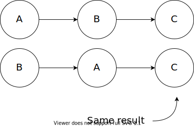
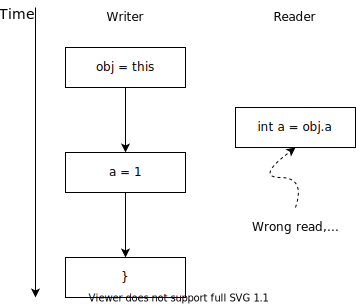

# Java Concurrency

## 并发模型的两个关键问题是什么？

1. **通信**：线程之间交换信息。通信机制包括 <ins>共享内存</ins> 和 <ins>消息传递</ins>。
2. **同步**：程序中用于控制不同线程间操作发生相对顺序的机制。

**Java 的并发，采用的是共享内存的模型。**

> JMM 通过通信进行同步，也就是说同步也是通信的内容之一。

## Java 的本地内存是指什么？

本地内存是一个抽象的概念，没有实体，是线程私有的。包含了处理器缓存、写缓冲区、寄存器等。

---

本地内存保存了共享变量的副本。


## 指令重排的目的是什么？

编译器和处理器为了 **优化程序性能** 而对指令序列进行重新排序的手段。

如：CPU 可以并行执行某些指令。

## 指令重排会有什么问题？

在约束条件下（数据、控制依赖），单线程的指令重排不会造成问题，而多线程情况下会。

**问题在于多线程**：对于多线程，指令在线程 A 进行重排，导致变量初始化、修改的顺序改变，并发时 B 线程可能在这个不正确的顺序中读取未正确赋值的变量，导致程序在多线程情况下语义被破坏。

```java
// thread A
a = 1;
flag = true;

// thread B
if (flag == true) {
  int i = a * a;
}
```

> The default value for `a` is `0`.


> `B'` 代表另一种情况，也是正常的情况。但是引入重排之后，B 的结果变得不正确，改变了程序的语义。此时应该有 `i = a * a = 4` 而非 `0`。 

## 指令重排的分类有哪些？

1. 编译器重排
2. 处理器重排: 通过插入 *内存屏障（Memory Barriers, Memory Fence）* 来禁止处理器的重排。通常处理器会提供相关指定。

**处理器重排分为**：

1. 指令级并行重排
2. 内存重排

排序示意图：



## 指令重排的约束是什么？

在单线程、单处理器时，

1. 数据依赖不重排：编译器或处理器不会改变数据依赖的指令的执行顺序。
2. 控制依赖可能重排：编译器和处理器会通过 *猜测（Speculation）* 来重排语句使得可以并发。

## 数据依赖分类有哪些？

名称|代码示例
---|---
读后写|a = b;<br />b = 2;
写后写|b = 1;<br />b = 2;
写后读|b = 1;<br />a = b;

## 内存屏障的分类

| Barriers     | Instructions                 | Description                                                  |
| ------------ | ---------------------------- | ------------------------------------------------------------ |
| `LoadLoad`   | Load1; `LoadLoad`; Load2     | Load1 装载，**先于** Load2 及后续 **装载** 指令的发生        |
| `StoreStore` | Store1; `StoreStore`; Store2 | Store1 的数据对其他处理器可见，**先于** Store2 及后续 **存储** 指令 |
| `LoadStore`  | Load1; `LoadStore`; Store2   | Load1 的发生，**先于** Store2 及后续 **存储** 指令刷新修改到内存。 |
| `StoreLoad`  | Store1; `StoreLoad`; Load2   | Store 对其他处理器可见（刷新修改到内存），先于 Load2 及后续 **装载** 指令。<ins>**该屏障会使之前所有的访问指令（装载或存储）完成后再执行后面的访问指令**</ins>。 |

其中 Store 表示存储并刷新到内存，前后两个操作为任意的（Load1 与 Load 2 代表从主内存读入寄存器的任意两个指令）。

> `StoreLoad` 是一个全能屏障。

## 顺序一致性模型与 JMM

顺序一致性模型是在没有指令重排的情况下，多线程的指令执行，对所有线程都可以看到相同的顺序，任何线程的操作对其他线程都立即可见，是一个理想模型。

JMM 由于允许指令重排，所以多线程下可能导致程序语义被破坏，而正确同步的线程也可以保证得到顺序一致性模型相同的结果。同时在同步临界区内部的指令，是允许重排的，只是在进入和退出临界区做了特殊处理，禁止了重排。

JMM 不保证 64 位的数据（long, double）写的原子性。因为在 32 位处理器上，64 位的数据时分两次写的，两次写之间如果有读的操作，将看到不一致的结果。此时<ins>使用 `volatile` 可以保证原子性</ins>。



> 处理器与内存之间的数据传递是通过一些列的步骤来完成，称为 *总线事务（Bus Transaction）*，总线事务包括 *读事务（Read Transaction）* 和 *写事务（Write Transaction）*

## as-if-serial 是什么意思？

像顺序执行一样。是指允许指令重排，但是重排后执行的结果必须和顺序执行一样。



## 未正确同步程序的执行特性有哪些？

对于这类程序，JMM 提供最小安全性：线程执行读取到的值，要么是之前某个线程写的值，要么是默认值（`false`, `0`, `0.0`, `null`），绝对不是 *无中生有（Out of Thin Air)*。

> 某线程写的值也可能是写了一半的值

## volatile 重排规则

禁止重排：

1. 读后
2. 写前
3. 写后读：具有锁的语义

<table style="text-align:center">
    <tr>
        <td></td>
        <th colspan="3">第二个操作</th>
    </tr>
    <tr>
        <th>第一个操作</th>
        <th>普通IO</th>
        <th>volatile 读</th>
        <th>volatile 写</th>
    </tr>
    <tr>
        <th>普通IO</th>
        <td></td>
        <td></td>
        <td>NO</td>
    </tr>
    <tr>
        <th>volatile 读</td>
        <td>NO</td>
        <td>NO</td>
        <td>NO</td>
    </tr>
    <tr>
        <th>volatile 写</td>
        <td></td>
        <td>NO</td>
        <td>NO</td>
    </tr>
</table>
`volatile` 变量在 **写时**，会插入内存屏障，禁止 CPU 将其任何前置指令重排，并刷新修改到主内存。`volatile` 变量在 **读时**，会插入内存屏障，禁止与后续任何指令重排，并将本地缓存置为无效，然后从主内存中读取更新后的值。

> 某线程 **读某个非 `volatile` 变量（或类的字段）时**，会访问主内存，然后将值缓存在本地内存，随后的访问将不再访问主内存。

## volatile 为禁止处理器中排插入的内存屏障规则

为了使 `volatile` 能够达到 JMM 规定的语义，编译器可以禁止自己重排，而 **处理器重排就需要插入内存屏障来禁止**。



## 怎么理解 "volatile 写-读" 与 "锁的释放-获取" 有相同的语义？

两者都保证前者（volatile 写、锁的释放）一定 happens before 在后者（volatile 读、锁获取）。

## 为什么要增强 volatile 的语义？

从 JDK 1.5 开始，为了提供一种比锁更轻量级的线程间通信机制，JSR-133 专家组决定增强其语义：<ins>确保 volatile 的 **写-读** 与锁的 **释放-获取** 具有相同的语义</ins>

## 锁的内存语义

### 1. happens-before

锁的释放-获取存在 happens-before 关系，即释放 happens-before 获取。

### 2. 内存语义

- 锁释放时，会将本地内存的共享变量刷新到主内存。
- 锁获取时，JMM 会把该线程对应的本地内存置为无效，从而使被监视器保护的临界区代码必须从主内存中读取共享变量。

> 与 volatile 变量读一样，“本地内存置为无效，去主内存中获取” 发生在锁获取时，也就是不获取锁，线程将仍无法看到修改。 两者的实现都是通过 CPU 的 lock 指令，确保 “读-改-写” 的原子性，禁止重排，刷新数据到主内存。

## final 域（字段） 的重排规则

保证了：有 `final` 域的对象，final 域的赋值一定限制在构造器之内（普通域可能重排到构造器外部），从而使得任何线程可见该对象时，final 域一定是初始化完成了的。对 final 域的调用，一定在对该对象赋值之后。



**《Java 并发编程的艺术》原文**

1. 在构造函数内对一个 `final` 域的 **写入**，与随后把这个被构造对象的引用赋值给一个引用变量，这两个操作之间不能重排。
2. 初次读一个包含 `final` 域的对象的引用，与随后初次 **读** 这个 `final` 域，这两个操作之间不能重排。

## final 域的重排规则前提是什么？

**不能有 `this` 溢出。**

如果有 `this` 溢出，则可能在重排后导致构造器还没有结束，就对 `final` 字段进行了引用，破坏了 `final` 的语义。

```java
class FinalEscape {
    public final int a;
    static FinalEscape obj;

	public FinalEscape() {
        a = 1;
        obj = this;
    }

    public static void writer() {
        obj = new FinalEscape();
    }

    public static void reader() {
        int a = obj.a;
    }
}
```

开启两个线程，`writer` 线程启动后，运行 `reader` 线程。重排后，构造器可能出现如下情况



则 `reader` 可能读到 `a` 初始化之前的值，破坏了程序语义。

而在 `this` 没有逃逸的基础上，`reader` 线程在获取 `obj` 引用时，一定已经初始化完成。

> 注意 `final` 域的写一定 happens before 构造器结束。

## 是否所有处理器都会为 final 插入内存屏障？

不是的，对于 x86 的架构，就不会插入任何内存屏障。

## 为什么要增强 final 域的语义？

在早期的版本中，线程可能看到 `final` 域的值发生改变：未初始化的值改变为初始化的值。为了修复这个 BUG，便增强了 `final` 的语义。在不使用 **同步**（`lock`, `volatile`）的情况下，保证任意线程能都能看到 `final` 域初始化之后的值。

> `String` 使用了 `final char[]` 来存储字符串，早期版本则可能在 `char[]` 完成初始化之前，得到一个 `null` 返回。

## 多线程是否总比单线程快

不是。多线程会有 **创建线程，上下文切换** 的开销，当任务量小时，CPU 单核时可能单线程比多线程更快。

## 如何减少上下文切换

1. **无锁并发编程**：类似 MapReduce 方法，当数据没有依赖关系时，可以并发。
2. **CAS 算法**：利用 Compare And Swap。
3. **最少线程**：避免创建不必要的线程，否则会造成大量线程 WAITING。
4. **协程**：单线程里面处理多任务调度，并在单线程中维持多个任务的切换。

## vmstat 工具

是一款 Linux/Unix 监控工具

```bash
vmstat interval count
```

- interval: 采集间隔，单位 s。e.g 2s 采集一次
- count： 采集多少次。默认无限采集，知道 <kbd>ctrl-c</kbd>

**结果如下**


**procs**

- **r**: number of runnable proccess count, running ant waiting.
- **b**: blocked proccess count, number of uninterruptable sleep.

**memory:**

- **swpd**: amount of swap used, in bytes
- **free**: 
- **buff**: amount of memory used as buffer
- **cache**: amount of memory used as cache

**swap:**

- **si**: amount of memory swapped in from disk (/s)
- **so**: amount of memory swapped out to disk (/s)

**io:**

- **bi**: blocks read in from a block device (blocks/s)
- **bo**: blocks write out to a block device (blocks/s)

**system:**

- **in**: interrupts per second, including the clock
- **cs**: number of context switch per second

**cpu:**

- **us**: user time, non-kernel
- **sy**: kernel time
- **id**: ide time, including IO-waiting time
- **wa**: IO-waiting time
- **st**: stolen time of virtual machine (what ???)

> us + sy + id = 100

## CAS 是什么？

Compare And Swap。乐观锁，读-改-写。利用 3 个操作数：内存地址 V, 旧的预期值 A，新的目标值 B。当设置 B 时，检查 V 对应的值是否与 A 相等，如果相等，则设置为 B，否则循环 CAS 算法（称自旋）。CAS 的原子性，由 CPU 指令（e.g. lock 前缀）保证。Java 中通过包 `java.util.concurrent.atomic` 提供的 `compareAndSet` 方法来实现，如

```java
AtomicInteger at = new AtomicInteger(0);
int prev = at.getAndIncrement();
```

**缺点：**

1. 不能检测到 ABA 问题。可以通过 `AtomicStampedReference` 加版本号解决。
2. 只能保证一个共享变量的原子性。Java 1.5 以后，可以通过 `AtomicReference` 将多个变量放入对象中，保证原子性
3. 循环的开销可能很大（自旋），如果修改频繁，会导致一直循环。（因为 CAS 是乐观锁，认为竞争的情况很少）

> 上例中，利用类自带的方法将整数+1并返回原来的值，这个过程也可以通过 `synchronized` 实现。

**另一个例子**

自定义修改的一个 CAS 操作例子。

```java
while (true) {
  int old = at.get();
  // do something with old and get newVal
  int newVal = doSthWith(old);
  boolean success = at.compareAndSet(old, newVal);
	if (success) break;
}
```

## 处理器是如何实现原子操作的？

1. 使用总线锁
2. 使用缓存锁

## 什么是总线锁？

通过在总线上 *声言*（传播）`LOCK#` 信号。锁定总线会导致其他 CPU 无法访问内存，内存由发出信号的 CPU 独占。所以总线锁的开销较大。

## 什么是缓存锁？

解决总线锁开销较大问题。

对 *缓存行* （CPU 操作缓存的最小单位）进行锁定。当有多个 CPU 对相同内存地址的缓存行进行写操作时，会使用 *缓存一致性机制*，阻止两个及以上 CPU 对内存的数据修改。

> 不是所有 CPU 都支持缓存锁，若不支持则只能使用总线锁。

## 什么情况下 CPU 不会使用缓存锁？

1. 操作数据不能被缓存
2. 操作数据超过一个缓存行
3. 处理器不支持缓存锁

## Java 锁状态有哪些？

级别从低到高

1. 无锁
2. 偏向锁
3. 轻量级锁
4. 重量级锁

> 锁级别只能提升，不能降低，避免无限所竞争（如 CAS 死循环）。

## 什么是偏向锁？

偏向第一个获得它的线程的锁。当线程执行同步代码块时会通过 CAS 将对象头的 *偏向锁* 标志置为 1，并执行代码块。

### 撤销

**偏向锁是等到出现竞争，才释放锁**。当另一个线程访问偏向锁的对象是，会先尝试 CAS 获取偏向锁。如果获取失败，则检查偏向的线程是否 *终止（terminated）*。若终止，则设置为当前线程（或置空，当对象不适合偏向锁时）；若未终止，则等待线程执行。

### 偏向锁设置

- `-XX:BiasedLockingStartupDelay` 默认，偏向锁在应用启动几秒后执行，该设置可以设置延迟时间。
- `-XX:UseBiasedLocking=true` 默认开启偏向锁，可以通过 `false` 关闭，关闭后，程序进入 *轻量级锁*。

```bash
java -XX:BiasedLockingStartupDelay=0 -XX:UseBaisedLocking=false ClassName
```

> 偏向锁不适合竞争频繁的应用。

## 什么是轻量级锁？

### 加锁

1. JVM 在当前线程栈帧中创建 **存储空间**，以存储 *锁记录* 称，Displaced Mark Word）。
2. 将对象头中的 Mark Word 拷贝到锁记录
3. 使用 CAS 将 Mark Word 替换为指向锁记录的指针
4. 如果成功则获取锁成功
5. 如果失败则自旋 CAS 获取锁，若获取锁失败，则 *膨胀* 为 ***重量级锁***，随后进入阻塞而 **睡眠**

> 自旋失败的条件是什么？

### 解锁

1. 利用 CAS 将 Displaced Mark Word 拷贝回 Mark Word
2. 成功则表示没有竞争
3. 失败则表示有竞争，意味着锁已经膨胀为重量级锁，释放锁并唤醒因为重量级锁而随眠的线程。


### See More

- [Java轻量级锁原理详解(Lightweight Locking)](https://blog.csdn.net/qq_35124535/article/details/70312553)
- [Java并发编程：Synchronized底层优化（偏向锁、轻量级锁](https://www.cnblogs.com/paddix/p/5405678.html)

## 什么是重量级锁？

基于操作系统的 *排他锁*（Mutex Lock），线程会进入阻塞状态，等待释放资源锁唤醒。此时会有用户态到核心态的转换、运行到睡眠的上下文切换，开销大。

## intro-thread semantics 是什么？

保证重排序不会改变单线程的程序执行结果。即 as-if-serial。

> 由 《 The Java Language Specification, Java SE 7 Edition 》提出的重排规则。

## synchronized 优化机制 todo


## 什么是内存屏障？

内存屏障是 JMM 利用处理器相关指令，限制处理器指令重排的方法，从而保证了执行顺序以及内存的可见性。

## 为什么单例模式需要用到 volatile ? 



---

基于 `volatile` 的单例模式

```java
class Singleton {
  private static volatile instance;
  
  public static Instance getInstance() {
    if (instance == null) {
      synchronized(Singleton.class) {
        if (instance == null) {
          instance = new Instance();
        }
      }
    }
    return instance;
  }
}
```

以上代码中，如果 `instance` 不是 `volatile`，则当执行 

```java
instance = new Instance()
```

的时候，可能发生重排。其中的 `new Instance()` 会分解为条指令

```java
// 1. 分配内存
memory = allocate();
// 2. 初始化对象
ctorInstance(memory);
// 3. 赋值，将 instance 指向
//    memory
instance = memory;
```

当重排时，


此时 *处理器 B* 将得到一个没有初始化完成的 Instance 实例，破坏程序语义。

**而 `volatile` 可以保证变量 `instance` 写，不与任何之前的指令重排，从而保证了 `instance` 的赋值操作一定在初始化之后，** 保证了 *线程 A*  的顺序执行。

## happens-before 是什么，有哪些规则？todo

A happens-before B，则 A 的结果对 B 可见（e.g. 刷新内存）。指令序列执行后的结果与顺序结果相同即为合法。

**规则：**

1. **程序顺序规则（Program Order Rule）**：一个线程的每个操作，happens-before 该线程的任意后续操作。
2. **监视器锁规则（Monitory Lock Rule）**：解锁 happens-before 随后同这个锁的加锁。
3. **volatile 变量规则（Volatile Variable Rule）**：volatile 写 happens-before 读。
4. **传递性（Transitivity）**
5. **线程启动规则（Thread Start Rule）**：`Thread.start`。 A start B，则 start 之前所有操作对 B 线程任何操作。
6. **线程终止规则（Thread Termination Rule）**：`Thread.join`, `Thread.isAlive`。A 调用 `B.join()`，则 B 的任何操作 happens-before A 中的 `B.join()` 调用。B 调用 `interrupted()` 检测是否收到中断信号。
7. **线程中断规则（Thread Interruption Rule）**：A 调用 `B.interrupt()` happens-before B 检测到中断事件。
8. **对象终结规则（Finalizer Rule）**：一个对象的初始化（构造器执行结束）完成 happens-before `finalize()` 调用

---

happens-before 是 JMM 的核心概念。从 JDK 1.5 开始，使用的新 JSR-133 中开始使用。规定了两个操作（**一个或多个线程中**）的<ins>可见</ins>关系，

A happens-before B，A 并不一定在 B 之前执行，只要程序产生的结果相同，就是合法的。这样做是为了尽可能的允许编译器或处理器进行重排优化。

> It should be noted that the presence of a *happens-before* relationship between two actions does not necessarily imply that they have to take place in that order in an implementation. If the reordering produces results consistent with a legal execution, it is not illegal.
>
> > For example, the write of a default value to every field of an object constructed by a thread need not happen before the beginning of that thread, as long as no read ever observes that fact.

- [Chapter 17. Threads and Locks](https://docs.oracle.com/javase/specs/jls/se7/html/jls-17.html#jls-17.4.5-200)

## 对线程来说，同步、通信分别代表什么？

**同步**：指程序中用于控制不同线程间操作发生的相对顺序的机制。正确同步的程序则是在重排下，仍能保证程序语义正确程序。

**通信**：是指线程交换信息的机制。

> 同步是通过通信实现，是通信交换的信息的一种。

## 内存可见性：写、读主存发生在什么时候？

1. 释放锁时、`volatile` 写之后，会将共享变量写入主存。
2. 获取锁是、`volatile` 读时，会将线程本地内存的共享变量置为无效，然后再去主内存读取变量。

> 1. `volatile` 的读，总是绕过 L1，直接读主内存。然而在无竞争的读的情况下，`volatile` 变量的读的效率接近本地变量。
> 2. 锁的释放、获取，实际上也可以看做通过主存进行 **消息传递** 的过程。

- [Myths Programmers Believe about CPU Caches – Software the Hard way](https://software.rajivprab.com/2018/04/29/myths-programmers-believe-about-cpu-caches/)
- [java - Is volatile expensive? - Stack Overflow](https://stackoverflow.com/questions/4633866/is-volatile-expensive)

## 类或接口在什么时候会初始化？todo

在 **首次** 发生系列任意一种情况时，一个 **类** 或 **接口** 类型 `T` 将被立即初始化（区分初始化之前的加锁操作）。

1. T 是一个类，T 的实例被创建。
2. T 是一个类，T 的静态变量被调用。
3. T 的静态字段被赋值。
4. T 的静态字段被使用，且该字段非常量。
5. T 是 *顶级类（Top Level Class）*，而且一个断言语句嵌套在 T 内部被执行。

> *A top level* class is a class that is not a nested class.
>
> *A nested class* is any class whose declaration occurs within the body of another class or interface.
>
> -- [Chapter 8. Classes](https://docs.oracle.com/javase/specs/jls/se8/html/jls-8.html)

也就是说对于嵌套类，即使外部类被加载，嵌套内部类也可能处于没有初始化的状态，直到他达到上面的初始化条件。

常量是在类加载时就放入常量池，与类初始化过程无关。

## 类的初始化需要做些什么？

1. 执行静态代码块
2. 初始化静态字段

## 描述一下类或接口的初始化过程

对每一个类或接口 C，都有唯一的 **初始化锁** LC 与之对应。每个线程至少会获取这个锁一次来保证对象的正确的初始化。

> 初始化锁是在 Class 对象上

下面是具体过程：

1. 通过在 Class 对象上同步（即获取 Class 对象的初始化锁），来控制类或接口的初始化。这个获取锁的线程会一直等待，直到当前线程能够获取到这个初始化锁。
2. 线程 A 执行初始化，同时线程 B 在初始化锁对应的条件上等待。
3. 线程 A 设置 `state=initialized`，然后唤醒等待初始化锁的所有线程。
4. 线程 B 获取到锁，检查状态为 `initialized`，释放锁并结束初始化。
5. 线程 C 需要执行初始化，与 *第 4 步* 相同。

> 1、2、3 为多线程竞争时创建实例的过程；4、5 的过程相同，为初始化完成后，其他线程请求初始化时的过程。

## 单例模式的两种实现方式

### 1. volatile

```java
public class Singleton {
  private volatile static Instance instance;

  public static Instance getInstance() {
    if (instance == null) {
      synchronized(Singleton.class) {
        if (instance == null) {
          instance = new Instance();
        }
      }
    }
  }
}
```

> `volatile` 写禁止与前面的指令重排，保证写时一定初始化完成。

### 2. 利用类的初始化过程

```java
public class Singleton {
  private static class InstanceHolder {
    public static Instance instance = new Instance();
  }
  
  pulic static Instance getInstance() {
    // 引起类 InstanceHolder 的初始化
    return InstanceHolder.instance;
  }
}
```

> 利用类初始化时的锁机制，保证只有一个实例会被创建。

## Java 锁是怎么实现的？

在对象头里面有一个叫做 Mark Word  的数据结构，存放了包括 HashCode、分代年龄、<ins>锁标记</ins> 字段。其中锁标志占 2 位，标识着锁的状态、类型。

Java 使用偏向锁、轻量级锁、重量级锁来进行优化。只有重量级锁使用了监视器，此时线程会进入阻塞（睡眠）状态。

## 什么是监视器（monitor）

监视器（monitor, AKA. intrinsic lock）用于管理一组互斥资源（临界资源），保证同时只要一个线程可以访问到这些资源。

Java 中每个对象（类与一个 Class 对象关联，一个 Class 对象也关联一个监视器）都有一个与一个监视器关联（因为每个类都可能有许多分离的临界资源组，由 `synchronized` 包裹）。保证了同时只能有一个线程能访问某组资源。

为监视器的同步，Java 提供 `wait` （暂停执行）， `notify` （恢复执行） 两个方法，同时提供他们的 3 个重载方法

```java
wait(long timeout, int nanos)
wait(long timeout)
notifyAll()
```

> 事实上只有一个程序只有一个监视器，但在逻辑上，像是每个对象都有一个监视器。

- [Monitors](https://www.programcreek.com/2011/12/monitors-java-synchronization-mechanism/)
- [Intrinsic Locks and Synchronization](https://docs.oracle.com/javase/tutorial/essential/concurrency/locksync.html)
- [锁原理 - 信号量 vs 管程：JDK 为什么选择管程](https://www.cnblogs.com/binarylei/p/12544002.html)

## synchronized 代码段的方法调用，会不会阻塞非同步方法的调用？

不会。

`synchronized` 利用 *监视器（Monitor）* 对临界资源进行管理。当代码段是 `synchronized` 包裹的，JVM 会调用指令 `monitorenter`, `monitorexit` 进入和退出监视器锁；非同步代码段的则不会调用，故非同步方法调用，不会被阻塞。

## synchronized 和监视器之间的关系

JVM 在执行 `synchronized` 代码块时，会使用 *监视器（Monitor）* 对象来实现。利用 `monitorenter` 和 `monitorexit` 指令管理进入、退出临界资源。

## 锁优化有哪些技术？

1. Adaptive Spinning: 适应性自旋
2. Lock Elimination: 锁消除
3. Lock Coarsening: 锁粗化
4. Lightweight Locking: 轻量级锁
5. Biased Locking: 偏向锁

## 自旋锁与自适应自旋

考虑到在许多应用上，共享数据的锁都是短暂的，而让线程进入阻塞会导致态的转变及上下文的切换，开销很大。多线程处理器的情况下，所以不如让后面竞争锁的 **线程执行一个忙循环，称为*自旋（Spinning）***，从而不放弃核心。

JDK 1.4.2 引入了自旋，默认是自旋 10 次，可以使用 `-XX:PreBlockSpin` 进行修改。

JDK 6 对自旋进行了优化，引入了 *自适应自旋（Adaptive Spinning）* 。对同一个锁，根据上一次获取锁的情况，动态调整自旋次数。如果上一次获取锁成功，那这一次获取成功的几率比较大，允许自旋等待持续相对更长时间（如 100 次）；如果上一次获取锁失败，那这一次获取锁的概率也较低，可能直接跳过自旋。

## 什么是即时编译

将热点代码编译成机器码，<ins>并做优化</ins>，以提高执行效率。

**Long Answer**：

*即时编译（Just In Time, JIT）* 是指当虚拟机解释执行字节码时，发现某些代码块执行特别频繁，于是将这些代码块定义为 “热点代码（Hot Spot Code）”，为了提高热点代码的执行效率，在运行时，JMM 会将这些代码块编译成本地机器码，并利用各种手段尽可能地优化代码。这个过程称为即时编译，执行这个过程的编译器称为 *即时编译器*。

## 为什么不使用 JIT 编译整个项目，而仅仅是热点代码

如果项目启动时，进行 JIT，将耗费大量的启动时间，这个时间可能是客户无法接受的。

所以 JVM 只能统计热点代码然后进行部分即时编译。

**那为什么不在编译时直接编译成机器码？**

Java 的观点是使用 JVM 来解决机器不兼容的问题：使用相同的字节码，在任何机器上都能运行。如果编译成机器码，则又是另外一回事了，比如 C。

Check out answer on [ Stack Overflow](https://stackoverflow.com/questions/5794777/why-doesnt-the-jvm-compile-the-entire-program-up-front-instead-of-compiling-it)

## 锁消除

在虚拟机 **即时编译器** 运行时，JVM 会检测哪些代码使用了同步，但是实际上不可能会发生共享数据的竞争，于是消除掉该锁锁。

锁消除的主要判断依据是 *逃逸分析（Escape Analysis）*。

这里的同步代码可能不是由程序员自己产生的，而是由编译器产生。如

```java
public String concatStr(String s1, String s2) {
  return s1 + s2;
}
```

在编译时（JDK 5 以前），会转化成

```java
public String concatStr(String s1, String s2) {
  StringBuffer sb = new StringBuffer();
  sb.append(s1);
  sb.append(s2);
  return sb.toString();
}
```

## 锁粗化

如果一些列连续的操作都是对同一个对象进行加锁、解锁操作，甚至有些加、解锁出现在循环体之内。这个时候频繁的加解锁会造成性能损耗。此时将锁的范围扩展到整个操作，会减少不必要的性能消耗。

**例如**

```java
StringBuffer sb = new StringBuffer();
sb.append(s1);
sb.append(s2);
sb.append(s3);
```

这里的每个 `sb.append` 操作都会导致导致一次加锁加锁，可以扩展到第一个 `append()` 之前 到 最后一个 `append()` 结束，这样就只需一次加解锁。

## 重量级锁

使用操作系统互斥量实现的锁，会导致线程进入睡眠。

## 一个类中，需要对不同字段分别进行加锁，应该怎样实现

```java
public class Example {
  private int a;
  private int b;
  private Object lockA = new Object();
  private Object lockB = new Object();

  public void syncA() {
    synchronized(lockA) {
      // do something
    }
  }
  // same to lock b
}
```

