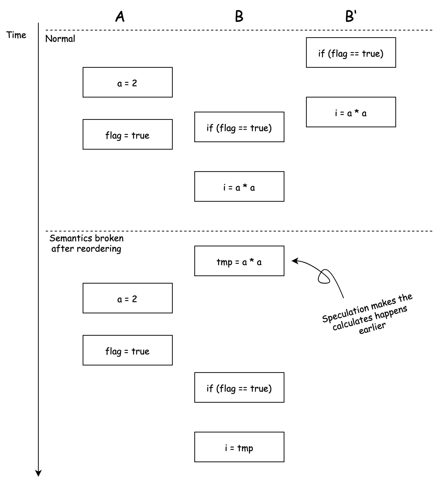
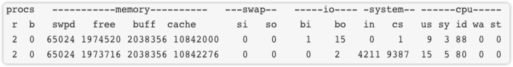
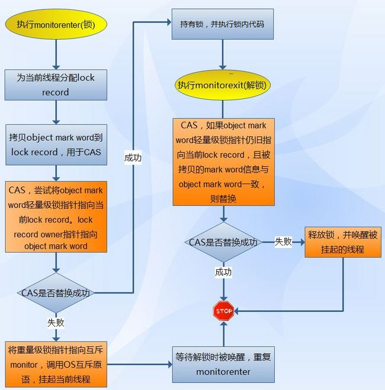

# Java::Concurrency

## 指令重排的目的是什么？

编译器和处理器为了 **优化程序性能** 而对指令序列进行重新排序的手段。

如：CPU 可以并行执行某些指令。

## 指令重排会有什么问题？

在约束条件下（数据、控制依赖），单线程的指令重排不会造成问题，而多线程情况下会。

**问题在于多线程**：对于多线程，指令在线程 A 进行重排，导致变量初始化、修改的顺序改变，并发时 B 线程可能在这个不正确的顺序中读取未正确赋值的变量，导致程序在多线程情况下语义被破坏。

```java
// thread A
a = 1;
flag = true;

// thread B
if (flag == true) {
  int i = a * a;
}
```

> The default value for `a` is `0`.



> B' 代表另一种情况，也是正常的情况。但是引入重排之后，B 的结果变得不正确，改变了程序的语义。此时应该有 `i = a * a = 4` 而非 `0`。 

## 指令重排的分类有哪些？

1. 编译器重排
2. 处理器重排
   1. 指令级并行重排
   2. 内存重排

## 指令重排的约束是什么？

在单线程、单处理器时，

1. 数据依赖不重排：编译器或处理器不会改变数据依赖的指令的执行顺序。
2. 控制依赖可能重排：编译器和处理器会通过 *猜测（Speculation）* 来重排语句使得可以并发。

## 数据依赖分类有哪些？

名称|代码示例
---|---
读后写|a = b;<br />b = 2;
写后写|b = 1;<br />b = 2;
写后读|b = 1;<br />a = b;

## final 域（字段） 的重排规则

保证了：有 `final` 域的对象，在被任何线程可见之前，已经正确的被初始化了，且该过程限制在构造器内部。包含了 编译器重排，处理器重排（通过内存屏障）。

### 1. 写

`final` 字段赋值，happens-before 对象引用赋值。 `final` 域写之后插入 `StoreStore` 屏障。

```java
this.a = 1;
// StoreStore
// happens before
// 
obj = instance
```

> 保证了对象引用之前 final 域已经完成初始化完成

### 2. 读

包含 `final` 的对象的引用，happens-before 对 `final` 字段的引用。`final` 域读之前插入 `LoadLoad` 屏障

```java
obj = instance;
// happens before
// ...
// LoadLoad
obj.a
```

### 3. 对于引用类型的写

`final` 引用类型的 **成员的写**，happens before **对象的读**。

---

> 假设：
>
> - `this.a` 是构造器内部
> - `instance` 是堆中的对象
> - `obj` 是对对象的引用

---

**原文：**

1. 在构造函数内对一个 `final` 域的 **写入**，与随后把这个被构造对象的引用赋值给一个引用变量，这两个操作之间不能重排。
2. 初次读一个包含 `final` 域的对象的引用，与随后初次 **读** 这个 `final` 域，这两个操作之间不能重排。

## final 域的重排规则前提是什么？

不能有 `this` 溢出。

如果有 `this` 溢出，则可能在重排后导致构造器还没有结束，就对 `final` 字段进行了引用，破坏了 `final` 的语义。

```java
class FinalEscape {
    public final int a;
    static FinalEscape obj;

	public FinalEscape() {
        a = 1;
        obj = this;
    }

    public static void writer() {
        obj = new FinalEscape();
    }

    public static void reader() {
        int a = obj.a;
    }
}
```

开启两个线程，writer 线程启动后，运行 reader 线程。重排后，构造器可能出现

```java
obj = this;
// reader here, reads a
a = 1;
```

则 `reader` 可能读到 `a` 初始化之前的值，破坏了程序语义。

而在 `this` 没有逃逸的基础上，`reader` 线程在获取 `obj` 引用时，一定已经初始化完成。

## 是否所有处理器都会为 final 插入内存屏障？

不是的，对于 x86 的架构，就不会插入任何内存屏障。

## 为什么要增强 final 域的语义？

在早期的版本中，线程可能看到 `final` 域的值发生改变：未初始化的值改变为初始化的值。为了修复这个 BUG，便增强了 `final` 的语义。在不使用 **同步**（`lock`, `volatile`）的情况下，保证任意线程能都能看到 `final` 域初始化之后的值。

## 多线程是否总比单线程快

不是。多线程会有 **创建线程，上下文切换** 的开销，当任务量小时，CPU 单核时可能单线程比多线程更快。

## 如何减少上下文切换

1. **无锁并发编程**：类似 MapReduce 方法，当数据没有依赖关系时，可以并发。
2. **CAS 算法**：利用 Compare And Swap。
3. **最少线程**：避免创建不必要的线程，否则会造成大量线程 WAITING。
4. **协程**：单线程里面处理多任务调度，并在单线程中维持多个任务的切换。

## vmstat 工具

是一款 Linux/Unix 监控工具

```bash
vmstat interval count
```

- interval: 采集间隔，单位 s。e.g 2s 采集一次
- count： 采集多少次。默认无限采集，知道 <kbd>ctrl-c</kbd>

**结果如下**



**procs**

- **r**: number of runnable proccess count, running ant waiting.
- **b**: blocked proccess count, number of uninterruptable sleep.

**memory:**

- **swpd**: amount of swap used, in bytes
- **free**: 
- **buff**: amount of memory used as buffer
- **cache**: amount of memory used as cache

**swap:**

- **si**: amount of memory swapped in from disk (/s)
- **so**: amount of memory swapped out to disk (/s)

**io:**

- **bi**: blocks read in from a block device (blocks/s)
- **bo**: blocks write out to a block device (blocks/s)

**system:**

- **in**: interrupts per second, including the clock
- **cs**: number of context switch per second

**cpu:**

- **us**: user time, non-kernel
- **sy**: kernel time
- **id**: ide time, including IO-waiting time
- **wa**: IO-waiting time
- **st**: stolen time of virtual machine (what ???)

> us + sy + id = 100

## CAS 是什么？

Compare And Swap。乐观锁，读-改-写。利用 3 个操作数：内存地址 V, 旧的预期值 A，新的目标值 B。当设置 B 时，检查 V 对应的值是否与 A 相等，如果相等，则设置为 B，否则循环 CAS 算法（称自旋）。CAS 的原子性，由 CPU 指令（e.g. lock 前缀）保证。Java 中通过包 `java.util.concurrent.atomic` 提供的 `compareAndSet` 方法来实现，如

```java
AtomicInteger at = new AtomicInteger(0);
int prev = at.getAndIncrement();
```

**缺点：**

1. 不能检测到 ABA 问题。可以通过 `AtomicStampedReference` 加版本号解决。
2. 只能保证一个共享变量的原子性。Java 1.5 以后，可以通过 `AtomicReference` 将多个变量放入对象中，保证原子性
3. 循环的开销可能很大（自旋），如果修改频繁，会导致一直循环。（因为 CAS 是乐观锁，认为竞争的情况很少）

> 上例中，利用类自带的方法将整数+1并返回原来的值，这个过程也可以通过 `synchronized` 实现。

**另一个例子**

自定义修改的一个 CAS 操作例子。

```java
while (true) {
  int old = at.get();
  // do something with old and get newVal
  int newVal = doSthWith(old);
  boolean success = at.compareAndSet(old, newVal);
	if (success) break;
}
```

## 处理器是如何实现原子操作的？

1. 使用总线锁
2. 使用缓存锁

## 什么是总线锁？

通过在总线上 *声言*（传播）`LOCK#` 信号。锁定总线会导致其他 CPU 无法访问内存，内存由发出信号的 CPU 独占。所以总线锁的开销较大。

## 什么是缓存锁？

解决总线锁开销较大问题。

对 *缓存行* （CPU 操作缓存的最小单位）进行锁定。当有多个 CPU 对相同内存地址的缓存行进行写操作时，会使用 *缓存一致性机制*，阻止两个及以上 CPU 对内存的数据修改。

> 不是所有 CPU 都支持缓存锁，若不支持则只能使用总线锁。

## 什么情况下 CPU 不会使用缓存锁？

1. 操作数据不能被缓存
2. 操作数据超过一个缓存行
3. 处理器不支持缓存锁

## Java 锁 todo

存放在哪里

minitor 是什么

## Java 锁状态有哪些？

级别从低到高

1. 无锁
2. 偏向锁
3. 轻量级锁
4. 重量级锁

> 锁级别只能提升，不能降低，避免无限所竞争（CAS 死循环）。

## 什么是偏向锁？

偏向某线程的锁。当线程执行同步代码块时会通过 CAS 将对象头的 偏向锁 置为 1，并执行代码块。

### 撤销

**偏向锁是等到出现竞争，才释放锁**。当另一个线程访问偏向锁的对象是，会先尝试 CAS 获取偏向锁。如果获取失败，则检查偏向的线程是否终止（terminated），若终止，则设置为当前线程（或置空，当对象不适合偏向锁），若未终止，则等待线程执行。

### 偏向锁设置

- `-XX:BiasedLockingStartupDelay` 默认，偏向锁在应用启动几秒后执行，该设置可以设置延迟时间。
- `-XX:UseBiasedLocking=true` 默认开启偏向锁，可以通过 `false` 关闭，关闭后，程序进入 *轻量级锁*。

```bash
java -XX:BiasedLockingStartupDelay=0 -XX:UseBaisedLocking=false ClassName
```

> 偏向锁不适合竞争频繁的应用。

## 什么是轻量级锁？

### 加锁

1. JVM 在当前线程栈帧中创建 **存储空间**，以存储 *锁记录* 称，Displaced Mark Word）。
2. 将对象头中的 Mark Word 拷贝到锁记录
3. 使用 CAS 将 Mark Word 替换为指向锁记录的指针
4. 如果成功则获取锁成功
5. 如果失败则自旋 CAS 获取锁，若获取锁失败，则 *膨胀* 为 ***重量级锁***，随后进入阻塞而 **睡眠**

> 自旋失败的条件是什么？

### 解锁

1. 利用 CAS 将 Displaced Mark Word 拷贝回 Mark Word
2. 成功则表示没有竞争
3. 失败则表示有竞争，意味着锁已经膨胀为重量级锁，释放锁并唤醒因为重量级锁而随眠的线程。



### See More

- [Java轻量级锁原理详解(Lightweight Locking)](https://blog.csdn.net/qq_35124535/article/details/70312553)
- [Java并发编程：Synchronized底层优化（偏向锁、轻量级锁](https://www.cnblogs.com/paddix/p/5405678.html)

## 什么是重量级锁？

基于操作系统的 *排他锁*（Mutex Lock），线程会进入阻塞状态，等待释放资源锁唤醒。此时会有用户态到核心态的转换、运行到睡眠的上下文切换，开销大。

## synchronized 优化机制 todo


## 指令重排有哪些？


## 什么是内存屏障，有什么作用，JMM 中的分类？


## 为什么单例模式需要用到 volatile


## happens-before


> It should be noted that the presence of a *happens-before* relationship between two actions does not necessarily imply that they have to take place in that order in an implementation. If the reordering produces results consistent with a legal execution, it is not illegal.
>
> > For example, the write of a default value to every field of an object constructed by a thread need not happen before the beginning of that thread, as long as no read ever observes that fact.

- [Chapter 17. Threads and Locks](https://docs.oracle.com/javase/specs/jls/se7/html/jls-17.html#jls-17.4.5-200)

## 内存屏障有哪些？


## 对线程来说，同步、通信分别代表什么？


## 内存可见性：写、读主存发生在什么时候？

1. 释放锁时、`volatile` 写之后，会将共享变量写入主存。
2. 获取锁是、`volatile` 读时，会将线程本地内存的共享变量置为无效，时线程去主存读取。

> 1. 也就是 **除非有修改**，否则线程仍然读取的是本地内存的数据。
> 2. 锁的释放、获取，实际上也可以看做通过主存进行 **消息传递** 的过程。


## AQS

AbstractQueuedSynchronizer 抽象队列同步器。

利用一个整型的 `volatile` 变量 `state` 来维护状态。

## ReentrantLock

基于 AQS

# Java::Concurrency-todo

