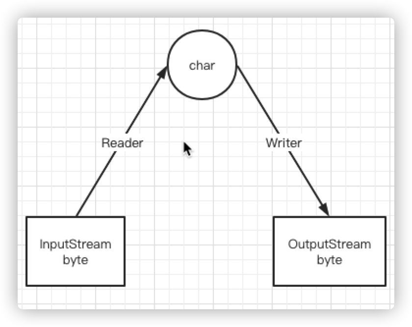
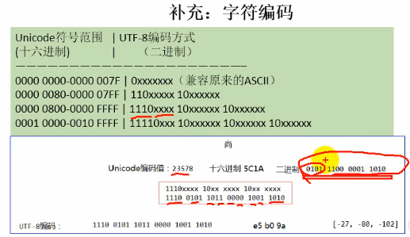

# Java

## Checked Exception

检查异常，需要 catch 或者 throws 的异常，与之对应的是 Unchecked Exception

Checked Exception 指的是编译器负责检查的异常，这种错误与运行环境无关，如 IOException，无论是什么环境，文件都可能不存在，则编译器要求必须显示处理这种异常。

Unchecked Exception 是指运行时的异常，包括 Error 和 RuntimeException

Throwable 但是 非 Error 或 RuntimeException 的，都被认为是 checked 异常

> For the purposes of compile-time checking of exceptions, `Throwable` and any subclass of `Throwable` that is not also a subclass of either `RuntimeException` or `Error` are regarded as checked exceptions.

## 关键字 volatile 作用

1. 保证内存可见：少量线程、非频繁写，多数线程读的情况
2. 禁止指令重排

## IO: File

包含文件或目录的信息，类似 `stat` 命令。不包含文件内容。

### 构造器

```java
File(String pathname);
File(String parent, String child);
File(File   parent, String child);
```

### 接口

1. `String[] list` 子文件、目录名。在文件上调用，返回 null
2. `File[] listFiles`
3. `boolean renameTo(File dest)` Move if the dest is not exists
4. `boolean createNewFile`: create if not exists
5. `boolean mkdir`: create if not exists
6. `boolean mkdirs` create if not exists with the parents.
7. `boolean delete`: delete file or directory if exists. **目录时，必须为空**

> 以上 `boolean` 返回，`true` 为操作成功

## IO 流（stream）的分类

1. **数据单位：** 字节流（8 bit, `byte`, 图片）、字符流（16 bit, `char`, 文本）
2. **传输方向：** 输入流、输出流
3. **角色：** 节点流（连接端到端，`FileInputStream`）、处理流（装饰器模式，`BufferedInputStream`）

> `char` 和 `short` 都是 16 bit

| 抽象基类 | 字节流       | 字符流 |
| -------- | ------------ | ------ |
| 输入流   | InputStream  | Reader |
| 输出流   | OutputStream | Writer |

## IO 流的体系结构，包含哪些类

| 抽象类型     | 节点流           | 缓冲流（处理流）     |
| ------------ | ---------------- | -------------------- |
| InputStream  | FileInputStream  | BufferedInputStream  |
| OutputStream | FileOutputStream | BufferedOutputStream |
| Reader       | FileReader       | BufferedReader       |
| Writer       | FileWriter       | BufferedWriter       |

## IO: FileReader 能处理图片吗？

不能。FileReader 属于字符流，只能处理文本文件

## IO：为什么 缓冲流 能提高读写速度

缓冲流：`BufferedInputStream`, `BufferedOutputStream`, `BufferedReader`, `BufferedWriter`

`BufferedXxx` 默认都使用了 1024 * 8 = 8192 bytes or chars 的内部缓冲区（`byte[] buf`, `char[] char`），使用 `offset` 和 `count` 进行偏移和计数。每次 `read` 时，判断 `buf` 是否足够，只有当 `buf` 不够时才访问磁盘，每次都从磁盘直接读取 8192 字节。减少磁盘 I/O 次数，从而提速。

如果读取长度 >= 8192，则 `BufferedInputStream` 与 `FileInputStream` 速度相同。

## BufferedOutputStream.flush 的作用是什么

将 `buf` 写入磁盘

## BufferedReader & BufferedWriter 专有方法

### BufferedReader

```java
String readLine(void)
```

读出数据不包含换行符

### BufferedWrite

利用 `readLine` 读取时无换行符，`write` 时则需要手动添加换行符

```java
void newLine(void)
```

## IO：转换流，是做什么的，怎么转换？

转换流是字节与字符之间的转换

- `InputStreamReader`: 字节转字符, read input stream
- `InputStreamWriter`: 字符转字节, write output stream

可以用于文件字符集转换

  

```java
FileInputStream is = new FileInputStream("file.txt");
// 指定输入流字节流，应该被当做什么字符集
// 默认值由 VM 决定（也依赖操作系统等）
InputStreamReader sr = new InputStreamReader(is, "GBK");

FileOutputStream os = new FileOutputStream("out.txt", "UTF-8");
OutputStreamWriter sw = new OutputStreamWriter(os);

char[] buf = new char[10];
while ((len = sr.read(buf)) != -1) {
    sw.write(buf, 0, len);
}

close all streams
```

> - buf 是字符型，is 是字节型
> - `FileWriter extends OutputStreamWriter`, similar to `FileReader`

## 文本字符集 UTF-8/UTF-16/UTF-32 区别

- UTF-8：8 bit 为单位，变长 1-4 bytes，前导 1 表示某字符占用单位数（8bit）(emoji 使用 4bytes，目前最多支持 6 bytes)
- UTF-16： 16 bit 为单位，变长，占用 2 或 4 字节
- UTF-32：固定使用 32 bits = 4bytes 存储，空间换时间

  

## IO: stdin/stdout/err

```java
class System {
    InputStream in
    PrintStream out
    PrintStream err
}
```

> 是字节流

### 重定向

```java
System.setIn(InputStream in)
System.setOut(PrintStream out)
System.setErr(PrintStream err)
```

## IO: 从控制台读入数据的方法

```java
BufferedReader br = new BufferedReader(
    new InputStreamReader(System.in)
);
br.readLine();
```

## IO: 打印流

- `PrintStream`：自动 `flush`，只接受 `OutputStream` 作为构造器输出流
- `PrintWriter`：不自动 `flush`，接受 `Writer` 与 `OutputStream` 作为构造输出流

当两者使用 `OutputStream` 时，行为类似，都使用了 `BufferedWriter`, `OutputStreamWriter`.

```java
new BufferedWriter(
    new OutputStreamWriter(
        inputStream
    )
)
```

## IO: 数据流

- DataInputStream
- DataOutputStream

处理流，用于读写 基本数据类型 和 String 数据，先写先读。

- `writeUTF` 使用 UTF-8 写字符串

## IO: 对象流 (Object Stream)

- ObjectInputStream
- ObjectOutputStream

可以保存基本类型与对象，利用**序列化与反序列化**实现。

```java
ObjectInputStream.readObject();
ObjectInputStream.readByte();
```

## IO: 序列化

必须实现的其中一个接口

- Serializable
- Externalizable

其中 `Externalizable` 定义如下

```java
public interface Externalizable extends java.io.Serializable {
    void writeExternal(ObjectOutput out);
    void readExternal(ObjectInput in);
}
```

`Serializable` 使用了反射机制调用 `writeObject`, `readObject` 方法，所以效率更低。

- Externalizable 必须有无参构造器

```java
interface Serializable {
    ANY-ACCESS-MODIFIER static final long serialVersionUID = 42L;
}
```

无法序列化以下修饰的属性

- `static`
- `transient`
- `@Transient`

## IO: 有 readLine 的类有哪些

- BufferedReader

## IO: RandomAccessFile

可以输入也可以输出，随机存取文件。类似 `open`。

```java
RandomAccessFile raf = new RandomAccessFile("file.txt", "rw");

raf.read(buffer);
raf.write(buffer, 0, len);
```

### mode

- r
- rw
- rwd: 读写并同步内容更新
- rws: 读写并同步内容和元数据的更新

### methods

- `seek(long pos)`, similar to `seek` in C

## IO: Scanner

## IO: ByteArray Input & Output Stream

节点流

- `ByteArrayInputStream`
- `ByteArrayOutputStream`

内部使用 `byte[]` 存储读取到的字节。可以利用这个数组进行对象序列化之后的临时存储、传递

```java
ByteArrayOutputStream os = new ByteArrayOutputStream();

ObjectOutputStream oos = new ObjectOutputStream(os);

oos.writeObject(someObject);
```

通过 `ByteArrayInputStream` 将 `byte[]` 传递给他进行 `readObject` 操作。
