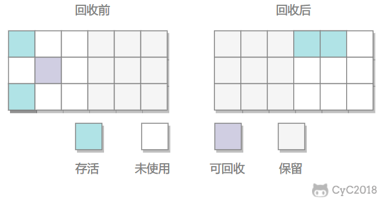

# Java

## Checked Exception

检查异常，需要 catch 或者 throws 的异常，与之对应的是 Unchecked Exception

Checked Exception 指的是编译器负责检查的异常，这种错误与运行环境无关，如 IOException，无论是什么环境，文件都可能不存在，则编译器要求必须显示处理这种异常。

Unchecked Exception 是指运行时的异常，包括 Error 和 RuntimeException

Throwable 但是 非 Error 或 RuntimeException 的，都被认为是 checked 异常

> For the purposes of compile-time checking of exceptions, `Throwable` and any subclass of `Throwable` that is not also a subclass of either `RuntimeException` or `Error` are regarded as checked exceptions.

## 关键字 volatile 作用

1. 保证内存可见：少量线程、非频繁写，多数线程读的情况
2. 禁止指令重排

`volatile` 在 JVM 会生成一条 `lock` 指令，该指令会引起处理器缓存会写到内存，当其他线程读时，会将本地内存置为无效，然后只接读主存。

> 访问 `volatile` 变量时，总是绕过处理器缓存，从主内存读取，同时导致其他非 `volatile` 的变量也从主内存中刷新到缓存。

## IO: File

包含文件或目录的信息，类似 `stat` 命令。不包含文件内容。

### 构造器

```java
File(String pathname);
File(String parent, String child);
File(File   parent, String child);
```

### 接口

1. `String[] list` 子文件、目录名。在文件上调用，返回 null
2. `File[] listFiles`
3. `boolean renameTo(File dest)` Move if the dest is not exists
4. `boolean createNewFile`: create if not exists
5. `boolean mkdir`: create if not exists
6. `boolean mkdirs` create if not exists with the parents.
7. `boolean delete`: delete file or directory if exists. **目录时，必须为空**

> 以上 `boolean` 返回，`true` 为操作成功

## IO: 怎么创建一个文件

```java
File file = new File("filenanme.txt");
file.createNewFile();
```

> 文件不存在时创建。

## IO 流（stream）的分类

1. **数据单位：** 字节流（8 bit, `byte`, 图片）、字符流（16 bit, `char`, 文本）
2. **传输方向：** 输入流、输出流
3. **角色：** 节点流（连接端到端，`FileInputStream`）、处理流（装饰器模式，`BufferedInputStream`）

> `char` 和 `short` 都是 16 bit

| 抽象基类 | 字节流       | 字符流 |
| -------- | ------------ | ------ |
| 输入流   | InputStream  | Reader |
| 输出流   | OutputStream | Writer |

## IO 流的体系结构，包含哪些类

| 抽象类型     | 节点流           | 缓冲流（处理流）     |
| ------------ | ---------------- | -------------------- |
| InputStream  | FileInputStream  | BufferedInputStream  |
| OutputStream | FileOutputStream | BufferedOutputStream |
| Reader       | FileReader       | BufferedReader       |
| Writer       | FileWriter       | BufferedWriter       |

## IO: FileReader 能处理图片吗？

不能。FileReader 属于字符流，只能处理文本文件

## IO：为什么 缓冲流 能提高读写速度

缓冲流：`BufferedInputStream`, `BufferedOutputStream`, `BufferedReader`, `BufferedWriter`

`BufferedXxx` 默认都使用了 1024 * 8 = 8192 bytes or chars 的内部缓冲区（`byte[] buf`, `char[] char`），使用 `offset` 和 `count` 进行偏移和计数。每次 `read` 时，判断 `buf` 是否足够，只有当 `buf` 不够时才访问磁盘，每次都从磁盘直接读取 8192 字节。减少磁盘 I/O 次数，从而提速。

如果读取长度 >= 8192，则 `BufferedInputStream` 与 `FileInputStream` 速度相同。

## BufferedOutputStream.flush 的作用是什么

将 `buf` 写入磁盘

## BufferedReader & BufferedWriter 专有方法

### BufferedReader

```java
String readLine(void)
```

读出数据不包含换行符

### BufferedWrite

利用 `readLine` 读取时无换行符，`write` 时则需要手动添加换行符

```java
void newLine(void)
```

## IO：转换流，是做什么的，怎么转换？

转换流是字节与字符之间的转换

- `InputStreamReader`: 字节转字符, read input stream
- `InputStreamWriter`: 字符转字节, write output stream

可以用于文件字符集转换

  

```java
FileInputStream is = new FileInputStream("file.txt");
// 指定输入流字节流，应该被当做什么字符集
// 默认值由 VM 决定（也依赖操作系统等）
InputStreamReader sr = new InputStreamReader(is, "GBK");

FileOutputStream os = new FileOutputStream("out.txt", "UTF-8");
OutputStreamWriter sw = new OutputStreamWriter(os);

char[] buf = new char[10];
while ((len = sr.read(buf)) != -1) {
    sw.write(buf, 0, len);
}

close all streams
```

> - buf 是字符型，is 是字节型
> - `FileWriter extends OutputStreamWriter`, similar to `FileReader`

## 文本字符集 UTF-8/UTF-16/UTF-32 区别

- UTF-8：8 bit 为单位，变长 1-4 bytes，前导 1 表示某字符占用单位数（8bit）(emoji 使用 4bytes，目前最多支持 6 bytes)
- UTF-16： 16 bit 为单位，变长，占用 2 或 4 字节
- UTF-32：固定使用 32 bits = 4bytes 存储，空间换时间

  

## IO: stdin/stdout/err

```java
class System {
    InputStream in
    PrintStream out
    PrintStream err
}
```

> 是字节流

### 重定向

```java
System.setIn(InputStream in)
System.setOut(PrintStream out)
System.setErr(PrintStream err)
```

## IO: 从控制台读入数据的方法

```java
BufferedReader br = new BufferedReader(
    new InputStreamReader(System.in)
);
br.readLine();
```

## IO: 打印流

- `PrintStream`：自动 `flush`，只接受 `OutputStream` 作为构造器输出流
- `PrintWriter`：不自动 `flush`，接受 `Writer` 与 `OutputStream` 作为构造输出流

当两者使用 `OutputStream` 时，行为类似，都使用了 `BufferedWriter`, `OutputStreamWriter`.

```java
new BufferedWriter(
    new OutputStreamWriter(
        outputStream
    )
)
```

## IO: 数据流

- DataInputStream
- DataOutputStream

处理流，用于读写 基本数据类型 和 String 数据，先写先读。

- `writeUTF` 使用 UTF-8 写字符串

## 怎么写出 UTF-8 的字符串？

使用 `writeUTF()` 方法。有该方法的类：

1. `DataOutputStream`
2. `ObjectOutputStream`

## IO: 对象流 (Object Stream)

- ObjectInputStream
- ObjectOutputStream

可以保存基本类型与对象，利用**序列化与反序列化**实现。

```java
ObjectInputStream.readObject();
ObjectInputStream.readByte();
```

## IO: 序列化

必须实现的其中一个接口

- Serializable
- Externalizable

其中 `Externalizable` 定义如下

```java
public interface Externalizable extends java.io.Serializable {
    void writeExternal(ObjectOutput out);
    void readExternal(ObjectInput in);
}
```

而 Serializable 自定序列化与反序列化过程是通过方法

```java
public void writeObject(ObjectOutputStream outputStream);
public void readObject(ObjectInputStream inputStream);
```

> - `Serializable` 使用了反射机制调用 `writeObject`, `readObject` 方法，所以效率更低。
> - `Externalizable` 必须有无参构造器

### serialVersionUID

类的版本号，默认由类的信息计算得到，任何修改都将改变该值。

```java
interface Serializable {
    ANY-ACCESS-MODIFIER static final long serialVersionUID = 42L;
}
```

无法序列化以下修饰的属性

- `static`
- `transient`
- `@Transient`

## IO: 反序列化

当类实现了 `Serializable` 接口时，JVM 会在继承树上寻找第一个 **未** 实现 `Serializable` 的构造器，开始向上执行构造，而不论而后的类是否实现了 `Serializable` 接口。

```java
class Grandparent implements Serializable {}
class Parent extends Grandparent{}
class Child extends Parent implements Serializable {}
```

上例中，当反序列化时，`Child` 本类实例的数据将被恢复，并且 `Parent` 和 `Grandparent` 的构造器将会被依次执行（优先构造父类的原则）。

而当类实现的是 `Externalizable` 接口时，**该类必须有无参构造器**，否则将抛出如下异常

```
java.io.InvalidClassException: cn.exmple.Test; no valid constructor
```

> 当类同时实现了 `Externalizable` 和 `Serializable` 接口时，也必须包含无参构造器。此时延其继承树，父类构造器将被调用。

## IO: 反序列化时，假设类没有设置 serialVersionUID, 而类进行了修改后，如何兼容以前序列化后的类？

当类修改后，`serialVersionUID` 将被重新计算，此时可以将类的 `serialVersionUID` 显式地设置为修改前的值。可以通过两种方式获取该值：

1. 反序列化时的异常信息会包含期望的值
2. 通过 Java 工具命令 `serialver`

```java
serialver package.to.ClassName
```

## IO: 反序列化时，如果类增加了属性，这些属性的默认值是多少？

默认值为空

## IO: 有 readLine 的类有哪些

- BufferedReader

## IO: RandomAccessFile

可以输入也可以输出，随机存取文件。类似 `open`。

```java
RandomAccessFile raf = new RandomAccessFile("file.txt", "rw");

raf.read(buffer);
raf.write(buffer, 0, len);
```

### mode

- r
- rw
- rwd: 读写并同步内容更新
- rws: 读写并同步内容和元数据的更新

### methods

- `seek(long pos)`, similar to `seek` in C

## 随机存储文件用什么类？

RandomAccessFile

```java
RandomAccessFile raf = new RandomAccessFile("file.txt", "rw");

raf.read(buffer);
raf.write(buffer, 0, len);
```

## IO: ByteArray Input & Output Stream

节点流

- `ByteArrayInputStream`：`read()` 获取到 `byte[]`。
- `ByteArrayOutputStream`：可以通过 `toByteArray()` 获取到 `byte[]` 的拷贝。

内部使用 `byte[]` 存储读取到的字节。可以利用这个数组进行对象序列化之后的临时存储、传递。

```java
ByteArrayOutputStream os = new ByteArrayOutputStream();

ObjectOutputStream oos = new ObjectOutputStream(os);

oos.writeObject(someObject);
```

之后再通过 `ByteArrayInputStream` 和 `ObjectInputStream` 进行 `readObject` 操作。

```java
ByteArrayInputStream bais = new ByteArrayInputStream(os.toByteArray());
ObjectInputStream ois = new ObjectInputStream(bais);
ois.readObject();
```

> `readObject` 时可能抛出 `ClassNotFoundException`

## 什么是 BIO ?

在读写数据时，线程阻塞等待 I/O 完成。

## 什么是 AIO ?

JDK 1.7 发布，也称 NIO 2。事件驱动，专门的程序处理 I/O，当某个 I/O 完成时，恢复线程进行处理。

## 什么是 NIO ?

NIO: New IO, 又被称为 Non-Blocking IO，包名为 `java.nio`。

I/O 时，通过轮询查询 IO 是否完成，

### 历史

JDK 1.4 发布 NIO 1 (**NIO**, Non-blocking I/O)， JDK 7 发布 NIO 2 (**AIO**, Asynchronous I/O), NIO 之前的因为总是阻塞，所以称为 **BIO** (Blocking I/O)

### IO vs NIO

- IO 面向流
- NIO 面向<ins>**缓冲区**</ins>，基于<ins>**通道**</ins>，更加高效。

## NIO: Path 是什么

> java.nio.file

`Path` 是 `File` 的升级版，是一个接口，获取实例时，使用 `Paths` 工具类

```java
Path path = Paths.get("file");
// path to file
File file = path.toFile();
// or
Path path = file.toPath();
```

## 枚举类

```java
enum Alphabet {
    A(2, "a"),
    B(1, "b"),
    C(3, "c"),
    ;

    private final int code;
    private final String lower;

    Alphabet(
        int code,
        String lower
    ) {
        this.code = code;
        this.lower = lower;
    }
}
```

## 泛型方法调用

```java
obj.<User>doSth(user);
```

## Copy array

```java
public static native void arraycopy(
    Object src , int srcPos,
    Object dest, int destPos,
    int length
);
```

> `srcPos` and `destPos` are for starting position.

## IO: Scanner

从文件或输入流按格式输入，类似 `scanf`，其获取输入均为 `nextXxx` 方法。另外通过 `hasNextXxx`

应根据方法进行对应输入，否则抛出异常 `java.util.InputMisMatchException`。

Scanner 中 token 表示一个由 delimiter 分割的字符串。delimiter 可以使用 `useDelimiter` 进行修改，默认为 `\p{javaWhitespace}`，代表任何空白符（等价于 `\s+`）。

### APIs

- `String next()`: 获取下一个 token
- `String nextLine()`: 获取该行剩下的部分，不包含换行符
- `Scanner useDelimiter(Pattern pattern)`: 设置使用的分隔符，正则表达式
- `Scanner useDelimiter(String pattern)`: 调用时 `pattern` 转为正则表达式

```java
Scanner scan = new Scanner(System.in);

scan.nextInt(); // 
scan.next();    // String
scan.nextLine();
```

## 网络编程 Server

```java
import java.net.ServerSocket;
import java.net.Socket;

serverSocket = new ServerSocket(8090);
while (true) {
    Socket accept = serverSocket.accept();
    new Thread(() -> {
        accept.getInputStream();
        accept.getOutputStream();
        accept.close();
    }).start();
}
```

## 网络编程 Client

```java
import java.net.Socket;

InetAddress localhost = InetAddress.getByName("localhost");
try (
        Socket socket = new Socket(localhost, 8090);
        OutputStream outputStream = socket.getOutputStream();
) {
    outputStream.write("English 中文".getBytes(StandardCharsets.UTF_8));
}
```

## UDP Client

> Package: `java.net.*`

```java
// byte[] buf
// InetAddress address
socket = new DatagramSocket();
packet = new DatagramPacket(
   		 	buf, buf.length,
    		address, 4445
		);
socket.send(packet);

// blocks
socket.receive(packet);
// returns byte[]
packet.getData();
```

> 1. `receive` 时会阻塞。
> 2. address 在 packet 中指定

## UDP Server

> Package: `java.net.*`

```java
socket = new DatagramSocket(4445);

while (running) {
    packet = new DatagramPacket(buf, buf.length);
    socket.receive(packet);

    InetAddress address = packet.getAddress();
    int port = packet.getPort();
    packet = new DatagramPacket(
        		buf, buf.length, address, port
    		);
    String received 
        = new String(packet.getData(), 0, packet.getLength());

    if (received.equals("end")) {
        running = false;
        continue;
    }
    socket.send(packet);
}
socket.close();
```

UDP 无连接，服务器开启一个循环等待客户端发送数据报。通过 `packet.getData()` 得到客户端发送数据。发送数据时，创建一个带有目的地 IP 和 port 的 packet，通过 socket 发送出去。

## 网络编程中的 Socket 是什么？

一个 socket 代表网络通信的一个端点。

- getOutputStream
- getInputStream

## A 与 a 的 ASCII 码

- A: 65
- a: 97

## 数据类型转换

### char[] <-> String

```java
// char[] chars
String str = String.valueOf(chars);
chars = str.toCharArray();
```

### collection to another

collection 类都实现了通过构造器，转为其他类型的容器。

```java
CONSTRUCTOR(Collection<? extends E> c) {
	...
}
```

所以可以互相转换

```java
// Set<String> set
List<String> list = new ArrayList<>(set);
```

### collection -> array

所有集合都实现了 `Colelction.toArray(T[] arr)` 方法，该方法将集合转为数组并放入 `arr` 中， 然后返回剩余集合元素

```java
// Set<String> set;
String[] arr = set.toArray(new String[0]);
```

> `toArray(void)` 返回 `Object` 数组。

### array -> collection

首先转成 `List`，再利用容器间的相互转换。

```java
// String[] arr
List<String> list = Arrays.asList(arr);
Set<String> set = new HashSet<>(list);
```

> `asList` 参数是泛型，只能传对象，不能是原始数据类型。如 `asList(int[])` 会把 `int[]` 当做 `asList` 的唯一元素。

## 怎么把 int array 转成 List&lt;Integer>？

Java 没有内置原始数组转成列表的方法。

## StringBuilder.delete 有哪些？

```java
// start, inclusive
// end, exclusive
delete(start, end);

deleteCharAt(offset);
```

## Arrays.sort 能不能自定义基本数据类型的排序？

不能，因为泛型不能用于基本数据类型。

```java
public static void sort(short[] a, int fromIndex, int toIndex);

public static <T> void sort(T[] a, Comparator<? super T> c);
```

## Java 中局部变量与类/对象变量的默认值

1. 局部变量：没有默认值
2. 类/对象：默认为“空“

| type                     | value |
| ------------------------ | ----- |
| byte/short/char/int/long | 0     |
| float/double             | 0.0   |
| boolean                  | false |

## Java 中的隐含展开是什么意思

隐式放大、显式缩小

```java
int i = 1;
long l = i;
float f = l;
double d = f;
```

## 什么是多态

多态是指对象有多种形态，即一个对象可以看做是它本身，也可以看做是它的父类的实例。声明的数据类型可以使用其子类实例代替，此时声明的类型是真实类型的多态形式


**例子：**

```java
// Dog implements Animal
// Cat implements Animal
Animal a;
Dog d = new Dog();
Cat a = new Cat();
a = d; // a 是 d 的多态形式
a = c; // a 是 c 的多态形式
```

此时 `a` 可以代表任何 `Animal` 的子类实例。

```java
// a can be any instance of sub class of A
public void hug(Animal a);
...
hug(new Dog);
hug(new Cat);
```

## 为什么 Java 不支持多重继承

因为多重继承有致命方块问题。


## Java 构造器能否继承？

不能。如果子类没有构造器，编译器会自动加上无参构造器；如果子类有构造器，则子类构造器有两种情况

1. 调用了 `super()` 或 `this()`，则调用必须在第一行
2. 否则，编译器会自动在构造器第一行添加无参构造器 `super()`

也就是，**父类总在子类之前构造完成**，保证父类的完整性（不会出现只实例化一半的情形）。

## javax 下的包是什么？

`javax` 为 Java 的标准扩展，Java standard eXtension。由于历史原因，从 JDK 1.2 开始，将新的标准库放入 `javax` 包下。

## abstract 类有没有构造器？

`abstract` 类与普通类相同，也有构造器。

## 创建类的实例有几种方法？

3 种。

1. new
2. serializable
3. reflection: newInstance

## 静态 final 变量是在什么时候初始化？

1. 声明时
2. 静态代码块中

## final 非静态变量能出现在哪些地方？

final 修饰的变量表示一旦初始化，便不能修改

1. 实例变量
2. 局部变量
3. **方法参数**

## auto boxing and unboxing 由谁完成？

编译器

## 字符串格式化时，模板中 '&lt;' 表示什么？

表示使用上一个参数。

```java
String.format("%d %<d", 1)
```

上例中模板参数只有一个，值为 `1`。第二个 `%<d` 便使用了前一个占位的参数。

## 日期的获取与计算

1. 日期获取：`Date`
2. 日期计算：`Canlendar`

```java
// return java.util.GregorianCanlender
Canlendar.getInstance();
```

## try...catch...finally 中的 return 规则

无论 `try...catch` 是否 `return`，都会执行 `finally`，如果 `finally` 同样执行了 `return`， 则以后则为准。

## 怎么理解类与对象的锁？

每一个类（被加载后）或者对象都有一把锁，默认情况下锁为打开状态，任何线程都能访问。当给对象、类加锁时，则其他线程在访问临界资源时，将不阻塞。

## 泛型之间是否有继承关系？

没有。例如

```java
class Animal {}
class Dog extends Animal {}
class Cat extends Animal {}
```

`ArrayList<Dog>` 与 `ArrayList<Animal>` 没有关系

```java
public void takeAnimal(ArrayList<Animal> animals);
// Cannot be called with dogs
ArrayList<Dog> dogs = new ArrayList<>();
// Compile error
takeAnimal(dogs);
```

## 线程的状态及转移条件？

Java 中线程可以分为 6 中状态

1. **New，新建**：调用 `new Thread` 之后 ， `start()` 之前。
2. **Runable，可运行**：`start()` 之后进入，包含了运行和就绪两种状态，Java 规范没有对其做区分。
3. **Blocked，阻塞**：为了等待锁或 I/O 而进入 **被动** 睡眠。
4. **Waiting，等待**：**主动** 进入睡眠，等待信号。
5. **Timed Wating，计时等待**：主动进入睡眠，等待超时或者信号。
6. **Terminated，终止**：`run` 退出或由于异常而意外退出。


## 什么是 Class 类？

`Class` 类包含了所有 Java 类型的信息。每一个 Java 类型都与一个 `Class` 实例对应，包括基本数据类型。三种实例获取方式

```java
Employee e;
Class c1, c2, c3, c4;

// 方法一：通过实例获取
c1 = e.getClass();
// 方法二：通过全类名
c2 = Class.forName("package.to.ClassName");
// 方法三：通过类型
c3 = ClassName.class;
c4 = int.class
```

> 特别注意：基本数据类型也对应 `Class` 实例。

## 术语：参数

- Local Variables
- Formal Method Parameters
- Exception Handler Parameters

## 常量会触发类加载吗？

不会。

常量在编译时通过 *传播优化*，将常量值存储到调用类的常量池中，所以在运行时，调用类与被调用的类已经没有关系了。

例如

```java
class ConstClass {
  public final static int TYPE = 1;
}

class Caller {
  public void go() {
    int type = ConstClass.TYPE;
  }
}

// After being compiled
class Class {
  public void go() {
    int type = 1;
  }
}
```

## 类加载的时机

《Java 虚拟机规范》没有进行强制约束，由虚拟机具体实现自由把握。

## 描述一下类的加载机制，有哪些阶段？


1. Loading：加载
2. Verification：验证
3. Preparation: 准备
4. Resolution: 解析
5. Initialization: 初始化
6. Using: 使用
7. Unloading: 卸载

> 加载、验证、准备、初始化、卸载这 5 个阶段是顺序 **开始** 的，且通常互相之间有交叉地进行，如加载时验证。解析阶段顺序可变，可能在初始化之后。

## 类的加载机制：加载阶段

这个阶段 JVM 需要做的事：

1. 获取定义类的字节码字节流
2. 将字节流表示的静态存储结构转化为方法区的 runtime 数据结构（将二进制流存放在 **方法区** 中）
3. 在堆中生成对应的 Class 对象，作为方法区中这个类的各种数据访问入口

> 1 是程序员可控性最强的阶段，可以通过自定义 **类加载器** 读取类的二进制流（非数组）。

数组本身不能通过类加载器加载，其加载规则如下：

> 设数组类为 `C`，元素类型为 `E`，去掉一个维度之后的 *组件类型（Component Type）* 为 `D`。

1. `D` 为数组，则递归的加载。
2. `D` 为基本数据类型，则将 `C` 与 *启动类加载器（Bootstrap Class Loader）* 关联。
3. `C` 的可访问性，与 `D` 的可访问性一致。

## 类的加载机制：验证阶段

确保 Class 文件的字节流中包含的信息符合 JVM 要求，并且安全。大致分为 4 类。

1. **文件格式验证**
2. **元数据验证**：是否都有父类（Object 除外），父类是否有 final 修饰，抽象方法是否都实现了等
3. **字节码验证**：最复杂的阶段。通过 *数据流分析* 和 *控制流分析*，确定程序语义是否合法、符合逻辑。JDK6 之前通过对方法体分析得出结论（称：类型推导）；JDK6 - JDK7 新增默认 *类型检查*，通过新增属性 `StackMapTable` ； JDK 7 之后只允许 类型检查。
4. **符号引用验证**：这个阶段是在“解析阶段”发生。检查例如被引用的类是否能找到等。

## 类的加载机制：准备阶段

准备是为 **类的变量（`static` 静态变量）** 分配内存并设置初始值的过程。

初始值有两种情况：

1. 常量（`static final`）的初始值是声明值。
2. 非常量初始值为空。

> 事实上，普通静态变量的声明值会在 **编译后** 通过 `putstatic` 指令在 <ins>类的构造器</ins> `<clinit>()` *（Class Level Init）*中进行赋值。

## 类的加载机制：解析阶段

*符号引用（Symbolic References）* 转换为 *直接引用（Direct References）* 的过程。

JVM 没有规定解析触发的时机，但必须在 17 个指令之前。触发指令可以分为 “动态” 和 “静态” 两种。

- **动态**：使用 `invokedynamic` 指令，对同一符号引用可以多次解析。
- **静态**：对同一符号引用的解析进行缓存，其余指令触发时不再解析。

## 什么是符号引用

*符号引用（Symbolic References）* 是在 class 字节码中，以一组符号来描述所引用的目标，任何形式的字面量，只要使用时能无歧义地定位到目标即可。

其引用的目标不一定已经加载到了 JVM 内存。

## 什么是直接引用

*直接引用（Direct References）* 是指向真实目标的引用，该目标必定已经在 JVM 内存中，可以是

1. 指向目标的引用
2. 相对偏移量：数组偏移量、字段位置的偏移量
3. 能间接定位到目标的句柄

## 类的加载机制：初始化阶段 及 &lt;clinit>() 方法规则

初始化阶段是执行 *类初始化* 的过程，包括静态变量赋值、执行静态代码块。

在 `javac` 编译阶段，会收集类的 静态变量（不包括常量）的赋值动作、静态代码块，放入 `<clinit>()` 方法中。初始化阶段就是执行这个 `<clinit>()` 方法。

1. `<clinit>()` 是由 **编译器** 收集静态变量的赋值操作、静态代码块，**合并** 产生的。语句的顺序与源文件一致。
2. `<clinit>()` 执行之前，会执行父类 `<clinit>()` 方法，所以第一个执行的 `<clinit>` 一定属于 `Object`。（对比 `<init>()` 方法中会显示调用父类 `<init>()` 方法）
3. 若一个类没有静态字段赋值、静态代码块，则该类无 `<clinit>()`。
4. 接口字段使用时赋值：实现类、子接口的 `<clinit>()` 不会触发父接口的 `<clinit>()`，而是父接口的字段（常量）被使用时触发。
5. 初始化锁

## 类加载器


对任意一个类，都必须有类加载器和这个类本身一起共同确立其在 JVM 中的唯一性，每一个类加载器，都有一个独立的类名空间。

- **启动类加载器**：负责加载 `$JAVA_HOME/lib` 目录下的类库，或者使用 `-Xbootclasspath` 参数指定，并按照文件名（如 `rt.jar`）识别进行加载。
- **扩展类加载器**：负责加载 `$JAVA_HOME/lib/ext` 目录下的类库，允许存放自定义通用性类库以扩展 Java SE 的功能。
- **应用程序类加载器**：又称 “系统类加载器”，负责加载用户路径 `classpath` 目录下的类库。为应用程序中的默认类加载器。

## 什么是双亲委派模型


当一个类加载器加载某个类时，会先将请求委派给父加载器，最终到达顶层的 **启动类加载器**，只有当父类加载器无法找到这个类时，子加载器才会尝试自己加载。

> *双亲委派模型（Parents Delegation Model）*，并不是有两个父级，而是因为 parent 的翻译。除了启动类加载器，每个加载器都有一个父加载器。

## 自定义类加载器


```java
class MyClassLoader extends ClassLoader {
  public Class<?> loadClass() {
    Class<?> c = findLoadedClass(name);
    if (c == null) {
      try {
        if (parent != null) {
            c = parent.loadClass(name, false);
        } else {
            c = findBootstrapClassOrNull(name);
        }
      } catch (ClassNotFoundException e) {
        // ClassNotFoundException thrown if class not found
        // from the non-null parent class loader
      }

      if (c == null) {
        // If still not found, then invoke findClass in order
        // to find the class.
        c = findClass(name);
      }
    }
    return c;
  }

  // Override this method to
  // find and return class
  @Override
  protected Class<?> findClass() {
    FileInputStream is = new FileInputStream("path/to/ClassName.class");
    is.read();
    return defineClass("pacakge.to.ClassName", byte[], int off, int len);
  }
}
```

使用

```java
ClassLoader loader = new MyClassLoader();
Class<ClassName> clazz= (Class<ClassName>) loader.loadClass("package.to.ClassName");
clazz.newInstance(); // ClassName
```

## 类或接口在什么时候会初始化？

有且只有以下 6 种情况下，会触发初始化：

1. 遇到 `new`, `getstatic`, `putstatic`, `invokestatic` 指令时，包括场景：使用 `new` 实例化对象、读写类型静态变量、调用类型静态方法。
2. 对类型 **反射** 调用时。
3. 初始化子类时发现父类未初始化，则 **先** 初始化父类。
4. 虚拟器启动时，需要指定一个要执行的 **主类**，虚拟机会先初始化这个主类。
5. JDK 7 新加入的动态语言支持。如果一个 `java.lang.invoke.MethodHandle` 实例最后解析结果为 `REF_getStatic`, `REF_putStatic`, `REF_invokeStatic`, `REF_newInvokeSpecial` 方法句柄时，句柄对应的类没有初始化，则初始化。
6. JDK 8 新增。调用接口 *默认（`default`）*方法时。

> 以上 **“类型”** 表示类或接口。
>
> 基于类初始化的线程安全单例模型则利用了第 1 条。

被动引用不初始化，例如

1. 在子类调用父类静态变量，子类不会初始化，只初始化 **直接定义该字段的类**。
2. 数组 `new SubClass[10]`, `SubClass` 不会初始化，而是初始化一个叫做 `[LSubClass` 的类。
3. 普通常量，会通过编译器 *传播优化* 将常量加入调用类的常量池，与定义类无关。

### MethodHandle

JDK 7 新增的一套 API，类似反射，可以在运行时访问类型信息。

- [秒懂Java之方法句柄(MethodHandle)](https://blog.csdn.net/ShuSheng0007/article/details/107066856)

---

以下来自《Java 并发编程的艺术》

在 **首次** 发生系列任意一种情况时，一个 **类** 或 **接口** 类型 `T` 将被立即初始化（区分初始化之前的加锁操作）。

1. T 是一个类，T 的实例被创建。
2. T 是一个类，T 的静态变量被调用。
3. T 的静态字段被赋值。
4. T 的静态字段被使用，且该字段非常量。
5. T 是 *顶级类（Top Level Class）*，而且一个断言语句嵌套在 T 内部被执行。

也就是说对于嵌套类，即使外部类被加载，嵌套内部类也可能处于没有初始化的状态，直到他达到上面的初始化条件。

常量是在类加载时就放入常量池，与类初始化过程无关。

## 类的初始化需要做些什么？

1. 执行静态代码块
2. 静态字段赋值

## 什么是顶级类（Top Level Class）

> *A top level* class is a class that is not a nested class.
>
> *A nested class* is any class whose declaration occurs within the body of another class or interface.
>
> -- [Chapter 8. Classes](https://docs.oracle.com/javase/specs/jls/se8/html/jls-8.html)

## 数组是对象，那它属于哪个类，父类是谁？

数组是由字节码指令 `anewarray` 直接创建，父类为 `Object`，类名为 `[Lxxx`，是一个非法的用户代码名称。

## Stack API

- empty
- peek
- pop
- push
- search

## Queue API

| Throws Exception   | Returns Null   | Description                            |
| ------------------ | -------------- | -------------------------------------- |
| [add][add]         | [offer][offer] | Add an element to the end of the queue |
| [remove][remove]   | [poll][poll]   | Remove and return the head element     |
| [element][element] | [peek][peek]   | Get first element without remove it    |

> `isEmpty` to check if empty.

## Deque API

Pronounced `[dek]`, meaning _Double End Queue_, which also has APIs for **queue**, **stack**.

The implemented class in JAVA is `LinkedList`, the deque acts like queue by default.

| `Queue` Methods        | Equivalent `Deque` Method      | Exception |
| ---------------------- | ------------------------------ | --------- |
| [`add(e)`][add]        | [`addLast(e)`][addLast]        | Y         |
| [`offer(e)`][offer]    | [`offerLast(e)`][offerLast]    |
| [`remove()`][remove]   | [`removeFirst()`][removeFirst] | Y         |
| [`poll()`][poll]       | [`pollFirst()`][pollFirst]     |
| [`element()`][element] | [`getFirst()`][getFirst]       | Y         |
| [`peek()`][peek]       | [`peekFirst()`][peekFirst]     |

> `isEmpty` to check if empty.

[add]: https://docs.oracle.com/javase/7/docs/api/java/util/Queue.html#add(E)
[offer]: https://docs.oracle.com/javase/7/docs/api/java/util/Queue.html#offer(E)
[remove]: https://docs.oracle.com/javase/7/docs/api/java/util/Queue.html#remove()
[poll]: https://docs.oracle.com/javase/7/docs/api/java/util/Queue.html#poll()
[element]: https://docs.oracle.com/javase/7/docs/api/java/util/Queue.html#element()
[peek]: https://docs.oracle.com/javase/7/docs/api/java/util/Queue.html#peek()

[addLast]: https://docs.oracle.com/javase/7/docs/api/java/util/Deque.html#addLast(E)
[offerLast]: https://docs.oracle.com/javase/7/docs/api/java/util/Deque.html#offerLast(E)
[removeFirst]: https://docs.oracle.com/javase/7/docs/api/java/util/Deque.html#removeFirst()
[pollFirst]: https://docs.oracle.com/javase/7/docs/api/java/util/Deque.html#pollFirst()
[getFirst]: https://docs.oracle.com/javase/7/docs/api/java/util/Deque.html#getFirst()
[dequePeek]: https://docs.oracle.com/javase/7/docs/api/java/util/Deque.html#peek()
[peekFirst]: https://docs.oracle.com/javase/7/docs/api/java/util/Deque.html#peekFirst()

## MAP API

- `getOrDefault(key, default)`
- `containsKey()`
- `containsValue()`

## 静态变量属于谁？

类

## 字段、方法声明时的关键字推荐顺序

```java
// Field
@Annotation public static final transient volatile

// Method
@Annotation public abstract static final synchronized native strictfp
```

> If two or more (distinct) field modifiers appear in a field declaration, it is customary, though not required, that they appear in the order consistent with that shown above in the production for `FieldModifier`.

- [SE7 Field Modifiers](https://docs.oracle.com/javase/specs/jls/se7/html/jls-8.html#jls-8.3.1)
- [SE7 Method Modifiers](https://docs.oracle.com/javase/specs/jls/se7/html/jls-8.html#jls-8.4.3)

## 怎么打印 class 文件的字节码

使用 `javap` 命令反编译一个 class 文件。

> Disassembles one or more class files.

```bash
javap -c DocFooter.class
```

- `-c` 打印出 *分解（disassemble）* 的 class 文件代码，如组成字节码的指令。（`c` for code）。

```
Compiled from "DocFooter.java"
public class DocFooter extends java.applet.Applet {
  java.lang.String date;
  java.lang.String email;

  public DocFooter();
    Code:
       0: aload_0       
       1: invokespecial #1         // Method java/applet/Applet."<init>":()V
       4: return        

  public void init();
    Code:
       0: aload_0       
       1: sipush        500
       4: bipush        100
       6: invokevirtual #2         // Method resize:(II)V
       9: aload_0       
      10: aload_0       
      11: ldc           #3         // String LAST_UPDATED
      13: invokevirtual #4         // Method
```

**See more：**

- [javap - Oracle](https://docs.oracle.com/javase/8/docs/technotes/tools/windows/javap.html)

## ThreadLocal 为什么要用弱引用，为什么内存泄露？


### 为什么要弱引用

ThreadLocal 实例是存放在当前线程的 map 中，调用时

```java
class SomeClass {
  ThreadLocal<Object> cache = new ThreadLocal<>();

  void doSth() {
    cache.set(obj);
  }
}
```

`cache` 实际上是作为键 `key` 在当前 `thread` 中使用的。

**如果 `key` 不是虚引用**，则当 `SomeClass` 实例被回收时，`cache` 由于引用数 `>0`，将无法被回收，虽然此时 `cache` 变量将无法再被使用。此时 `cache` 必须等到 与 `thread` 一起被 GC。

**所以采用了 `WeekReference`**，这样就可以当 `SomeClass` 实例被 GC 时，`cache` 也被回收。

> **虚引用是键的虚引用**，键就是 ThreadLocal 实例本身。

### 为什么会内存泄露

因为使用了弱引用。`cache` 是作为键存储在 `thread` 当中，而 `value` 则是调用 `set` 的设置的值，当 cache 因为弱引用被回收时，`thread` 中存放 `ThreadLocal` 的 `map` 的一个表项的 `key` 变成了 `null`，而 `value` 仍然存在引用。此时的情况类似

```java
Map<Object, Object> map;
map.set(null, value);
```

`value` 将无法被使用，无法被回收。

解决办法：使用完后调用 `cache.remove()` 删除掉 `value`。

> 不使用 `WeekReference` 引入的问题也是内存泄露，引入之后造成新的内存泄露问题。

## ps -x 中 -x 什么意思？

`-x` 指打印出包含无控制终端的进程。

相反 `-X` 与 `-a` 都只打印出有控制终端的进程。

> 有控制终端的进程是指在控制终端启动，生命周期受终端影响的进程。

## 什么是内存溢出，怎么排查？(dig deeper)

内存溢出（Out Of Memory, OOM）。是指应用系统中存在无法回收的内存或使用的内存过多，最终使得程序运行要用到的内存大于能提供的最大内存。

使用工具 dump 出堆的快照。

1. `jstat`：打印出 *性能统计数据（performance statistics）*。
2. `jstack`：打印出线程调用栈。
3. `jmap`：Memory Map，打印出对象内存映射、堆内存详细信息。

```bash
# 1. 查看进程 pid
ps -ef|grep name

# 2. 查看垃圾回收情况
#    5000 指采集时间间隔，类似 vmstat
jstat -gc pid 5000

# 3. 开启 OOM 快照
java -XX:+HeapDumpOnOutOfMemoryError
java -xx:HeapDumpPath=/paht/to/m.hprof

# 4. dump 查看方法栈信息
jstack -l pid > /path/to/jstack.txt

# 5. dump 查看 JVM 内存分配情况
jmp -heap pid > /path/to/jmapHeap.txt

# 6. dump JVM 详细的二进制内存使用情况
#    导出文件需要工具如 Memery Analyzer 分析
jmap -dump:format=b,file=/path/to/oom.hprof pid
```

## 常见的 OOM 情况？

1. **老年代堆空间被占满**：对比垃圾回收前后情况以及结合对象引用情况分析，找到泄漏点。
2. **持久代被占满**：如大量使用反射，解决方案：增加持久代空间，`-XX:MaxPermSize=16M`

异常举例

```html
java.lang.OutOfMemoryError：Java  heap space

java.lang.OutOfMemoryError：PermGen space
```

## 进制转换

使用 `Integer` 类。

| 目标进制            | 方法                      |
| ------------------- | ------------------------- |
| 2                   | Integer.toBinaryString(n) |
| 8                   | Integer.toOctalString(n)  |
| 16                  | Integer.toHexString(n)    |
| \\(r \in [2, 36]\\) | Integer.toString(100, r)  |

对于 `Integer.String()` 的 *radix（基）* 受以下常量约束

- `Character.MIN_RADIX = 2`
- `Character.MAX_RADIX = 36`，因为 10 个数字 + 26 个英文字母

在这个范围之外的 `radix` 都固定为 10  。

## 运行时数据区


堆：对象

方法区：常量、静态变量、类型信息（Class 对象）、即时编译后的代码缓存

直接内存：

## 为什么要去了解垃圾收集和内存分配？

当需要排查各种内存溢出、内存泄露时，当垃圾收集成为系统达到更高并发的瓶颈时，需要对自动化的 GC 过程进行监控和调节。

垃圾回收主要针对 **堆** 和 **方法区**。

## 怎么判断对象已死？

1. 引用计数
2. 可达性分析

## 为什么 Java 不使用引用计数算法来判断对象存活？

1. 引用计数本身存在循环引用问题的缺陷
2. JDK 1.2 开始支持强引用、软引用、弱引用、虚引用

## 可达性分析算法

> 可达性分析，Reachability Analysis。

通过一系列 GC Roots 对象作为起始集合，从这些节点开会按引用关系向下搜索，不能到达的对象则不会再被使用。


## GC: 如何选取 GC Roots

1. 虚拟机栈（栈帧中的本地变量）中的引用对象
2. 方法区中的静态、常量引用的对象
3. 本地方法中的 JNI 引用的对象
4. JVM 内部的引用：NullPointException、Class 对象
5. `synchronized` 持有的对象
6. 反应 Java 虚拟机内部情况的 JMXBean、JVMTI 中注册的回调、本地代码缓存等。

## 分代收集假说

### 弱分代假说（Weak Generation Hypothesis）

绝大部分对象都是朝生夕灭。

### 强分代假说（Strong Generation Hypothesis）

熬过多次垃圾收集的对象就难以消亡。

### 跨代引用假说（Intergenerational Reference Hypothesis）

跨代引用相对同代引用来说仅占极少数。可以通过 *记忆集（Remember Set）* 把老年代分为若干小块，标识出存在跨代引用的块，发生 Minor GC 时，将其加入 GC Roots。

通过以上假说，将堆内存分为新生代、老年代。


## 垃圾收集算法有哪些

1. 标记 - 清除
2. 标记 - 复制
3. 标记 - 整理

## GC 算法：标记 - 清除

> Mark-Sweep

先标记垃圾（或非垃圾），再清除垃圾对象。


**缺点：**

1. 执行效率不稳定
2. 内存碎片

## GC 算法：标记 - 复制



将内存划分为大小相等的两块，每次只使用其中一块，当这一块内存用完了就将还存活的对象复制到另一块上面，然后再把使用过的内存空间进行一次清理。

**主要不足是只使用了内存的一半。**

现在的商业虚拟机都采用这种收集算法回收新生代，但是并不是划分为大小相等的两块，而是一块较大的 Eden 空间和两块较小的 Survivor 空间，每次使用 Eden 和其中一块 Survivor。在回收时，将 Eden 和 Survivor 中还存活着的对象全部复制到另一块 Survivor 上，最后清理 Eden 和使用过的那一块 Survivor。

HotSpot 虚拟机的 Eden 和 Survivor 大小比例默认为 **8:1**，保证了内存的利用率达到 90%。如果每次回收有多于 10% 的对象存活，那么一块 Survivor 就不够用了，此时需要依赖于老年代进行空间分配担保，也就是 **借用老年代** 的空间存储放不下的对象。

> 根据存活年龄，熬过多次垃圾收集的，可以从新生代晋升到老年代。

## GC 算法：标记 - 整理


让所有存活的对象都向一端移动，然后直接清理掉端边界以外的内存。

**优点**：不会产生内存碎片
**缺点**：需要移动大量对象，处理效率比较低。

## JVM 中线程的 PC 代表什么

Java 中 PC 记录**正在执行**的虚拟机字节码指令的地址，如果正在执行的是 *本地方法（native method）* 则为空。

与 CPU 中的 PC 不同，CPU 的 PC 总是指向下一条执行的指令。

## 浮动垃圾（Floating Garbage）

CMS 回收过程中，由于用户线程继续运行而产生的垃圾。

## 常用的垃圾收集器有哪些


其中

- OpenJDK 使用的是 OpenJDK VM，默认垃圾收集器 `Parallel`
- JavaSE 使用的是 HotSpot VM，默认垃圾收集器 `G1`

## JVM：OopMap

> Ordinary Object Pointer, OOP

HotSpot 中维护的数据结构。类加载完成之后，会把对象什么偏移量上什么类型记录下来。可以用来枚举 GC Roots。

## GC: Partial GC，Full GC

Partial GC 部分收集，是指分代 GC，又可以细分为

1. Minor GC：GC 新生代
2. Major GC：GC 老年代，目前只有 CMS 支持单独 GC 老年代
3. Mixed GC：GC 整个新生代和部分老年代

Full GC，整堆收集

## GC: 并发 vs 并行

**并发**：用户线程与 GC 线程交替执行，共享 CPU 资源。

**并行**：GC 线程并行，耗费所有 CPU 资源，此时暂停用户线程。

## GC: Safe point 和 Safe region

*安全点（safe point）* 与 *安全区域（safe region）* 都是指「具有让程序长时间执行的特征」。借助这些点来暂停用户程序，进程垃圾回收。这些地方使用指令复用等，不会产生新的类的实例，避免了 GC 时对象图发生变化。

**安全点** 是针对正在运行的程序，**安全区域** 是针对程序没有被执行的场景。

## GC: Serial

单线程，新生代，标记复制，暂停用户线程。


<center><b>Serial/Serial Old</b></center>

## GC: ParNew

Serial 的多线程版本，JDK 9 之后只能与 CMS 组合。


<center><b>ParNew/Serial Old</b></center>

## GC: Parallel Scavenge

与 ParNew 相似，区别在于

1. Parallel Scavenge 是 *吞吐量* 优先，适用于不需要交互的应用。
2. 提供自适应地调节堆内存。


<center><b>Parallel Scavenge/Parallel Old</b></center>

吞吐量是用户运行时间占比，设用户代码运行时间为 \\(T_u\\)，GC 时间消耗为 \\(T_{gc}\\)，则吞吐量 \\(tp\\) 为

\\[
tp = \\frac{T_u}{T_u + T_{gc}}
\\]

启用自适应堆内存调整：`-XX:+UseAdaptiveSizePolicy`，开启后 JVM 会通过当前系统的运行情况，动态调整 Eden、Survivor、晋升老年代对象大小等参数。

> JDK 5 以前的版本中，Parallel Scavenge 本身包含了 PS MarkSweep 收集器，该收集器与 Serial Old 几乎一样，所以通常称 Parallel Scavenge 与 Serial Old 搭配使用。

## GC: Serial Old

主要提供客户端模式下 HotSpot 使用，


<center><b>Serial/Serial Old</b></center>

## GC Parallel Old


<center><b>Parallel Scavenge/Parallel Old</b></center>

## GC: CMS

> CMS: Concurrent Mark Sweep, 并发标记清除

最短暂停时间，用于 Web 等是实时交互应用。

过程

1. 初始标记（Initial Mark）
2. 并发标记（Concurrent Mark）
3. 重新标记（Remark）
4. 并发清除（Concurrent Sweep）

其中 1、3 有用户线程停顿；2、4 耗时最长。


## GC: CMS 缺点

1. 资源敏感
2. 无法处理浮动垃圾，可能触发 Concurrent Mode Failure，然后必须调用 Serial Old 来 GC
3. 由于 CMS 采用「标记-清除」算法，会产空间碎片，此时需要触发 Full GC，增加停顿时间。
---

### 1. 资源敏感

由于 CMS 与用户线程并发，就会争用 CPU 等资源，造成用户线程变慢。

假设 CPU 的 **核心** 数是 \\(n\\)，则 CMS 启动的线程数

\\[
\\frac{n + 3} {4}
\\]

也就是 CMS 占用 CPU 资源率

\\[
\\frac{n + 3}{4n} = \\frac{1}{4} + \\frac{3}{4n}
\\]

## Concurrent Mode Failure

指 CMS 运行时，预留的内存空间不足以容纳需要创建对象，产生的错误。此时需要调用 Serial Old 来回收老年代。

## 查看使用的 GC

```bash
java -XX:+PrintCommandLineFlags -version
```

## G1

> Garbage First

将堆空间分为若干个 *区域（Region）*，每次回收时，只回收价值收益最大的那些 Region，而避免整个堆的回收。


> Humongous 表示大对象

**步骤：**

1. 初始标记（Initial Marking）
2. 并发标记（Concurrent Marking）
3. 最终标记（Final Marking）
4. 筛选回收（Live Data Counting and Evacuation）

其中除了「并发标记」，其余均需要用户线程暂停。


**See also:**

- [G1: One Garbage Collector To Rule Them All](https://www.infoq.com/articles/G1-One-Garbage-Collector-To-Rule-Them-All/)

## 引用对象的定位

两种方式，都有使用，HotSpot 使用的是 **指针** 的方式。

1. 句柄
2. 指针

**句柄方式** 时，`reference` 变量存放的是句柄的指针，句柄是一个数据结构，包含了对象与元数据的指针


**指针方式** 时，`reference` 类型存放的是指向对象的指针，对象中存放着指向类型元数据的指针。


## 直接内存

独立于 JVM 运行时内存，在堆之外。JDK 1.4 中新加入的 NIO 类，引入的基于 *通道（Channel）* 与缓冲区的 I/O 方式，使用用 Native 函数库直接分配堆外内存，通过 `DirectByteBuffer` 对象操作该内存区域，避免了 Java 堆与 Native 堆中来回的数据复制。

## todo

JVM 内存模型

对象创建的过程

HashMap, ArrayList 扩容机制

AtomicReference

**yòu** 囿，局限

```
Serial, SerialOld 客户端模式, 分别 新生代、老年代，单线程
所有新生代都是 标记-复制算法、并发（暂停用户线程）
Serial Old, Parallel Old 标记-整理，暂停用户线程

Parallel 系列高吞吐量（执行用户代码时间占比高），适合交互少的应用
ParNew + CMS 适合交互多的，如 web 应用

## 老年代
CMS 最短停顿时间，标记清除
增量式并发收集器（Incremental Concurrent Mark Sweep, i-CMS）已废弃

CMS 执行过程中会有用户线程运行，所以不能等到老年代满了才 GC，需要提前 GC
```

**补充GC 算法，为什么是 2 个 survivor**

### 编程

生产者-消费者模式

LRU
