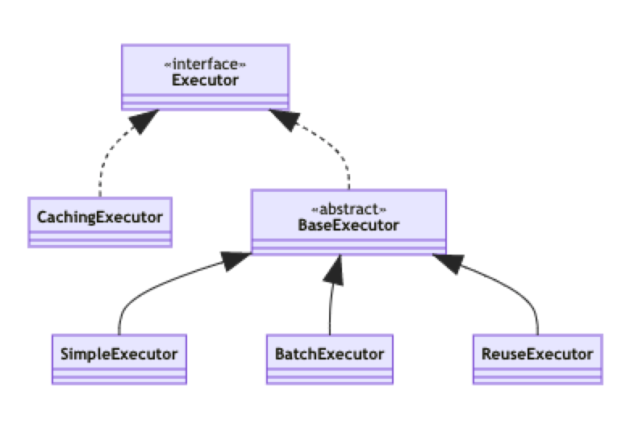

# MyBatis

## 生命周期

1. `SqlSessionFactoryBuilder`: 创建 SqlSessionFactory，创建之后无用
2. `SqlSessionFactory`: 创建 SqlSession，相当于连接池获取一个连接
3. `SqlSession`: 进行 SQL 调用，获取一个 mapper，调用其中的方法

## 事务管理器有哪些

```xml
<environment>
    <transactionManager type="JDBC|MANAGED">
    ...
    </transactionManager>
</environment>
```

- JDBC:
- MANGED:

## 数据源有哪些

```xml
<dataSource type="POOLED">
    <property name="driver" value="${driver}"/>
    <property name="url" value="${url}"/>
    <property name="username" value="${username}"/>
    <property name="password" value="${password}"/>
</dataSource>
```

- POOLED
- UNPOOLED
- JNDI

## 关联查询

关联查询分为 “1:n” 和 “n:1”，两种均可以使用**子查询**和**连表查询**获得结果

- `1:n`: collection, 使用 `ofType` 指定泛型类型
- `n:1`: association, 使用 `javaType` 指定关联字段类型

**子查询：**

结果集不包含关联表数据

```xml
<select id="teacher">select * from teacher where id=#{tid}</select>

<resultMap id="">
    <association property="" column="tid" select="student" javaType="Student"/>
</resultMap>

<select id="student" resultMap="">select * from student where id=#{sid}</select>
```

**连表查询：**

结果集包含了关联数据

```xml
<select id="teacher" resultMap="">select t.name t_name, s.name s_name from teacher t left join student s ...</select>

<resultMap id="teacher or student">
    <association property="" javaType="Teacher">
        <result property="name" column="t_name">
    </association>
</resultMap>
```

## 动态 SQL 是什么原理，怎么使用

根据不同的条件生成不同的 SQL 语句。通过 OGNL 计算出表达式的值，并动态的拼接成SQL语句。

- if
- choose(when, otherwise): switch case
- trim(where, set)
- foreach: Iterable, Array, Map
- script: 带注解的映射器中使用动态 SQL 必须使用该标签
- bind: 允许你在 OGNL 表达式以外创建一个变量，并将其绑定到当前的上下文

### if

```xml
<if test="title != null">
  AND title like #{title}
</if>
```

### choose

```xml
<choose>
  <when test="title != null">
    AND title like #{title}
  </when>
  <otherwise>
    AND featured = 1
  </otherwise>
</choose>
```

### where

```xml
<where>
  <if test="state != null">
    state = #{state}
  </if>
  <if test="title != null">
    AND title like #{title}
  </if>
  <if test="author != null">
    AND author_name like #{author.name}
  </if>
</where>
```

### set

```
<update id="updateAuthorIfNecessary">
  update Author
    <set>
      <if test="username != null">username=#{username},</if>
    </set>
  where id=#{id}
</update>
```

### trim

```xml
<trim prefix="WHERE" prefixOverrides="AND |OR ">
  ...
</trim>
```

### foreach

```
<foreach item="item" index="index" collection="list"
    open="(" separator="," close=")">
      #{item}
</foreach>
```

### bind

```xml
<select id="selectBlogsLike" resultType="Blog">
  <bind name="pattern" value="'%' + _parameter.getTitle() + '%'" />
  SELECT * FROM BLOG
  WHERE title LIKE #{pattern}
</select>
```

> OGNL 语言将字符串 `item.id` 解析成方法调用 `item.getId()`

## MyBatis 缓存

在内存中缓存 select 语句结果(对象)，`update, delete, insert` 会刷新缓存

1. **一级缓存（local cache）**：`SqlSession` open 与 close 之间有效，返回同一个 POJO 对象。`sqlSession.clearCache` 可手动刷新。默认开启，不能关闭
2. **二级缓存（global second level）**：`<cache/>` 开启
    1. 作用域为一个 `namespace`
    2. 查询数据首先放入一级缓存
    3. 一级缓存 `close` 或 `commit` 时，放入二级缓存
    4. 新会话时，先检查二级缓存，再检查一级缓存
    5. 不同的 mapper 查出的数据放在各自的缓存中
    6. `readOnly` 默认 `false`，此时通过 `Serializable` 返回拷贝对象。相反，`true` 时返回同一对象。

### Configure 2nd-level cache

#### By XML

```xml
<mapper namespace="cn.yelfive.dao.UserMapper">
    <!-- Enable 2nd-cache -->
    <cache/>
</mapper>
```

#### By annotation

```java
@CacheNamespace(readWrite = true)
public interface UserMapper {}
```

### 查询过程


> 对同一个 mapper 方法进行匹配。如，获取了列表、与列表中某一元素的查询两种情况，是没有缓存的。

## Mapper xml 中有哪些标签

1. `select`, `update`, `delete`, `insert`
2. `resultMap`
3. `parameterMap`
4. `sql`
5. `include`
6. `selectKey`: 将id填充进传入`@Insert`, `@InsertProvider`, `@Update`, or `@UpdateProvider` 的对象中，若是 `before` 则先修改对象的 id，在 `insert`，如果是 `after`，则先 `insert`，再获取 id 传给对象，相当于获取最近的 id。

## sql 与 include 标签

`<sql id="">` 用于定义可重用 SQL 语句片段，通过 `<include refid="">` 进行调用，可传参数

**Example:**

```xml
<sql id="sometable">
  ${prefix}Table
</sql>

<sql id="someinclude">
  from  <include refid="${include_target}"/>
</sql>

<select id="select" resultType="map">
  select field1, field2, field3
  <include refid="someinclude">
    <property name="prefix" value="Some"/>
    <property name="include_target" value="sometable"/>
  </include>
</select>
```

## DAO 层的工作原理

Dao 在 MyBatis 中被称为 mapper，其中的方法通过 **全类名+方法名** 唯一确定要执行的sql，故 **不能重载**。

在 `SqlSessionFactoryBuilder.build` 的时候会读取 xml 文件，此时会解析所有 Mapper 定义的 sql。

在获取 mapper 时（`session.getMapper()`），实际上获取到的是通过 Proxy 接口动态代理得到 mapper 代理，当调用 mapper 代理的方法时，会根据**全类名+方法名**作为**键**，去 `Configuration.mappedStatements` 获取唯一的 `MappedStatement` 实例，其中包含需要执行的 SQL 及 SQL 类型(SELECT etc.)。最后执行并返回。

> During building sql session factory, if the two method in mapper have same name, `InvalidArgumentException` will raise during `Configuration.put()`.

## MyBatis 如何分页查询

1. RowBounds 类，内存分页
2. SQL `limit` 语句
3. 插件，拦截 sql 改为子查询 `select (select clause) t limit offset, size`;

## MyBatis 插件运行原理

MyBatis 通过拦截执行过程中的某一点，进行自定义处理。包括

- Executor (update, query, flushStatements, commit, rollback, getTransaction, close, isClosed)
- ParameterHandler (getParameterObject, setParameters)
- ResultSetHandler (handleResultSets, handleOutputParameters)
- StatementHandler (prepare, parameterize, batch, update, query)

**编写插件：**

```java
// ExamplePlugin.java
@Intercepts({ @Signature(
    type= Executor.class,
    method = "update",
    args = {MappedStatement.class,Object.class}
    )
})
public class ExamplePlugin implements Interceptor {
    private Properties properties = new Properties();
    public Object intercept(Invocation invocation) throws Throwable {
    }
    public void setProperties(Properties properties) {
        this.properties = properties;
    }
}
```

**启用：**

```xml
<!-- mybatis-config.xml -->
<plugins>
  <plugin interceptor="org.mybatis.example.ExamplePlugin">
    <property name="someProperty" value="100"/>
  </plugin>
</plugins>
```

## 批量插入获取 pk

通过 `keyProperty` 和 `useGeneratedKeys="true"` 实现，最后 `pk` 会写回传入参数的指定字段。

```xml
<insert id="insertList" useGeneratedKeys="true" keyProperty="id">
  INSERT INTO country (name,code )
  VALUES
  <foreach collection="list" item="item" separator=",">
    (#{item.name},#{item.code})
  </foreach>
</insert>
```

```java
@Insert({"<script>",
        "INSERT INTO user(name, username, password) VALUES",
        "<foreach collection=\"list\" item=\"item\" separator=\",\">",
        "(#{item.name}, #{item.username}, #{item.password})",
        "</foreach>",
        "</script>"
})
@Options(keyProperty = "id", useGeneratedKeys = true)
int batchInsert(List<User> users);
```

> 1. 注解用 `@Options(keyProperty = "id", useGeneratedKeys=true)`. `@Options` 与 `@Insert` 等注解配合达到 xml 写 sql 的效果。
> 2. 基于注解的动态 SQL 需要用到 `<script>` 标签

## MyBatis 是如何映射结果的

### 列名与 POJO 字段对应

1. 使用 XML: `<resultMap>`, `<association>`, `<collection>` 标签
2. 使用注解: `@Results`, `@Result`, `@One`, `@Many` 注解
3. 使用 SQL `alias`, MyBatis 会忽略大小写，通过 `_` 寻找对应的驼峰字段

### 赋值

通过反射，为返回对象赋值。

## MyBatis 中的懒加载如何配置

在 `<settings>` 中使用 `lazyLoadingEnabled`、`aggressiveLazyLoading` 全局配置，可以在具体关系中使用  `fetchType` 修改。

- `lazyLoadingEnabled` 全局开启懒加载，默认 `false`。可由 `fetchType` 重写
- `aggressiveLazyLoading` 当懒加载时，任何一个懒加载关系加载时，加载该 pojo 实例的所有关联数据。默认 `false`
- `lazyLoadTriggerMethods` 可以触发加载的方法。默认 `equals,clone,hashCode,toString`
- `fetchType` 单独设置某关联数据的获取类型：`LAZY`, `EAGER`, `DEFAULT`

```java
@Results({
  @Result(
    property = "", column = "",
    many = @Many(
      select = "Role.getRoleById",
      fetchType = FetchType.LAZY
      )
  )
})
User getUserById(long id);
```

## ResultMap 怎么设置、调用？

ResultMap 可以通过 xml 或 注解 定义，之后可以通过 xml 或者 注解引用（`@Results`, `@ResultMap`）

### xml

```java
<resultMap id="user"></resultMap>

<select id="getUserById" resultMap="user">
  ...
</select>
```

### 注解

```java
// define a result map by attribute `id`
@Results(id = "", ...)
@Select(...)
User getUserById(long id);
```

**调用：**

```java
@Select("SELECT * FROM user")
@ResultMap("userRole")
List<User> findAll();
```

## MyBatis 中的 SQL 的占位符参数怎么传值、使用？

### 1. 匿名参数

'`param1`, `param2`, ...' represents the '1st, 2nd, ...' arguments passed to mapper method

```java

@Inert("INSERT INTO user VALUES(#{param1}, #{param2})")
long createUser(long id, String name);
```

### 2. 命名参数

```java
@Inert("INSERT INTO user VALUES(#{id}, #{name})")
long createUser(@Param("id") long myId, @Param("name") String myName);
```

## MyBatis Mapper @Insert 返回值

`@Insert` 只能返回修改行数，如果要获取修改的记录，需要使用 `@SelectKey` 再次查询后修改 POJO 对象

## SelectKey

### Annotation

```java
@Inert("INSERT INTO user VALUES(#{id}, #{name})");
@SelectKey("SELECT * FROM user WHERE id=LAST_INSERT_ID()", before = false)
int createUser(User user);
```

其中 `@SelectKey` 在查询之后会将数据填充到 `user`，并覆盖已有数据

### XML selectKey

```xml
<selectKey keyProperty="" resultType="" order="BEFORE|AFTER">
  select something from some_table
</selectKey>
```

### Example

在插入前（`before=true`）获取整型数据（`resultType=int.class`）作为 `nameId`，传递给 `insert` 语句。

```java
@Insert("insert into table3 (id, name) values(#{nameId}, #{name})")
@SelectKey(statement="call next value for TestSequence", keyProperty="nameId", before=true, resultType=int.class)
int insertTable3(Name name);
```

## Executor 有哪些，怎么使用？

`Executor` 用于执行真正的 CRUD 操作。除了 `CachingExecutor`，其他的作用域均为 `SqlSession`

  

- `SimpleExecutor`: 每次都生成一个 `PreparedStatement` 执行
- `BatchExecutor`: 执行批量更新。执行器会收集一定量的 CUD 操作，然后批量发送给数据库，减少数据库交互的次数。在 **查询** 或者显示调用 `flushStatements()` 时，会将 SQL 发送给数据库。可以解决 SQL 语句太长，超过 `max_allowed_packet` 的异常。
- `ReuseExecutor`: 生成并重用 `PreparedStatement`。内部使用 SQL 作为 key 在数据结构 `Map<String, PreparedStatement>` 中查找。
- `CachingExecutor`: 二级缓存，作为其他 `Executor` 的包装类

默认为 `SimpleExecutor`。通过以下方式可以指定执行器

### 1. openSession 时指定

```java
SqlSessionFactory.openSession(ExecutorType.SIMPLE)
```

### 2. XML 配置

```xml
<!-- SIMPLE REUSE BATCH -->
<setting name="defaultExecutorType" value="SIMPLE">
```

---

创建 Executor 方法

```java
package org.apache.ibatis.session;

class Configuration {
  public Executor newExecutor(Transaction transaction, ExecutorType executorType) {
    // ... other statements
    if (ExecutorType.BATCH == executorType) {
      executor = new BatchExecutor(this, transaction);
    } else if (ExecutorType.REUSE == executorType) {
      executor = new ReuseExecutor(this, transaction);
    } else {
      executor = new SimpleExecutor(this, transaction);
    }
    if (cacheEnabled) {
      executor = new CachingExecutor(executor);
    }
    /// ... other statements
  }
}
```

**See more**: [mybatis – MyBatis 3 | Java API](https://mybatis.org/mybatis-3/java-api.html)

## MyBatis 中如何自定义数据类型映射？

通过继承 `BaseTypeHandler` 或实现 `TypeHandler` 可以定义 parameter 和 result。MyBatis 提供了常见类型的 type handler。借此可以生成如枚举类型的映射关系。

其中

- `setParameter` 表示设置 SQL 中的参数
- `getResult` 为定义 Java 中的数据类型

### 自定义 TypeHandler

```java
@MappedJdbcTypes(JdbcType.VARCHAR)
public class ExampleTypeHandler extends BaseTypeHandler<String> {
}
```

> 其中 `JdbcType.VARCHAR` 代表数据库中的数据类型

### 配置生效

```xml
<!-- mybatis-config.xml -->
<typeHandlers>
  <typeHandler handler="org.mybatis.example.ExampleTypeHandler"/>
</typeHandlers>
```

**See more**: [mybatis – MyBatis 3 | Configuration](https://mybatis.org/mybatis-3/configuration.html#typeHandlers)

## &lt;sql> 与 &lt;include> 有顺序依赖吗？

`<sql>` 与 `include` 没有顺序依赖，两者位置可以是任意的。以下声明也是合法的

```xml
<sql id="a">
  <include refid="b"/>
</sql>

<sql id="b">
  ...
</sql>
```

## MyBatis 的配置是怎么存储的？

MyBatis 会在创建 `SqlSessionFactory` 时解析配置文件，之后将所有配置都存起来放入 `Configuration` 的实例中。如

Tag | Configuration Property
--- | ---
resultMap | resultMaps
select/insert/...| mappedStatements
parameterMap | parameterMaps

## 为什么 MyBatis 被称为半自动，什么是全自动？

相对于 Hibernate，MyBatis 需要手动编写 SQL 语句，而 Hibernate 可以自动生成语句，自动获取关联数据等。

## MyBatis 开启日志

```xml
<!-- mybatis-config.xml -->
<settings>
  <setting name="logImpl" value="STDOUT_LOGGING"/>
</settings>
```

### value

- STDOUT_LOGGING: Standard output
- LOG4J
- SLF4J
- LOG4J2
- JDK_LOGGING
- COMMONS_LOGGING
- NO_LOGGING

> 常用选项为 `STDOUT_LOGGING`, `LOG4J`。其中后者需要导入相关依赖

## MyBatis/Hibernate/JPA 之间的关系

JPA (Java Persistence API) 是一套持久化规范，Hibernate 是其实现。

Hibernate 封装程度比 MyBatis 高，省去了大多数 SQL 的编写，但灵活性不如 MyBatis。
