# Network

##  TCP 与 UDP 能不能同时使用一个端口号？

可以。

TCP 与 UDP 下一层是 IP 协议，IP *数据报（datagram）* 中包含了上层协议类型。当目的主机 NIC 解析 IP 协议时会根据上层协议是 TCP (6) 还是 UDP (17)，将 *载荷（payload）* 传给相应的协议栈处理程序进行处理，这个载荷称为运输层 *报文段（segment）*。而端口号是保存在这个报文段的头部当中，只有相应的处理程序才能正确解析，得到目的地端口后，在将数据部分传给对应的进程进行处理。由于处理 TCP 的程序与处理 UDP 的程序不同，他们可以区分开接收端进程，故 TCP 与 UDP 可以同时使用同一个端口号。

## 网卡 NIC

1. NIC 有自己的处理器、存储器。
2. 接收 CPU 传如的数据报，传出网络。
3. 接收网络中的 分组，然后通知 CPU 来读。

---

在生活中，对 *网卡* 这个名词应该很熟悉，因为网卡是计算机上网不可或缺的一部分。也叫 *网络适配器，网络接口卡（Network Interface Card, NIC）*。它在计算机网络中所处的位置就是<ins>数据链路层与物理层</ins>，兼顾两层的功能。它其实就是一个小型的嵌入式系统，上面 **有自己的处理器以及存储器（包括ROM和RAM）**。计算机的 CPU 将网络层的 IP 数据报交给网卡之后，就可以去做别的事情了，由网卡的处理器复杂将 IP 数据报处理，并将信号转为电信号发送出去，以及接收在网络上传输过来的分组，然后通过 **中断** 通知计算机的 CPU 来把数据读走。这就是网卡的主要工作。 如果只是通过 IP 地址来进行转发分组，那么如果中间需要很多路由器来进行转发，如何去识别我该将分组转发给哪个路由器呢？所以提出了物理地址作为设备的地址唯一标识，也就是 *MAC (Media Access Control)* 地址，每个网卡具有唯一的 MAC 地址，这样根据 MAC 地址就可以找到如何转发了。MAC 地址是一个 48 位的二进制数据。

**See Also**：

- [计算机网络系列之IP协议与网卡 - 知乎](https://zhuanlan.zhihu.com/p/136817258)

## MAC

48 bits = 6 bytes，链路层寻址。

```
00-16-EA-AE-3C-40
```

## MAC 地址与 IP 地址均全球唯一，为什么需要两个地址而不是其中一个就行？

MAC 地址与 IP 地址工作在不同的计算机网络层中，计算机需要发送一个分组到另一台计算机时，先想分组放入 IP 数据报，封装了 IP 地址，然后交给数据链路层，数据链路层需要把分组发送到网络中的中间节点的交换机、路由器，分组在链路层转发时，没有 IP 地址，只有 MAC，到了路由器或者工作在更高层的设备时，才会将链路层的帧解开，获取到 IP 地址。

MAC 用于下一跳，IP 用于点到点。

## Socket 开发的误区

### 1. 一个端口只能监听一次？

一个网卡上的端口只能被同一个协议监听一次。

### 2. 为什么不指定监听的 IP 服务也能被访问到？

默认是绑定 `INADDR_ANY`，实际上就是 `0.0.0.0` 指所有网卡。

### 3. 通过 127.0.0.1 一定能访问到本地服务？

否。必须监听了本地回环 或则 `0.0.0.0` 才可以。

### 4. 能否开个端口只允许本地能够访问？

可以。通过监听 `127.0.0.1`。

### 5. 能否指定某几个 IP 能访问服务？

可以。但是要分别单独地为这几个 IP 进行监听，获取 socket 然后处理。

### 6. 同时监听 127.0.0.1 与 INADDR_ANY，以哪个为准？

前者。`INADDR_ANY` 优先级最低。

FROM: [socket开发：一台服务器同一端口同时在多个网卡上开启listen的误区理解。_charthyf的博客-CSDN博客](https://blog.csdn.net/charthyf/article/details/81502143)

## 网络各层中分组的名称是什么？

| 层     | 分组   | Package  |
| ------ | ------ | -------- |
| 应用层 | 报文   | message  |
| 运输层 | 报文段 | segment  |
| 网络层 | 数据报 | datagram |
| 链路层 | 帧     | frame    |
| 物理层 | 比特   | bit      |

另外 SSL 的分组称为*记录（record）*，工作在应用程序与运输层之间。

> RFC 等文献中，把 TCP 的分组叫做 *报文段（segment）*，把 UDP 及网络层分组称为 *数据报（datagram）*

## 应用层、传输层工作在什么态下？

应用层：用户态

传输层：核心态

## TCP vs UDP

UDP 与 TCP 都是基于 IP 不可靠，尽力而为的服务。

TCP ：超时重传、流量控制（目的主机接收速度低）、拥塞控制（整个网络）

UDP：只负责将数据报发送出去，其他都不管了

分组大小：TCP 使用 MSS 限制数据大小，由链路层 MTU 决定；UDP 不会限制数据大小，最终交给 IP 协议来决定是否分片传输。

## 什么 MSS？

最大报文段长度，Maximum Segment Size。是指 TCP 从上层 *发送缓冲（send buffer）* 中能够取出并放入报文段的 **最大数据量**，通常是 1460 字节，因为链路层以太网 *帧（frame）* 的 MTU 通常是 1500 字节，而 IP *数据报（datagram）* 头信息占 20 字节、TCP 协议报文段头信息占用 20 字节。剩下给留给传输层放入数据的大小只剩 1460 字节。这样才可以刚好把一个网络层数据报放入一个链路层帧。

## MSS 存在的原因是什么？

在使用 TCP 协议时，为了保证可靠传输，需要将大分组分成小段再分别传输，否则当分组丢失或则出现 bit 错误时，将不得不重传整个大的分组。

如果 MSS 过小，则不能填满 MTU，增加传输次数。如果 MSS 过大，则超过 MTU，需要分几个帧才能完成传输，且重传时也要传这些分组。故最好将 MSS 设置成刚好能塞满一个 MTU。

> UDP 不保证可靠传输，故可以不考虑 MSS。

## 什么是 MTU？

最大传输单元，Maximum Transmission Unit。一个链路层帧能够承载的最大数据量。在以太网帧中长度为 1500 字节，广域网链路层帧不超过 576 字节。

## 分类编址 vs. 无类别域间编址（CIDR）

期初因特网地址编址方式称为 *分类编址（Classful address）*，是将地址分为 A 到 E 五类。随后出现 *无类别域间编址（Classless Inter-Domain Routing, CIDR）*，使用 `a.b.c.d/x` 的形式，将地址高 `x` 位称作 *网络前缀（prefix）*，用于区分 **子网**，剩余的 `32 - x` 位用作 **主机号**，用于区分子网中不同主机。

## HTTP 长连接

HTTP 1.1 开始默认长链接，为了兼容以前的 HTTP 版本，需要声明以下头信息

```http
GET / HTTP/1.1
Connection: Keep-Alive
Keep-Alive: timeout=10,max=500
Connection: close # close TCP connection after response
```

> 早期版本每次 HTTP 连接都需要经历 TCP 连接的 3 次握手。

## HTTP 的优点

1. 简单
2. 灵活
3. 应用广泛、跨平台

## HTTP 缺点

1. 无状态
2. 明文、不安全。

## HTTP：什么是管道网络传输？

管道（pipeline）指向 HTTP 服务器发送的请求 A、B，可以同时发起，B 不用等待 A 响应，服务器依次处理请求。

## HTTP：什么是队头阻塞？

是指使用长链接的 *管道（pipleline）* 技术时，多个请求在同一个 TCP 连接内排队等待服务器处理时，前面的请求耗时阻塞，导致后面的请求不得不等待。

## 什么是 HTTPS？

HTTPS 是在 HTTP 与 TCP 之间加入了一层 SSL/TLS 层， 用于提供传输安全。

SSL 用于加强 TCP 的安全性。

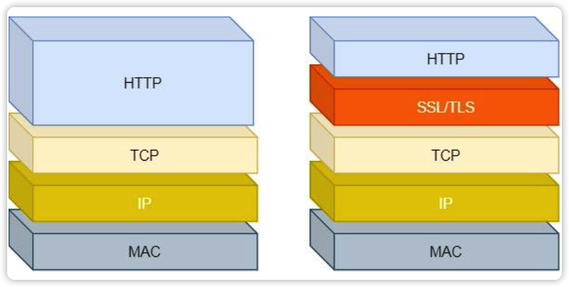

## HTTP vs. HTTPS

区别|HTTP| HTTPS
---|---|---
**报文**|明文|密文
**连接**|TCP 三次握手|在 TCP 三次握手的基础上，还需要 4 次 TLS 握手，总共 **7 次握手**
**端口号**|80|443
**CA**||有 CA 颁发证书，可以通过 CA 的公钥进行签名验证

## 报文鉴别码（MAC）的作用？

报文鉴别码（Message Authentication Code, MAC），使用散列函数获取报文摘要，保证报文的完整性。

鉴别秘钥（Authentication key），用 \\(s\\) 表示，则 MAC 可以表示成

\\[
MAC = H(m + s)
\\]

其中 \\(H\\) 为散列函数，\\(m\\) 为需要传输的报文。

## 在已经有 RSA 的基础上，为什么还需要 MAC？

RSA 是保证数据不被窃取，攻击者无法知道截获的报文内从， 但是攻击者仍然可以修改报文，交换 `0`、`1` 比特，导致服务器读出错误的内容，造成损失。所以 MAC 是为了保护 RSA 的报文完整性，由报文加上 *鉴别秘钥（authentication key）* 经过散列函数之后生成，如果报文内容被篡改，会导致接收端验证 MAC 失败，从而阻止攻击。

## 什么是数字签名？

基于 *公钥基础设施（Public Key Infrastructure, PKI）*，对通信的提供保护，包括

- 报文发送方的 **身份鉴别**
- 保证报文的 ***完整性（message integrity）***。

> 报文完整性是指，报文是完整的，不被伪造、篡改，其中不包含机密性。

## 什么是 CA？

*认证中心（Certification Authority, CA）*，是颁发证书的权威机构。当服务器需要注册自己的公钥时，会把公钥 P 交给 CA 时，CA 使用自己的私钥对公钥 P 进行签名，附加其他信息，并颁发给服务器。

客户端请求服务器时，会现获取 CA 证书，并通过 CA 机构的公钥，验证证书的合法性。

## 保护数据完整性的方法有哪些？

1. MAC：报文鉴别秘钥，获取报文摘要
2. PKI：数字签名

## TLS 是什么，记录格式如何？

SSL/TLS 用于加强 TCP 的安全性。

SSL 的一个分组称为 *记录（record）*，多个记录可以组装在同一个 TCP 报文段中。


- **类型：**记录用途，握手、数据、关闭连接。
- **版本：**SSL 版本。
- **长度：**数据长度，接收端使用该字段从 TCP 字节流中取出记录。
- **MAC：** \\(H(SEQ + M_B + Data)\\)

## SSL/TLS 四次握手

SSL 用于加强 TCP 的安全性。

1. ClientHello
2. ServerHello
3. To Server: PMS, 已发送报文 MAC
4. To Client：MAC

---

### 1. ClientHello

客户端向服务器发送自己

1. 支持的加密算法列表
2. 客户端 *不重数（nonce）*

### 2. ServerHello

告诉客户端

1. 选择的加密算法
2. 选择的 Hash 算法
3. 服务器 CA 证书
4. 服务器不重数

> 这里的 Hash 算法用于计算 MAC，服务器与客户端相同。后面生成的 AS 两者不同。

### 3. To Server

发送 PMS + 已发送报文的 MAC。

客户端根据服务器选择的算法、服务器公钥，生成一个 *前主秘钥（Pre-Master Secret, PMS）*，并发送给服务器。

**此时已经有服务器公钥，客户端以 RSA 加密报文并发送给服务器**。

在这之前客户端通过 <ins>PMS</ins> 和 <ins>不重数计（客户端和服务器）</ins> 算出 MS，并分割得到

1. 客户端鉴别秘钥：用于计算客户端 MAC。鉴别秘钥（Authenticate Secret, AS）。
2. 客户端对称秘钥：用于加密后续发送给服务器的报文。
3. 服务器鉴别秘钥：用于保证后续服务器发送报文的完整性。
4. 服务器对称秘钥：用于解密后续服务器发送的报文。

```
MS = PRF(PMS, ClientNonce + ServerNonce)
```

- **PRF**: Pseudo Random Function，伪随机数生函数。
- **MS**：长度固定为 48 字节的伪随机数，随后切片生成 4 个秘钥。

### 4. To Client

返回服务器收到的报文的 MAC，完成握手。

服务器根据 PMS + nonce 计算出 2 个 AS，2 个 SC（Symmetric Cipher）。并验证客户端已收到的报文的 MAC 是否与客户端传的 MAC 一致。

> 服务器与客户端各自独立的从 PMS 及 不重数计算出 4 个秘钥。

## TLS：秘钥交换算法

1. RSA 作为交换算法
2. DH_RSA：DH 作为交换算法，相同长度的秘钥，DH 更安全；RSA 作为交换秘钥时的签名算法。
3. DHE_RSA：DHE 作为交换算法，每次会话生成临时（Ephemeral）DH 秘钥；RSA 作为交换秘钥的签名算法。
4. DHE_DSA ：DHE 作为交换算法；DSA 作为签名算法
5. ECDHE_RSA：ECDHE 作为交换算法（椭圆曲线，更快）；RSA 作为签名算法。

## TLS：握手使用 RSA 作为交换算法的问题

相同长度的 key 的情况下，DH 的安全性强与 RSA。

## TLS：PMS 是做什么的？

由客户端生成，与 2 个不重数一起，用于客户端与服务器独立计算得到 2 个 AS（Authenticate Secret），2个 SC（Symmetric Cipher）。

```
MS = PRF(PMS, ClientNonce + ServerNonce)
```

- **PRF**: Pseudo Random Function，伪随机数生函数。
- **MS**：长度固定为 48 字节的伪随机数，随后切片生成 4 个秘钥。

## TLS：为什么需要不重数？

为了防止 **“连接重放攻击”**。

没有 nonce 时，攻击者可以录制整个对话，包括连接过程，然后重放，最后产生同样的对话秘钥，且所有的报文都能通过完整性检查。

有了不重数，攻击者与服务器握手时，服务器将产生一个 **新的** 随机数发送给攻击者，攻击者随后重返的请求将无法通过完整性检查。

完整性检查是通过鉴别秘钥，鉴别秘钥是通过 MS 生成， MS 是通过 PMS 与 **客户端+服务器不重数生成**。

## TLS 怎么防止分组重放攻击？

### Q. 什么是分组重放攻击？

是指监听 `C->S` 的通信，调换分组顺序或则删除分组，每一个分组都能通过完整性校验，但接收端收到了顺序异常的分组。

### Q. 怎么防止？

通过序列号。

假设 A 向 B 发送信息。

**原理**：A 维护一个序列号，从 0 开始计数，每次发送一个 SSL 记录自增。如果 B 收到的分组序列号非递增，则认为是非法分组。

**实际上**：A 与 B 同时维护 A 的序列号，每一个 SSL 记录中，将序列号加入 MAC 计算。B 收到分组之后也加入 A 的序列号计算 MAC，进行完整性校验。

\\[
H(Data + M_A + SEQ)
\\]


## TLS 1.2 vs. TLS 1.3

|      | 1.2                         | 1.3                         |
| ---- | --------------------------- | --------------------------- |
| 握手 | 两次往返（2 RTT），4 次握手 | 一次往返（1 RTT），3 次握手 |

> RTT, Round Trip Time，往返时间。

## 什么是前向保密

*前向保密（Forward Secrecy, FS）*，也称 *完全前向保密（Perfect Forward Secrecy, PFS）*，是密码学中通讯的安全属性，指长期使用的主秘钥泄露不会导致过去的会话秘钥泄露。可以保护过去的会话不会受未来秘钥暴露的威胁。

包括

SSL v3 开始可以使用支持前向安全的密码算法通信。在秘钥协商过程中，客户端、服务器端分别生成公钥私钥对，然后彼此交换公钥，并使用 “自己的私钥+对方的公钥+随机数” 生成相同的会话秘钥，这样即使被抓取且服务器主私钥被暴露，因为不知道各自的 **临时私钥**，也无法计算出会话秘钥。

\\[
SC = f(my-pri, your-pub, nonce)
\\]

## DSA

Digital Signature Algorithm.

## Cipher Suites 格式

```html
Ciper Suite: TLS_密钥交换算法_签名算法_WITH_对称加密算法_摘要算法
```

秘钥交换算法：DH -> DHE（前向安全） -> ECDHE（更快）

签名算法：

## DH 算法

DH 算法是秘钥协商协议（Key-agreement algorithm），**通过不可信的信道协商出一个相同的对称秘钥**，他本身是匿名（无认证）的。他的主要变种有

1. Anonymous mode：无认证。对协商过程无签名，容易被中间人攻击。
2. Static mode：客户端-服务器固定公钥-私钥对，或其中一方固定，另一方随机生成临时的。
3. Ephemeral mode：即 DHE，双方都随机。**目前主要使用的变种**。

原理：

Alice 与 Bob 协商一个明文 \\(c\\) 并交换，并各自生成私钥 \\(pri\\)，然后 **分别** 计算出公钥 \\(pub=f(c, pri)\\)。再交换公钥 \\(pub_A\\) 和 \\(pub_B\\)，然后 Alice 与 Bob 再将对方的公钥与自己的私钥用来计算出一个相同的结果，即为协商的出的对称秘钥。

> 前提是从 \\(pub\\) 中计算出 \\(pri\\) 数学上是困难的。


## DHE vs ECDHE

两者都是秘钥协商算法。

Cipher Suites 中 `TLS_XXX_YYY` 表示使用使用的协商算法是 `XXX`，使用的签名算法是 `YYY`。

协商算法：

签名算法：

ECDHE 使用

```html
TLS_ECDHE_RSA_
TLS_ECDHE_DSA_
TLS_ECDHE_ECDSA_
```


## TLS 与 DH

TLS 使用了密码套件，包含了各种加密算法

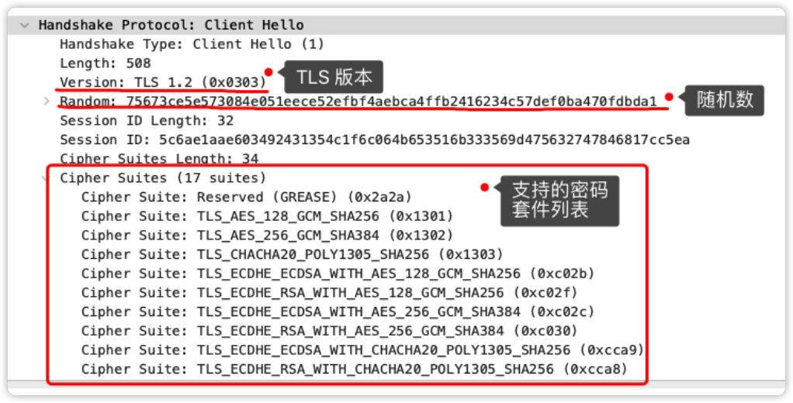

其中秘钥交换算法均是基于 DH 算法，分为

1. **非前向安全**：RSA
2. **前向安全**：DHE-RSA、DHE-DSA、ECDHE-RSA、ECDHE-ECDSA

**ECDHE**: Elliptic Curve Diffie-Hellman Ephemeral key exchange algorithm，椭圆曲线 HD 临时秘钥交换

**椭圆曲线不是椭圆**，曲线表达式如下

\\[
y^2 = x^3 - x + 1
\\]

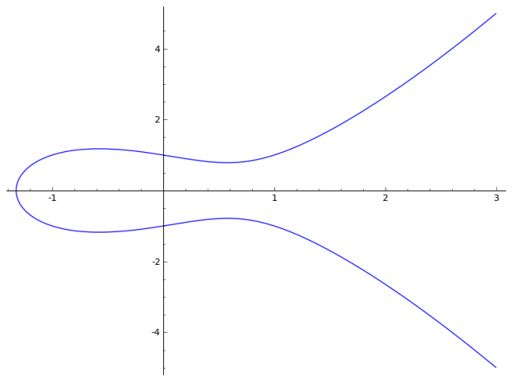


**ephemeral**: 短暂的，这里指秘钥协商过程中，会使用临时秘钥对，以保证前向安全。

## RSA 与 Diffie-Hellman 算法

RSA 是非对称加密算法，可以用于加密、签名、**秘钥协商**。秘钥协商便是加密随机数发送给服务器的过程。

Diffie-Hellman 算法，简称 DH 算法，是秘钥协商算法。

如，SSL 便是用 DH + RSA 来协商一个对称秘钥，称会话秘钥。

## ECDHE

秘钥协商算法，基于 ECC（Elliptic Curve Cryptography）。通过两对公钥-私钥对分别计算出用于生成最终会话秘钥的临时会话秘钥。具有前向安全的属性。比 DHE 更快。

---

设 A 与 B 在使用 ECDHE 算法交换秘钥。

在椭圆曲线上选出一点 \\(G = (x, y)\\)。A 与 B 独立生成 `[1, n - 1]` 的随机数 \\(d_a\\), \\(d_b\\) 作为私钥。生成 \\(Q_A=dG=(x_k, y_k)\\)，与 \\(Q_B\\)，然后将 \\(Q_A, Q_B\\) 做为公钥发送给对方。

\\[
d_AQ_B = d_Ad_BG = d_Bd_AG = d_BQ_A = (x_k, y_k)
\\]

从而得到 \\(x_k\\)，再经过 Hash 算法，得到会话秘钥

\\[
SC = f(message,nonce_A+nonce_B,x_k)
\\]

> G 的选取有一套不为人知的方法。

## HTTP 优化方式

1. 避免请求：缓存（`ETag`）、条件请求
2. 减少请求次数：资源合并（小图合成大图，多个 css 合并为一个）、代理服务器处理重定向（避免 B 端重定向）、延迟访问资源。
3. 减少数据大小：压缩 (`Content-Type`)

> - 无损压缩（Content-Type: gzip, deflate, br）。二进制文件、文本文件，不能接受损失。
>
> - 有损压缩：图片、视频、音频。有点损失仍可以接收。

## HTTP 重定向

| Code | Message            | Description                                       |
| ---- | ------------------ | ------------------------------------------------- |
| 301  | Moved Permanently  | 资源永久的移动到另一个 URL，使用 `GET` 方法重定向 |
| 302  | Found              | 资源临时重定向到另一个 URL，使用 `GET` 方法重定向 |
| 303  | See Other          | 重定向到其他资源，常用于 `POST`/`PUT` 方法的响应  |
| 304  | Not Modified       | 资源未修改，客户端可以继续使用之前的缓存          |
| 307  | Temporary Redirect | 类似 302，但请求方法不得改变                      |
| 308  | Permanent Redirect | 类似 301，但请求方法不得改变                      |

## HTTP 缓存

响应时控制

```http
HTTP/1.1 200 OK
ETag: <hash of the content>
Expires: absolute date time
Cache-Control: max-age=relative seconds to live
Cache-Control: no-store  # do not cache at all
Cache-Control: no-cache  # cache but do not server without revalidate
```

条件请求

```http
GET / HTTP/1.1
If-Modified-Since: date time to check
If-None-Match: check against ETags1, Etags 2
```

## CA 证书信任链

浏览器会从 “服务器证书” 开始往上层直至 “根证书” 验证目标证书的真实性。根证书缓存在操作系统中。

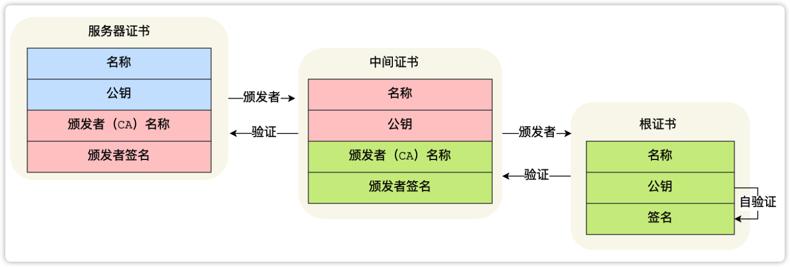

## HTTPS 的优化

1. 硬件优化
2. 软件优化
3. 协议优化
4. 证书优化
5. 会话复用

---

### 1. 硬件优化

- 秘钥协商：计算 RSA、ECC

- 对称加密：AES

属于 CPU 密集型，提升 CPU 性能或专用支持 AES-NI 特性的 CPU，可以提升握手、数据交换的性能。

> ECC 是为了前向安全

### 2. 软件优化

升级 Linux 内核版本、升级 OpenSSL 版本。新版本，新性能，更高安全性。

### 3. 协议优化

#### 使用 ECDSA 证书

因为 ECC 比 RSA 秘钥更短

#### 椭圆曲线使用 `X25519` 曲线，最快。

Nginx 配置：

```nginx
ssl_ecdh_curve X25519:secp384rl;
```

服务器指定优先使用算法

```nginx
ssl_ciphers: 'ECDHE+ECDSA+AES128+SHA:RSA+AES128+SHA'
```

#### TSL 1.3

只需要 1 RTT 的 3 次握手。

### 4. 证书优化

1. 证书传输：采用 ECDHE 而非 RSA 协商算法，更短。
2. 证书验证：采用 OCSP Stapling 而非 CRL 或 OCSP 算法，更快。

CRL（Certificate Revocation List） 是 **客户端** 收到证书后向 CA 下载吊销列表，客户端比对。

OCSP（Online Certificate Status Protocol）是 **客户端** 向 CA 询问证书的合法性。

OCSP Stapling 是 **服务器** 向 CA 周期性的查询证书状态，然后将 **结果+CA 签名** 一起发送给客户端，客户端通过核对签名，确定结果的准确性。

> 证书验证是指：客户端收到一个签名正确的 CA 证书，但可能这个证书已经被 CA 吊销，所以客户端要验证这个证书的合法性。

### 5. 会话复用

是指第一次协商之后的对称秘钥，在随后的 TLS 连接中再次利用，避免握手。

有两种复用方式

1. Session ID：C-S 均保留对称秘钥，并用 Session ID 作为键来存储，后续 TLS 连接，直接使用 Session ID 绕过握手，除非没有找到对应的 Session ID。缺点：服务器需要缓存所有<ins>会话秘钥</ins>，如果服务器分布式，两次请求可能无法命中同一个缓存导致缓存失效。
2. **Session Ticket**：服务器将<ins>会话秘钥</ins>加密后传给客户端，客户端下次简历 TLS 连接时捎带，验证成功则为有效，类似 JWT。

> 两则都 **不具备前向安全，且需要设置合理的有效时间，减少重放攻击。**

#### Pre-Shared Key

客户端将 Session Ticket 捎带在一个有效请求中，如果验证通过直接处理请求。减少一次 RTT。TLS 1.3 1次 RTT 的原理。

与 Session Ticket 一样的缺点，重放攻击称为 <ins>0-RTT Attack</ins>。

## HTTP/2

**优化方向**：

- **头部压缩**：静态表、动态表、Huffman 编码，头部被封装与 *首部帧（Head Frame）*。
- **二进制帧**：将数据封装成 *帧（Frame）*，*首部帧（Header Frame）* 采用 HPACK 压缩算法。
- **并发传输**：双向字节流 Stream，解决队头阻塞问题。客户端 Stream ID 是奇数，服务器 Stream ID 是偶数。
- **服务器推送**：

**See Also**: [HTTP/2 简介  | Web Fundamentals  | Google Developers](https://developers.google.com/web/fundamentals/performance/http2)

> [rfc7541 HPACK: Header Compression for HTTP/2](https://datatracker.ietf.org/doc/html/rfc7541)

## HTTP/2 静态表

一个约定的表，表示了 header 与 value 对应关系，共 61 个表项。每一个表项代表一个键值对。

| Index | Header Name      | Header Value |
| ----- | ---------------- | ------------ |
| 1     | :authority       |              |
| 2     | :method          | GET          |
| 3     | :method          | POST         |
| ...   | ...              | ...          |
| 61    | www-authenticate |              |

> 无 `value` 表示值可变。

## HTTP/2 动态表

在同一个 TCP 连接中，不包含在静态表中的头信息会动态地建立动态表表项，索引从 62 开始。建立表项之后的请求或响应，则直接使用索引表示对应的头信息。

为了避免大量请求导致动态表项太大，服务器通常提供 `http2_max_requests 1000` 的配置，表示一个 TCP 连接支持的最大请求数，达到最大请求数时，断开 HTTP/2 连接，释放内存。

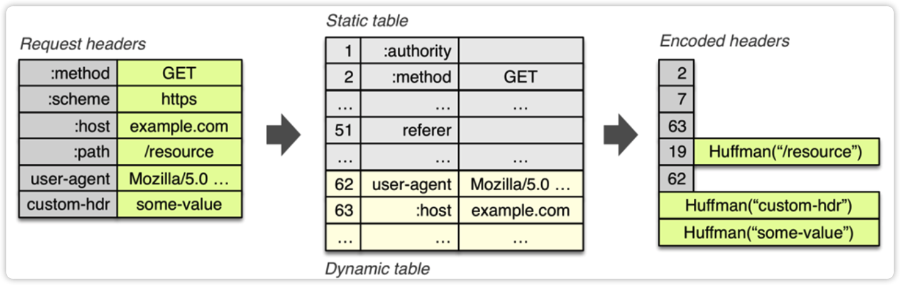

## HTTP/2 静态 Huffman 编码表

属于首部优化

通过大量 HTTP 头信息统计计算得到的编码表，也就是概率上是通信中的头信息长度压缩至最小。

> This Huffman code was generated from statistics obtained on a large sample of HTTP headers.

## HTTP/2 的二进制帧

HTTP/2 将数据封装成 *帧（Frame）*，帧是 HTTP/2 中的最小单位。HPACK 压缩算法。


结构如下

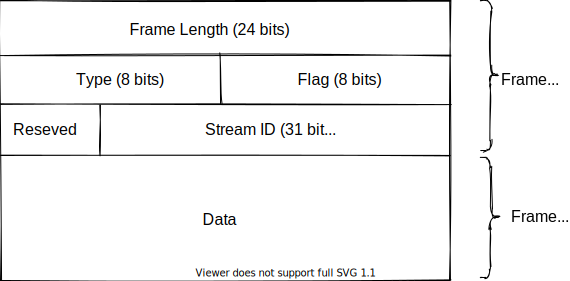

其中首部占用 9 字节。

## HTTP/2 Stream

已经建立的连接内的双向字节流，可以承载一条或多条消息。

同一个连接中可以，可以有多个 Stream，包含了请求/响应消息。多个 Stream 可以并发。避免了 HTTP/1.1 时的队头阻塞。

**一个请求+响应，使用同一个 StreamID**

Stream ID 只能递增，客户端发起的的 Stream ID 是奇数，服务器发起的 Stream ID 是偶数。编号耗尽之后将发送 `GOAWAY` 控制帧从而关闭连接。

> 由于队头阻塞，HTTP/1.1 要实现 100 个并发，需要建立 100 个 TCP 连接，每个连接都需要 3 次握手；而通过 Stream，只需要 1 个 TCP 连接便可以了。
>
> 在 Nginx 中可以通过 `http2_max_concurrent_streams 128` 来配置同一个 TCP 连接中的并发 Stream 数目上限。

---

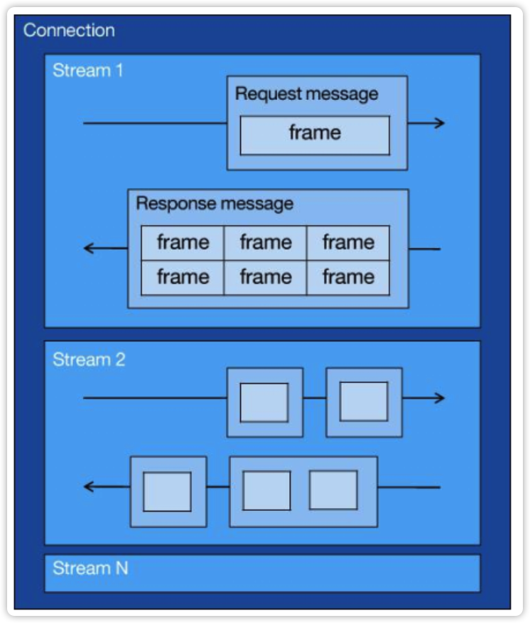

不同 Stream 可以乱序传输，但是同一个 Stream 内的 Frame 必须按顺序（多个 Stream 的 Frame 可以交叉）。


## HTTP/2 的队头阻塞问题

HTTP/2 基于 TCP，TCP 有重传机制（SR + Slide Window），当出现丢包重传时，导致的阻塞。

## QUIC 协议有哪些特点

基于 UDP 的可靠传输，并内部包含了 TLS 1.3。

- **无队头阻塞**：基于 TLS 1.3，在 UDP 之上实现了可靠传输（拥塞控制、重传机制、流量控制）。
- **更快建立连接**：握手只需要 1 RTT，协商 Connection ID，后续的连接建立可以直接携带连接信息与数据，实现 0 RTT。
- **连接迁移：** 由于状态有 Connection ID 维护，客户端如果 IP 变动，可以通过 Connection ID 恢复连接。

QUIC 有两个特殊的单向流：

- QPACK Encoder Stream
- QPACK Decoder Stream

作为加解密字典（动态表表项）时的通知、响应，用于同步动态表。解决了接收方接收失败，动态表项无法更新，于是无法理解服务器 index 的问题。

## HTTP/3

基于 QUIC 实现的 HTTP 协议，解决了 HTTP/2 存在的问题（QUIC 解决的问题）。

头部压缩使用 QPACK 压缩算法：静态表、动态表、Huffman 编码。

静态表项 91 项。

帧格式更简单.

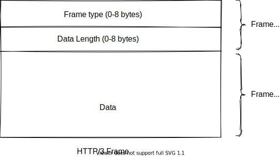

## HTTP 1.1 2 3 对比

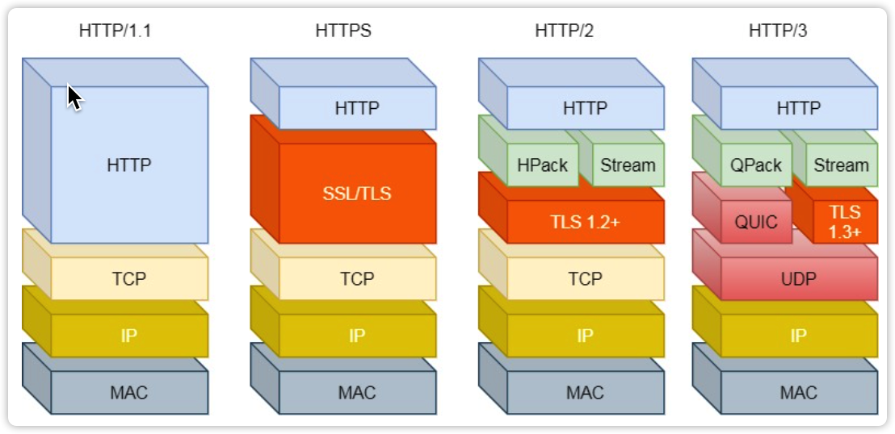

## 为什么需要 TCP

因为下层 IP 协议提供的是不可靠的，尽力而为的服务。

## UDP 报文结构

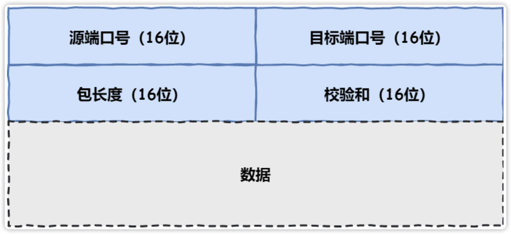

## TCP 报文结构

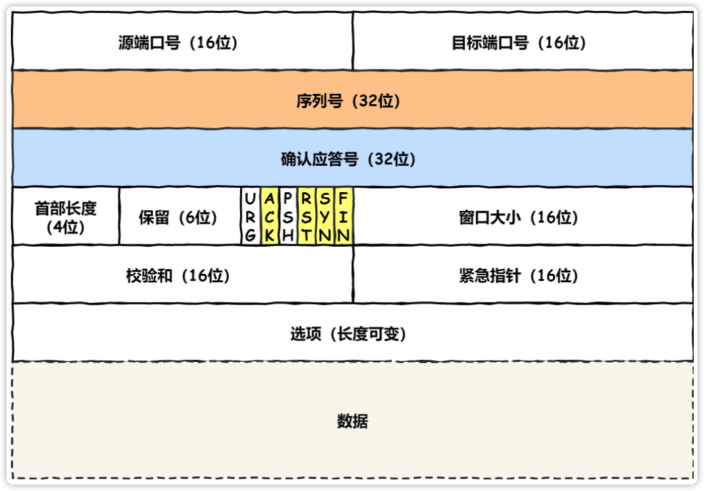

> IP地址 在 IP 层。

## 什么是 TCP

TCP 是面向连接的、可靠的、基于字节流的传输层协议。

## TCP 连接过程

3 次握手，1 RTT。

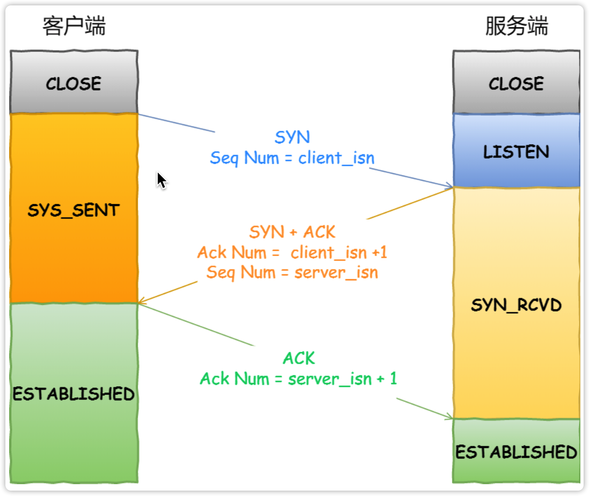

## 为什么 TCP 是 3 次握手不是 2 次 或 4 次？

如果是 2 次，

1. 无法阻止旧的、重复的初始化 SYN 建立连接。
2. 无法同步双方序列号：服务器无法得知客户端是否收到了服务器的 SEQ 序列号。
3. 造成资源浪费，如果服务器收到 SYN 并返回 SYNACK 之后便建立连接，当客户端没有收到这个 SYNACK 时会重传，此时服务器会不断建立连接。

4 次则没必要。

---

关于 1，考虑如下情况。

客户端发出 SYN 由于网络拥塞，没有收到 ACK，于是重传 SYN，这个 SYN 被成功收到，并响应，随后建立连接-关闭连接。

此时第一个 SYN 终于到达，如果只有 2 次握手，服务器认为客户端又要发起一次 TCP 连接，于是按正常响应并保持状态，此时客户端收到 ACK 之后知道自己没有发送过 SYN，于是丢弃这个 ACK。这种情况下，服务器维持连接直到超时。

> The principle reason for the three-way handshake is to prevent old duplicate connection initiations from causing confusion. --from RFC 793.

## 什么是 MSL

Maximum Segment Lifetime，最大报文生成时间，是任何一个报文在网络中存在的最大时间。大于等于 TTL 减少到 0 的时间。

Linux 中 MSL 固定为 30s，如果需要修改，需要修改源码并从新编译内核。

## TCP 挥手：为什么要 TIME_WAIT 等待？

> 主动关闭方等待 2 个 MSL，计时从最后一个收到的 FIN 报文开始。

有两个原因

1. 等待网络中旧的包已经因超时而丢弃，避免与新连接的包发生冲突。（见下图）
2. 保证 **被动关闭的一方** 正确关闭，考虑其没有收到 FIN 的 ACK 的情况，它可能会再次发送 FIN。

---

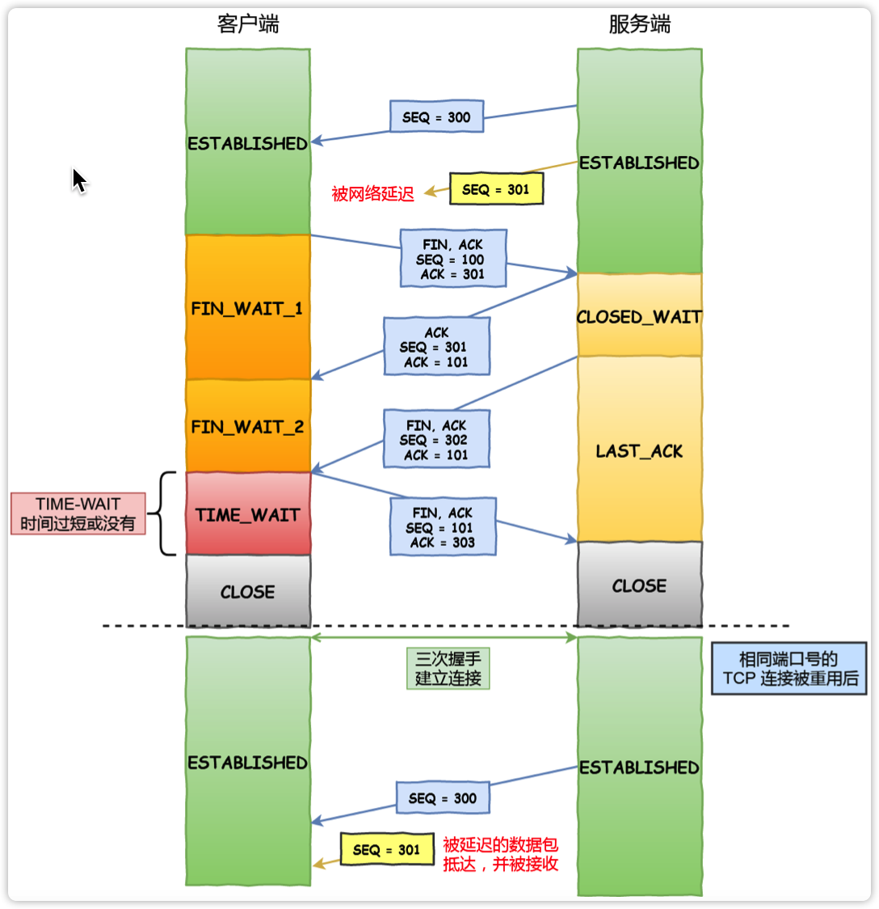

## TCP 挥手： TIME_WAIT 为什么是 2 个 MSL？

对方发起 FIN 报文，没有收到 ACK 时，会触发重传，来回刚好是 2 MSL。

## TCP 挥手：为什么需要 4 次挥手？

TCP 是双向连接，关闭连接时表示发起方没有更多数据要传，但此时仍可以接收数据。只有当两端都关闭了连接这条连接才真正被关闭了。一端关闭需要一趟 FIN-ACK。

## IPv4 头信息的 TTL 字段

Time To Live，这里指最大跳数。每一跳减少 1，减为 0 了便丢弃。同时发送 ICMP 报文给源主机。

IPv4 中有校验和字段，每次减少 TTL，都会导致重新计算校验和，性能开销大。故 IPv6 取消了校验和，TTL 变为 “跳限制”，含义相同。

## 为什么 UDP 有报文长度、TCP 没有

报文大长度实际上都可以通过 IP 数据报的大小计算得出，而 UDP 的 **包长度** 实际上是多余的。因为网络硬件为了处理方便，首部长度需要是 4 字节的整数倍，所以使用长度来对齐。

对于 TCP

```html
TCP 数据长度 = IP 总长度 - IP 首部长度 - TCP 首部长度
```

对于 UDP

```html
UDP 数据长度 = IP 总长度 - IP 首部长度 - UDP 首部长度
```

> UDP 首部长度固定为 8 字节。

## 为什么 TCP 有首部长度而 UDP 没有？

TCP 有一个长度可变的 “选项” 字段，而 UDP 的首部长度是固定 8 字节，TCP 首部长度最低 20 字节。

## TCP 与 UDP 的区别

| #    | 区别                   | TCP                              | UDP                                        |
| ---- | ---------------------- | :------------------------------- | ------------------------------------------ |
| 1    | **连接**               | 面向连接                         | 无连接                                     |
| 2    | **服务对象**           | 一对一的端对端服务               | 可以一对多，多对多                         |
| 3    | **可靠性**             | 可靠                             | 不可靠，尽最大努力                         |
| 4    | **拥塞控制、流量控制** | Y                                | N                                          |
| 5    | **首部开销**           | >= 20 字节                       | 固定 8 字节                                |
| 6    | **传输方式**           | 流式传输，数据没有边界           | 数据是 **按包为单位** 传输的，有边界       |
| 7    | **分片**               | TCP 受 MSS 限制，MSS 受 MTU 限制 | 不受限制，一般封装在 IP 报文后低于一个 MTU |

## TCP 与 UDP 的应用场景

TCP

1. FTP
2. HTTP/HTTPS

UDP

1. DNS, SNMP
2. 多媒体
3. 广播

> SNMP, Simple Network Management Protocol, 简单网络管理协议。是指收集并整理 IP 网络中设备信息，管理网络设备的协议。

## 为什么 DNS 使用 UDP

因为 DNS 的报文通常小于 512 字节，使用 UDP 免去握手延迟，更快。

RFC 也有描述随着 DNS 记录变多，第一次显示发现 UDP 包被截断，应该使用 TCP。

## Linux 中如何查看 TCP 连接状态

```bash
netstat -napt
```

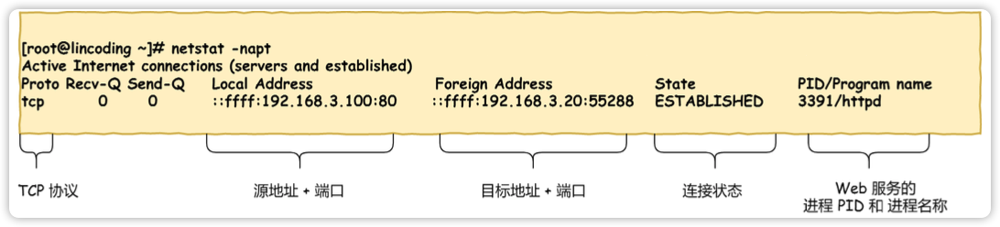

> - `-p` 指定协议 `t` 表示 TCP 协议，MacOS 中需要使用 `tcp`。
> - `-n` 显示 IP 地址，而非 `localhost` 这样的
> - `-a` 显示所有 socket

## 为什么 TCP 的初始序列号 ISN 是随机的？

为了区分开通络中残留的历史报文。

---

如果固定了，则可能把历史报文当做正常报文。

## TCP 初始序列号是怎么计算的？

基于时钟、IP 四元组。

---

```html
ISN = M + F(local ip, local port, remote ip, remote port)
```

- M 基于时钟，每 4ms +1
- F 为 Hash 函数

## SYN、ACK、accept 是如何工作的？

- 收到的 SYN 队列
- 3 次握手后已建立连接的队列
- accept 从已建立连接的队列里获取套接字

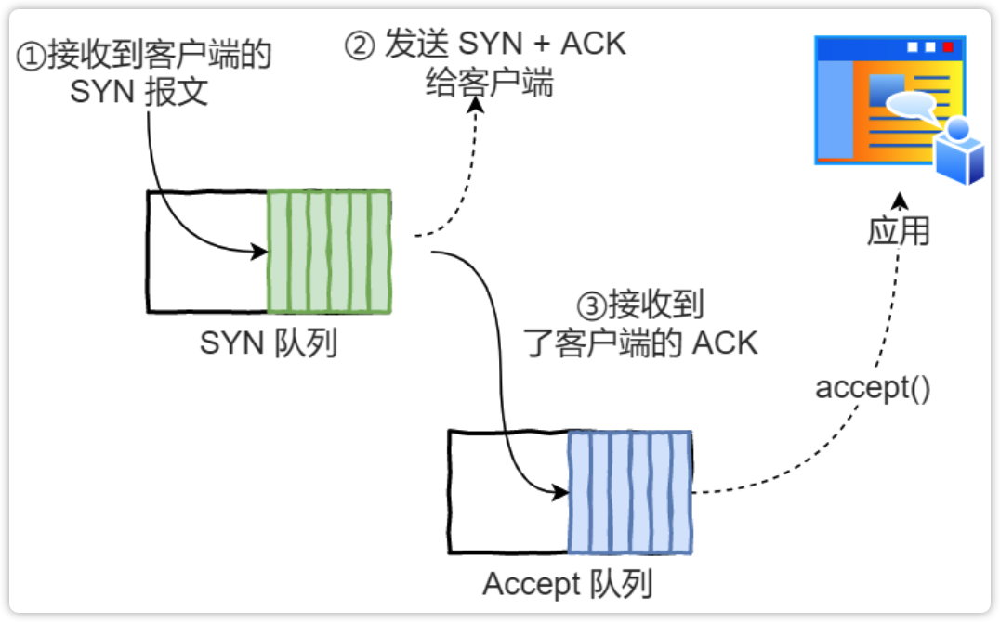

## 什么是 SYN 攻击，如何防护？

### 什么是 SYN 攻击？

攻击者只发送初始 SYN 给服务器，并不真正连接。服务器的 SYN 队列被塞满。

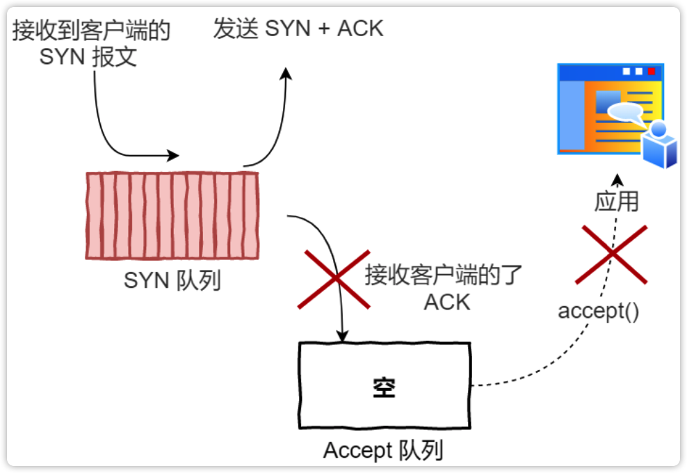

### 如何住址 SYN 攻击？

当 SYN 队列满的时候，计算出一个 cookie，并作为服务器序列号 SEQ 传送给客户端，此时并不将 SYN 入队。

1. 客户端为正常请求，通过 cookie 校验，合法则放入 accept 队列
2. 客户端为攻击者，不会发起 ACK，避免资源浪费

## TCP 挥手：TIME_WAIT 过多有什么危害？

1. 内存资源占用：在内存中保存连接信息
2. 根据发起方：服务器线程占用；客户端端口占用

## TCP 保活机制

在一段时间内如果 TCP 连接没有任何活动，便触发保活机制：向连接发送探测报文，超过最大探测次数仍然没有收到响应，便断开连接。

> 此时通常是连接一方突然崩溃或不可达，没有正常关闭造成。

触发保活后会有 3 种情况

1. 对方响应，则等待下一个触发
2. 对方应用崩溃后重启，并响应 RST 报文，则断开并重建 TCP 连接
3. 对方应用崩溃或其他原因导致不可达，则到达探测上限后断开连接。

Linux 内核中的保活机制参数（可修改）

```nginx
# 触发保活的时间，
#    超过该时间没有任何连接活动
#    便触发包含保活机制
#    7200s = 2h
net.ipv4.tcp_keepalive_time=7200

# 保活检测时间间隔，每次 75s
net.ipv4.tcp_keepalive_intvl=75

# 保活检测次数，
#    9 次检测没有响应便断开连接
net.ipv4.tcp_keepalive_probes=9
```

所以 Linux 默认情况下需要

\\[
7200 + (75 \times 9) = 7875s = 2 h\; 11 m\; 15s
\\]

才会断开连接。

## Socket 编程中 accept 出现在 TCP 握手什么阶段？

调用 `accept` 会阻塞进程，等待 accept 队列有完成了 3 次握手的连接，再返回。

---

系统调用

```c
int listen(int socketfd, int backlog)
```

中的 `backlog` 便是控制 `accept` 队列长度，与系统内核参数 `somaxconn` 相关

```
accept 队列长度 = min(backlog, somaxconn)
```


## Socket 编程：客户端调用 close 后发生了什么？

客户端发送 FIN，服务器收到 FIN 之后 TCP 协议栈会在 FIN 包末尾插入 `EOF`，服务器会感知到 FIN 报文，进入 `CLOSED_WAIT` 状态。等服务器读到 `EOF` 时便知道数据已经读完，处理完成之后调用 `close` 并发送 FIN 报文。

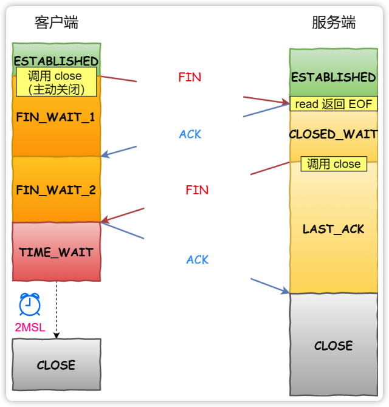

## TCP 重传机制有哪些

1. 超时重传
2. 快速重传
3. SACK: Selective Acknowledgement
4. D-SACK: Duplicate SACK

## TCP 超时重传

发送端超时没有收到对应的 ACK，进行数据包重传。

*超时时间（Retransmission Timeout, RTO）*，应该略大于 RTT。

- 太大：重传间隔大、效率低
- 太小：引起不必要的重传，加剧网络阻塞

## TCP 快速重传

目的之发现缺少报文之后，向发起端发送缺失报文的 ACK。发起方收到 3 次缺失报文的 ACK 后，立即重传。

## SACK

Selective Acknowledgement，选择性确认。利用 TCP 首部的选项字段，发送服务器接收到的缓存地图，来告知发送端缺失的报文段。

与快速重传相比，SACK 通过传递已收到的序列号来表示需要重传的序列号。 

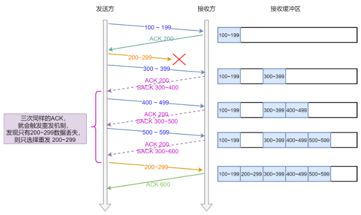

对同一报文段的 3 次 ACK 表明需要快速重传，而其中携带的 SACK 选项，表明接收端已经收到的报文段序列。

图中

```html
ACK=200
STACK=300-600
```

表明需要序列号 200 的报文段，已经收到了的是序列号为 300 到 599 的报文段。

---

Linux 使用参数打开该功能，Kernel 2.4 默认为打开。

```nginx
net.ipv4.tcp_sack
```


## D-SACK

Duplicate Selective Acknowledgement. 重复选择性确认。

选择性地确认重复传输了的包。

<u>接收端</u> 响应 ACK 超时没有被 <u>发送端</u> 收到时，<ins>发送端</ins> 会认为 <ins>接收端</ins> 没有收到报文，于是重传。此时 <u>接收端</u> 收到重复的报文段之后，向 <u>发送端</u> 发出 D-SACK 报文告知已经收到了哪些报文，而响应的报文段中的 ACK 是下一个想要收到的报文。如图

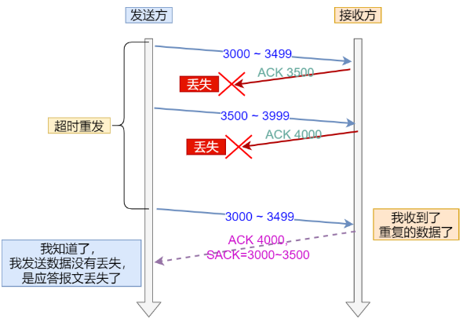

---

Linux 通过以下参数打开，Kernel 2.4 默认开启

```nginx
net.ipv4.tcp_dsack
```

## TCP：累计确认

又称累计应答，允许不对每一个报文进行确认，而确认报文的 ACK 表示已经收到了之前所有的报文。

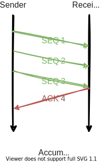

表示 SEQ 4 以前所有的报文都已经收到。

## TCP 滑动窗口

发送方维护一个窗口，只有当最左端报文被确认时，才会往右边滑动。

## TCP 滑动窗口大小由谁决定？

由接收方决定。

通过 TCP 首部中的窗口大小字段，<u>接收方</u> 会告诉 <u>发送方</u> 自己的缓冲区剩余空间大小。

## TCP 流量控制

通过 <u>接收端</u> 窗口来控制流量，避免 <u>接收端</u> 缓冲区溢出。

## TCP 窗口探测报文

如果滑动窗口的大小变为 0，<u>发送端</u> 将停止发送报文。此时 <u>发送端</u> 启动一个计时器，来探测 <u>接收端</u> 窗口是否变为大于 0，然后将 <u>接收端</u> 窗口大小放入 ACK 报文响应。

探测报文一般探测 3 次，每次间隔约 30 - 60s，如果 3 次仍窗口大小仍为 0，则发送 `RST` 断开连接。

## TCP 糊涂窗口综合症

Silly Window syndrome。当 <u>接收方</u> 取走缓冲区数据速度低于 <u>发送方</u> 发送速率时，只能不断减少发送窗口大小。当窗口减少到几字节时，在用首部就有 20 字节的 TCP 去传输，便显得不合适了。

解决方案：

1. <u>发送端</u> 不发送小数据，采用 Nagle 算法。
2. <u>接收端</u> 避免告诉太小的窗口大小，当 \\(RCV.WND < \min\{MSS, 缓存空间 / 2\}\\) 时

---

**Nagle 算法**：同时满足一下两个条件才发送数据

1. 窗口大小或数据大小 \\(\ge MSS\\)
2. 收到了之前报文的 ACK

> TCP 的 Nagle 算法默认是开启的，如果是 `telnet`、`ssh` 这样实时性高的任务，需要手动关闭

## TCP 拥塞控制是什么，有哪些算法？

*拥塞（congestion）*控制是指为了避免整个网络因为流量过大发生网络拥塞，而牺牲当前连接传输速率采取的一系列方法。

设发送窗口大小 \\(swnd\\)，接收端窗口大小 \\(rwnd\\)，**拥塞窗口大小 \\(cwnd\\)**，则有如下关系

\\[
swnd = \min\{cwnd, rwnd\}
\\]

拥塞控制算法有：

1. 慢启动
2. 拥塞避免
4. 快速恢复

## TCP 慢启动

每次收到一个 ACK，便 `cwnd + 1`。

如此，`cwnd` 实际上是指数增加。慢启动不慢！

> `cwnd` 的初始值为 1。

## TCP 拥塞避免

当 `cwnd` 超过慢启动阈值（slow start threshold）`ssthresh` 时，便启动 *拥塞避免算法*，直至触发重传（超时重传、快速重传）。

此时每收到一个 ACK，便使

\\[
cwnd= cwnd + \frac{1}{cwnd}
\\]

例如当前 \\(cwnd = 8\\) 表示一个 RTT 可以发送 8 个报文，则收到 8 个 ACK 时，才有 \\(cwnd=9\\)。

---

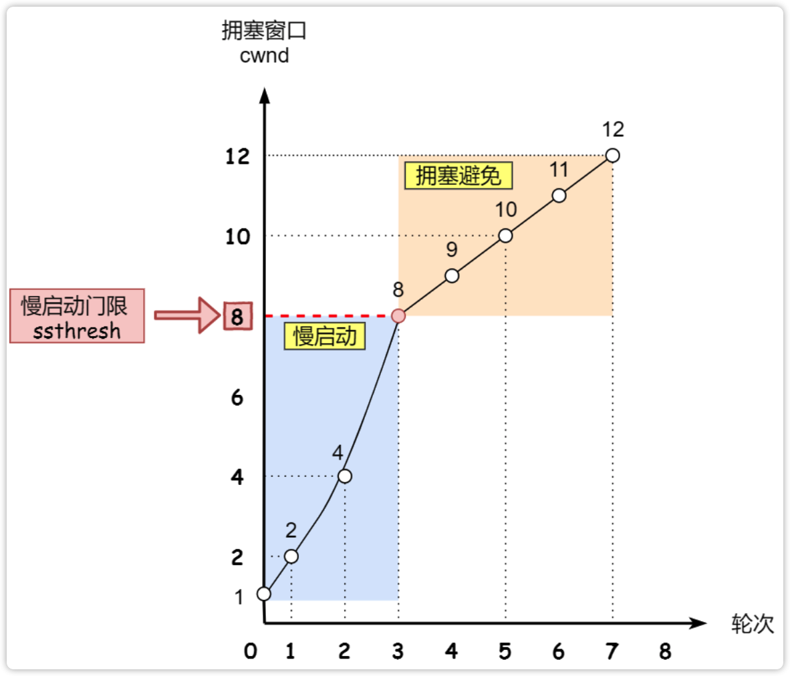

## TCP 快速恢复

由快速重传触发。所以首先修改 \\(cwnd\\) 与 \\(ssthresh\\) 的值

\\[
\begin{aligned}
cwnd     &= cwnd \div 2\\
ssthresh &= cwnd
\end{aligned}
\\]

然后执行 *快速恢复* 算法如下

1. \\(cwnd = ssthresh + 3\\)，3 是因为收到 3 个 ACK 而进入的快速重传
2. 重传丢失的包
3. 如果再次收到重复的 ACK，\\(cwnd = cwnd + 1\\)
4. 如果收到新的 ACK，则 \\(cwnd = ssthresh\\)，进入拥塞避免

> 第 4 步中，收到新的 ACK 表示前面重复的 ACK 报文已经被 <u>接收端</u> 收到，即可以恢复之前状态：拥塞避免。

## TCP 拥塞出现之后会发生什么？

### 1. 发生超时重传

\\[
\begin{aligned}
ssthresh &= cwnd \div 2\\
cwnd      &= 1
\end{aligned}
\\]

随后进入 *慢启动* 阶段。

> TCP 认为超时重传是较为严重的拥塞情况，因为此时发送方甚至连快速重传的 3 次 `ACK` 都收不到，所以此时直接将 \\(cwnd=1\) 并进入慢启动。

### 2. 快速重传

\\[
\begin{aligned}
cwnd     &= cwnd \div 2\\
ssthresh &= cwnd
\end{aligned}
\\]

随后进入 *快速恢复* 算法。

> TCP 认为这种情况略好于超时重传

## 抓包工具

1. tcpdump：Linux 抓包
2. Wireshark：跨平台

## 网络层 vs 传输层

网络层：点对点

传输层：端对端

## 什么是数据链路层

连路程负责量数据帧从一个设备传到另一个设备。

## IP 分类编址

是 IP 地址早期的分类方式，将 32 位的二进制地址分为 A-E 5 类。每一类都包含分类号、网络号、主机号。

其中

- <u>分类号</u> 采用前缀编码（Huffman 编码）
- <u>网络号</u> 用于路由器寻址
- <u>主机号</u> 表明这个分类下的网络号下面能包含的所有主机数。主机号全 `1` 表示网络号下的广播地址，全 `0` 表示网络本身。

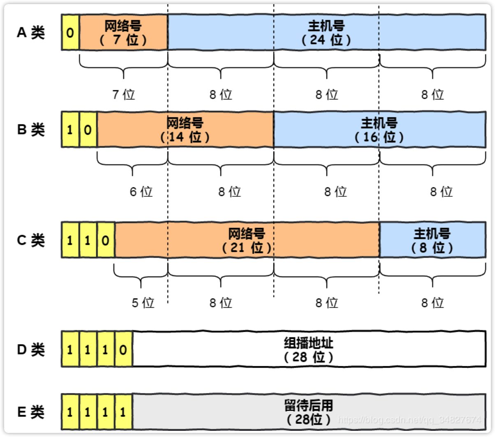

## IP 广播地址的作用

用于 <u>同一链路</u> 下所有主机下之间数据交换（收发数据包）。

## IP 广播的分类

根据广播的分组能否到达其他子网分为

### 1. 直接广播

广播的分组可以 **通过路由器** 到达其他子网。

> 路由器通常拒绝转发广播分组，所以直接广播 **没有真实使用**。

### 本地广播

广播的分组在发送主机所限制在的子网内。

> 中间可以经过其他交换机。

## D 类多播地址是什么，什么是多播？

Multicast，又称 *组播*、*群播*。

将 *数据包（packet）* 送给指定分组的所有主机。广播 plus 。


---

组播地址分类

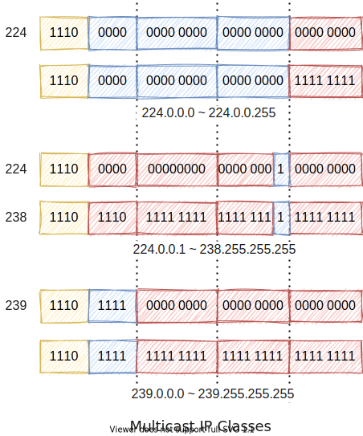

1. 局域网组播。
2. Internet 组播，用户可使用。
3. 本地管理组播，内部网内部使用。

## 单播、广播、组播

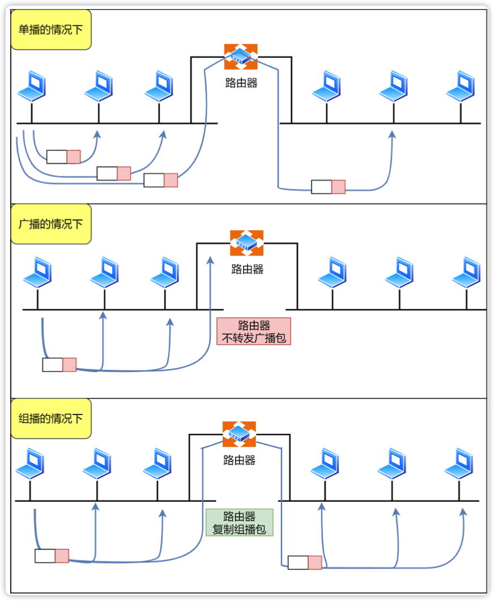

## IP 地址分类判定

```python
if addr & (1 << 31) return A;
if addr & (1 << 30) return B;
if addr & (1 << 29) return C;
if addr & (1 << 28) return D;
if addr & (1 << 27) return E;
```

## IP 分类编址的缺点

1. 同一网络号下不分层，不利于寻址
2. A、B、C 三类分址不能与现实网络匹配，C 类主机太少（254 个），B 类太多

> 解决方案是 CIDR。

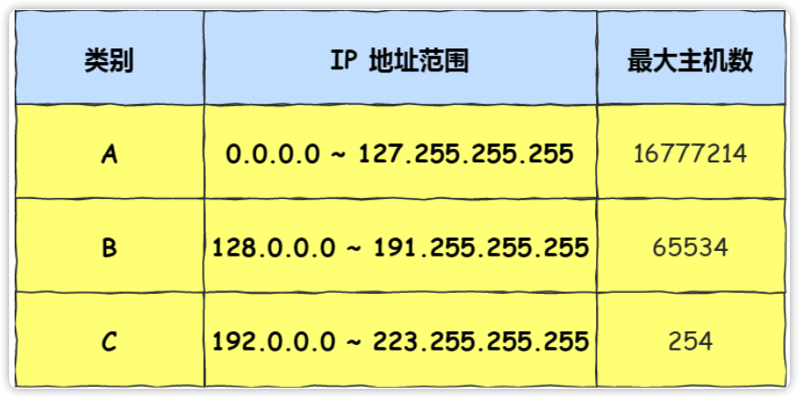

## 子网掩码（VLSM） 与 CIDR

CIDR 用于英特网寻址，VLSM 用于子网寻址。

CIDR（Classless Inter-Domain Routing，无类别域间路由选择）是因特网地址分配策略，通常一个组织会被（ISP）分配一个网络，而这个网络中组织可以有子网，子网由子网掩码确定，组织自己定义规则。ISP 不关心这个组织怎么分配，他只需要将目的地是这个网络号的分组传过去就行。

从另一个角度看，CIDR 把多个子网聚合在了一起，因此将这个过程称为 *地址聚合（address aggregation）*，也称 *路由聚合（route aggregation）*。



---

CIDR 中，`a.b.c.d/x` 的前 `x` 位称为网络前缀或网络号。

## IP 分址：分类编址、子网掩码、CIDR 之间的关系？

<u>分类编址</u> 是最早提出的 IP 地址路由和管理的方式，但是这种方式只支持两级划分，且 IP 主机数目分配不均匀，故 1985 年起增加了一个字段 “子网号字段”，提出子网掩码。

<u>子网掩码</u> 可以进一步把 IP 地址分为 *子网（subnet）号*，实现 3 级划分，把大的网络划分为小的网络。但仍然基于分类编址，不够灵活，于是提出 CIDR。

<u>CIDR</u> 则进一步则完全取消了 “分类” 的概念，使网络号长度也可变，并可以聚合子网。

> 子网掩码不够灵活：如果一个单位需要 2000 个地址，则只能使用 B 类地址，
>
> 子网掩码：又称 *变长子网掩码（Variable Length Subnet Mask, VLSM）* 是指掩盖主机号，得到子网号。与 IP 按位与，得到的便是子网号。

**参考**：

- [有类IP地址、子网掩码、无类域间路由_Flash1256的博客](http://www.cxyzjd.com/article/weixin_44740037/105949188)

## 私有地址

在 A、B、C 三类地址当中，有部分地址不会被英特网使用，这部分为私有地址，与之相对的是公网地址。公网地址可以经过 NAT 访问到私有地址。

```html
A: 10/8
B: 172.16/12
C: 192.168/16
```

## 公有 IP 地址由谁管理？

ICANN, Internet Corporation for Assigned Names and Numbers, 互联网名称与数字地址分配机构。

IANA, Internet Assigned Numbers Authority, 互联网号码分配局。

IANA 是 ICANN 下属机构，按州分配 IP 地址。

## IP 数据报分片

IP 的数据报大小受链路层链路 MTU 限制，如以太网支持 1500 字节的 MTU，表示一个数据报（包括头部），不能超过 1500 字节。如果网络层报文段长度超过了 MTU，就需要对其分片。

IPv4 中有一个片偏移字段，便是分片的序列号。

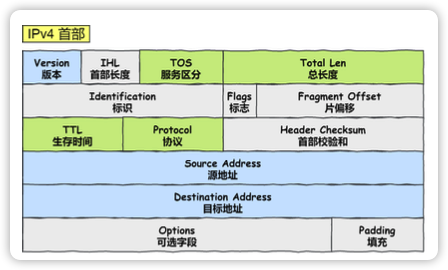

> IPv6 不允许分片。

## IPv4 vs. IPv6

1. 取消了首部校验和，避免了 TTL 每一跳改变都重新计算的开销。
2. 取消分片，分片只能由上层协议实现，路由器将不进行分片，提升效率。
3. 取消选项首部，首部长度固定为 40 字节。

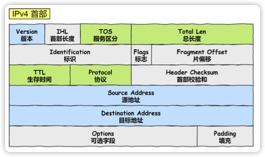

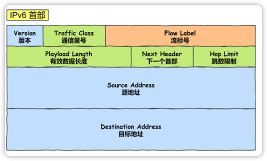


## 工作在各层的协议

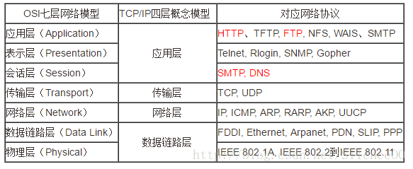

## DNS 协议及查询流程

### DNS 作用

Domain Name System, 域名系统，负责 <u>域名</u> 与 <u>IP 地址</u> 转换。

1. 查找方式：*分递归查询（recursive query）*、*迭代查询（iterative query）*。
2. 层级：根 DNS，顶级 DNS（Top-Level DNS, TLD），权威 DNS，本地 DNS
3. 运行在 53 端口号。
4. 每一层都设有缓存

### DNS 查询流程

1. 客户端查本地 DNS，递归
2. 本地 DNS 查根，迭代
3. 本地 DNS 查 TLD，迭代
4. 本地 DNS 查 权威 DNS，迭代
5. 返回并请求对应服务器

> 理论上所有查询都可以是递归的，本地 DNS 请求根 DNS，根 DNS 在递归请求其他。而实践中并没有这么做。

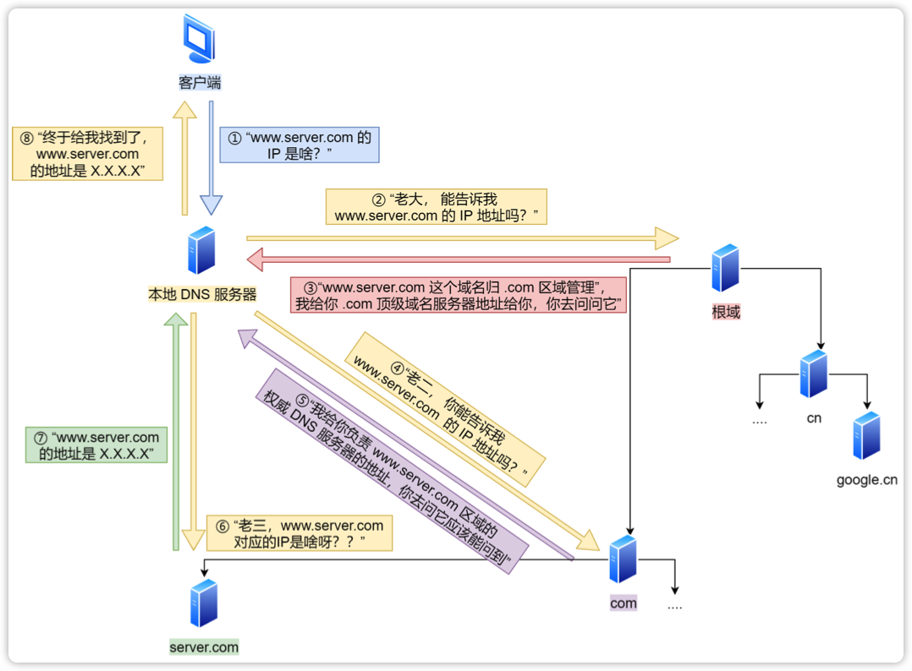

## DNS 记录

DNS 记录称为 *资源记录（Resource Record, RR）*。

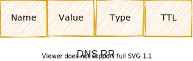

**Name 与 Value 的值取决于 Type**。

### DNS Type

#### 1. Type = A

Address。

```html
(example.com, 192.168.1.1, A)
```

#### 2. Type = AAAA

IPv6 地址解析。

```html
(example.com, ff::ff, AAA)
```

> IPv6 地址长度为 IPv4 的 4 倍，故 AAAA

#### 2. Type = NS

Name Server。DNS 服务器

```html
(foo.com, dns.foo.com, NS)
```

要知道 `foo.com` 就去询问 DNS 服务器 `dns.foo.com`，然后再通过 A 记录查询到 DNS 服务器的 IP

```html
(dns.foo.com, 222.222.22.22, A)
```

### 3. Type = CNAME

Canonical Name，规范主机名。主机的别名。

```html
(foo.com, www.foo.com, CNAME)
```

`foo.com` 是 `www.foo.com` 的别名。

#### 4. Type = MX

Mail，邮件服务器的规范主机名。允许邮件服务器有别名。

```html
(foo.com, mail.bar.foo.com, MX)
```

> MX 与 CNAME 可以有相同 Name 的记录，同过不同的服务器区分，请求不同类型的记录。

## ARP

Address Resolution Protocol，地址解析协议，IP to MAC。

当一个包需要发送到下一跳时，需要 MAC 地址，此时如果当前节点没有下一跳的 MAC 地址，就需要 ARP 获取下一跳的 MAC 地址。

首先当前节点查询自己的 ARP 表，如果不包含下一跳 IP 的设备的 MAC 地址，就通过 **广播** 的方式发送一个 ARP 请求报文，称 *ARP 查询分组（ARP query packet）*，目的 MAC 地址为 `FF-FF-FF-FF-FF-FF`，随后收到广播的适配器检查ARP 分组中的 IP 地址，如果与自己的匹配，就返回一个 ARP 响应分组。当前节点收到响应分组后，便更新自己的 ARP 表

---

ARP 表示例

> 按需添加表项，删除过期表项

| IP              | MAC               | TTL      |
| --------------- | ----------------- | -------- |
| 222.222.222.222 | 88-B2-2F-54-1A-0F | 13:46:00 |

## RARP

Reverse ARP，MAC to IP。

最初是为了无盘工作站设计，通过 MAC 地址解析得到 IP 地址，后来被 BOOTP 协议取代，随后又被 DHCP 取代。

> 路由器的静态 IP 也是由 DHCP 分配

需要搭建 RARP 服务器

1. NIC 发起 RARP 广播
2. RARP 接收查询分组并响应

## DHCP

Dynamic Host Configuration Protocol，动态域名解析服务。

基于 UDP，端口号：服务器 67，客户端 68，整个过程都使用 IP 广播。

1. **DHCP 发现报文（DHCP DISCOVER）**：
2. **DHCP 提供报文（DHCP OFFER）**：网络中可能存在多个 `DHCP` 服务器，每个服务器返回一个 `OFFER` 报文。
3. **DHCP 请求报文（DHCP REQUEST）**：客户端在收到的 `OFFER` 报文中选择一个并向 **选中的服务器** 响应 `REQUEST` 报文，其中包含选择的参数。
4. **DHCP ACK 报文（DHCP ACK）**：服务器响应 `ACK` 报文，应答 `REQUEST` 报文要求的参数。

---

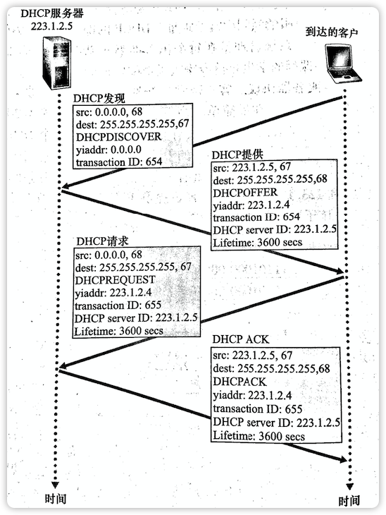

> 其中 `yiaddr` 表示 your ip address，指分配给客户端的 IP 地址。

## DHCP 中继代理

DHCP 获取 IP 地址的全过程都是通过 IP 广播，这就要求每一个子网都必须设置一个 DHCP 服务器，为了解决这个问题，使用 DHCP 中继代理，对不同网段的 IP 地址分配，也通过同一个 DHCP 服务器进行同一管理。

## NAT & NAPT

> NAT, Network Address Translation，网络地址转换。
>
> NAPT, Network Address and Port Translation, 网络地址与端口转换

路由器通过动态的修改 IP 请求的头信息中的源 IP 地址，源端口号（NAPT），来达到将私有地址转为公有地址的目的。

- 普通的 NAT 是 one-to-one，将一个 IP 转换成另一个 IP。
- NAPT 是 one-to-many，将多个私有 IP 转化为同一个公网 IP。这么做是为了解决网络地址紧缺问题，NAT 使一个子网可以共用一个公网 IP 地址。

---

**NAPT 转换表举例**

| WAN              | LAN                |
| ---------------- | ------------------ |
| 公有 IP:端口号   | 私有 IP:程序端口号 |
| 138.76.29.7:5001 | 10.0.0.1:3345      |

## NAT 的问题级解决方案

| 问题                                                         | 解决方案                                |
| ------------------------------------------------------------ | --------------------------------------- |
| 外部无法主动与内部设备通信，因为 NAPT 表需要内部访问时才能建立 | 使用 IPv6，给每一个 NIC 分配一个公网 IP |
| 转换表生成及转换操作有性能开销                               |                                         |
| 通信过程中 NAT 路由器重启，会导致所有 TCP 连接被重置         | 采用 NAT 穿透技术                       |

## NAT 穿透（traversal）

应用程序自己实现 NAPT，不需要路由器来修改头信息。

应用程序能主动发现自己位于 NAT 设备之后，并主动获取 NAT 设备的公有 IP，自己建立端口映射条目。这样即使路由器重启，也可以恢复之前的映射。

## ICMP

> Internet Control Message Protocol, 互联网控制报文协议。

工作在网络层。有主机和路由器用力啊彼此沟通网络层信息，如报告差错、查询可达性。

> 如 TTL 减少到 0，会向源主机发送一个 ICMP 报文。

---

ICMP 报文结构

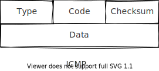

常见 ICMP 类型及编号

| 类型 | 编号 | 种类 | 描述                                        |
| ---- | ---- | ---- | ------------------------------------------- |
| 0    | 0    | 查询 | 回显回答（echo reply），ping 的回答         |
| 3    | 0    | 差错 | 目标网络不可达（`type = 3` 都是目标不可达） |
| 3    | 1    | 差错 | 目标主机不可达                              |
| 4    | 0    | 差错 | 源抑制（拥塞控制）                          |
| 5    | 0    | 差错 | 重定向或改变路由                            |
| 8    | 0    | 查询 | 回显请求（echo request），ping 请求         |
| 11   | 0    | 差错 | TTL 过期                                    |

## IP 首部上层协议类型

| 协议类型 | 协议  |
| -------- | ----- |
| 1        | ICMP  |
| 2        | IGMP  |
| 6        | TCP   |
| 17       | UDP   |
| 50       | IPsec |

## IGMP

>  Internet Group Management Protocol, 互联网组播管理协议。工作在 **网络层**，使用 IP 封装。

用于控制网络中的主机加入或退出组播，一台路由器连接的主机并不全加入组播网络，而是当他发起 IGMP 个路由器之后才加入，之后路由器收到目的地址为组播地址（D 类地址）时，才将报文发送给所有已加入组播的主机。

## ping 的工作原理

利用 ICMP 报文的 `type = 8` 回显请求，`type = 0` 回显应答。报文在 ICMP 的基础上，增加了 2 个字段。

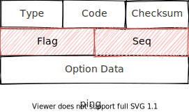

1. **标识符**：区分哪个应用程序发送的 ICMP 包，比如进程 `PID`。
2. **序号**：从 `0` 开始，每一次发送回显请求便自增 `1`。
3. **数据**：存放发送请求的时间，可以计算往返时间。

## traceroute

windows 下是 `tracert`，有两个作用

1. 查询当前主机到目的中间路由器信息
2. 查询 `MTU`

---

原理

1. 将 IP 首部的 TTL 字段从 `1` 开始递增，直到到达目的主机，每一个中间路由器都会响应 ICMP 报文，包含该路由器信息。
2. 将 IP 首部的 <u>禁止分片标志位</u> 设为 `1`，当路由器需要对数据报进行分片时，发现不能分片，于是丢弃数据报并报告 ICMP 报文，表示 **“需要进行分片但设置了不可分片位”**，ICMP 报文包含了该路由器的 `MTU`。

## Linux 查看路由表

```bash
route -n
```

结果如下

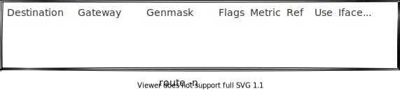

MacOSX 中使用

```bash
route -n get <destination>
```

来查看目的地的路由表项，结果与 Linux 也有差异。

> `-n` for numbers，打印 IP 而非主机名，因为打印主机名会引起查询耗时。 

## Linux 怎么查看 ARP 表

```bash
arp -a
```

> MacOSX 相同

## TCP/IP 协议栈如何找出接收端 socket ？

传输层根据四元组（源 IP，源端口号，目的地 IP，目的地端口号）找出对应 socket（TCP、UDP），并把数据拷贝到该 socket 接收缓冲区，等待读数据。

## 以太网帧结构



类型（16 进制），表示上层协议类型

- `0800`：IP
- `0806`：ARP

## 交换机基本功能

交换机的作用是对分组进行 **过滤** 和 **转发**。

*过滤（filtering）* 是指决定一个帧应该被 <u>转发</u> 还是 <u>丢弃</u>。

*转发（forwarding）* 则是决定帧应该从哪个分组传出。

## 交换机工作原理

当一个分组从端口 `x` 到达时，有三种情况

1. 交换机表中无对应 MAC 地址：广播该帧，称泛洪flood
2. MAC 表项对应的端口 \\(\neq\\) `x`：转发
3. `=x`：丢弃

随后交换机将这个分组的 MAC 地址和到达端口 `x` 记录在交换机表中。

> 关于第 3 种情况（`=x`）表明 <u>帧</u> 是从该端口进入，则目的 MAC 跟 `x` 应该同网络，此时不需要转发。

## 什么是冲突域？

以太网中可能发生碰撞的节点的集合。

以太网的信道是共享的，采用的是竞争的方式。如果两个节点同时发信息，必定会发生碰撞。

以太网采用 *CSMA/CD（Carrier Sense Multiple Access with Collision Detection, 带有冲突检测的载波侦听多路访问）* 避免冲突：先听后发、边听边发、碰撞后随机延迟重发；碰撞停发。

## 什么是 CSMA/CA

CSMA/CA, Carrier Sense Multiple Access with Collision Avoidance，带 **冲突避免** 的载波监听访问，主要用于无线网络，在发送数据之前先检测信道使用，接收数据之后需要发送 ACK 确认帧。

## 交换机性质

1. 自学习：交换机会将每个收到分组的 MAC 地址和来源端口记录在交换机表中。
2. 消除碰撞：
3. 连接异质的链路：可以连接不同速度的链路。
4. 冲突隔离：同一端口的信息不会被传到另外一个端口连接的网络。
5. 无 MAC 地址：交换机本身不检查到达帧的 MAC 地址，而只做存储转发。

## 交换机表

控制信息：如加入时间，通常 60 min 没有活动的表项会被删掉。

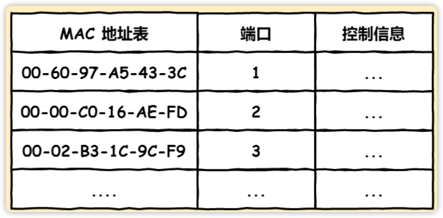

## BGP 做什么的

> BGP, Border Gateway Protocol，边界网关协议。**端口号 179**。

*AS（Autonomous System，自治系统）* 之间的路由选择协议。分组通过 CIDR 前缀进行路由，到一个 AS 的 *网关路由器（gateway router）*，网关路由器再通过 *内部路由器（internal router）* 转发到目标主机。

网关路由器是位于 AS 边缘的路由器，它直接与另一个 AS 的网关路由器。

## 路由器转发表

通过转发子网掩码（或 CIDR 前缀）与目标 IP 地址 按位与运算得到的网络号与路由表中的目标地址对比，确定转发端口。

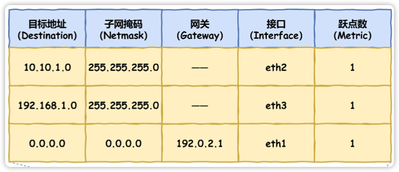

> 目的地址 `0.0.0.0` 表示 catchall。

## AS 是什么意思

Autonomous System，自治系统。一个自治的网络。

## 链路层多路访问

### 1. 信道划分协议（Channel partition protocol）

1. TDM, Time Division Multiplexing, 时分复用
2. FDM, Frequency Division Multiplexing, 频分多路复用
3. CDMA, Code Division Multiple Access, 码分多路复用

### 2. 随机接入协议（Random access protocol）

1. 时隙 ALOHA
2. ALOHA
3. CSMA：基于 ALOHA
4. CSMA/CD

### 3. 轮流协议（Taking-turns protocol）

1. 轮询协议（polling protocol）：蓝牙
2. 令牌传递协议（token-passing protocol）

## 输入网址后访问的协议

1. DNS
2. UDP：DNS 使用 UDP
3. HTTPS
4. TCP
5. IP
6. ARP
7. CSMA（CD for ethernet or CA wireless）
8. OSPF：开放最短路径优先
9. BGP

> OSPF 与 BGP 均是路由选择协议

## 路由生成算法

1. 手动配置
2. 路由选择算法动态生成

## 路由选择算法

- **链路状态（Link State, LS）**：如 Dijkstra 算法，OSPF 协议
- **距离向量（Distance Vector, DV）**：如 RIP

## DV 的毒性逆转

> *毒性逆转（poisoned reverse）* 解决 *路由环路（routing loop）*、*无穷计数（count-to-infinity）* 问题。

如果 `z` 通过 `y` 到达目的地 `x` ，则 `z` 通告 `y`，`z` 到 `x` 的直接距离是 \\(\infty​\\)。



> 连接线上的数字代表开销。

## 路由选择协议

- OSPF：AS 内部路由选择
- BGP：AS 之间路由选择

> AS，Autonomous System，自治系统。如 ISP 内部。

## 邮件传输协议

SMTP 是发，其他是收。

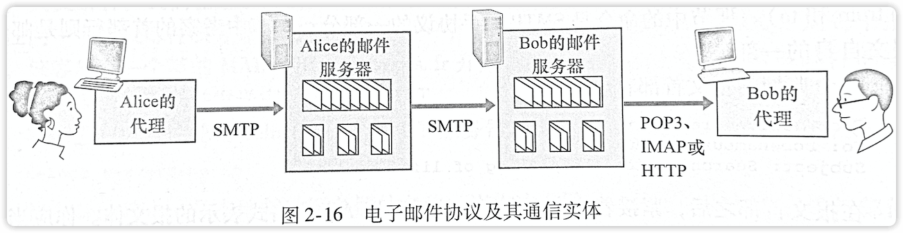

## UDP 数据报传输过程

UDP 是无连接协议，区别于 TCP，对上层数据没有大小限制，而是交给 IP 协议决定是否分片。到了接收端，则是放入接收端 socket 缓冲区（socket buffer, skb）中，等待 `rcvfrom(2)` 系统调用读出。

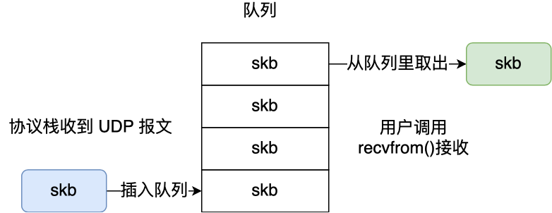

## todo

WiFi 协议

什么协议工作在哪层，使用的端口号是什么

