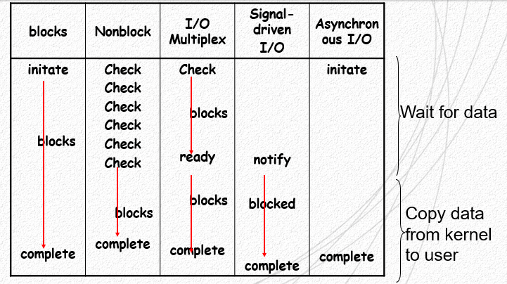
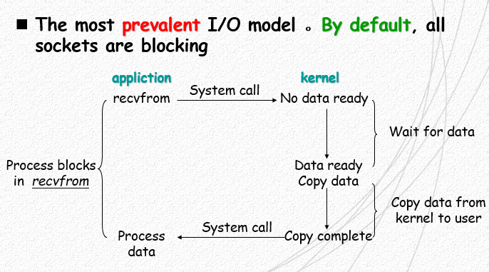
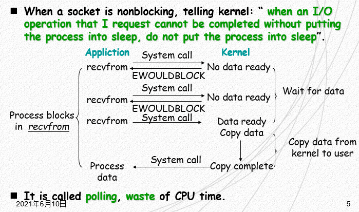
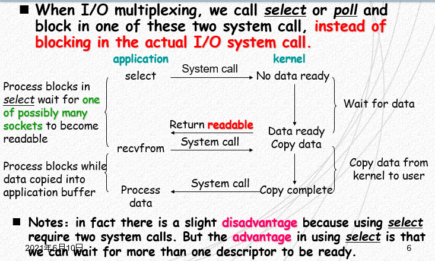
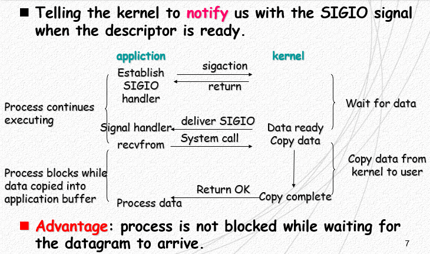
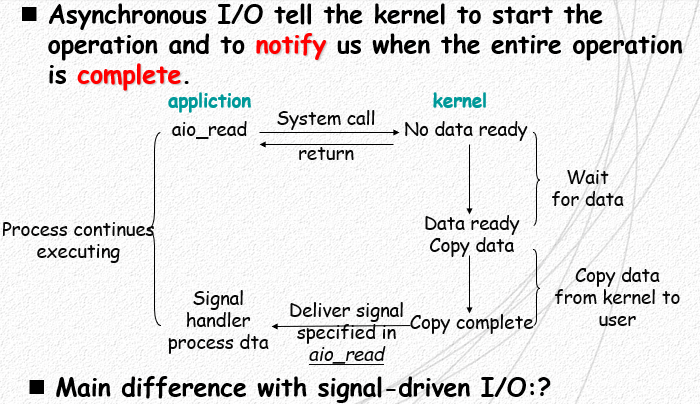
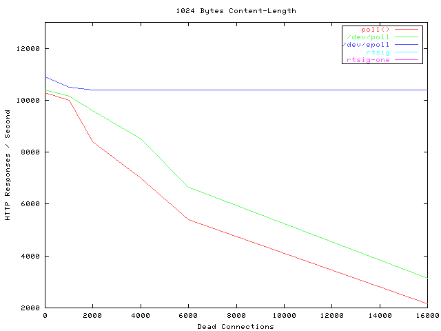

# OS

## 进程间通信的方式有哪些？

1. 消息
2. 共享内存
3. 信号量
4. 软中断信号
5. 管程：通过程序语言实现并定义了共享数据及其操作，使用 wait， signal 进行进程间通信。
6. 管道
7. socket：网络中的进程与进程间通信

## 为什么文件使用完了需要close？

文件打开需要在操作系统中建立

- 进程文件描述符表项
- 内核文件表表项

若不关闭，则会一直暂用这些表现，浪费资源

> inode 表表项<ins>可能</ins>存在浪费

## 5 种 IO 模型分别是什么？

进程向内核发出 IO 请求，内核检查是否有准备好数据。这个过程中的交互方式可以分为 5 种模型

1. 阻塞 blocks: 没有数据准备好时，进程进入睡眠态，直到有数据时被唤醒，期间不能做其他工作，知道 IO 完成，数据从内核态拷贝到用户态
2. 非阻塞 non-block: 请求进程不进入睡眠态，可以继续执行其他任务，通过轮询的方式询问内核是否有数据，而后阻塞的拷贝数据。
3. 多路复用 multiplexing：阻塞的是 `select` 系统调用的进程，而非请求进程，当有数据时再调用请求进程进行数据拷贝。
4. 信号驱动 signal driven: 请求进程向内核发出 IO 请求之后便去做其他事，内核当有数据准备好时，便向请求进程发起 `SIGIO` 信号。
5. 异步 I/O asynchronous: 与 “信号驱动” 类似，区别在通知的时机，通过与内核共享内从，当数据拷贝完成后，才通知请求进程。



> - 阻塞是指请求进程（线程）被阻塞。
> - 除了 <ins>异步 IO 模型</ins>，其他模型都在 **读** 操作时，进行了阻塞。

### IO 总结

除了 **异步 IO**，其余在拷贝数据时都会发成阻塞。Block IO 在发起 IO 请求之后进入睡眠，不能处理其他任务，其他模型（除了多路复用）则可以。

## 什么是同步 IO，什么是异步 IO？

- **同步 IO**：会引起请求线程的阻塞，直到 IO 操作完成
- **异步 IO**：由始至终，不会引起请求线程的阻塞

## IO: 什么是阻塞 IO？

请求进程被阻塞，进入睡眠态，直到 IO 完成。



## IO: 什么是非阻塞 IO ？

Non-block IO 时，请求进程采用轮询（polling）的方式，询问 IO 是否结束，而不进入睡眠态。请求进程可以向 *内核* 发起 IO 请求之后，继续做其他的事，然后不时的去询问内核是否有 IO ready。

这种方式会浪费 CPU 时间（轮询）。



## IO: 什么是多路复用？

多路复用模型中，使用系统调用 `select`, `poll`, `epoll` 阻塞式的等待内核数据 ready，当有 ready 时，再调用 IO 请求进程，这样便不用阻塞请求进程，当数据准备好时再通过系统调用将数据读出。

这样的好处是只用一个进程阻塞，不用为每个 socket 都创建一个阻塞进程，节约了系统资源。缺点是每次 IO 都需要两个系统调用 (`select`, `read`)

其中 `select`, `poll` 采用轮询的方式查询是否有数据准备好；`epoll` 采用信号的方式，由内核通知进程。

> `epoll` 与<ins>信号驱动</ins>的区别：`epoll` 由三方进程收 “data ready” 信号，之后调用 IO 请求进程；信号驱动则是只接通知请求进程。



## IO: 什么是信号驱动 IO 模型

请求进程通知内核，当数据准备完成后，使用 `SIGIO` 通知该进程。这个过程中进程不用阻塞，可以继续执行其他任务。



Java 中使用 `sun.misc` 包下的 `Signal`, `SignalHandler` 等类可以实现信号驱动模型。

```java
Thread thread = new Tread(new NotifyMeWhenReady());
// Setup signal handler
Signal.handle(new Signal("SIGIO"), handler);
thread.start();
//   do other stuff simultaneously
```

### Handler

```java
SignalHandler handler = signal -> {
    // do something after receive
    // signal SIGIO
}
```

### NotifyMeWhenReady

```java
Signal.raise(new Signal("SIGIO"));
```

## IO: 什么是异步 IO 模型？

请求进程告诉内核，当 IO 完成，并将数据传输到了请求进程的用户态下，再通知请求进程 IO 完成。



## select/poll/epoll 之间的关系

时间顺序：select -> poll -> epoll



<center>性能对比</center>

### 关系

### select

1. 只支持1024个 sockets
2. 只会返回数据，不会告知来源于哪个 socket
3. 会修改传入数组
4. 非线程安全

### poll

- 解决了 1、2、3，3个问题

### epoll (event poll)

- 增加了线程安全
- 仅仅 Linux 支持

See also: [IO 多路复用是什么意思？ - 知乎](https://www.zhihu.com/question/32163005)

## 有了 epoll 是否就不需要其他调用了，为什么？

`select`, `poll`, `epoll` 有着不同的应用场景

**select**:

1. **时间精度**：`select` 的 timeout 参数精度为 1ns，而 `poll` 和 `epoll` 为 1ms，因此 `select` 更加适用于实时性要求比较高的场景，比如核反应堆的控制。
2. **可移植性**：`select` 可移植性更好，几乎被所有主流平台所支持

**poll**:

1. `poll` 没有最大描述符数量的限制，如果平台支持并且对实时性要求不高，应该使用 `poll` 而不是 `select`。

**epoll**:

1. 运行在 Linux 平台上，有大量的描述符需要同时轮询
2. 描述符变化频繁且生存期短暂，没必要使用 epoll，维护红黑树需要大量消耗。

