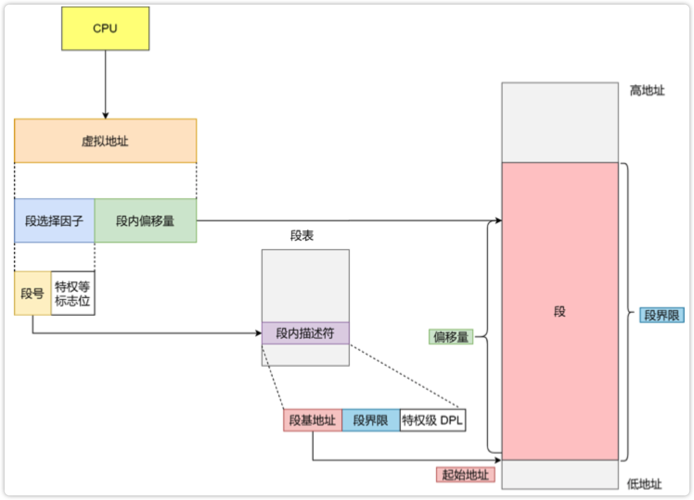
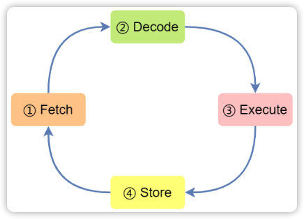
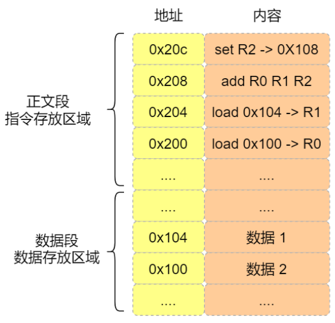
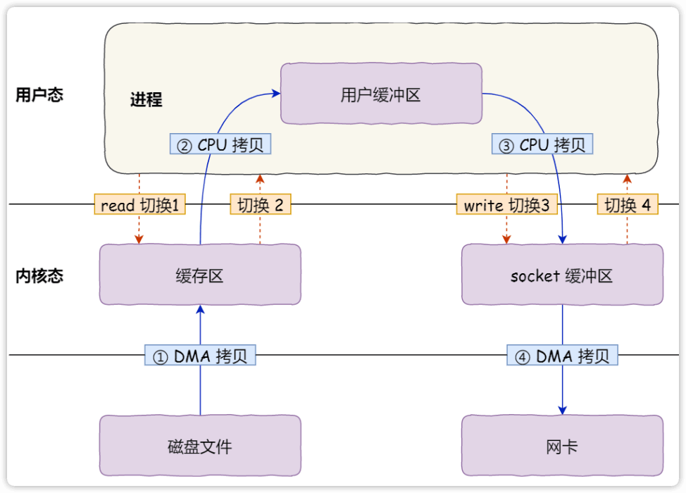

# OS

## 进程间通信的方式有哪些？

1. 消息
2. 共享内存
3. 信号量
4. 软中断信号
5. 管程：基于信号量通过程序语言实现并定义了共享数据及其操作，使用 wait， signal 进行进程间通信。Java 的 *监视器（Monitor）* 模型就是管程的实现之一。
6. 管道
7. socket：网络中的进程与进程间通信

> 管程：管理资源的过程

## 为什么文件使用完了需要close？

文件打开需要在操作系统中建立

- 进程文件描述符表项
- 内核文件表表项

若不关闭，则会一直暂用这些表现，浪费资源

> inode 表表项<ins>可能</ins>存在浪费

## 5 种 IO 模型分别是什么？

进程向内核发出 IO 请求，内核检查是否有准备好数据。这个过程中的交互方式可以分为 5 种模型

1. 阻塞 blocks: 没有数据准备好时，进程进入睡眠态，直到有数据时被唤醒，期间不能做其他工作，知道 IO 完成，数据从内核态拷贝到用户态
2. 非阻塞 non-block: 请求进程不进入睡眠态，可以继续执行其他任务，通过轮询的方式询问内核是否有数据，而后阻塞的拷贝数据。
3. 多路复用 multiplexing：阻塞的是 `select` 系统调用的进程，而非请求进程，当有数据时再调用请求进程进行数据拷贝。
4. 信号驱动 signal driven: 请求进程向内核发出 IO 请求之后便去做其他事，内核当有数据准备好时，便向请求进程发起 `SIGIO` 信号。
5. 异步 I/O asynchronous: 与 “信号驱动” 类似，区别在通知的时机，通过与内核共享内从，当数据拷贝完成后，才通知请求进程。


> - 阻塞是指请求进程（线程）被阻塞。
> - 除了 <ins>异步 IO 模型</ins>，其他模型都在 **读** 操作时，进行了阻塞。

### IO 总结

除了 **异步 IO**，其余在拷贝数据时都会发成阻塞。Block IO 在发起 IO 请求之后进入睡眠，不能处理其他任务，其他模型（除了多路复用）则可以。

## 什么是同步 IO，什么是异步 IO？

- **同步 IO**：会引起请求线程的阻塞，直到 IO 操作完成
- **异步 IO**：由始至终，不会引起请求线程的阻塞

## IO: 什么是阻塞 IO？

请求进程被阻塞，进入睡眠态，直到 IO 完成。


## IO: 什么是非阻塞 IO ？

Non-block IO 时，请求进程采用轮询（polling）的方式，询问 IO 是否结束，而不进入睡眠态。请求进程可以向 *内核* 发起 IO 请求之后，继续做其他的事，然后不时的去询问内核是否有 IO ready。

这种方式会浪费 CPU 时间（轮询）。


## IO: 什么是多路复用？

多路复用模型中，使用系统调用 `select`, `poll` 阻塞式的等待内核数据 ready，当有 ready 时，再调用 IO 请求进程，这样便不用阻塞请求进程，当数据准备好时再通过系统调用将数据读出。此外后来出现的 `epoll` 采用数据驱动，等待内核准备数据，当数据准备好时，再通过信号通知 `epoll` 进程可以开始读数据了。不管是 `select`, `poll`, `epoll` 中的哪种系统调用，从内核读数据的过程，都是阻塞式的。

这样的好处是只用一个进程阻塞，不用为每个 socket 都创建一个阻塞进程，节约了系统资源。缺点是每次 IO 都需要两个系统调用 (`select`, `read`)

其中 `select`, `poll` 采用轮询的方式查询是否有数据准备好；`epoll` 采用信号的方式，由内核通知进程。

> `epoll` 与<ins>信号驱动</ins>的区别：`epoll` 由三方进程收 “data ready” 信号，之后调用 IO 请求进程；信号驱动则是只接通知请求进程。


## IO: 什么是信号驱动 IO 模型

请求进程通知内核，当数据准备完成后，使用 `SIGIO` 通知该进程。这个过程中进程不用阻塞，可以继续执行其他任务。


Java 中使用 `sun.misc` 包下的 `Signal`, `SignalHandler` 等类可以实现信号驱动模型。

```java
Thread thread = new Tread(new NotifyMeWhenReady());
// Setup signal handler
Signal.handle(new Signal("SIGIO"), handler);
thread.start();
//   do other stuff simultaneously
```

### Handler

```java
SignalHandler handler = signal -> {
    // do something after receive
    // signal SIGIO
}
```

### NotifyMeWhenReady

```java
Signal.raise(new Signal("SIGIO"));
```

## IO: 什么是异步 IO 模型？

请求进程告诉内核，当 IO 完成，并将数据传输到了请求进程的用户态下，再通知请求进程 IO 完成。


## select/poll/epoll 之间的关系

时间顺序：select -> poll -> epoll


<center>性能对比</center>

### 关系

### select

1. 只支持1024个 sockets
2. 只会返回数据，不会告知来源于哪个 socket
3. 会修改传入数组
4. 非线程安全

### poll

- 解决了 1、2、3，3个问题

### epoll (event poll)

- 增加了线程安全
- 仅仅 Linux 支持

See also: [IO 多路复用是什么意思？ - 知乎](https://www.zhihu.com/question/32163005)

## 有了 epoll 是否就不需要其他调用了，为什么？

`select`, `poll`, `epoll` 有着不同的应用场景

**select**:

1. **时间精度**：`select` 的 timeout 参数精度为 1ns，而 `poll` 和 `epoll` 为 1ms，因此 `select` 更加适用于实时性要求比较高的场景，比如核反应堆的控制。
2. **可移植性**：`select` 可移植性更好，几乎被所有主流平台所支持

**poll**:

1. `poll` 没有最大描述符数量的限制，如果平台支持并且对实时性要求不高，应该使用 `poll` 而不是 `select`。

**epoll**:

1. 运行在 Linux 平台上，有大量的描述符需要同时轮询
2. 描述符变化频繁且生存期短暂，没必要使用 epoll，维护红黑树需要大量消耗。

## 什么是 CPU 密集型

CPU-bound，也称 *计算密集型（computation intensive）*，bound 指限制，CPU-bound 指系统的性能受 CPU 限制。也就是说磁盘 I/O、内存访问相对而言资源丰富许多。如圆周率计算，几乎不需要磁盘 I/O 主要是 CPU 的计算。

**最佳线程数 = CPU 执行核心数/（1-阻塞系数）**

## 什么是 I/O 密集型

IO intensive, I/O-bound，bound 指限制，I/O-bound 指系统性能受磁盘 I/O 限制。此时 CPU 资源相对丰富，应尽量减少 I/O 操作。如 MyISAM 索引压缩，可以将索引所占空间减少到 1/10 大小，对 I/O 密集型的性能提升显著。

## CPU 密集型 与 I/O 密集型的特点

*CPU 密集型* 主要考虑执行效率，所以使用 C 语言编程。线程数应该等于核心数

*I/O 密集型* 大部分时间都在 I/O，因此用 C 编程不会比 Python 提高多少。如 Web 应用

## 为了优雅的退出程序，应该捕获哪些信号？

1. SIGTERM
2. SIGQUIT
3. SIGINT

## SIGKILL 是什么信号，能捕获吗？

SIGKILL，9，不能捕获。

## 内存管理：虚拟内存

操作系统用来防止多个程序 *物理内存地址（Physical Memory Address）*冲突的解决方案，引入虚拟内存之后，程序不用考虑物理地址。

CPU 提供了 *内存管理单元（Memory Management Unit, MMU）* 来做 *虚拟内存地址（Virtual Memory Address）*到物理地址的映射。


## 内存管理：段式管理

将程序分为若干个逻辑段：代码段、数据段、栈段、堆段。每一段对应一段连续的物理地址。

**查找表**：段表，保存了段的基地址（起始物理地址）、段界限（段长）等。

虚拟内存地址结构

1. 段选择子：保存在寄存器中，其中包含段号，保存段表的索引。
2. 段内偏移量：在内存中，相对于段基地址的偏移量。



## 内存管理：分段的问题

1. 内存碎片：段是连续的空间，当不断申请、释放内存时，导致一些不足以载入一个程序的碎片空间。
2. 内存交换效率低：每次对换一个段，段相对较大，可能导致整个性能卡顿。

> 解决方案：引入页式存储管理。


### 内存管理：内存碎片分类

1. 外部内存碎片：产生的多个不连续的小物理内存，会导致程序无法被装载。
2. 内部内存碎片：分配的内存大于所需，导致浪费。

> 外部内存碎片可以使用内存交换解决：将段换出、换入，以改变其对应的物理地址，整理碎片。


## 内存管理：页式管理

将虚拟内存与物理内存分为大小相同的页，Linux 中页大小为 `4KB`。

页在内存中的管理是 LRU。

为了提高效率，同时引入了映射换缓冲区：地址旁路缓冲（Translation Lookaside Buffer, TLB），又称页表缓存、快表。


## 内存管理：一级分页有什么问题？

如果只有一级分页，对于 32 位 CPU，需要做到 0 到 4G 的物理页映射。设一个物理页大小为 `4KB` ，一个页表项占用 4 bytes，指向一个物理页。则映射 4G 的物理内存，需要 \\(2^{32} \div (4 * 2^{10})=2^{20}\\) 个表项，占用 `4MB` 的空间。如果有 100 个进程，则需要占用 `400MB` 的内存空间。

## 内存管理：为什么需要多级分页

为了解决只有一级分页的问题，页表过大的问题，引入多级分页。

根据 **局部性原理**，进程运行时只需要加载一部分资源到内存。

使用 `1K` **一级页表** 表项覆盖 `4G` 的存储空间，每个 **二级页表** 保存 `1K` 的表项， **二级页表** 动态按需创建。


## 内存管理：64 位分页式管理

64 位 CPU 可操作的内存范围很大，二级分页不够。于是 64 位操作系统将内存分为 4 级。

1. 全局页目录（Page Global Directory, PGD）
2. 上层页目录（Page Upper Directory, PUD）
3. 中间页目录（Page Middle Directory, PMD）
4. 页表（Page Table，PT），其表项为 PTE（Page Table Entry）


## 内存管理：TLB

> Translation Lookaside Buffer，旁路缓存，又称页表缓存、快表。

虽然多级地址解决了进程内存占用问题，但同时也让虚拟内存地址到物理内存地址转换成本更高。根据局部性原理，可以增加一个缓存 **硬件**，用于 **存储最常访问的几个页表项**。


## 内存管理：MMU 是做什么的？

在整个处理器中，封装了 MMU，TLB。MMU 用于地址转换及与 MMU 交互。


## 内存管理：段页式管理

将段式内存管理与页式内存管理结合起来。

**地址结构**


**转换过程**


## 内存管理：Linux 的内存管理

Intel 80268 开始支持段式内存管理，80386 开始支持页式内存管理。但是页式管理是在段式管理的基础上。


而 Linux 使用的是页式管理，为了绕过段式管理单元，**Linux 将每个段的地址都从 0 开始覆盖整个内存空间**，所有段包含虚拟页地址相同。包括 Linux 操作系统本身的代码和应用程序，面对的都是相同的线性地址（虚拟地址）。这样，**段的作用就只用于访问控制和内存保护**。

Linux 中，虚拟地址空间又分为两部分，**用户空间** 与 **内核空间**。


由于内核共享同一段物理内存空间（如睡眠进程列表，每个进程都能在访问到），所以内核空间对每一个进程而言，内核空间都有相同的映射。


所有进程可以使用的虚拟内存编址范围

- 对于 `32` 位操作系统是 `0-3GB`
- 对于 `64` 位操作系统是 `0-128T`，

## 内存管理：32 位 Linux 系统中用户空间分布


从低到高

1. **保留**：未使用
2. **程序文件（.text）**：二进制可执行代码
3. **已初始化数据（.data）**：已经初始化的全局变量
4. **未初始化数据（.bss, Block Started by Symbol）**：未初始化的全局变量
5. **堆**：动态分配的内存，地址由低往高增长
6. **文件映射**：扩展库（C Library）
7. **栈**：函数调用栈

> 图中 “未初始化的数据（.bass）” 应该是 `.bss`。

## 什么是内存泄露问题？

内存泄露是指当一个分配的存储空间不被使用时，却没有办法回收。内存泄露会照成 *内存溢出（Out Of Memory, OOM）*。

对于 Java，对象不可能被使用时，却仍然存在对其的引用。可能存在内存泄露的情况

1. **单例模式**：当实例不被使用时，无法被回收。
2. **静态集合**：将元素加入静态集合（集合类型的静态变量），随后不用了，忘了回收。
3. **ThreadLocal**：ThreadLocal 对象被回收，value 无法被回收。解决：调用 `remove`。
4. **集合元素修改**：如 `Map`，`Set`，如果重写了`hashCode` 方法导致修改元素返回不同的 hash 值，将导致内存溢出。
5. **各种连接**：数据库连接、Socket 链接

> 总之就是各种忘了释放对象。

### 集合的内存泄露问题举例

```java
public class LeakExample {
    private int age;

    public LeakExample(int age) {
        this.age = age;
    }

    public static void main(String[] args) {
        Set<LeakExample> set = new HashSet<>();
        LeakExample a1,a2,a3,a4;
        set.add(a1 = new LeakExample(1));
        set.add(a2 = new LeakExample(1));

        a1.age = 5;
        // size=3, should be 2
        set.add(a2);
    }

    @Override
    public int hashCode() {
        return age;
    }
}

```

此时调用 `set.remove(a2)`，由于 `hashCode` 返回 `5`，与原来的第一次添加时不同，会删除掉新添加的元素，而原来的元素将无法被删除，因为利用 `hashCode` 无法定位到原来的位置。

## Linux man command

```bash
man [section] name
```

**Sections**

```html
1      User Commands
2      System Calls
3      C Library Functions
4      Devices and Special Files
5      File Formats and Conventions
6      Games et. Al.
7      Miscellanea
8      System Administration tools and Deamons
```

## Linux 中的 fork 调用多线程下的问题

多线程（如 C 语言中使用 `pthread_create` ）情况下时，如果调用 `fork(2)` 创建新的进程，则调用该系统调用的线程将被复制。同时复制的还有父进程的所有虚拟空间，包括其中的互斥量、文件描述符，其他线程将 “消失”。

这种 “消失” 将导问题如

1. 如果 A 线程 lock 了资源，B 线程调用了 `fork(2)`，则 A 线程的 lock 将被复制，但是 A 线程会消失，于是没有线程可以释放 lock（不可剥夺条件）。其他线程将不可以获得该资源锁。
2. 父进程打开了许多文件（实际上是父进程的线程），这些文件描述符在子进程很多是没必要的
3. 其他...

解决方案：

#### 1. 在 `fork(2)` 之后调用立即调用 `exec(2)` 方法簇，并使用 `pthread_atfork(3)` 来设置句柄。

```c
int pthread_atfork(void (*prepare)(void), void (*parent)void(), void (*child)(void));
```

- `prepare`: 创建子进程前调用
- `parent`: 创建子进程后，`fork` 返回前，父进程调用
- `child`: 创建子进程后，`fork` 返回前，子进程调用

>可以利用这个 C 函数关闭多余的文件描述符或其他清理工作。

#### 2. 设置 fork 时关闭文件描述符

利用 `fcntl` 的 `FD_CLOEXEC`，这样 fork 出的进程就无法使用父进程打开的文件了。

```c
int fd = open("file", O_RDWR | O_CREAT);
if (fd < 0) {
    perror("open");
}
fcntl(fd, F_SETFD, FD_CLOEXEC);
```

---

> The child process is created with **a single thread**--the one that called `fork()`. The entire virtual address space of the parent is replicated in the child, including the states of mutexes, condition variables, and other `pthreads` objects; the use of `pthread_atfork(3)` may be helpful for dealing with problems that this can cause.

**See also**

- [谨慎使用多线程中的fork - origins - 博客园](https://www.cnblogs.com/liyuan989/p/4279210.html)
- [exec(3): execute file - Linux man page](https://linux.die.net/man/3/exec)

## 进程、线程、协程之间的关系

进程是资源分配的基本单位，线程是程序调度的基本单位，协程是在线程基础上由纯软件实现的执行和调度方式。

<u>线程</u> 由硬件+软件实现，由于同一进程中的不同线程之间共享 **代码段、数据段、打开文件、虚拟地址空间** 等资源，在上下文切换时只需要切换寄存器、栈、程序计数器等，所以开销小很多，速度更快

<u>协程</u> 则是由纯软件实现，协程间调度的开销远远小于线程上下文切换开销。


## PC, Program Counter

程序计数器是用于存放 **下一条指令** 所在单元的 **地址** 的地方。

Java 中 PC 记录**正在执行**的虚拟机字节码指令的地址，如果正在执行的是 *本地方法（native method）* 则为空。

## 寄存器的种类

1. **通用寄存器**：存放需要运算的数据
2. **程序计数器**：Program Counter. 存放 **下一条** 指令的 **地址**
3. **指令寄存器**：Instruction Register. 存放当前正在执行的指令。

> 当通过 PC 获取了指令之后，会存储在 IR 中，然后 PC 自增指向下一个指令的内存地址。

## 总线的作用是什么

总线用于 CPU 和内存及其他设备之间的通信，传输信息。

## 总线的分类

根据传输信息的种类分

1. 地址总线：传输要操作的 **内存地址**
2. 数据总线：传输数据
3. 控制总线：传输控制信号，如中断、设备复位等

> CPU 读写内存数据时经历两个总线：
>
> 1. 地址总线，指定内存地址
> 2. 数据总线，传输数据

## 总线位宽

总线能同时传送的二进制数据位数。

## CPU 位宽

一次整数运算能处理的二进制数据的位数。

## 冯诺依曼机的组成


- **控制单元**：读取指令并解码或简单无条件的地址跳转。
- **逻辑运算单元、算数逻辑单元**：根据输入信号和数据进行运算。

## 指令执行的过程

1. CPU 读取 <u>PC</u> 获取指令地址
2. CPU 通过 <u>控制单元</u> 操作 <u>地址总线</u> 访问内存地址，通知内存设备准备数据
3. 通过 <u>地址总线</u> 将指令数据传给 CPU，存放在 <u>IR</u>
4. <u>PC</u> 自增
5. CPU 中 <u>控制单元</u> 执行指令，并读取下一条指令

## 指令周期

*指令周期（Instruction Cycle）* 是指 CPU 读取一条指令并执行所花的时间。

编译器在编译程序的时候会构造指令，这个过程叫做 *指令编码（Encode）*，CPU 执行程序的时候，就会解析指令，这个过程叫做 *指令解码（Decode）*。



## 程序的指令级表示

对于程序 `a = 1 + 2` 而言，首先需要进行编译、汇编生成机器码。

编译器经过分析代码，发现 `1` 和 `2` 是数据，于是将其放入 <u>数据段</u>；将操作指令放入 <u>正文段</u>。



图中对应 32 位 CPU，一个指令的大小为 32 位，而数据的大小则跟数据类型有关。*程序计数器* 首先位于 `0x200` 处。

## 时钟周期、CPU 周期、指令周期

- 指令周期：取出并执行一条指令的时间
- CPU 周期：一个指令划分为多个阶段，其中一个阶段执行的时间
- 时钟周期：又称 <u>震荡周期</u>，是处理器操作的最基本单位

---

对于一个指令周期来说，我们取出一条指令，然后执行它，至少需要两个 CPU 周期。取出指令至少需要一个 CPU 周期，执行至少也需要一个 CPU 周期，复杂的指令则需要更多的 CPU 周期。而一个CPU周期是若干时钟周期之和。


## CPU 周期

CPU周期亦称 *机器周期*，在计算机中，为了便于管理，常把一条指令的执行过程划分为若干个阶段，每一阶段完成一项工作。

例如，取指令、存储器读、存储器写等，这每一项工作称为一个基本操作（注意：每一个基本操作都是由若干CPU最基本的动作组成）。完成一个基本操作所需要的时间称为机器周期。通常用内存中读取一个指令字的最短时间来规定CPU周期。

## 32/64 位 CPU、操作系统是指什么？

CPU 32、64 位指一次可以取的二进制位数。

操作系统（软件）的 32、64 位是指指令的位宽。

> 64 位的 CPU 可以运行 32 位的操作系统，反之则不可以。因为 64 位的操作系统，指令位宽是 64 位，CPU 寄存器 为 32 位，无法存储 64 位的指令。

## CPU 的存储结构

`L1 cache` 中通常分为 <u>指令缓存</u> 与 <u>数据缓存</u>。

CPU 内部


层次结构


## CPU 寄存器、cache、内存、硬盘速度比较


| Type     | Clock cycles |
| -------- | ------------ |
| Register | 0.5          |
| L1       | 2-4          |
| L2       | 10-20        |
| L3       | 20-60        |
| Memory   | 200-300      |
| SSD      | >2k          |
| HDD      | >2000w       |


> - SSD: Static State Drive
> - HDD: Hard Disk Drive

## CPU cache、内存

**CPU cache**：使用 SRAM（Static Random Access Memory, 静态随机存储器）

**内存**：DRAM（Dynamic Random Access Memory, 动态随机存储器）

> *静态* 是指有电就能存储，*动态* 是指由于使用的是电容存储，需要定时刷新。

## Linux 中查看 CPU cache 大小

```bash
# 查看『数据』缓存
cat /sys/devices/system/cpu/cpu0/cache/index0/size
  32k

# 查看『指令』 缓存
cat /sys/devices/system/cpu/cpu0/cache/index1/size
  32K

# 查看『2 级』 缓存
cat /sys/devices/system/cpu/cpu0/cache/index2/size
  256K

# 查看 『3 级』缓存
cat /sys/devices/system/cpu/cpu0/cache/index3/size
  3072K
```

## CPU 的存储查询层级

从上至下分层查询。


## CPU 中寄存器数目及大小

CPU 中寄存器一般是几十到几百个，每个寄存器用来存储一定字节的数据

- 32 位 CPU，存 4 bytes
- 64 位 CPU，存 8 bytes

## CPU Cache 与 内存地址映射方式

1. 直接映射缓存（Direct Mapped Cache）
2. 全相连缓存（Fully Associative Cache）
3. 组相连缓存（Set Associative Cache）

## CPU Cache 的存储单位是什么

*缓存行（Cache Line）*。在 Linux 系统中，可以通过如下命令查看 **缓存行大小**，单位为字节。**对于 64 位的 CPU，缓存行为 64 字节。**

```bash
cat /sys/deivces/system/cpu/cpu0/cache/index0/coherencey_line_size
64
```

以上结果表示 **L1 cache 的数据缓存行大小为 64 字节**，可以存放 16 个 `int` 型数据。

当存储数组 `int[] arr` 时，可以顺序缓存 16 个元素。

>coherency: 一致性

## CPU 分支预测器

例如，CPU 发现执行某条指令的概率很大，就会把指令缓存在 「指令缓存」中。

在计算机体系结构中，*分支预测器（Branch predictor）* 是一种 **数字电路**，在分支指令执行结束之前猜测哪一路分支将会被运行，以提高处理器的指令流水线的性能。

> 使用分支预测器的目的，在于改善指令流水线的流程，就像一家公司的员工提前预测公司所需要的东西，即交付不同单位进行准备工作，而那各个部门之间的等待交办的时间大大地缩短，整个公司的效率就会提高了。现代使用指令流水线处理器的性能能够提高，分支预测器对于现今的指令流水线微处理器获得高性能是非常关键的技术。

### 显式调用分支预测器

C 语言中

```c
#define likely(x)   __builtin_expect(!!(x), 1)
#define unlikely(x) __builtin_expect(!!(x), 1)
if (likely(a == 1)) {
  // do sth
} else {
  // do sth
}
```

当确信 CPU 分支预测器不准且知道实例很可能（`likely`）或很少（`unlikely`）执行 `if` 代码块时使用。

See also:

- [分支预测器 - 维基百科，自由的百科全书](https://zh.wikipedia.org/wiki/%E5%88%86%E6%94%AF%E9%A0%90%E6%B8%AC%E5%99%A8)

## 如何提高 CPU cache 命中率

分别提高 <u>数据缓存</u> 和 <u>指令缓存</u> 命中率。

1. 数据缓存：利用内存布局顺序操作。
2. 指令缓存：有规律地使用条件分支语句，使 CPU 分支预测器发挥作用。

利用以下机制

1. Cache Line 预读
2. CPU 分支预测器

## 从 CPU cache 角度判断程序运行速度

利用 cache 的缓存命中率。

### 1. 遍历二维数组

```c
int arr[M][N];

for (int i = 0; i < M; i++) {
  for (int j = 0; j < N; j++) {
    array[i][j] = 0;
  }
}

// vs

for (int i = 0; i < M; i++) {
  for (int j = 0; j < N; j++) {
    array[j][i] = 0; // <- here
  }
}
```

方式一更快，因为 L1 cache 会顺序预先缓存数组。

### 2. 遍历并排序

```c
#define M 16
// random array
int arr[M];

// 1. Traverse
for (int i = 0; i < M; i++) {  
  if (arr[i] < 50) {
    arr[i] = 0;
  }
}
// 2. Sort
sort(arr);
```

**Q.** 先遍历后排序 vs 先排序后遍历 谁快？

**A.** 先排序后遍历。这样可以利用 **CPU 分支预测器**，将指令 `arr[i] = 0` 缓存起来。

## 多核对 CPU cache 带来的问题以及解决方案

问题：由于时间片轮转，无法保证每个线程都是用相同的核心，则无法利用 L1/L2 cache。

解决：Linux 提供 `sched_setaffinity(2)` 系统调用，将线程绑定到某个 CPU 核心。

> **sched**:  schedule
>
> **affinity**: 亲密关系
>
> `sched_{set,get}affinity` 两个系统调用

## CPU Cache Line 的结构

每一个 *缓存行（Cache Line ）* 包括：索引，各种标志，数据块。

对于 64 位的 CPU，缓存行为 64 字节。


## 单核情况下，CPU 将 cache 回写到内存的策略

1. 写直达（Write Through）：每次写操作直接写入内存，开销大。
2. 写回（Write Back）：每次只写 cache，只有写脏数据，且该缓存行索引代表的内存地址不相同时，才写入到内存。

## 多核心的情况下，CPU cache 会出现什么问题，怎么解决？

会出现 *缓存一致性（Cache Coherence）* 问题。通过基于 *总线嗅探* 机制的 *MESI* 协议解决。

## 解决多核 CPU 缓存一致性问题，首先要解决什么问题

1. **写传播（Write Propagation）**：某个 CPU 核心的写，一定要传播到其他核心。
2. **事务串行化（Transaction Serialization）**：某个 CPU 核心的操作顺序，在其他核心看来顺序是一样的（`as-if-serial`）。

## 总线嗅探机制

*总线嗅探（Bus Snooping, Bus Sniffing）*，通过 CPU 缓存中的 *一致性控制器（coherency controller）* 来监听总线事务，保证缓存一致性。具有一致性控制器的缓存又称为 *嗅探缓存（snoopy cache）*。

如当某个核心更新了某个缓存行，则该核心通过总线，以广播的形式，告诉其他核心这个修改事件。

> snoop: 窥探
>
> sniff: 嗅探

## MESI

MESI 是通过 *总线嗅探（Bus Snooping）* 机制，以达到 *缓存一致性（Cache Coherency）* 目的的协议。

MESI 是以下单词的缩写，分别代表缓存行的 4 种状态。

1. Modified
2. Exclusive
3. Shared
4. Invalidated

### 几点说明

1. 只有一个核心使用这个缓存时，cache line 状态为 `E`
2. 两个核心要互相读数据时，需要先将数据写入内存，另一个核心再从内存读，而不是直接交换数据。

### 几个例子

> 设两个核心 `A`， `B`，同时操作同一个内存地址 `X`。

#### 1. `A` 初始状态 `M`

若 `B` 想要修改缓存数据，则通过总线告诉所有核心该事件。A 收到事件后检查发现自己的缓存行有 `X`，于是将数据会写到内存，并将自己的状态改为 `I`。之后 `B` 读取 `X` 并修改，然后将 B 的缓存行状态设置为 `M`。

```html
A[M] ---> A[I]
B[I] ---> B[M]
```

#### 2. `A` 初始状态 `E`

`B` 读 `X`，则通过总线嗅探机制，将 `A` 中 `X` 的状态修改为 `S`，同时 `B` 也为 `S`。

## 什么是 CPU 缓存伪共享

缓存 *伪共享（False Sharing）*，是当两个 CPU 核心分别读写内存地址接近的两个不同变量，两个数据被读入同一个缓存行（因为一个缓存行可以容纳 64 字节），这两个核心对其中一个变量的写，会导致另一个核心的缓存失效，虽然两个变量没有任何关系。


## 怎么解决 CPU 缓存伪共享

1. 字节对齐
2. 字节填充

---

### 1. 字节对齐

对于 Linux，可以利用 `__cacheline_aligned_in_smp` 宏声明变量，使变量在 buffer cache 中对齐。

在 Linux 内核源码 `cache.h` 中定义了该宏

```c
#ifndef ____cacheline_aligned_in_smp
#ifdef CONFIG_SMP
#define ____cacheline_aligned_in_smp ____cacheline_aligned
#else
#define ____cacheline_aligned_in_smp
#endif /* CONFIG_SMP */
#endif
```

使用方式

> 对于结构，声明的变量连续在内存中存储。

```c
struct test {
  int a;
  int b __cacheline_aligned_in_smp;
}
```


> Symmetrical Multiprocessing or Shared-memory Multiprocessing (SMP)，对称多处理器。
>
> symmetrical: 对称的，在这里表示 <u>操作系统</u> 对所有的处理器（CPUs or Processors）都同等的看待，没有所谓的 *主处理器（master processor）*。

### 2. 字节填充

对于 Java，使用字节填充的方法，可以使两个变量一定处于不同的 cache line 当中。

Java 并发框架 `Disruptor`，队列 `TransferQueue` 都使用了字节填充的方法来优化并发。

---

举个例子 `Disruptor`

```java
abstract class RingBufferPad {
  protected long p1, p2, p3, p4, p5, p6, p7;
}

abstract class RingBufferFields<T> extends RingBufferPad {
  //... other code
  private final long indexMask;
  private final Object[] entries;
  //... other code
}

public final class RingBuffer<E> extends RingBufferFields {
  public static final long INITIAL_CURSOR_VALUE = Sequence.INITIAL_VALUE;

  protected long p1, p2, p3, p4, p5, p6, p7;
  // ... other code
}
```

因为继承类的初始化，会先初始化父类，再初始化子类，且 **JVM 会为父、子类的成员变量分配连续的空间**。结果是 `RingBufferField` 中的成员变量不会被加载到同一个 cache line 当中，且这些成员变量都是 `final`，初始化之后不会改变，加上填充之后，就保证这些成员变量无论如何都不会由于其他变量更新，导致伪共享问题。


<center>无论如何加载，<code>RingBufferFields</code> 中的变量都不会与其他可写变量加载到同一个 Cache Line，<br/>从而避免了伪共享问题</center>

> 对象的引用（`Object[]`）占用 4 字节，long 占用 8 字节。

## CPU, Processor, Core

> CPU 是 *处理器（Processor）*，一个 Processor 有多个 *核心（Core）*。CPU 不是唯一的 Processor，其他包括 GPU。

图中是一个多处理器系统。


## Linux 调度的对象（数据结构）?

调度的对象是结构 `task_struct`。无论 <u>进程</u> 或是 <u>线程</u>，他们都是在内核中用该结构表示，所以可以统称为 **任务**。

> 定义在 [sched.h](https://github.com/torvalds/linux/blob/master/include/linux/sched.h)

## Linux 调度队列

根据不同调度策略分为不同的调度队列，如

- `dl_rq`: Deadline Runnable Queue
- `rt_rq`: Realtime
- `cfs_rq`: completely fair schduling


## Linux  设置进程谦让值

```bash
nice -n -3 /usr/sbin/mysqld
```

> \\(nice \in [-20, 20]\\)

## Linux 修改进程谦让值

```bash
renice -10 -p pid
```

> \\(nice \in [-20, 20]\\)

## Linux command watch

```bash
watch -d -i 10 command
```

- `-d` difference
- `-i` interval, default \\(1s\\)

## 中断

是指处理器接收到来自硬件或软件的信号，提示发生了某个事件，应该被注意，这种情况就称为中断。分为硬中断、软中断。

为了解决中断处理程序执行时间可能会很长，当系统受到一个中断信号时，会将中断处理程序分为两个部分，*上半部（top half）* 和 *下半部（bottom half）*，其中 <u>上半部</u> 负责处理跟硬件紧密相关的工作，然后触发一个 <u>软中断</u> （即 <u>下半部</u>），处理复杂耗时的工作。

---

**举例**

当 NIC 收到数据时，像 CPU 发起一个 硬中断，硬中断调用 中断处理程序，该程序分为上半部、下半部

1. 上半部：快速响应，将网卡数据读入内存，触发下半部
2. 下半部：把内存中的数据按照协议栈解析

## 硬中断、软中断、信号

**硬中断**：硬件引起的中断，小、快，不可被中断。

**软中断**：软件引起的中断，慢，可以被中断。

**信号**：在 Unix/Linux 系统中，使用软件的方式实现的通信机制，别名 *软中断信号*，不过与上面的软中断没有关系。

## Linux 系统中查看中断情况

### 1. 软中断

通过 `/proc/softirqs`


可以使用 `watch -d cat /proc/softirqs`

### 2. 硬中断

```bach
cat /proc/interrupts
```

## 中断处理进程

每一个核心都有一个中断处理进程，为内核进程，可以使用以下命令查看


其中 `[]` 表示该进程是内核进程。

> 中断处理进程的名称都是 `[ksoftirqd/n]`

## 定位软中断 CPU 使用率过高问题

### 1. top 查看软中断处理处理进程使用率


高亮字段 `si` 代表软中断（soft interrupt）的 CPU 使用率。图中的使用率为 3% 和 4% 左右，但是都用在了软中断处理上（`[ksoftirqd/0,1]`）

## 2. 通过 watch -d 查看是哪个中断类型造成的

```bash
watch -d -i 2 cat /proc/softirqs
```

得到结果


如果是 NET_RX 网络接收中断的变化率过快，则检查网络收包速度情况

### 3. 检查网络收包情况

```bash
sar -n DEV
```

### 4. 使用 `tcpdump` 抓包

如果抓包发现是某些非法来源 IP，则添加防火墙规则。

## 整数的机器表示

正数：源码=补码

负数：补码

### 为什么负数要补码表示？

为了方便运算

## 小数的表示：定点数

小数部分用乘 2 取整的方式，如 `0.625`

\\[
\begin{aligned}
0.625 \times 2 &= \color{red}1.25 \\\\
0.25  \times 2 &= \color{red}0.5  \\\\
0.5   \times 2 &= \color{red}1.0
\end{aligned}
\\]

最后按上到下的顺序排列 `0.101`。

## 小数的表示：浮点数

根据精度不一样分为 `float`，`double`。


设 \\(s\\) 表示符号位，\\(e\\) 表示指数位，\\(f\\) 表示尾数位，

则 `float` 的十进制转换为

\\[
(-1)^s \times (1 + e) \times 2 ^{(e - 127)}
\\]

## 什么样的小数才能在计算机中被精确表示

\\[
(\frac{1}{2})^n
\\]

即，最后一位为 `5` 的小数。

## PCB

> Process Control Block, 进程控制块。

是进程的唯一标识，一个进程对应一个 PCB，用以存储进程的上下文信息，包括了

1. 描述信息：pid，uid
2. 控制信息：进程状态，优先级
3. 资源信息：地址空间、打开文件表等
4. CPU 相关：**寄存器、PC**，以便进程切换

> 在 Linux 中 PCB 指的是 `task_struct` 结构。

PCB 在系统中以 **链表** 的形式组织：**相同的状态的进程** PCB 通过链表串起来。 

进程状态的改变也对应链表中 PCB 节点的删除、移动操作。


## 程序调度：周转时间

程序从开始到结束包含的 <u>运行时间</u> 与 <u>等待时间</u> 的总和。

## CPU 的上下文是什么

CPU 执行指令的环境，包含了 <u>寄存器的值</u> 和 <u>程序计数器（PC）</u>。

## 进程上下文是什么

进程上下文包含了进程运行的环境，包括

1. 虚拟内存：**页表**
2. 栈
3. 全局变量
4. 打开文件等资源
5. 内核堆栈
6. 寄存器

进程的上下文切换则是将环境存储到 PCB 结构，并加载另一个进程的上下文。

## 进程真正用户 ID vs. 有效用户 ID

**真正用户 ID（Real user ID）**：运行可执行文件的用户

**有效用户 ID（Effective user ID）**：默认为该文件的拥有者，代表了进程所拥有的权限，可以通过 `setuid` 改变。

---

如 

- A 拥有文件 `a.out`， `a.txt`
- B 拥有 `a.out` 的可执行权限，`b.txt`

则默认情况下，B 运行 `a.out` 将无法操作 `b.txt`，除非 `a.out` 中有调用 `setuid(B id)`。

## 触发进程上下文切换的场景

上下文切换总是发生在核心态到用户态转变的过程，有如下场景

1. 从核心态返回用户态被抢占
2. 执行中断处理后返回用户态被抢占
3. 进入睡眠
4. 进程退出

## 为什么说用户态、内核态的切换开销大

用户态到内核态的转变没有上下文切换，但仍有寄存器状态的存储与恢复，内存的拷贝，系统调用的校验与执行等的开销。

**See Also:**

- [Why it is expensive to switch from user-mode to kernel-mode? - Quora](https://www.quora.com/Why-it-is-expensive-to-switch-from-user-mode-to-kernel-mode)
- [User mode switch kernel mode overhead test - Programmer Sought](https://www.programmersought.com/article/94706827545/)

## 什么是线程

是进程中的一套指令执行流程，是操作系统能到调度的最小指令序列执行单位。

同一个进程的线程共享 代码段、数据段、打开文件、虚拟内存空间等资源。


## 线程上下文切换

只需要保存和加载线程私有的 <u>寄存器、栈、PC</u>，因此比进程上下文切换快很多。

## 线程的优缺点

**优点**：同一个进程的不同线程可以共享内存空间、打开文件表等资源，因此同一个进程的线程间切换也更快。

**缺点**：一个线程崩溃会导致整个进程崩溃，包括其中所有线程。

## 进程 vs. 线程

|      | 进程                           | 线程                                                         |
| ---- | ------------------------------ | ------------------------------------------------------------ |
| 定义 | 资源分配的最小单位             | 程序执行的最小单位                                           |
| 切换 | 栈、寄存器、页表、打开文件表等 | 只需要切换线程私有栈、寄存器、PC                             |
| 通信 | 借助操作系统提供的信号量等通信 | 可以直接读写进程的 **共享数据段（全局变量）** 来进行通信，因此也带来了 **数据一致性问题**。 |

## 线程的切换

<u>**同进程**内的线程</u> 只需要保存和载入 栈、寄存器、PC。

<u>**不同进程**内的线程切换</u> 与进程切换一样，还需保存 堆、打开文件表、虚拟内存（页表）等信息。

## 线程的实现

1. 用户线程（User Thread）：纯用户空间实现，不由内核控制。
2. 内核线程（Kernel Thread）：内核实现、管理
3. 组合方式
4. 轻量级进程（Light Weight Process, LWP）

> Linux 使用了 LWP 1 对 1 模式，一个进程有多个用户线程，每一个用户线程对应一个 LWP，每一个 LWP 对应一个内核线程。


## 用户线程与内核对应关系

1. `1:1`
2. `N:1`
3. `N:M`
4. 混合

## 进程调度算法分类

1. 抢占式调度：
2. 非抢占式调度

## 进程调度算法有哪些

1. 先来先服务（First Come First Serve, FCFS）
2. 短作业优先（Shortest Job First, SJF）
3. 高响应比优先（Highest Response Ratio Next, HRRN）
4. 时间片轮转（Round Robin, RR）
5. 最高优先级调度（Highest Priority First, HPF）
6. 多级反馈队列（Multilevel Feedback Queue, MFQ）
7. 最短剩余时间优先（Shortest Remaining Time First, SRTF）

## 调度算法：SRTF

> 最短剩余时间优先（Shortest Remaining Time First, SRTF）

在每个时间片，根据剩余时间长短调整优先级，剩余时间短的进程优先级更高。

这样是为了尽早地结束进程，释放资源。

## 进程调度算法：HRRN

> 高响应比优先（Highest Response Ratio Next, HRRN）


## 进程调度算法：MFQ

> 多级反馈队列（Multilevel Feedback Queue, MFQ）

综合了 <u>RR</u> 和 <u>HPF</u>。Linux 采用了该算法。

1. 多个队列
2. 优先级越高、时间片越短

算法：

1. 新任务首先放入最高权限队列，FCFS
2. 时间片结束后较低权限队列
3. 高权限队列空时调度低权限队列
4. 高权限队列可以 **抢占** 低权限队列任务执行


> 多级：多个队列，每个队列优先权高到低
>
> 反馈：如果有新的高权限加入队列，立即停止（被抢占）当前进程，转而执行新的进程

## 进程间通信为什么要通过内核

> 进程间通信，Inter Process Communication, IPC

因为进程间的用户地址空间是相互独立的，不能直接互相访问，而进程的内核空间确实共享的，所以通信可以通过内核，进而传递信息。


## IPC：管道

管道是基于文件系统的单向数据流。又分为

- 命名管道：任意进程间通信
- 匿名管道：调用 `pipe(2)` 的进程及其 *后代（descendants）*进程 **相互** 通信

<u>命名管道</u> 将在文件系统长期存在，直到删除（ `unlink`）；<u>匿名管道</u> 则声明周期与进程相同。

**缺点**：通过文件系统传递消息，效率低。

---

Linux 中使用系统调用 `mknod(2)` 来创建有名管道，此外，以下命令创建有名管道

```bash
mkfifo
mknod
```

创建了命名管道之后通过 `open` 打开管道并 读（`read`）、写（`write`）。

**Bash example:**

```bash
mkfifo path/to/fifo

ls path/to/fifo
prwxr-x-r-x ... fifo

cat file > path/to/fifo
```

**C example:**

```c
int fd;
mknod("path/to/fifo", 010777, 0);
fd = open("path/to/fifo");
fwrite(fd, str, 6);
```

**pipe:**

```c
int pipe(int fd[2]);
// fd[0] stdin  -> fread
// fd[1] sdtout -> fwrite
fread(fd[0]);
fwrite(fd[1]);
```


## IPC：命令行中的管道

```bash
A | B
```

执行以上命令，shell 进程会创建两个进程，和一个匿名管道，于是 A、B 进程与shell 进程便可以通过这个匿名管道通信。


## IPC：消息队列

消息队列是保存在内核中的消息链表。

缺点：消息量小，消息不及时；交换消息时，需要将消息在用户空间与内核空间之间拷贝。

**结构：**


---

举例

```c
// create message id with
// custom integer key
int msgid = msgget(123, 0777);

// send message
msgsnd(msgid, &msg, len);

// receive message
msgrcv(msgid, &msg, len);
```

## IPC：共享内存

消息队列需要将数据在用户空间与内核空间之间拷贝，而共享内存是使多个进程的虚拟空间，直接映射到同一段物理内存空间，实现读写同一块共享内存。避免了来回拷贝。

引入问题：当并发使用共享内存时，会导致一致性问题。

```c
int shmid = shmget(key, size, flag);
// attach physical memory address
// to `addr`
void shmat(shmid, addr, flags);

/* manipulating like normal */
// memory address
pint = (int *) addr;
*pint = 2;

// detach
void shmdt(addr);
```


## IPC：信号量

> Semaphore

信号量是使用一个整型计数器来实现进程间的互斥与同步（而不是用来进行数据交换）。

> 共享内存在并发情况下会引发一致性问题。而这个问题可以通过信号量解决。

信号量使用 P 和 V 操作，分别代表 减少、增加 一个信号量的值。

- P 操作后，n >= 0，有剩余资源，无操作；n < 0，无剩余资源，该进程进入睡眠
- V 操作后，n > 0，无进程睡眠，无操作；n <= 0，已有进程进入睡眠，**由于归还了一个资源**，故可以唤醒一个进程。

> P, V 是 Dijkstra 提出的荷兰语单词首字母，Probeer (try) 和 Verhoog (increment)。

## IPC: 信号

> Signal，信号，Unix 中称为 软中断信号

异步通信机制。

信号捕捉后的处理方式

1. 执行默认操作，如 SIGTERM 会直接 `exit(2)`，此时相当于 `signal(SIG, 0)`。
2. 自定义处理，通过声明 `signal` 声明一个操作，通过 `kill` 发出一个信号
3. 忽略信号，`signal(SIG, 1)`

> `SIGKILL(9)` 与 `SIGSTOP(19)` 无法被捕获。

---

**SYNOPSIS**

```c
oldfunc = void * singal(signum, func);
```

`func` 除了函数地址外，还可以是 `0`, `1`

- `0` ：默认行为，收到 signal 后 `exit`
- `1` ：忽略该信号

> SYNOPSIS 是「概要、大纲」的意思，Linux manual 中使用这个单词来表示调用方式和函数签名。

## IPC：Socket

Socket 提供了网络中跨主机的进程通信，同时也可以是 **同一个主机上不同进程的通信**。

```c
int socket(int domain, int type, int protocol);
```

- `domain`：协议簇，`AF_INET` 用于 IPv4；`AF_INET6` 用于 IPv6；`AF_LOCAL` 与 `AF_UNIX` 相同，用于本机。
- `type`：指定 TCP（`SOCK_STREAM`） 、 UDP（`SOCK_DGRAM`）、原始套接字（`SOCK_RAW`）
- `protocol`：已弃用

## Socket：TCP 编程模型


## Socket：UDP 编程模型


## IPC：本地进程间通信的 socket 编程模型

```c
int socket(int domain, int type, int protocol);
```

- `domain`: 设置为 `AF_LOCAL` 或 `AF_UNIX` 
- `type`: 根据数据类型设置

**Pseudo Code:**

```c
struct sockaddr_un addr;
// 非 AF_LOCAL 时，传 IP
addr.sun_path = "path/to/foo.sock";
addr.sun_family = AF_LOCAL;
int bind(sockid, addr);
```

> **`bind` 一个本地文件路径**，用于传递数据。而 TCP 与 UDP `bind` 一个 IP 和 端口号。

## 锁的分类


<u>乐观锁</u> 认为资源竞争的情况不严重，采用对比然后修改的策略，对比的可以是版本号，也可以是修改的原始值。

<u>悲观锁</u> 认为资源竞争严重，采用互斥的方式锁定资源。

**乐观锁适用竞争少的场景、悲观锁适用竞争严重的场景。**

乐观锁全程没有加锁，所以有被称为 **无锁编程**。

> 对于自旋锁，单核 CPU 时需要抢占式调度器，否则竞争线程永远不放弃 CPU，导致另一个线程无法释放资源。

## 读写锁

读写锁将锁分为 *读锁* 和 *写锁*。

读锁为共享锁，写锁为互斥锁。

当一个资源被加读锁时，可以被其他线程加读锁；如果一个资源被加了写锁，则不能再被其他资源加锁。

## 读写锁优先级

读优先：总是先接受读锁，等所有读锁都释放，写锁才能加成功。

写优先：加了写锁之后，拒绝接受后面的锁，前面的读锁释放后，立即加写锁。

## 死锁的必要条件

1. 资源互斥
2. 保持并等待
3. 不可剥夺
4. 环路等待

打破任意一个必要条件就可以破坏死锁，通常采用破坏 **环路等待** 条件，即按照一定的顺序获取资源。

## 死锁的排查

Java 可以使用 `jstack` 工具。

C 在 Linux 下可以使用 `pstack` + `gdb` 工具。

## 同步问题：生产者-消费者问题

> *生产者消费者问题（Producer-consumer problem）*，也称 *有限缓冲问题（Bounded-buffer problem）*

生产、消费时锁定库存，保证只有一个线程访问库存。

**信号量方案**：指定 空槽（`emptyBuffers`） 与 库存（`fullBuffers`）两个信号量。生产时锁减少 `emptyBuffers`，空槽为 0 表示库满；消费时锁减少 `fullBuffers`，库存为 0 表示需要等待生成。


> Java 提供类 `java.util.concurrent.BlockingQueue` ，该类提供 `take` 和 `put` 方法，可以实现生产者-消费者模式。

## 同步：哲学家就餐问题

3 种解决方案。

### 方案一：进餐前加全局锁

只能一个人进餐


### 方案二：规定按奇偶拿左、右侧叉子

奇数编号哲学家先右后左

偶数编号哲学家先左后右


### 方案三：使用信号量数组记录进餐

当且仅当左右没有进餐时，自己才能进餐。


多线程启动哲学家进程：

```c
void smart_person(int i) // i 为哲学家编号
{
    while(TRUE) {
        think();
        take_forks();
        eat();
        put_forks();
    }
}
```

## 同步：数据库读-写问题

读锁是共享锁，写锁是互斥锁。

可以利用信号量，分 3 种策略实现

1. 读优先
2. 写优先
3. 读写平权

## 操作系统什么时候加载磁盘页到内存

缺页的时候。

当 CPU 想要访问的页面不再内存时，会产生一个 **缺页中断**，操作系统收到缺页中断后，会调用响应的处理程序，将磁盘上的页面加载到内存。


## 缺页中断与其他的中断有什么不同

|              | 缺页中断              | 其他中断                 |
| ------------ | --------------------- | ------------------------ |
| **触发时机** | 指令执行期间          | 指令执行结束后检查并处理 |
| **当前进程** | 睡眠（因为 I/O 操作） | 在当前进程中处理         |
| **恢复**     | 重新执行当前指令      | 执行下一条指令           |

## 什么时候会调用页面置换算法

缺页中断时会发生页面加载，如果此时内存已经满了，就会触发页面置换算法，把暂时不用的页面换出到磁盘，然后再加载页面进内存。

## 页面置换算法

> Page Replacement Algorithm 

1. 最佳页面置换算法（Optimal, OPT）
2. 先进先出（FIFO）
3. 最近最少使用（LRU）
4. 时钟（Clock）
5. 最不常用算法（Least Frequently Used, LFU）

> 常用的是？

## PRA：OPT

> 最佳页面置换算法（Optimal, OPT）

理论模型，把未来最长时间不会访问的页面换出。

> 由于程序是动态的，无法知道页面什么时候会再次使用到

## PRA：FIFO

> 先进先出（First In First Out, FIFO）

置换出在内存中停留时间最长的页面。

## PRA：LRU

> 最近最少使用（LRU）

置换出距离上次访问时间最长的页面。

缺点：需要把所有页面维护成一个链表，每次使用一个页面，需要在链表中找出这个页面，然后移动到表头。找出这个页面就需要遍历整个链表。开销大，很少使用。

## PRA：Clock

> 时钟（Clock）置换算法

结合了 LRU 和 FIFO 算法。

维护一个环形链表（clock），将访标记最近访问的页面。指针指向最老的页面。

当发生缺页时，从指针指向的页面开始旋转，当页面为 1 时，修改为 0，直到找到一个标识为 0 的页面。


## PRA：LFU

> 最不常用算法（Least Frequently Used, LFU）

统计每个页面的使用次数，每次置换使用次数最少的页面。

**缺点：**没有考虑时间，可能有之前使用频繁，以后不会再使用的页面。

**改进：** 可以定期减少使用次数。

## 磁盘调度算法

> Disk Schedule Algorithm

磁盘调度主要是为了减少 *磁盘臂（arm）* 的移动距离，提高 I/O 效率。

1. 先来先服务（FCFS）
2. 最短寻道时间优先算法（Shortest Seek Time First, SSTF）
3. 扫描算法（SCAN，又称电梯算法）
4. 循环扫描（Circular SCAN, CSCAN）
5. LOOK
6. CLOOK（Circular LOOK）

## DSA：FCFS

> 先来先服务（First Come First Serve, FCFS）

优先：简单，每个请求都平等对待

缺点：请求分散时，频繁移动磁头，性能差

## DSA：SSTF

> 最短寻道时间优先算法（Shortest Seek Time First, SSTF）

优先寻址里磁头近的磁道

缺点：**饥饿**，当某区域请求频繁时，其他扇区可能无法被响应。

## DSA：SCAN

> 扫描算法（SCAN，又称电梯算法）

磁头按一定方向移动，沿途处理请求，到达 **最后的磁道** 后返回，继续沿途扫描。

缺点：中间磁道的请求获得响应的频率较大。

## DSA：CSCAN

> 循环扫描（Circular SCAN, CSCAN）

磁头按一定方向扫描，到达最后磁道后，返回起点，**返回过程中不处理请求**。

## DSA：LOOK and CLOOK

SCAN 与 CSCAN 都是到达最后一个磁道才返回，LOOK 与 CLOOK 则是到达请求中最远的请求立即返回。而**不需要移动到最始端或最远端**。

| #     | #     |
| ----- | ----- |
| SCAN  | LOOK  |
| CSCAN | CLOOK |

## 设备驱动程序与设备控制器

*设备驱动程序（device driver）* 是一个软件，操作系统通过它与 *设备控制器（device control）* 通信。设备控制器 为硬件。

**设备控制器上有自己的 CPU 与寄存器，可以与系统 CPU 进行通信**。即使硬盘也有自己的 CPU。


## DMA

> Direct Memory Access

DMA 是计算机系统一种可以使硬件子系统直接访问内存，而不需要主系统 CPU 的参与的技术。

对于磁盘 I/O，CPU 可以向 DMA 发送 I/O 信号，DMA 控制器会进行内存访问，完成读写操作，然后通过总线告诉 CPU I/O 完成。


## 零拷贝技术

零拷贝（Zero-copy）技术是为了相同的数据不会在内存中从一个区域拷贝到另一个区域。主要用于网络文件拷贝。

在 Linux 系统中可以使用 `sendfile(2)` 实现，前提是网卡支持 *SG-DMA（The Scatter-Gather Direct Memory Access）* 技术。

通过一下命令可以查看网卡是否支持该技术

```bash
ethtool -k en0 | grep scatter-gather

scatter-gather: on
```


Kafka 便使用了 Java 的 `transferTo`，在 Linux 下则会最终调用 `sendfile` 系统调用。此外 Nginx 也有相关配置

```nginx
http {
  sendfile on;
}
```

> scatter：散播
>
> gather：收集

---

传统拷贝技术

#### 使用 read



#### 使用 mmap


## 零拷贝为何不适用大文件传输

零拷贝技术底层仍然使用了操作系统的 *高速缓冲区（Buffer cache，Page cache）*，这个机制在大文件传输的场景下就不合适了，因为高速缓冲

- 缓存最近反问过的数据
- 提前读

而在大文件传输时，不会在传输的过程中再加工数据，会带来两个问题：

1. 大文件很快会占满缓冲区，导致热点小文件无法使用高速缓冲。
2. 这个机制会导致数据额外地从 **磁盘控制器缓冲** 区到内核空间的拷贝。

**解决方案是绕过高速缓冲区。**


## 什么是缓冲 I/O

利用操作系统的高速缓冲区（Buffer cache, Page cache）进行 I/O，基于局部性原理、提前读。

## 什么是直接 I/O

绕过高速缓冲区（Buffer cache, Page cache）进行 I/O，读大文件时效率高。

## 如何大文件传输

1. 绕过内核高速缓冲
2. 压缩

> 实践中可以使用 `nc` (netcat) 工具，不过并没有绕过高速缓存

---

**具体而言：**

传输大文件时，根据线程是否需要处理其他任务，绕过高速缓冲区，可以采用以下方案中的一种，

1. **直接 I/O**：`open(O_DIRECT)`
2. **异步 I/O+直接 I/O**：异步读 I/O 采用的是直接 I/O，将数据写入网卡缓冲区，可以使用 <u>直接 I/O</u> 绕过内核缓冲区。


## MySQL 与直接 I/O

MySQL 可以通过配置开启直接 I/O，默认 `NULL`，表示使用高速缓冲。

```ini
 innodb_flush_method = O_DIRECT
```

> `O_DIRECT`: `InnoDB` uses `O_DIRECT` (or `directio()` on Solaris) to open the data files, and uses `fsync()` to flush both the data and log files. This option is available on some GNU/Linux versions, FreeBSD, and Solaris.

**See Also:**

- [MySQL :: MySQL 5.7 Reference Manual :: 14.15 InnoDB Startup Options and System Variables](https://dev.mysql.com/doc/refman/5.7/en/innodb-parameters.html#sysvar_innodb_flush_method)

## Nginx 与直接 I/O

```nginx
location /video/ {
  sendfile on;
  aio on;
  directio 1024m;
}
```

以上配置，当文件大于 1024MB 时，采用异步 I/O，否则使用高速缓冲。

## 一个进程能打开多少文件

默认情况下 1024，可以通过 `ulimit` 修改。

##  Linux read(2) vs. recv(2)

```c
ssize_t read(int fd, void *buf, size_t count);
```

If *fd* refers to a socket, `read(2)` is equivalent to `recv(2)` with no flags set.

> More: [read() — Read from a file or socket - IBM Documentation](https://www.ibm.com/docs/en/zos/2.2.0?topic=functions-read-read-from-file-socket#rtrea)

## 网络编程：既然有了多线程网络编程，为什么还要多路复用？

因为多线程网络编程如果是阻塞式的，那主线程每次 `accept` 一个文件描述符时，需要使用一个线程去调用 `read` 读数据，而 `read` 会阻塞等待内核准备好数据，这个过程中线程不能做其他事，浪费了线程资源。而使用多路复用，可以在数据 ready 之后，再调用线程去执行 `read`。

## 网络 I/O：多进程模型及存在的问题

为每一个

## 网络 I/O：多线程模型及存在的问题

## select/poll/epoll

`select` 使用固定长的位图来表示文件描述符集合，对大 1024，其中还有一个是监听文件描述符，而且每次都会被拷贝两次，第一次从用户空间到内核，第二次内核修改后拷贝到用户空间。

`epoll` 采用 **链表** 形式来存放文件描述符，没有了数目限制。与 `select` 本质上区别不大，返回文件描述符集合后都需要遍历来查看对应描述符是否有事件。

`epoll` 在内核中使用了红黑树来跟踪需要检查的文件描述符，通过 `epoll_ctl` 将需要跟踪的描述符加入内核。不用每次都传递所有描述符，减少了内核与用户空间来回拷贝的数据量。此外，`epoll` 采用事件驱动机制，内核维护了一个链表来记录就绪事件，最后只返回有事件的描述符，调用的地方就不用做无用的遍历。

## select example

```c
int listenfd = socket();
int i = 0;
// add listenfd to bitmap
fds[i++] = listenfd;
while (true) {
    tmpfds = fds;
    select(tmpfds);
    
    for (fd in tmpfds) {
        // event: connection
        if (fd == listenfd) {
            while (true) {
                clientfd = accept(fd);
                if (clientfd == -1) break;
                fds[i++] = clientfd;   
            }
        }
        // event: data ready
        else {
            recv(fd, buffer);
        }
    }
}
```

## Reactor/Dispatcher 模式

一组线程/进程（称为 Reactor 或 Dispatcher）处理分发事件，一组处理链接、业务。分为

1. 单 Reactor 单 进程/线程
2. 单 Reactor 多 进程/线程
3. 多 Reactor 单 进程/线程
4. 多 Reactor 多 进程/线程

通常有 3 个对象

1. Reactor：监听并分派事件
2. Acceptor：处理连接事件
3. Handler：处理数据准备事件，业务处理

> 就是随机组合
>
> 多 Reactor 单 进程/线程 的实现复杂度并没有减少，而性能也没有改善，实践中没有使用。

## Reactor：单 Reactor 单进程/线程

适合处理业务比较快的场景，如 Redis 便使用了 单Reactor 单进程模式，因为它的瓶颈不在 CPU 上。

这个模式下，一个进程中有三个对象

1. Reactor
2. Acceptor
3. Handler

`Reactor` 使用 `select` 监听事件，若是创建连接事件（`fd=listenfd`），则调用 `Acceptor`；若是数据准备好事件（`fd!=listenfd`），则调用 `Handler`。


> C 单进程，Java 单线程

## Reactor：单 React 多进程/线程


> 进程模式中，进程通信更复杂，实践中很少使用。

## Reactor：多 Reactor 多进程/线程


## Proactor 模式

类似 Reactor 模式，Reactor 模式是同步 I/O 模型，Proactor 是异步 I/O 模型。

当数据拷贝到了用户控件，再调用回调 handler

## Linux：查看网络（网卡）配置


> `dev` 代表 `device`

### 1. 网口连接标志

`ifconfig` 中的 RUNING，`ip` 中的 `LOWER_UP` 代表了

### 2.收发包

`RX` 收包，`TX` 发包，后面会跟 `errors`, `drops`, `overrun`, `carrier`, `collision`。

- `overrun`：缓冲区溢出数据包数

## Linux：查看 socket 信息

可以使用 `netstat` 和 `ss` 命令，其中 `netstat` 性能开销大。


### Recv-Q

接收队列

socket 状态为 `Listen` 时表示 **全连接队列** 的长度。

socket 状态为 `Established` 时，表示 **全连接队列** 的最大长度。

全连接队列是已经通过了 3 次握手，建立连接，但是没有被 `accept` 取走的队列。与之相对的是 *半连接队列*，指收到了第一次 `ACK` 之后的队列。


## ⽹络吞吐率和 PPS 如何查看？

使用 `sar` 命令。该命令会按一定的时间间隔打印吞吐率信息

```bash
sar -n DEVICE inteval
```

- `sar -n DEV`，显示⽹⼝的统计数据；
- `sar -n EDEV`，显示关于⽹络错误的统计数据；
- `sar -n TCP`，显示 `TCP `的统计数据  


- `rxpck/s` 与 `txpck/s` 每秒接收、发送的包数量
- `rxkB/s` 与 `txkB/s` 每秒接收、发送的数据量，字节（`B`）为单位
- `rxcmp/s` 与 `txcmp/s` 每秒接收、发送的压缩包数量

## Nginx 日志分析

### 1.1. PV

> Page View

```bash
wc -l access.log
```

### 1.2. PV 分组

按日期分组

```bash
awk '{print substr($4, 2, 11)}' access.log | sort | uniq -c
```

> `uniq` 会

### 2. UV

> Unique Visitor

通过 IP 来鉴别用户。

```bash
awk '{print $1}' access.log | sort | uniq | wc -l
```

### 3. 客户终端分析

通过 `access.log` 中 `User-Agent` 字段（第 12 列）。

```bash
awk '{print $12}' access.log | sort | uniq -c | sort -rn
```

> `sort -rn` 表示根据数字（`-n`）逆向（`-r`）排序。

### 4. 热点资源统计

根据 `access.log` 中的请求路径字段（第 7 列）。

```bash
awk '{print $7}' access.log | sort | uniq -c | sort -rn | head -n 3
```

## 磁盘访问的基本单位是多少

基本单位是 **扇区**，大小为 512B

## Linux 文件系统以什么作为基本单位

**块** 为基本单位，大小为 4K，即 8 个扇区。

## Linux 的虚拟文件系统怎么理解

是操作系统与真实文件系统的中间层，适配器的存在

## Linux 文件系统有哪些分类

1. 磁盘文件系统
2. 内存文件系统：如 `/proc/`，实际上是在内存中
3. 网络文件系统

## 文件系统空闲空间是怎么管理的

1. 空闲表
2. 空闲链表
3. 位图

Unix 系统使用空闲链表。既可以把磁盘块当做链表，又可以当做数据块使用。

## Linux 文件系统目录项为了提高效率，采用了什么方法


## 软链接与硬链接

**硬链接** 是对 inode 的拷贝，相当于给文件取了别名。**只能在同一个文件系统，与文件建立链接**。

**软连接** 是一个文件，该文件是一个指向文件内容的指正，所以删除真正文件之后，软连接还是存在，但是已经无法访问原来文件了。

## todo

进程 fork 发生了什么：页表复制、打开文件表复制

CPU cache 与内存的映射，直接映射 etc

进程调度器（deadline etc）

Java 程序计数器存的是什么

