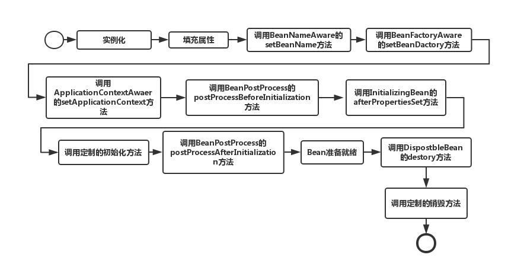

# Spring

## IoC

把对象实例化的过程交给外部（框架），依赖解耦

## DI

在 IoC 的基础上，将解耦的依赖统一管理

## AOP

### AOP Terminology

1. advice 增强、通知
2. joinpoint 连接点，可以用于增强的方法
3. pointcut 实际上使用了增强的方法
4. introduction 动态添加的字段或方法
5. target
6. proxy
7. weaving 织入，增强（advice）的过程
8. aspect

## Spring Bean Scope

1. singleton, 始终唯一，**默认作用域**
2. prototype, 每次获取一个单独的
3. request, HTTP request 唯一
4. session, web session 唯一
5. global-session, discarded in v5, portlet web 应用中使用

## @Bean vs @Component

1. `@Component` 只能作用于自定义**类**，需要 `@ComponentScan` 配置扫描路径
2. `@Bean` 只能作用于**方法**，适用于三方库 bean 的实例化。

## bean 线程安全

Bean 不是 prototype 的情况，一个实例可能被多个线程并发使用，导致字段出现 race condition

## @RestController vs @Controller

`@RestController` = `@Controller` + `@ResponseBody`

`@ResponseBody`: 方法的返回用于填充 HTTP response body

## xxxAware 接口的作用

使 Bean 可以获得某些属性（感知，aware），如 BeanName, ApplicationContext。如，`BeanNameWare` 可以使 bean 获得bean id

```java
public interface BeanNameAware extends Aware {
      void setBeanName(String name);
}

class User implements BeanNameAware {...}
```

--- [Spring中的aware接口 - 简书](https://www.jianshu.com/p/c5c61c31080b)

## 声明 Bean 的注解有哪些

1. @Bean
2. @Component
3. @Controller
4. @Service
5. @Repository

## Spring MVC 由哪些组成

1. M: Model. Includes Dao, Service, Entity
2. V: View
3. C: Servlet

## Bean lifecycle

  

总共有11个步骤

1. 实例化，无依赖注入，相当于 new
2. 依赖注入
3. 依次调用接口 BeanNameAware, BeanFactoryAware, ApplicationContextAware 的 setXyz 方法进行感知注入
4. BeanPostProcess.postProcess**Before**Initialization 前置方法
5. InitializingBean.afterPropertiesSet
6. 调用 init-method 或者 @PostConstruct
7. BeanPostProcess.postProcess**After**Initialization 后置方法
8. ready to be called
9. 调用 DisposableBean.destroy 方法
10. 调用 destroy-method 或 @PreDestroy

## Spring 事务分类

1. 编程式
2. 声明式：通过配置

   1. XML
   2. Annotation

`@Transaction` 注解，只能作用于 `public` 方法，默认只回滚未检查异常。

## Spring 事务隔离级别

`TransactionDefinition.ISOLATION` 和枚举类 `Isolation` 中定义

1. **Isolation.DEFAULT**: MySQL 使用 `REPEATABLE_READ`，Oracle 使用 `READ_COMMITTED`
2. **Isolation.READ_UNCOMMITTED**:
3. **Isolation.READ_COMMITTED**:
4. **Isolation.REPEATABLE_READ**:
5. **Isolation.SERIALIZABLE**:

## Spring 事务回滚

@Transaction(rollbackFor = ), 默认只会滚未检查异常、RuntimeException

## 事务传播机制

Spring 有 7 种传播机制，枚举在 `Propagation` 类中。

- **Propagation.REQUIRED**：**默认值**。如果当前没有事务，则创建一个新事务。如果当前存在事务，就加入该事务。该设置是最常用的设置。
- **Propagation.SUPPORTS**：支持当前事务，如果当前存在事务，就加入该事务。如果当前不存在事务，就以非事务执行。
- **Propagation.MANDATORY**：支持当前事务，如果当前存在事务，就加入该事务，如果当前不存在事务，就抛出异常。
- **Propagation.REQUIRE_NEW**：创建新事务，无论当前存不存在事务，都创建新事务。
- **Propagation.NOT_SUPPORTED**：以非事务方式执行操作，如果当前事务存在，就把当前事务挂起。
- **Propagation.NEVER**：以非事务方式执行，如果当前存在事务，则抛出异常。
- **Propagation.NESTED**：如果当前存在事务，则在嵌套事务内执行。如果当前没有事务，则按 REQUIRED 属性执行。

### 参考文献

- [Spring 的事务实现原理和传播机制 - 知乎](https://zhuanlan.zhihu.com/p/157646604)
- [带你读懂Spring 事务——事务的传播机制 - 知乎](https://zhuanlan.zhihu.com/p/148504094)

## 设计模式：IoC 与 DI

IoC 是一种原则，DI 是其具体实现的一种，其他实现包括

1. Factory
2. AbstractFactory
3. TemplateMethod
4. etc.

## IoC 中 Inversion 的含义

传统 A 使用 B 时，A 需要创建 B 来调用，IoC 下，B 不是由 A 来创建。这个时候 A 是被给与。

Inversion 是 A 的主动调用 **反转** 为被动给予

## Factory 工厂模式：怎么创建 Bean

Spring 中有两个可以创建 Bean 的工厂模式，分别为

1. BeanFactory: 按需创建、通过 `@Bean` 注解
2. ApplicationContext: 加载时，一次性创建所有 Bean，无论是否需要

    1. ClassPathXml
    2. FileSystemXml
    3. XmlWeb
    4. AnnotationConfig

```java
ApplicationContext app = new ClassPathXmlApplicationContext("under/classpath/file.xml");
```

> 注解无法注入 **集合类型** 的数据。

## 单例模式的好处

1. 可以减少创建时的开销
2. 可以减少 GC 的压力

## 模板方法 template，是什么

- 模板方法提供了算法的骨架，部分实现推迟到子类
- Spring 中 `XyzTemplate` 类便使用了该模式，如 JdbcTemplate，不过 Spring 中，使用的是回调而非继承来实现，如

```java
jdbcTemplate.query("SELECT * FROM users LIMIT 1", (resultSet) -> {
    long id = resultSet.getLong("id");
});
```

## 引用类型分类

1. 强引用：
2. 软引用：内存不足时回收
3. 弱引用：当对象只有弱引用时，GC时会直接回收
4. 虚引用：`PhantomReference`, 类似弱引用，但必须与 `ReferenceQueue` 配合使用，回收时触发一个队列push，作为debug使用. `get`总是返回 `null`。
