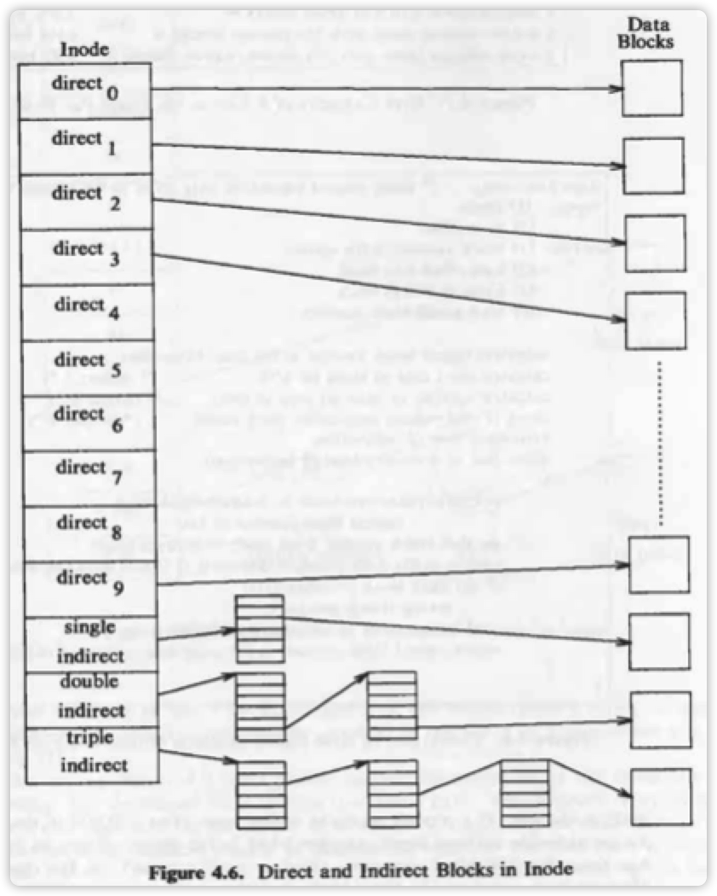
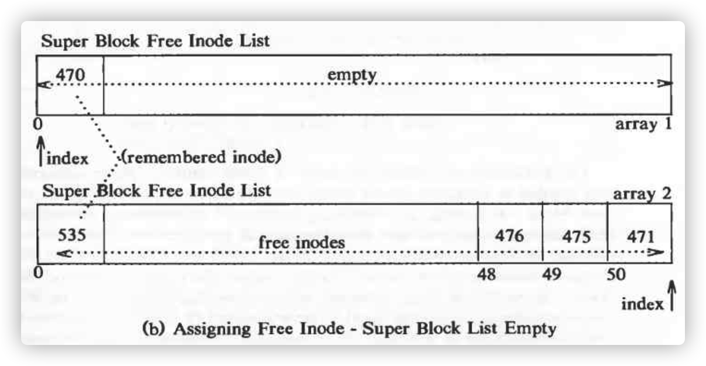
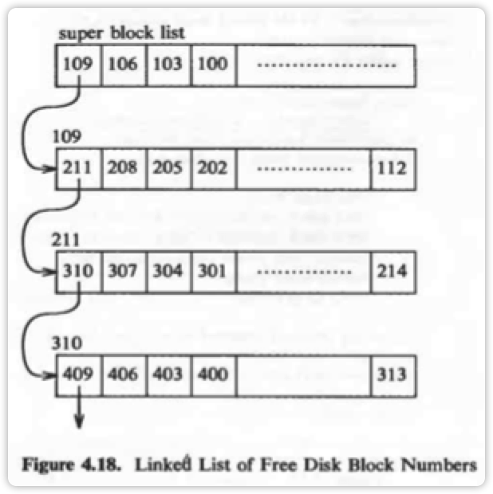
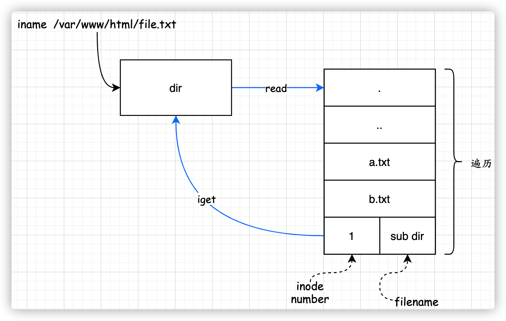
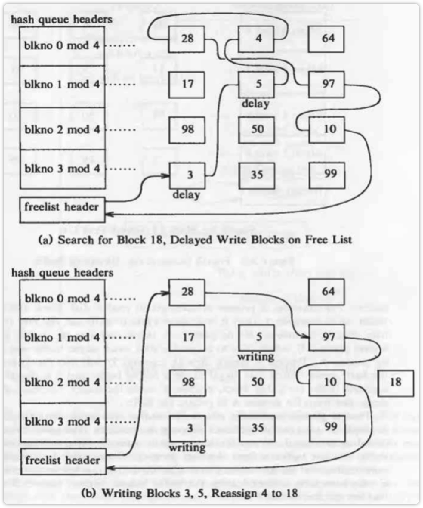
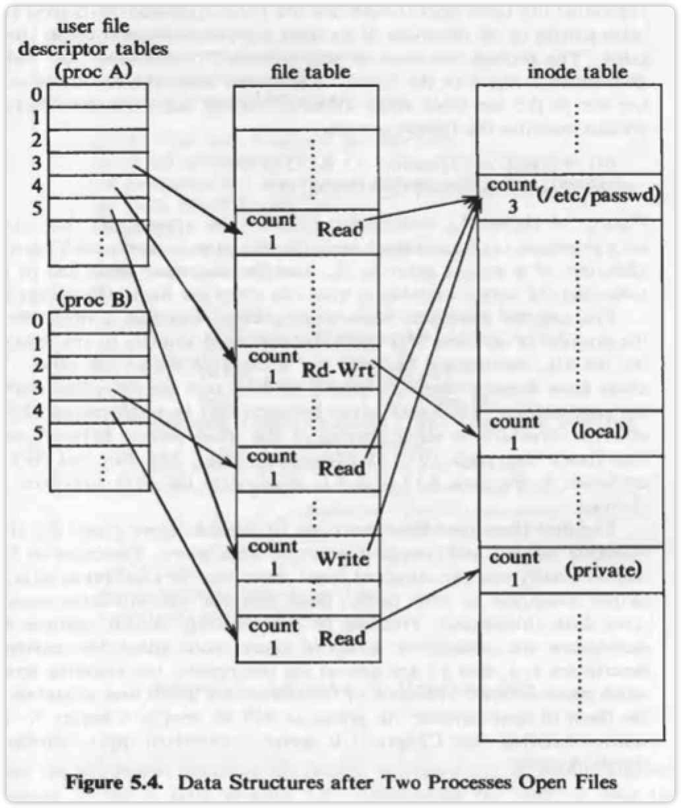

# Unix

## Unix 系统中文件系统结构？

- boot block: 存储启动程序
- super block: 存储文件系统信息，包括空闲 inode 表，空闲数据块
- inode table：在安装系统是，由管理员设置的一块固定大小的表。用于存放所有 i 节点。
- data block：数据块，用于存放数据。

## 什么是索引节点 inode ？

在操作系统安装时，管理员会在磁盘上分配一个固定大小的空间，用于存储 inode 表。

inode 是一个数据结构，对应于一个文件，包含了文件的 **类型（0表示删除）**、所有权、大小、数据的磁盘地址明细表（块号）等各种信息。

**在访问文件时**，内核会把磁盘上的 inode 拷贝进内存，并在内存中维护一个类似 *数据缓冲区高速缓冲（buffer cache）* 的数据结构，用于存储使用中的和空闲的 inode。

> inode table 中不是所有项都有存储，按需插入

## 文件是如何存储的？

每个文件会获得一个 inode，inode 存储了该文件存放的物理磁盘块地址明细表（磁盘块号），分为直接寻址和间接寻址表项（通常为 13个：10个直接，1-3间接各一个）。寻址地址为 0 的，表示使用了系统调用 `lseek` 跳过了该块。

寻址时，根据磁盘块大小，计算偏移量，在明细表中获取位置，找到磁盘块号。如假设一块大小为 1024 byte， 要获取 9000th byte，则找到第 8 个寻址块，获得磁盘块号，然后读取块中偏移为 808 的位置。

## 超级块中存放了什么信息？

1. 空闲数据块
2. 空闲块数目
3. 空闲 inode 表
4. 索引节表大小
5. 其他

## 超级块中的空闲 inode 表是怎样存储的？

超级块中维护了一个数组作为空闲 inode 表，数组元素为 **i 节点号**。其中最大的节点号被称为铭记（remembered）点。每次内核都会去扫描 inode 表，根据其有效为为 0 判断其为空闲，然后加入超级块的空闲索引节点表中。每次需要分配空闲 inode 时，从小到大在空闲表中取出，直到达到铭记点。然后重新扫描。

## 超级块中，空闲磁盘块是如何存储的？

在超级块中，维护了一个空闲磁盘块数组。此外，在尾部存储了到下一个存储了空闲磁盘块号的磁盘块（用一个磁盘块，来存储空闲块号数组）。并借用这个链表将整个空闲磁盘链接起来。如下图，取磁盘块号的方向为从右到左。只有链表中的第一个节点存储在超级块中，其余节点分离的存储在磁盘中。当超级块中的磁盘存取到最后一个元素时，会根据该块号去获取下一个空闲磁盘数组，读入超级块，最后返回该块（用于存储）。

## 为什么空闲磁盘块和空闲 inode 表组织方式不一样

1. inode 可以根据标志位为 0 判断为空闲，磁盘块不行，所以可以通过扫描获取空闲 inode 表。
2. inode 的消耗不如磁盘块频繁，因此 inode 扫描磁盘的性能影响相对小很多。
3. 磁盘块本身可以作为链表，存储空闲磁盘块。

## 进程映像是什么意思？

是指在内存中存储的进程的各种信息，如正文段、区表等。

## 进程的中断发生在什么态，什么时候检查，什么时候处理，在哪里处理？

- 用户态或核心态
- 检查：睡眠与核心态切换时、返回用户态时
- 处理：返回用户态时
-  在当前进程进行处理

## 进程的状态有哪些，如何相互转换？

> 图中缺失”跟踪态“，指 `ptrace` 之后，子进程等待父进程发出的 `TR_RESUME` 指令。

## 目录的可执行权限是什么意思？

表示允许搜索该目录。

目录是特殊的文件，其内容是目录项（entry），所以可读代表可以读取里面的目录项，即罗列目录下的子目录和文件。搜索目录即是根据目录项中的 <ins>inode 号</ins>，对子目录或者文件进行 `iget` 系统调用。

以系统调用 `namei` (path to inode) 为例，我们需要获取到 `filename.txt` 文件，`namei` 会循环调用 `read`, `iget` 系统调用，直到找到 `filename.txt`。其中

- `read` 表示读取目录项，为 `r` 权限
- `iget` 便是根据 inode 号，获取 inode 的过程，为搜索，代表 `x` 权限。此时，所有需要经过 `iget` 却没有 dir `x` 权限的调用，都将返回错误。

> 图中遍历读取目录项的过程，可能经过间接寻址过程（与获取普通文件块相同）。

## 数据缓冲区高速缓冲（Buffer Cache）的数据结构

散列队列（Hash Queue）

图中需要块号 18 的文件，于是在空闲链表中寻找，3、5 两个节点都处于延迟写状态，于是找到 4，摘下并读入 18  块内容，重新放入散列队列（`18 mod 4 =  2`）。

## 数据缓冲区高速缓冲的优缺点

**优点**

1. 对 IO 提供了统一的接口，系统设计简单
2. 对 IO 做了对齐，上层应用软件不需要考虑数据对齐
3. 减少了磁盘访问
4. 每个块只保留一个缓冲区，保证了文件系统的完整性，同时访问不是会导致数据被破坏

**缺点**

1. 无法知道内核什么时候将内存写入磁盘，若为写入，当系统瘫痪时，将无法恢复。（可以通过系统调用 `sync` 将 buffer cache 写入磁盘）
2. 传输大量并且以后不会使用的数据时，降低了读写效率

## 内核在内存中维护的 inode 节点有什么作用？

内核维护的内存 inode 节点是类似 buffer cache 一样被组织起来的。它包含了文件的 inode 节点以及一些额外的字段：

1. 状态：上锁、是否修改、是否为安装点等
2. 文件系统中的<ins>逻辑设备号</ins>
3. 磁盘索引节点号：由于 inode 在磁盘中顺序存储，通过节点号便可以存取该 inode
4. 指向其他内存 inode 的指针：上/下一个（空闲）inode
5. **引用数**：等于 0 时放入空闲列表

> 文件 inode 包含了 *联结数（number of links）* 表示有多少个文件名指向这个文件

## 系统调用：iget

根据 inode number 获取上锁的 inode 并装入内存

## 系统调用：iput

释放 inode

1. 引用数为 0，放入空闲表
2. 联结数为 0，删除文件

**删除文件**

1. 调用 `free` 释放磁盘
2. 将文件类型置为 0
3. 调用 `ifree` 释放索引节点

> 文件删除的判断发生在系统调用 `iput`，该算法调用 `free`、`ifree` 释放磁盘块与 inode

## 系统调用：bmap

将文件的字节偏移转换为物理磁盘块号，即根据文件字节偏移量获取文件的块号

## 系统调用：namei

将路径名转为上锁的 inode。path name to inode.

> 根的索引节点存储在全局变量中。`chroot` 可以更改 <ins>**进程**</ins> 的用户根目录的 inode

## 目录

Unix 系统中目录是一个文件（也有 inode），它的内容是目录项（entry），包含了 **索引节点号，文件名**。如下表表示根节点目录文件内容

索引节点号|文件名
---|---
83|.
2|..
1798|init

> Unix V 中，一个目录项占用 16 个字节，其中节点号 2 字节，文件名 14 字节。

**注意：文件名实际上存储在目录中，而非文件 inode 中。故修改一个文件名或创建一个文件，需要其父目录的写权限**

## 系统调用：ialloc

为文件分配一个索引节点，创建文件时，内核从超级块的空闲索引节点表中获取一个索引节点号，然后通过 `iget` 获取并返回磁盘中的索引节点。

## 系统调用：ifree

释放 inode。将 inode 归还到空闲列表，系统可用 inode 数 +1。

## 系统调用：alloc

分配一个块。内核从超级块的空闲磁盘块中摘下一个磁盘块（空闲计数减一），并调用 `getblk` 将块加入 buffer cache，并清空其内容，标记已修改。

## 系统调用：free

当删除文件或者文件内容被删除等，会释放磁盘块，此时算法 `free` 将该块归还到空闲列表。根据超级块中空闲磁盘块表是否已满，分两种情况

1. **已满**：将该块变为链接块，内核将超级块表写到这个块上，然后把这个块写到磁盘上。把这个块号写到超级块表，使他成为其中的唯一成员
2. **未满**：加入超级块空闲块表

## 用户打开文件时发生了什么

用户打开文件时，会读入文件 inode，存储在内存的 *索引节点表* 中。对于每个打开的文件，同时会创建一个 *用户文件描述符表项*，和内核 *文件表* 表项（`fork` 、`dup` 除外）。

- `dup` 允许同一个进程多次引用同一个 **文件表** 表项，如管道。
- `fork` 允许不同进程引用同一个 **文件表** 表项。

## 系统调用：open

