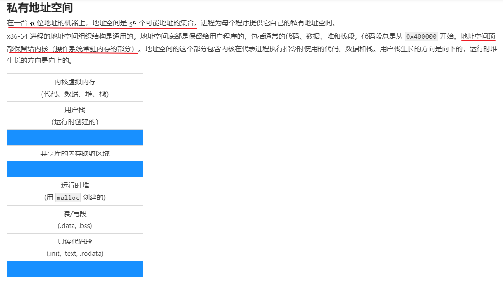

# Todo List

- [ ] 岗位：https://www.nowcoder.com/discuss/678745
- [x] Redis 持久化机制是怎样的？
- [x] Redis 淘汰机制
- [ ] **复习基础：计网、操作系统、计算机组成、算法、数据结构。。。**
- [x] Unix: effective uid, real uid, user directory, chdir, chroot
- [x] 悲观锁，乐观锁是什么，举个例子？
- [ ] [BAT常问的JVM高频面试题背诵版](https://mp.weixin.qq.com/s/r4uigbq5XyoFiB_206YM6Q?utm_source=wechat_session&utm_medium=social&utm_oi=741227338951315456&from=singlemessage&isappinstalled=0&scene=1&clicktime=1626354694&enterid=1626354694)
- [ ] **《设计模式》**
- [ ] [十道海量数据处理面试题与十个方法大总结](https://blog.csdn.net/v_JULY_v/article/details/6279498)

## DB & MySQL

- [x] B 与 B+ 树
- [ ] 数据库 x/s锁
- [ ] 什么是binlog，如何恢复数据，如何崩溃恢复
- [ ] ABA
- [ ] **Redis 基本数据类型的数据结构**，zset 跳表 etc.

## Java

- [x] CAS 原理
- [ ] **GC，类型**
- [ ] ABA
- [ ] Java 中怎么定义一个匿名 callback
- [ ] `jstack` 命令 dump 线程信息，例如哪里出现死锁
- [x] 数据类型占用内存，其中引用类型占用 4 bytes
- [ ] 对象初始化过程：创建一个对象时发生了什么
- [ ] this 逃逸
- [ ] syntax: `Runnable write = TestConcurrency::write;`
- [ ] 怎么debug一个oom
- [ ] ReentrantLock 的原理：基于 AQS
- [ ] AQS 的原理：Abstract Queued Synchronizer 抽象队列同步器。利用一个整型的 `volatile` 变量 `state` 来维护状态。
- [ ] 动态代理
- [ ] DataOutput, what is it? `data ouput` -> `object ouput` -> ??
- [ ] Stream API
- [ ] MQ 的区别，RocketMQ
- [ ] 虚拟机引用对象的方法https://blog.csdn.net/GFJ0814/article/details/51182682

## 算法

- [ ] 大数加法
- [ ] KMP 算法：字符串匹配
- [ ] [三种常见的限流算法 - Ruthless - 博客园](https://www.cnblogs.com/linjiqin/p/9707713.html)
- [ ] 跳跃表
- [ ] 数遍历方法
- [ ] 回文数：https://leetcode-cn.com/problems/largest-palindrome-product/solution/jian-dan-qing-xi-de-cjie-fa-by-wkcn-q15a/

## OS

- [x] 死锁的必要条件

- [x] 内存管理（Linux etc.）

- [x] [Linux进程虚拟地址空间 - fellow_jing - 博客园](https://www.cnblogs.com/fellow1988/p/6220710.html)

- [x] 虚拟地址

  

# 进阶

## Java

- [x] 管程与监视器
  1. [锁原理 - 信号量 vs 管程：JDK 为什么选择管程 - binarylei - 博客园](https://www.cnblogs.com/binarylei/p/12544002.html)
  2. [java里的管程Monitor - 知乎](https://zhuanlan.zhihu.com/p/87724639)
- [ ] 逃逸分析 《深入理解 JVM》P417
- [ ] 《Java 并发编程艺术》P119， 锁，ReentrantLock
- [ ] Netty: IO Framework
- [ ] JVM方法句柄
  - [JVM方法句柄 - 知乎](https://zhuanlan.zhihu.com/p/120955469)
  - [秒懂Java之方法句柄(MethodHandle)](https://blog.csdn.net/ShuSheng0007/article/details/107066856)

## 工具

- [ ] ElasticSearch

## 网络

- [ ] TCP 拥塞控制算法, BBR
- [ ] UDP 实现可靠传输
- [x] http3 使用基于 UDP 的 QUIC
- [ ] 怎么ip编程

## MySQL

- [x] 聚簇索引
- [ ] [如何理解关系型数据库的常见设计范式？ - 知乎](https://www.zhihu.com/question/24696366)
- [ ] 锁   [详解 MySql InnoDB 中的三种行锁（记录锁、间隙锁与临键锁）_weixin_34006468的博客-CSDN博客](https://blog.csdn.net/weixin_34006468/article/details/88039873)

## Redis

- [ ] Lua 脚本
- [ ] 集群模式是如何实现的

## 中间件

- [ ] [Redis、Kafka 和 Pulsar 消息队列对比](https://mp.weixin.qq.com/s/-X2XXISdcBMFOahtlQsTgg)

## Spring

- [ ] Spring 中用到的设计模式

# kafka

​    Kafka 是一种高吞吐量、分布式、基于发布/订阅的消息系统，最初由 LinkedIn 公司开发，使用Scala 语言编写，目前是Apache 的开源项目。

**下面是Kafka中涉及到的相关概念**

**1、broker：**Kafka 服务器，负责消息存储和转发

**2、topic：**消息类别，Kafka 按照topic 来分类消息

**3、partition：**topic 的分区，一个 topic 可以包含多个 partition，topic 消息保存在各个partition 上

**4、offset：**消息在日志中的位置，可以理解是消息在 partition 上的偏移量，也是代表该消息的唯一序号

**5、Producer：**消息生产者

**6、Consumer：**消息消费者

**7、Consumer Group：**消费者分组，每个Consumer 必须属于一个 group

**8、Zookeeper：**保存着集群 broker、topic、partition 等 meta 数据；另外，还负责 broker 故障发现，partition leader 选举，负载均衡等功能
