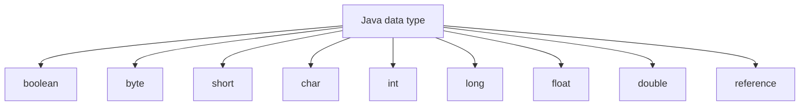
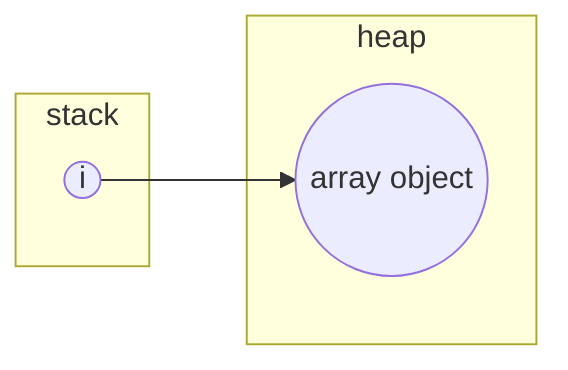

# Java Basics

## Variables



:::tip About Reference

The type `reference` is like a cup, which can be used to hold ++something++ to refer to an object. So what's in the cup? A memory address? Only the JVM knows.

The book *Head First Java* calls the ++something++ a remote, which can be used to control an object, such as a TV or a Dog. Before the remote is referred to a specific TV, it is a remote without initialization, not pointing to anything, which means it cannot be used at all until given a TV.
:::

## Variable scope

### 1. Local Variable

Variables inside a brace pair(a block):

```java
{
    int age = 30;
}

age = 31; // undefined
```

### 2. Member Variable

Variable belongs to a class instance, has the lifetime of an instance.

### 3. Static Variable

Variable belongs to a class, and has the lifetime of its class.

```java
public class Hello {
    // static variable
    static int age = 30;
}
```

## Constant

`Java` uses keyword `final` to define a constant.

```java
final String name = "Felix";
```

## Data Type

### Primitive Data Type

#### Integer

| Data Type | Size | Range |
| --------- | ---- | ----- |
| byte      | 1B   |
| short     | 2B   |
| int       | 4B   |
| long      | 8B   |

#### Float

| Data Type | Size |
| --------- | ---- |
| float     | 4B   |
| double    | 4B   |

#### Char

| Data Type | Size |
| --------- | ---- |
| char      | 2B   |

> Unicode char: `\ufoobar`, of which `foobar` stands for hexadecimals.

#### Automatically type conversion

```java
byte/short/char -> int -> long -> float -> double
```

> When calculation or assign data among `byte/short/char` types, they all got `int` result, even between the same type, e.g. `byte + byte` result in `int`.

```java
int a = (byte) 128; // -1
```

#### Force type conversion

- `float` -> `int`, cut off.

    ```java
    int a = (int)123.3; // 123
    ```

- big integer to small one, according to binary presentation.

    ```java
    int a = 128;
    byte b = (byte)a; // b = -128, 111111111
    ```

### Reference Data Type

- class
- interface
- array

## Operators

### Bitwise operation(on _integers_)

| Operator | Desc                                                                                                     |
| -------- | -------------------------------------------------------------------------------------------------------- |
| `<<`     | Move left                                                                                                |
| `>>`     | Move right, negative integers with `1` and positive with `0`, depends on the first bit on the very left. |
| `>>>`    | Move right as unsigned integer, which always use `0` to pad left                                         |
| `&`      | Bitwise and                                                                                              |
| `|`      | Bitwise or                                                                                               |
| `^`      | Xor                                                                                                      |
| `~`      | Bitwise not, opposite according to the complement of the value.                                          |

### Operator priorities

> Larger level has higher priority

| Level  | Operator                                              | Description                                                                                        | Associativity   |
| ------ | ----------------------------------------------------- | -------------------------------------------------------------------------------------------------- | --------------- |
| **16** | `[]` `.` `()`                                         | access array element access object member parentheses                                              | left to right   |
| **15** | `++` `--`                                             | unary post-increment unary post-decrement                                                          | not associative |
| **14** | `++` `--` `+` `-` `!` `~`                             | unary pre-increment unary pre-decrement unary plus unary minus unary logical NOT unary bitwise NOT | right to left   |
| **13** | `(data tye)`<br/>`new`                                | cast object creation                                                                               | right to left   |
| **12** | `* / %`                                               | multiplicative                                                                                     | left to right   |
| **11** | `+ -` `+`                                             | additive string concatenation                                                                      | left to right   |
| **10** | `<< >>` `>>>`                                         | shift                                                                                              | left to right   |
| **9**  | `< <=` `> >=` `instanceof`                            | relational                                                                                         | not associative |
| **8**  | `==` `!=`                                             | equality                                                                                           | left to right   |
| **7**  | `&`                                                   | bitwise AND                                                                                        | left to right   |
| **6**  | `^`                                                   | bitwise XOR                                                                                        | left to right   |
| **5**  | `|`                                                   | bitwise OR                                                                                         | left to right   |
| **4**  | `&&`                                                  | logical AND                                                                                        | left to right   |
| **3**  | `||`                                                  | logical OR                                                                                         | left to right   |
| **2**  | `?:`                                                  | ternary                                                                                            | right to left   |
| **1**  | `=  +=  -=` `*=  /=  %=` `&=  ^=  |=` `<<=  >>= >>>=` | assignment                                                                                         | right to le     |

## Flow Control

### If

Condition of if must be `boolean` or `boolean` expression.

```java
// valid
if (true) {
}

// invalid
if (1) {
}
```

### `switch...case`

- `switch(expression)` takes only expression that returns limited data types:

  - `char`, `Character`
  - `byte`, `Byte`
  - `short`, `Short`
  - `int`, `Integer`
  - `String`
  - `enum`

- `case` takes only constant values like literal string, not even variables.

```java
String name = "Felix";

switch(name) {
    case "Felix":
        // do something
}
```

## Loop

Java supports three types of loop: `for`, `while`, `do...while`

### `for`

With a `for`, it can further be divided into two types, `for loop`and `for each`

#### `for loop`

```java
int max = 100;
for (int i; i < max; i++) {
    // loop body
}
```

Specially, for without any parameter means infinite loop.

```java
for (; ; ) {
    // Do sth infinitely.
}
```

### `for each`

**For each** loop literates the elements from `array`, `Collection`.

```java
String[] a = {"a", "b"};

for (String s : a) {
    // Use `s` to represents the element inside array `a`.
}
```

### `continue` and `break`

`continue` is used to terminate current iteration and begins the next immediately.

`break` is used to terminate current loop, with all left iterations.

`continue` and `break` can be used in conjunction with a _label_ to terminate loop of specific level.

```java

label:
for () {
    for () {
        continue label;
        break label;
    }
}
```

> **label** in which can be any string token to represent the cut point,
> it can even be the same as defined variable name.

## Object Oriented

A class is typically composited by `field/property`, `method`.

## Overload

Two methods may have the same method name, as long as the parameters are different.

### Considered as `overload`

- different parameters:
    1. number of parameters
    2. type of parameters
    3. different parameter order
- method is compared to the first method defined with the same name

### Not `overload`

- different return type is not considered a `overload`.
- different parameter name is not considered a `overload`.

```java
class HelloWorld {
    public double sum(int x, float y) {
        return x + y;
    }

    public double sum(float x, int y) {
        return x + y
    }

    // not overload, compile error
    public int sum(int x, float y) {

    }
}
```

## Variable arguments method

### Define as variable list

> With this syntax, it's valid to pass arguments separately or pass them as an array.

```java
public class A {
    public void doSth(String ...args) {
    }

    public void caller() {
        String str1;
        String str2;
        String[] strArr[] = {str1, str2};
        // Valid expression
        this.doSth(str1, str2);
        this.doSth(strArr);
    }
}
```

### Define as array

> With this syntax, passing as an array is valid

```java

public class A {

    // Equivalent to
    public void doSth(String[] args) {
    }

    public void caller() {
        String str;
        String[] strArr[];
        // Invalid expression
        this.doSth(str);
        // Valid expression
        this.doSth(strArr);
    }
}
```

> *Variable arguments* of those two syntaxes cannot exist in the same class as `overload`.

## Class Code Block

### Static Block

Static block executes at class loading-time, even before an instance is created from this class.

```java
public class HelloWorld {

    // static block
    static {
        System.out.println("I'm here");
    }

    public HelloWorld() {
        System.out.println("I'm constructor");
    }

    /*
     * Output:
     * I'm here
     * I'm constructor
     */
    public static void main(String[] args) {
        HelloWorld a = new HelloWorld();
    }
}
```

## Non-Static Block

Similar to [static block](#static-block), except it is executed when an instance is created, before constructor called.

```java
public class HelloWorld {

    {
        System.out.println("code block");
    }

    public HelloWorld() {
        System.out.println("constructor");
    }

    public static void main(String[] args) {
        System.out.println("first");
        new HelloWorld();
        System.out.println("last");
    }
}
```

The above code will output

```text
first
code block
constructor
last
```

> _Non-static code block_ is quite similar to a constructor without arguments.
> However, a Java class can have more thant one constructors, _code block_ will be called before any constructor is called.

## import

```java
// Import a class
import java.sql.Date;
// Import static variable
import static java.lang.Math.PI
```

## Inner classes

### Non-static class

```java
public class Outer {
    protected int age = 0;
    public class Inner {
        public sayAge() {
            System.out.println(age);
        }
    }
}
```

### Static class

```java
public class Outer {
    public static class Inner {
        public Inner() {
            // constructor
        }
    }
}
```

Static `Inner` class is considered as static property of `Outer`, e.g.

```java
new Outer.Inner();
```

### Local inner class

> _seldom used_

```java
public class Outer {
    public void callLocally() {
        public class Inner() {
            // definitions go here
        }

        new Inner();
    }
}
```

### Anonymous class

- No constructor

```java
cls = new SomeClass() {
    // class definitions go here
}
```

**f.x.**

```java
this.addWindowListener(new WindowAdapter() {
        @Override
        public void windowClosing(WindowEvent e) {
            System.exit(0);
        }
    }
);
this.addKeyListener(new KeyAdapter() {
        @Override
        public void keyPressed(KeyEvent e) {
            myTank.keyPressed(e);
        }
        @Override
        public void keyReleased(KeyEvent e) {
            myTank.keyReleased(e);
        }
    }
);
```

## Casting

Consider the following example.

```java
public class Testing {
    public static void main(String[] args) {
        Dog d = new Dog();

        cry(d);
        d.watchDoor();
    }
    static void cry(Animal animal) {
        System.out.println("is dog: " + (animal instanceof Dog)); // is dog: true
        // The `animal` is a dog, however it only has properties and methods of `Animal`
        // If the `Dog.watchDoor` should be called, the type of the variable animal
        // should be converted:
        // Dog d = (Dog) animal
        // d.watchDoor();
        //
        // the `d` passed in the method `main` is casted into instance of `Animal` inside `cry` by calling `cry(d)`
        animal.shout();
    }
}

class Animal {
    public void shout() {
        System.out.println("This is only animal.");
    }
}

class Dog extends Animal {
    public void shout() {
        System.out.println("Dog says: wang wang");
    }

    public void watchDoor() {
        System.out.println("Dog's watching door");
    }
}

class Cat extends Animal {
    public void shout() {
        System.out.println("Cat says: meow meow");
    }
}
```

## Array

### Declare an array

```java
int[] i = null; // Recommended
int j[] = null; // c-style
```

By declaring a variable of array, `i` for example, means that the variable `i` can be used to refer to an array object (array is an object).



and then this variable can refer to an array of any length,

```java
i = new int[5];
i = new int[6];
```

### Initialize an array with elements

#### initialize at declaring time

```java
int[] var1 = new int[]{1, 2, 3};    // An array with 3 elements
int[] var2 = {1, 2, 3};             // same as above
```

#### Initialize after declaration

```java
int[] var4;
var4 = new int[5];
var4[0] = 1;

int[] var5;
var5 = new int[]{1, 2, 3};
```

### More array examples

```java
// Array of 2 integers, with default 0
int[] var1 = new int[2];

// Define a array of integers
int[] var1 = null;
// Reference to memory
var1 = new int[3];

// Define and fill value into array with 3 integers
int[] var1 = {1, 2, 3};

String[] str1 = new String[5];
String[] str2 = new String[]{""};   // length of 1, whose value is empty string
String[] str3 = {""};               // Identical to syntax above
```

### Default values for array

| Element Type   | Default Value |
| -------------- | ------------- |
| `int`          | `0`           |
| `float`        | `0.0`         |
| `char`         | ASCII `0`     |
| `boolean`      | `false`       |
| Reference type | `null`        |

> **Reference type** includes `String`

### Multi Dimension array

```java
// Dynamic number of elements in second dimension
int[][] a = { { 1, 2}, { 3, 4, 5 } };

// 2x2
int[][] b = new int[2][2];

// 2x?, which means the second dimension size is arbitrary
int[][] c = new int[2][];
```

## Exception handling

In Java, checked exceptions(every exception except for `RuntimeException`) must be handled by:

1. try-with-resources
2. try-catch
3. declaration

### 1. try-with-resources

> The `try-with-resources` statement is a try statement that declares one or more resources. A resource is an object that must be closed after the program is finished with it. The `try-with-resources` statement ensures that each resource is closed at the end of the statement. Any object that implements `java.lang.AutoCloseable`, which includes all objects which implement `java.io.Closeable`, can be used as a resource.
>
> -- [The try-with-resources Statement](https://docs.oracle.com/javase/tutorial/essential/exceptions/tryResourceClose.html)

Supported interfaces:

- `java.lang.AutoCloseable`
- `java.io.Closeable`

```java
try (
    BufferedReader br1 = new BufferedReader(new FileReader(path1));
    BufferedReader br2 = new BufferedReader(new FileReader(path2));
) {
    // do sth with resource
}
```

### 2. try...catch...finally

```java
try {
    // do sth may cause exception
} catch (ExceptionType e) {

} finally {

}
```

### 3. Declare exceptions by keyword `throws`

```java
public class ExceptionTest {
    public void causeException() throws FileNotFoundException {
        FileInputStream("path/to/file");
    }
}
```

## Boxed classes

Convert the basic variable types into objects.

| Basic Type | Corresponding Class |
| ---------- | ------------------- |
| char       | Character           |
| boolean    | Boolean             |
| byte       | Byte                |
| short      | Short               |
| int        | Integer             |
| long       | Long                |
| float      | Float               |
| double     | Double              |

## Boxing vs. Unboxing

> [Auto Boxing and Unboxing](https://docs.oracle.com/javase/tutorial/java/data/autoboxing.html) is the automatic conversion that the Java compiler makes between the primitive types and their corresponding object wrapper classes.

### 1. Boxing

```java
int i = 1;

Integer j = i;
// equivalent to
Integer j = Integer.valueOf(i);
```

### 2. Unboxing

```java
Integer i = new Integer(1);
int j = i;
// equivalent to
int j = i.intValue();
```

## `String`, `StringBuffer` and `StringBuilder`

- `String`
  
    Constant object, cannot be modified after created.

- `StringBuffer`
  
    Variable object, can be modified after created, thread-safe.

- `StringBuilder`
  
    Variable object, can be modified after created, non-thread-safe, high performance, recommended.

## File path

==The relative path in java always means the path relative to **user directory**.==

When a IDE, [IDEA](https://www.jetbrains.com/idea/) for example, runs a Java(tm) project, the user directory is the project root. Especially when there's sub-modules (run as `main`), the user directory is always the root of the project.
On the contrary, when you run an executive JAR from a terminal, the user directory is where you run the command `java`.
Finally, when you use Junit to run a test case, it relative path is to the module directory, that's different from project root when there are submodules.

```java
/*
 * Relative path, to
 * System.getProperty("user.dir")
 * Which is also the root of current project directory.
 */
File f1 = new File("user.log");

// Absolute path
File f2 = new File("/var/www/html/user.log");

// To test where current user directory is
System.out.println(new File('.').getAbsolutePath());
```

## Enumerate

```java
enum Week {
    Monday, Tuesday, Wednesday, Thursday, Friday, Saturday, Sunday
}

enum Month {
    January, February, March, April, May, June,
    July, August, September, October, November, December
}
```

## Generics

Generics takes data type as a placeholder for a class.
It's quite flexible as you can use the same class for different data types.

**usage**:

```java
List<String> l = new ArrayList<String>();   // <String> declares the element inside list is `String`s
```

When talking about generics, its always about containers, a.k.a `Collection`.
Here are the relations of `Collection`s

```txt
                +---------------+                               +---------------+
                | <<interface>> |                               | <<interface>> |
                |  Collection   |                               |      Map      |
                +---------------+                               +---------------+
                |               |                               |               |
                +---------------+                               +---------------+
                 ^             ^                                        ^
                /               \                                       |
+---------------+               +---------------+                       |
| <<interface>> |               | <<interface>> |                       |
|      Set      |               |      List     |                       |
+---------------+               +---------------+                       |
|               |               |               |                       |
+---------------+               +---------------+                       |
        ^                        ^             ^                        |
        |                       /               \                       |
+---------------+     +---------------+   +---------------+     +---------------+
|    HashSet    |     |   ArrayList   |   |   LinkedList  |     |    HashMap    |
+---------------+     +---------------+   +---------------+     +---------------+
|               |     |               |   |               |     |               |
+---------------+     +---------------+   +---------------+     +---------------+
```

### Create your own generic class

```java
class SomeGenerics<DataType> {              // Generics: DataType is a placeholder
    public DataType doSth() {               // Generics: DataType is a placeholder
        return (DataType) childOfObject;    // Generics: DataType is a placeholder
    }

    public void sthElse(DataType dt) {      // Generics: DataType is a placeholder
        // do sth. with dt
    }
}
```

### Interface `List`

- `ArrayList`

    Based on `array`, **fast to get**, slow to `add/remove`.

- `LinkedList`

    Based on linked list, slow to get, **fast to add/remove**

- `Vector`

    Thread-safe version of `ArrayList`.

### Interface `Map`

- `HashMap` Non-thread-safe, fast. `key` or `value` **CAN** be `null`.
- `HashTable` Thread-safe, slow. `key` or `value` **MUST NOT** be `null`.
- `TreeMap` Slow than `HashMap`, used for sorting.

### Interface `Set`

An unordered collection of objects in which duplicate values cannot be stored.

- `HashSet`

    Based on `HashMap`.
- `TreeSet`

    Based on `TreeMap`. it needs the elements to be sorted, so the element object must implements interface `Comparable`. **Used only when need sorting.**

    ```java
    class User implements Comparable<User> {

        public int id;
        public String name;

        public User(int id, String name) {
            this.id = id;
            this.name = name;
        }

        public int compareTo(User u) {
            if (this.id > u.id) {
                return 1;
            } else if (this.id == u.id) {
                return 0;
            } else {
                return -1;
            }
        }
    }
    ```

### Collection Iterator

#### 1. Iterating map

1. With key

    ```java
    Iterator<String> iterator = map.iterator();
    while(iterator.hasNext()) {
        String key = iterator.next();
        // do sth.
    }
    ```

2. With key => value

    ```java
    Iterator<Entry<String, String>> iterator = map.iterator();

    while(iterator.hasNext()) {
         Entry<String, String> entry = iterator.next();
         entry.getKey();
         entry.getValue();
    }
    ```

See more about generics [here](./Generic-Methods.md).

## Thread

### 1. class `Thread`

```java
class MyThread extends Thread {
    public void run() {
        // do sth here
    }
}

public class Runner {
    public static void main(String[] args) {
        Tread thread = new MyThread();
        thread.start(); // Starts a new thread.
    }
}
```

### 2. interface `Runnable`

```java
class MyRunnable implements Runnable {
    public void run() {
        // do sth. inside thread
    }
}

public class Runner {
    public static void main(String[] args) {
        Thread thread = new Thread(new MyRunnable);
        thread.start();
    }
}
```

### `Thread.yield` vs. `Thread.sleep`

Both are used to block current thread, give up CPU control.

- `Thread.yield` To put current thread into `ready` state.

    ```java
    Thread.yield();
    ```

- `Thread.sleep` To put current thread into `blocked` state, until given time.

    ```java
    Thread.sleep(2000); // in milliseconds
    ```

### `thread.join`

Used to wait until another thread finished.

```java
public class FatherThread implements Runnable {
    public void run() {
        Thread son = new Thread(new SonThread);
        son.start();

        try {
            // Wait the son to join the party.
            son.join();
        } catch(InterruptedException e) {
            // sth is wrong
            System.exit(1);
        }

        // Son has joined the thread with his own mission finished.
    }
}

class SonThread implements Runnable {
    public void run() {
        // sth child does
    }
}
```

### Thread priority

```java
int priority;
Thread thread = new MyThread();
thread.setPriority(priority);
```

1. `priority` is from 1-10, default to be 5.
2. `priority` represents the probability, does not exactly mean the thread will be executed starting from the highest priority.

### Thread resource lock

1. synchronized method

    After `synchronized`, every object has one lock. Calls on the `synchronized method` need the thread to have the lock to proceed, otherwise, this thread will have to wait.

    ```java
    public class Bank{
        Account account;
        int amount;
        public void Bank(Account account, int amount) {
            this.account = account;
            this.amount = amount;
        }
        public synchronized void withdraw() {   // synchronized method
        }
    }
    ```

2. synchronized block

    ```java
    public class Bank {
        // blah blah blah...
        public void withdraw() {
            synchronized(this.account) { // lock object: `this.account`
                // Only thread having the lock of object `this.account`
                // can access this block.
                // Others will have to wait.
            }
        }
    }
    ```

3. synchronized static block

    ```java
    public class Account {
        public static synchronized void withdraw() {
            // Multiple calls to Account::withdraw will be exclusive
        }
    }
    ```

    It's the same as the following

    ```java
    public class Account{
        public static void withdraw() {
            synchronized(Account.class) {
            }
        }
    }
    ```

## Access Modifiers

|      Modifier       | Class | Package | Subclass | World |
| :-----------------: | :---: | :-----: | :------: | :---: |
|       private       |   Y   |         |          |
| default _(Not Set)_ |   Y   |    Y    |          |
|      protected      |   Y   |    Y    |    Y     |
|       public        |   Y   |    Y    |    Y     |   Y   |

- Local class cannot have modifier
- Package class can only be `public` or `default`

**See Also** [Controlling Access to Members of a Class](https://docs.oracle.com/javase/tutorial/java/javaOO/accesscontrol.html)

## Paths

- `/`

  ```java
  // Path relative to current project
  getClass().getResource("/");

  // System root
  new File("/");
  ```

- `x/y/z`, relative path to user directory

## Network

Package `java.net`

- `InetAddress`

    This class includes methods such as `getByName()`(get *ip* from *hostname*). It has no public constructor, which means the instance could be created only by static methods, such as

    ```java
    InetAddress.getByName()
    ```

- `InetSocketAddress`

- `ServerSocket`

    ```java
    ServerSocket socket = new ServerSocket(8080);
    ```

### TCP summary

**Server Side:**

1. Create `ServerSocket`
2. Create connection socket by using `ServerSocket.accept`
3. Read input data from accepted `socket` by `socket.getInputStream`

**Client Side:**

1. Get IP instance by `server = InetAddress.getByName("localhost")`
2. Create client socket by `new Socket(server, 8090);`
3. Send data to server by `socket.getOutputStream.write()`
4. Close socket `socket.close`
