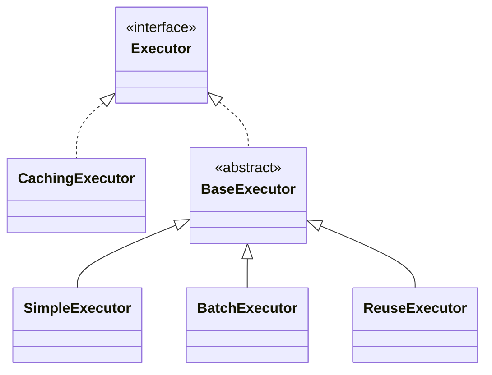

# MyBatis Executors

Executors are the classes to execute actual CRUD, here's the diagram

```mermaid
classDiagram

  class Executor
  class CachingExecutor
  class BaseExecutor
  class SimpleExecutor
  class BatchExecutor
  class ReuseExecutor

  <<interface>> Executor
  <<abstract>> BaseExecutor

  Executor <|.. CachingExecutor
  Executor <|.. BaseExecutor

  BaseExecutor <|-- SimpleExecutor
  BaseExecutor <|-- BatchExecutor
  BaseExecutor <|-- ReuseExecutor
```