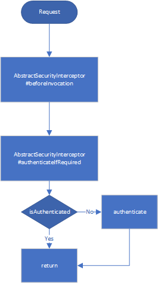

# How Spring Authenticates



## Introduction

**Spring Security** uses `manager-provider` mode to validate a user. The authentication is performed by calling `AuthenticationManager#authenticate`, and by saving what's returned using

```java
SecurityContextHolder.getContext().setAuthentication(auth)
```

the whole authentication process is completed.

Which means, the subsequent request will be automatically validated, and if request is valid, the saved `auth` will be available by calling

```java
SecurityContextHolder.getContext().getAuthentication(auth)
```

If you go further into to source code, you will find

```java
package org.springframework.security.authentication;

class ProviderManger {
    public Authentication authenticate(Authentication authentication) {
        Class<? extends Authentication> toTest = authentication.getClass();
        for (AuthenticationProvider provider : getProviders()) {
            if (!provider.supports(toTest)) {
                continue;
            }
            try {
                result = provider.authenticate(authentication);
            }
            catch (AccountStatusException e) {
                throw e;
            }
            catch (InternalAuthenticationServiceException e) {
                throw e;
            }
            catch (AuthenticationException e) {
                lastException = e;
            }
        }
    }
}
```

The `ProviderManager` gets all registered providers and then iterates them,
of which the `support` method indicates whether this provider should be used to authenticate given `authentication`.
If the provider returns `null` or throws `AuthenticationException` the next provider who supports this given `authentication` will be used, until non-`null` returned or non-`AuthenticationException` thrown.

## Step by Step

### 1. Write a provider

The whole process involves two **interfaces**:

- `AuthenticationProvider`
- `Authentication`

You can write your own provider by implementing `AuthenticationProvider` under package **org.springframework.security.authentication**,
such as follows:

```java
import org.springframework.security.authentication.AuthenticationProvider;

public class MyProvider implements AuthenticationProvider {
    @Override
    public Authentication authenticate(Authentication authentication) throws AuthenticationException {
        // Here's your code to returns an `Authentication` if succeeds,
        // and null if you cannot decide,
        // or throws exception if authentication is invalid.
    }

    @Override
    public boolean supports(Class<?> authentication) {
        // Indicates that this provider can be used to validate MyAuthenticationToken
        return MyAuthenticationToken.class.isAssignableFrom(authentication);
    }
}
```

And a provider comes always with its `Authentication` to indicates that this is the auth the provider wants.
An `Authentication` is typically kind of a container, which contains user's `principal` and `credential`.
With these data, the provider can check if the user is a valid one.

Here is how you implements an `Authentication`:

```java
import org.springframework.security.authentication.AbstractAuthenticationToken;

public class MyAuthenticationToken extends AbstractAuthenticationToken {
    private String username;
    private String password;

    public MyAuthenticationToken(String username, String password) {
        this.username = username;
        this.password = password;
    }

    @Override
    public Object getPrincipal() {
        return this.username;
    }

    @Override
    public Object getCredentials() {
        return this.password;
    }
}
```

> You can of course just implements `Authentication` interface.

#### More details

The returned `Authentication#isAuthenticated` of `authenticate` **MUST** return `true`,
otherwise, according to the `AbstractSecurityInterceptor`,
the returned `Authentication` will be `authenticate`d for every request,
with `credentials` cleaned, the subsequent requests will always fail.

### 2. Register your provider

After writing your provider and authentication, you need to register it to `ProviderManager`,
so that the latter can use yours when iterating providers.

```java
import org.springframework.security.config.annotation.web.configuration.WebSecurityConfigurerAdapter;

@Configuration
@EnableWebSecurity
public class SecurityConfig extends WebSecurityConfigurerAdapter {
    private final UsernameProvider myProvider;

    public SecurityConfig(MyProvider myProvider) {
        this.myProvider = myProvider;
    }

    protected void configure(AuthenticationManagerBuilder auth) {
        auth.authenticationProvider(this.myProvider);
    }
}
```

### 3. Authenticate

This is the last step, where authenticate or retrieve principal.

#### 3.1 Authenticate

```java
public class UserService {
    @Autowired
    AuthenticationManager authenticationManager;
    public Object login(String username, String password) {
        Authentication auth = new MyAuthentication(username, password);
        Authentication validAuth = this.authenticationManager.authenticate(auth);
        SecurityContextHolder.getContext().setAuthentication(validAuth);

        return validAuth.getPrincipal();
    }
}
```

#### 3.2 Retrieve principal

A principal can be any class instance, it is used to hold the information of a user, such as `User` entity.
Sometimes you may want to get the name of a user, then

```java
User user = (User) SecurityContextHolder.getContext().getAuthentication().getPrincipal();
```

When retrieving the principal,
there will be no authenticating take place,
just get the data from session and then deserialize it into Java objects.

## More discussion

**Spring Security** offers `username` and `password` authentication by default.
If you request with those two parameters, **Spring Security** will pass them to `UsernamePasswordAuthenticationFilter` within `UsernamePasswordToken`, and the provided `username` and `password` will automatically authenticated.
