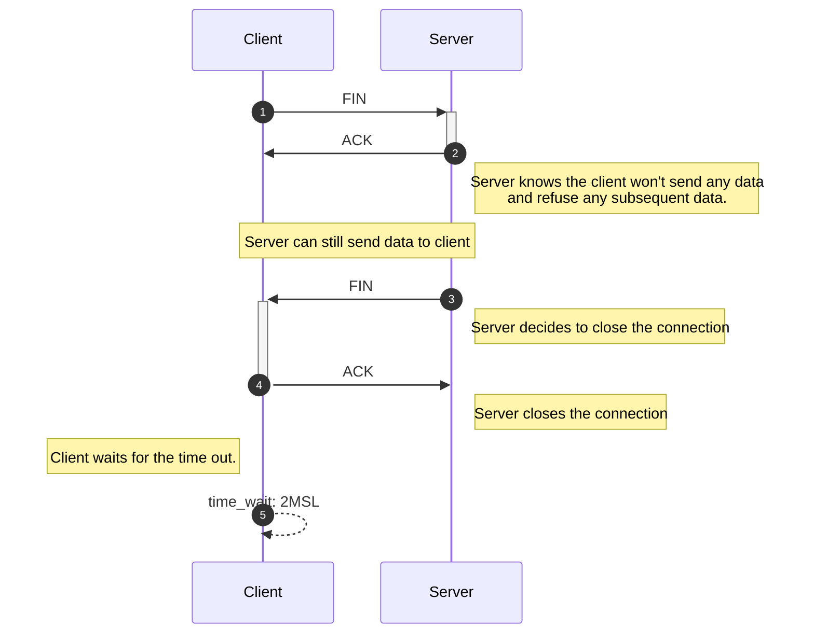

# 3 and 4 way handshake in TCP

## 3-way Handshake

## 4-way Handshake

@@caption Fig. 2  4-way handshake to close the connection

:::tip Terminology
MSL: <acr>Maximum Segment Lifetime</acr>, see [here](../../en/Others/Terminology-Acronym.md#Network-Layer) for more information
:::

**Q: Why need 4-way handshake, not just 2?**

**Q: Why need the time_wait?**
