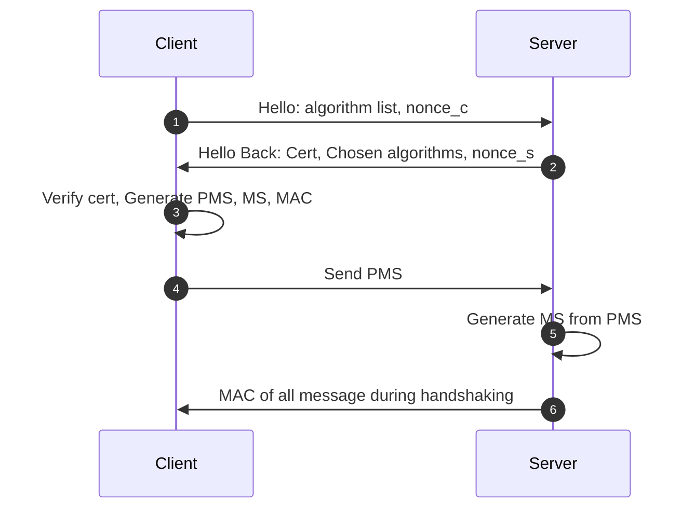
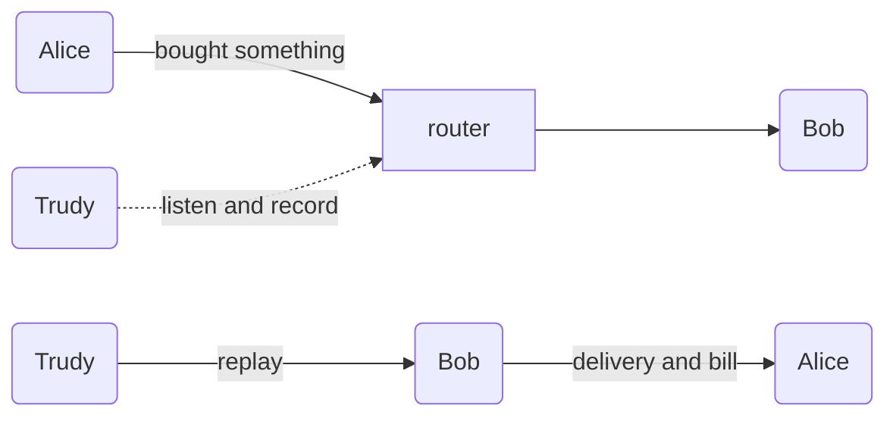

# Transport Layer Security: SSL and TLS

SSL and TLS are both used to reinforce the security of TCP, which stand for,

- TLS: <acr>Transport Layer Security</acr>
- SSL: <acr>Secure Socket Layer</acr>

## What are SSL/TLS

SSL was first designed and published by Netscape, then handed over to ISO who later renamed it to TLS. For such historical reasons, the terms SSL and TLS are sometimes used interchangeably.

- In 1994, Netscape designed the 1.0 version of the SSL protocol (Secure Sockets Layer), but it has not been released.

- In 1995, Netscape released version 2.0 of SSL, which was soon discovered to have serious vulnerabilities.

- In 1996, SSL 3.0 version came out and was used on a large scale for the first time.

- In 1999, the Internet Standards Organization (ISO) took over from Netscape and released an upgraded version of SSL. In order to show that it is no longer associated with Netscape, it was renamed TLS 1.0.

- In 2006, TLS 1.1 released.
- In 2008, TLS 1.2 released.
- In 2011, TLS 1.2 released.
- In 2018, TLS 1.3 released.

## How SSL/TLS works

> We will use the term TLS to represent both SSL and TLS.

A TLS connection is created through 4 handshakes, on top of the TCP connection.

::: tip Terminology

- MAC: Message Authentication Code
- PMS: Pre-Master Secret
- MS: Master Secret
- Nonce: Unique random number

:::

1. Client sends hello to server. It lists the algorithms that client supports.
    - Algorithms
    - Nonce of the client(explained later)
2. Server sends back the chosen algorithm and its nonce.
    - Chosen algorithms
      - Symmetric
      - Public-private keys
      - MAC generation algorithm, notated as $H$
    - Nonce of the server
3. Client generates a Pre-Master Secret(PMS), which can later be used to calculate Master Secret(MS) and is later divided into
   1. A MAC secret(notated as $s$),
   2. A symmetric key, used to encrypt messages to the server.
4. Client sends the PMS and MAC of all the messages sent and received without encryption during handshaking.
   1. PMS, server uses to generate same MS, key, secret
   2. MAC, server can verify match of the MAC of received messages to ensure its integrity.
        $$
        MAC = H(s + message)
        $$
5. Server calculates MS and MAC secret, which are identical to those of the client.
6. Send back the MAC of all messages received from client. The client can verify if it matches the MAC it sent so far.

By finishing all the 6 steps, a SSL/TLS connection is created, subsequent messages can be sent with symmetric encryption. SSL/TLS results in 4 secrets:

1. $E_B$, symmetric encryption secret of Bob, to encrypt/decrypt messages from Bob to Alice
2. $M_B$, MAC secret of Bob, to sign the message from Bob to Alice
3. $E_A$, symmetric encryption secret of Alice, to handle messages from Alice to Bob
4. $M_A$, MAC secret of Alice, to sign messages from Alice to Bob

For example, message sent from Bob to Alice can be

$$
\begin{aligned}
    c &= E_B(m + H(M_B + m)) \\
\end{aligned}
$$

But we still have some questions so far.

## QA

**Q. Why needing nonce?**

**A.** To avoid replay attack. Suppose Alice bought something from Bob, and Trudy might have recorded all messages sent from Alice. The next day, Trudy replays the messages, Bob would think Alice want to buy the same things again, and send Alice bill and order.

With nonce, Bob could know the message is invalid because the nonce is different.

**Q. Why client and server sends MAC at step 4 and 6?**

**A.** The first few messages during handshake is un-encrypted, Trudy can then modify the messages before they arrive Bob. For example, in the first 'Hello' request, some encryption algorithms might be less secure than the others, Trudy could remove all algorithms but the most vulnerable one. Bob will have no choice but use the only algorithm left. On the other hand, with MAC(via RSA encryption), Bob could know if the message is tampered, so is the MAC from Bob to Alice.

## References

- [SSL/TLS协议运行机制的概述 - 阮一峰的网络日志](http://www.ruanyifeng.com/blog/2014/02/ssl_tls.html)
- [What is Transport Layer Security? | TLS protocol | Cloudflare](https://www.cloudflare.com/zh-cn/learning/ssl/transport-layer-security-tls/)
- [为什么 HTTPS 需要 7 次握手以及 9 倍时延 - 面向信仰编程](https://draveness.me/whys-the-design-https-latency/)
- [What is SSL, TLS? And how this encryption protocol works | CSO Online](https://www.csoonline.com/article/3246212/what-is-ssl-tls-and-how-this-encryption-protocol-works.html)
