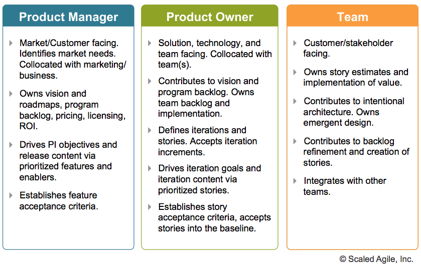

# Roles in Software Engineering

## Product Owner

The Product Owner (PO) is a member of the Agile Team responsible for defining Stories and prioritizing the Team Backlog to streamline the execution of program priorities while maintaining the conceptual and technical integrity of the Features or components for the team.

> Product Owner is a role you play on a Scrum team. Product Manager is the job.

<b>Figure 1. PM vs. PO</b>

### See Also

- [Product Manager vs Product Owner](https://medium.com/@melissaperri/product-manager-vs-product-owner-57ff829aa74d)
- [Product Owner – Scaled Agile Framework](https://www.scaledagileframework.com/product-owner/)