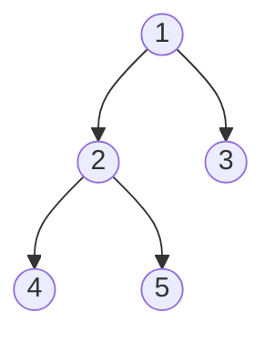

# Heap Sort

## Solution

把数组序列看做是一个完全二叉树的序列。例如，对于序列

$$\{1,2,3,4,5\}$$

可以对应以下树结构，



采用堆排序时，需要用到一个称为“筛选”的方法，一次筛选结束之后，最小（大）的元素将排在堆顶，即第一个元素的位置。然后从第二个元素开始，继续筛选，直至最后只剩下一个元素，最后得到有序序列。

### 筛选

筛选时<todo/>

### Code Sample

```java
class Solution {
    public int[] sortArray(int[] nums) {
        return heapSort(nums);
    }

    int[] heapSort(int[] nums) {
        int max = nums.length - 1;
        for (int i = 0; i < max; i++) {
            heapAdjust(nums, i, nums.length - 1);
        }
        return nums;
    }

    void heapSort(int[] nums, int start, int end) {
        // k is the last node without a child
        int k = start - 1 + ((end - start + 1) >>> 1);

        
        for (int max = k; k >= start; k--) {
            int i = k;
            while (i <= max) {
                // Index of right son
                int r = start + ((i - start) << 1) + 2;
                // Index of left son
                int l = r - 1;
                // The least index between `l` and `r`
                int tar = r <= end && nums[r] < nums[l] ? r : l;

                if (nums[tar] < nums[i]) {
                    swap(nums, tar, i);
                    i = tar;
                } else {
                    break;
                }
            }
        }
        return nums;
    }

    void swap(int[] nums, int i, int j) {
        int tmp = nums[i];
        nums[i] = nums[j];
        nums[j] = tmp;
    }
}
```
