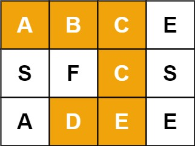

# 剑指 Offer 12. 矩阵中的路径

> 来源：[力扣（LeetCode)](https://leetcode-cn.com/problems/ju-zhen-zhong-de-lu-jing-lcof)

## Problem

给定一个 $m \times n$ 二维字符网格 `board` 和一个字符串单词 `word` 。如果 `word` 存在于网格中，返回 `true` ；否则，返回 `false` 。

单词必须按照字母顺序，通过相邻的单元格内的字母构成，其中“相邻”单元格是那些水平相邻或垂直相邻的单元格。同一个单元格内的字母不允许被重复使用。

例如，在下面的 3×4 的矩阵中包含单词 "ABCCED"（单词中的字母已标出）。

  

**示例 1：**

```
输入：board = [["A","B","C","E"],["S","F","C","S"],["A","D","E","E"]], word = "ABCCED"
输出：true
```

**示例 2：**

```
输入：board = [["a","b"],["c","d"]], word = "abcd"
输出：false
```

**提示：**

- `1 <= board.length <= 200`
- `1 <= board[i].length <= 200`
- `board` 和 `word` 仅由大小写英文字母组成

## Solution

本题采用回溯法。

给定的矩阵中，每一个元素作为一个回溯的起点，遍历地对起点进行回溯，直到得到解。

由于路径中一个字母只能经过一次，需要使用一个变量来记录是否经过该字母。因此，定义 `boolean[][] taken`。对于 `taken[i][j]`, `true` 表示已经走过，`false` 表示未走过。

```java
class Solution {
    public boolean exist(char[][] board, String word) {
        if (board.length == 0 || board[0].length == 0) return false;

        int r = board.length, c = board[0].length;
        boolean[][] taken = new boolean[r][c];
        for (int i = 0; i < r; i++) {
            for (int j = 0; j < c; j++) {
                if (this.backtrack(board, taken, i, j, word, 0)) return true;
            }
        }
        return false;
    }

    public boolean backtrack(
        char[][] board, boolean[][] taken,
        int row, int column,
        String word, int offset
    ) {
        if (offset >= word.length()) return true;

        if (this.bound(board, row, column) && this.constraint(taken, board, row, column, word, offset)) {
            taken[row][column] = true;
            if (
                this.backtrack(board, taken, row - 1, column, word, offset + 1)
                || this.backtrack(board, taken, row, column + 1, word, offset + 1)
                || this.backtrack(board, taken, row + 1, column, word, offset + 1)
                || this.backtrack(board, taken, row, column - 1, word, offset + 1)
            ) return true;
            taken[row][column] = false;
        }
        return false;
    }

    /**
     * Whether within boundary
     */
    private boolean bound(char[][] board, int row, int column) {
        return row >= 0 && row < board.length
             && column >= 0 && column < board[0].length;
    }

    /**
     * Constraint given by the problem
     */
    private boolean constraint(
        boolean[][] taken, char[][] board, int row, int column,
        String word, int offset
    ) {
        return !taken[row][column] && board[row][column] == word.charAt(offset);
    }
}
```

利用 *OOP* 的特点，可以用类的属性 `board`, `taken`, `word` 来避免显示的值传递，可以稍微简化一下代码:

```java
class Solution {
    private boolean[][] taken;
    private char[][] board;
    private String word;

    public boolean exist(char[][] board, String word) {
        if (board.length == 0 || board[0].length == 0) return false;

        int r = board.length, c = board[0].length;
        this.board = board;
        this.word = word;
        this.taken = new boolean[r][c];
        for (int i = 0; i < r; i++) {
            for (int j = 0; j < c; j++) {
                if (this.backtrack(i, j, 0)) return true;
            }
        }
        return false;
    }

    public boolean backtrack(int row, int column, int offset) {
        if (offset >= word.length()) return true;

        if (this.bound(row, column) && this.constraint(row, column, offset)) {
            taken[row][column] = true;
            if (
                this.backtrack(row - 1, column, offset + 1)
                || this.backtrack(row, column + 1, offset + 1)
                || this.backtrack(row + 1, column, offset + 1)
                || this.backtrack(row, column - 1, offset + 1)
            ) return true;
            taken[row][column] = false;
        }
        return false;
    }

    /**
     * Whether within boundary
     */
    private boolean bound(int row, int column) {
        return row >= 0 && row < board.length
             && column >= 0 && column < board[0].length;
    }

    /**
     * Constraint given by the problem
     */
    private boolean constraint(int row, int column, int offset) {
        return !taken[row][column] && board[row][column] == word.charAt(offset);
    }
}
```
