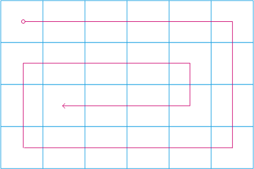
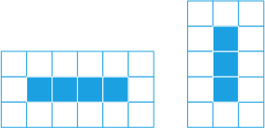

# 剑指 Offer 29. 顺时针打印矩阵

> 来源：[力扣（LeetCode）](https://leetcode-cn.com/problems/shun-shi-zhen-da-yin-ju-zhen-lcof)

## Problem

输入一个矩阵，按照从外向里以顺时针的顺序依次打印出每一个数字。

**示例 1**：

```
输入：matrix = [[1,2,3],[4,5,6],[7,8,9]]
输出：[1,2,3,6,9,8,7,4,5]
```

**示例 2：**

```
输入：matrix = [[1,2,3,4],[5,6,7,8],[9,10,11,12]]
输出：[1,2,3,4,8,12,11,10,9,5,6,7]
```

**限制：**

```
0 <= matrix.length <= 100
0 <= matrix[i].length <= 100
```

## Solution

### 1. 打印路径



- 时间复杂度 $O(nm)$
- 空间复杂度 $O(nm)$

```java {12,26}
class Solution {
    public int[] spiralOrder(int[][] matrix) {
        if (matrix == null || matrix.length == 0 || matrix[0].length == 0) return new int[]{};

        int row = matrix.length;
        int col = matrix[0].length;
        int total = row * col;
        int[] arr = new int[total];
        boolean[][] visited = new boolean[row][col];

        // Indicates {row, column} step toward right, down, left, up respectively
        int[][] directions = {{0, 1}, {1, 0}, {0, -1}, {-1, 0}};
        int directionIndex = 0;

        int i = 0, j = 0;
        for (int k = 0; k < total; k++) {
            arr[k] = matrix[i][j];
            visited[i][j] = true;

            int oldI = i;
            int oldJ = j;
            i += directions[directionIndex][0];
            j += directions[directionIndex][1];

            if (i >= row || i < 0 || j >= col || j < 0 || visited[i][j]) {
                directionIndex = (directionIndex + 1) % 4;
                i = oldI + directions[directionIndex][0];
                j = oldJ + directions[directionIndex][1];
            }
        }
        return arr;
    }
}
```

### 2. 按层模拟


当矩阵 $matrix$ 非正方形时，`下` 与 `左` 可能发生越界问题，此时需要判断是否越界，如第 `17` 行处的判断。



**代码：**

```java {17}
class Solution {
    public int[] spiralOrder(int[][] matrix) {
        if (matrix == null || matrix.length == 0 || matrix[0].length == 0) return new int[]{};

        int row = matrix.length;
        int col = matrix[0].length;
        int total = row * col;
        int[] arr = new int[total];

        int left = 0, right = col - 1, top = 0, bottom = row - 1;
        int k = 0;
        while (left <= right && top <= bottom) {
            for (int j = left; j <= right; j++) arr[k++] = matrix[top][j];

            for (int i = top + 1; i <= bottom; i++) arr[k++] = matrix[i][right];

            if (k < total) {
                for (int j = right - 1; j >= left; j--) arr[k++] = matrix[bottom][j];

                for (int i = bottom - 1; i >= top + 1; i--) arr[k++] = matrix[i][left];
            }

            left++;
            right--;
            top++;
            bottom--;
        }

        return arr;
    }
}
```

**复杂度分析:**

- *时间复杂度*：$O(mn)$，其中 $m$ 和 $n$ 分别是输入矩阵的行数和列数。矩阵中的每个元素都要被访问一次。
- *空间复杂度*：$O(1)$。除了输出数组以外，空间复杂度是常数。
