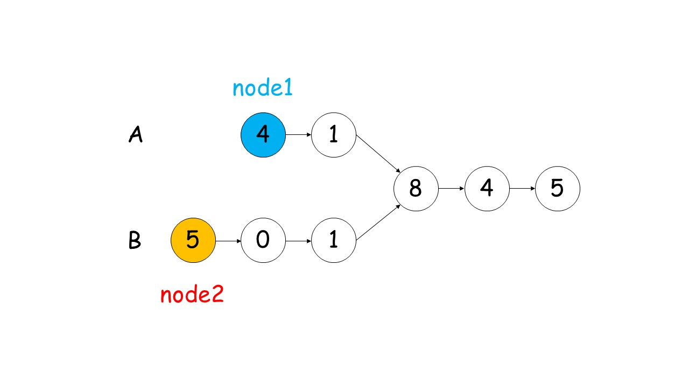
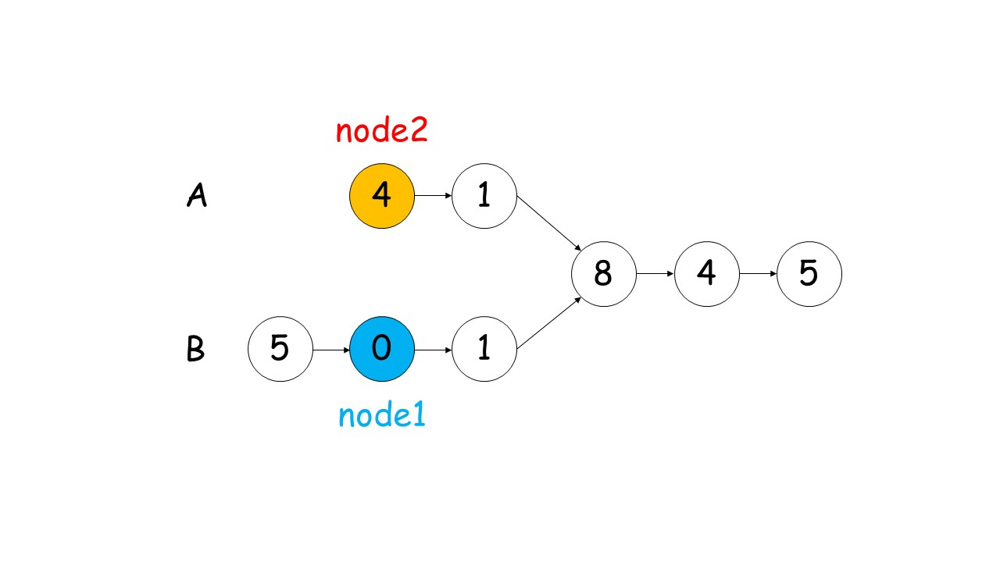

# 剑指 Offer 52. 两个链表的第一个公共节点

> 来源：[力扣（LeetCode）](https://leetcode-cn.com/problems/liang-ge-lian-biao-de-di-yi-ge-gong-gong-jie-dian-lcof/)

输入两个链表，找出它们的第一个公共节点。

## Problem

如下面的两个链表：


在节点 `c1` 开始相交。

**示例 1：**


```
输入：intersectVal = 8, listA = [4,1,8,4,5], listB = [5,0,1,8,4,5], skipA = 2, skipB = 3
输出：Reference of the node with value = 8
输入解释：相交节点的值为 8 （注意，如果两个列表相交则不能为 0）。从各自的表头开始算起，链表 A 为 [4,1,8,4,5]，链表 B 为 [5,0,1,8,4,5]。在 A 中，相交节点前有 2 个节点；在 B 中，相交节点前有 3 个节点。
```

**示例 2：**


```
输入：intersectVal = 2, listA = [0,9,1,2,4], listB = [3,2,4], skipA = 3, skipB = 1
输出：Reference of the node with value = 2
输入解释：相交节点的值为 2 （注意，如果两个列表相交则不能为 0）。从各自的表头开始算起，链表 A 为 [0,9,1,2,4]，链表 B 为 [3,2,4]。在 A 中，相交节点前有 3 个节点；在 B 中，相交节点前有 1 个节点。
```

**示例 3：**


```
输入：intersectVal = 0, listA = [2,6,4], listB = [1,5], skipA = 3, skipB = 2
输出：null
输入解释：从各自的表头开始算起，链表 A 为 [2,6,4]，链表 B 为 [1,5]。由于这两个链表不相交，所以 intersectVal 必须为 0，而 skipA 和 skipB 可以是任意值。
解释：这两个链表不相交，因此返回 null。
```

**注意：**

- 如果两个链表没有交点，返回 `null`.
- 在返回结果后，两个链表仍须保持原有的结构。
- 可假定整个链表结构中没有循环。
- 程序尽量满足 O(*n*) 时间复杂度，且仅用 O(*1*) 内存。

## Solution

双指针，让每个指针遍历两个链表，则遍历到相同节点处时，必然通过了相同的节点数；
若没有相同的节点，则最终到达两个链表的末端，并且有 `curA = curB = null`




```java {16}
/**
 * Definition for singly-linked list.
 * public class ListNode {
 *     int val;
 *     ListNode next;
 *     ListNode(int x) {
 *         val = x;
 *         next = null;
 *     }
 * }
 */
public class Solution {
    public ListNode getIntersectionNode(ListNode headA, ListNode headB) {
        ListNode curA = headA, curB = headB;

        while (curA != curB) {
            curA = curA != null ? curA.next : headB;
            curB = curB != null ? curB.next : headA;
        }
        return curA;
    }
}
```

**第 16 行**：当 `headA = headB = null` 时，程序不进入循环；当第二遍循环时，如果没有相同的节点，将同时到达两个链表末端，此时 `curA = curB = null`
