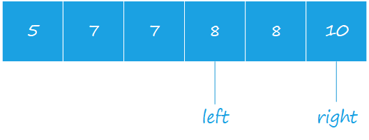

# 剑指 Offer 53 - I. 在排序数组中查找数字 I

> 来源：[力扣（LeetCode）](https://leetcode-cn.com/problems/zai-pai-xu-shu-zu-zhong-cha-zhao-shu-zi-lcof)

## Problem

统计一个数字在排序数组中出现的次数。

**示例 1:**

```
输入: nums = [5,7,7,8,8,10], target = 8
输出: 2
```

**示例 2:**

```
输入: nums = [5,7,7,8,8,10], target = 6
输出: 0
```

**限制：**

```
0 <= 数组长度 <= 50000
```

## Solution

**分析：** 通过二分查找，找到 `>=target` 与 `>=target + 1` 的下边界（第一次出现 target 的索引），
然后两个索引相减，则得到了 target 出现的次数。



**特殊情况：**

1. `target` 不存在，此时得到的大于 `target` 的第一个数，和大于 `target + 1` 的第一个数，索引相等，索引差值为0。
2. $target + 1 > a_n$，则得到的索引为 $n$（$a$ 的长度+1）

**时间复杂度分析：** 查找 `target` 与 `target + 1` 的时间复杂度均为 $O(\log n)$ 故最终时间复杂度为 $O(2\log n) = O(\log n)$

```java {8, 13}
class Solution {
    public int search(int[] nums, int target) {
        return locateLowerBoundary(nums, target + 1)
                - locateLowerBoundary(nums, target);
    }

    private int locateLowerBoundary(int[] nums, int target) {
        int left = 0, right = nums.length - 1;
        while (left <= right) {
            int mid = (left + right) / 2;
            if (nums[mid] >= target) right = mid  - 1;
            else left = mid + 1;
        }
        return left;
    }
}
```

在*第8行*，使用 `left <= right` 进行条件判断，是因为当 `left=right` 时，

- 如果 `nums[left] == target`，则 `right = right - 1`, 不影响 `left` 值
- 如果 `nums[left] < target`，则 `target` 一定不存在，且有 `nums[left + 1]` 正好是大于 `target` 的第一个数，此时得到最小 `target + 1` 的最小边界：`left + 1`。
